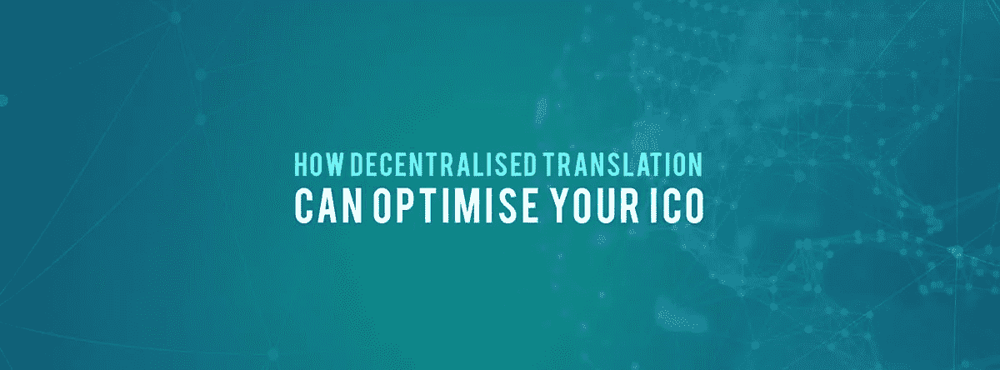

# 分散翻译如何优化你的 ICO

> 原文：<https://medium.datadriveninvestor.com/how-decentralised-translation-can-optimise-your-ico-b26d3d2a14dc?source=collection_archive---------13----------------------->

如果你正计划推出或已经推出了一个 ICO，你可能想考虑使用分散翻译作为一种方式，使你的 ICO 更容易被世界各地的人。

TranslateMe 是一个 ICO，通过结合使用神经机器学习、人工智能和人类输入，提供异常准确的分散翻译解决方案。我们的一些应用已经到位，并取得了巨大成功。我们期待通过我们的服务优化其他 ico 和企业。以下是我们可以帮助你的方法！

**是什么让分散翻译与众不同？**

你可能在想分散翻译和传统翻译的区别。相对于集中式解决方案，分散式翻译有许多优势，是翻译 ICO 相关内容的最佳选择。分散翻译解决方案的一些优势包括:

负担得起的成本

由于使用了神经机器学习、人工智能和人类输入，翻译更加准确

由区块链技术支持的高度安全的平台

使用大量的数据来联合所有的努力，创造最好的翻译

**使用 TranslateMe 翻译你的白皮书和网站**

就 ICO 而言，您的白皮书无疑是最重要的内容。它可以让你与世界交流你的 ICO 的愿景。

我们为您提供一种创新的方法，将您的白皮书准确翻译成世界上最少使用的语言。这消除了你的潜在投资者和最终用户转向谷歌翻译和其他集中式平台的风险，在那里你的信息和愿景很可能在翻译中迷失。

**使用 TranslateMe Chat 与你的 ICO 团队对话**

TranslateMe ICO 的终端应用之一是即时翻译聊天应用。TranslateMe Chat 的用途是无穷无尽的，但有些用途包括:

用世界各地的 ICO 团队成员选择的语言与他们交流。

与您的团队交流时，没有误译或沟通失误

你可以对来自世界各地的投资者和最终用户毫无困惑地讲话和广播信息

**二维码的优势**

TranslateMe 设计了一个专门的流程，在这个流程中，你可以将一个二维码链接到你所有的文档。用户可以扫描该代码，以便将内容翻译成他们选择的语言。一个文档，多种语言。

**拥有更大的触角**

通过翻译与你的 ICO 相关的所有内容，你在寻找投资者和最终用户时会有更广泛的接触。大多数 ico 都提供世界各地的人都可以使用的服务，那么为什么不通过翻译你的所有内容来接触那些说不太为人所知的语言的人呢？

如果你有任何问题或意见，欢迎在下面分享。我们很想听听你的想法。在我们的社交平台上关注我们，及时了解我们的 ICO。

Translateme.network ICO 即将推出。