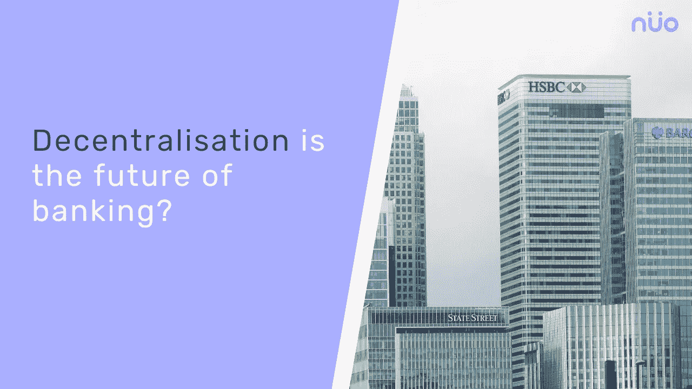

# 分散化银行如何接管金融生态系统？

> 原文：<https://medium.datadriveninvestor.com/how-decentralized-banks-are-taking-over-the-financial-ecosystem-7b45ce57cf4a?source=collection_archive---------5----------------------->

Photo by [Jordan](https://unsplash.com/@suspected?utm_source=medium&utm_medium=referral) on [Unsplash](https://unsplash.com?utm_source=medium&utm_medium=referral)

## 了解什么是分散式银行，它与传统银行有何不同？

Decentralized banking

近年来，公众对传统银行体系的信任有所下降。人们正在寻找一种替代方案，一种能让他们完全控制自己存款和投资的系统。不可信、去中心化的数字货币世界向他们承诺了这一点。因此，去中心化的银行系统不再是一个牵强的想法，而是越来越被主流接受。就连传统的金融系统纯粹主义者现在也在谈论它。

## 为什么去中心化的银行是未来？

对银行信心的崩溃主要是由于 2008 年的金融危机，世界各地的银行诈骗，以及高管的管理不善。分散化银行的内在品质确保其参与者不太可能成为金融危机或诈骗的受害者，也不太可能因为不透明的交易和高层管理人员的管理不善而失去他们的数字资产。

 [## 5 行业转型区块链应用|数据驱动投资者

### 除非你一直生活在岩石下，否则我相信你现在已经听说过区块链了。而区块链…

www.datadriveninvestor.com](https://www.datadriveninvestor.com/2019/02/13/5-real-world-blockchain-applications/) 

## 什么是去中心化银行？

2018 年 7 月，流行的加密交易所币安宣布投资创始人银行，该银行将成为世界上第一家分散和社区所有的银行。一旦获得欧盟银行牌照，该银行将允许所有市场参与者成为其联合创始人，并采用区块链治理模式。这将导致更大的透明度。更高的透明度是分散化银行的最大优势之一，这种银行的运营理念是不信任。它还取消了中介的角色。

智能合约和点对点服务取代了中间商，实现了借贷双方的直接交易。世界上任何地方的任何人都可以成为这个银行系统的一部分，这是传统银行不可能做到的。一个人只需要一部手机或一台台式机和一个互联网连接就可以从世界任何地方访问分散式银行。

分散式银行主要支持以区块链为基础技术的加密货币(而非法定货币)的借贷。

## 分散银行与传统银行有何不同？

与分权银行不同，传统银行没有中介机构就无法运作。还有，信任是其运作的关键。这是它们与客户关系的核心，而客户对其治理或贷款流程没有发言权。此外，传统银行不提供金融自由，也没有确保其金融系统民主化的技术。

分散式银行和传统银行的主要区别如下。

## 贷款流程

在传统的银行系统中，中介决定是否借钱给某人。基金所有者无权决定这一点。银行也不告知他们如何使用他们的资金。它的交易流程不透明，文书工作太多。银行业还有一个地理限制。不是世界上任何地方的任何人都能从传统银行借到钱。此外，如果他们没有良好的财务记录，他们就不能从银行贷款。

在像[诺网](https://app.nuo.network/)这样的分散化银行中，也像传统银行一样提供借贷服务。然而，它没有建筑。它以计算机界面的形式存在，可以从任何地方通过互联网访问。它也没有由最高管理层或中介主持的决策会议来批准或不批准贷款请求。

人们尤其怀疑管理现有银行的人。像[诺网](https://app.nuo.network/)这样的平台没有他们的位置。它拥有智能合约和点对点(P2P)系统，有助于两个陌生人之间的直接借贷。这个过程很快——因为没有人审查财务历史——自动化，交易费用为零或非常低。传统银行通常收取高额交易费。

## 区块链技术扮演着举足轻重的角色

区块链技术是记录所有交易的分布式、分散的分类账。它公开透明地跟踪所有交易。贷方不必依赖中介来检查借出的数字资产是否已经到达预期的参与者。分类帐是不可变的，所以没有人能改变它。传统银行的系统没有这种技术。因此，基金所有者对银行的借款人总是一无所知，有些时候，一些银行高管会篡改数据来欺骗投资者和监管者。

## 智能合同

智能合同是自动执行的合同。它们的特点是把条款和条件协议写成代码行，存在于分散的区块链网络上。此外，在分散的银行体系中，它们强化了参与者的义务，确保了可信的交易，并消除了对中间人的需求。他们还保持交易过程的无冲突性和准确性。此外，智能合约使跨境交易成为可能。传统的银行系统没有智能合约，而是由中间人监督交易过程，并强制借贷双方履行义务。

随着加密货币市场的快速扩张，预计未来将出现更多分散的银行。

免责声明:这不是财务建议。本邮件或其他媒体中的观点、陈述、估计和预测仅属于作者个人。这篇文章的内容不是由任何人赞助的，文中提到的观点仅仅是作者的观点。最早见于**。**