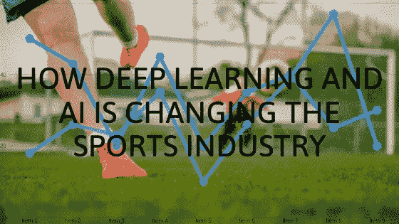
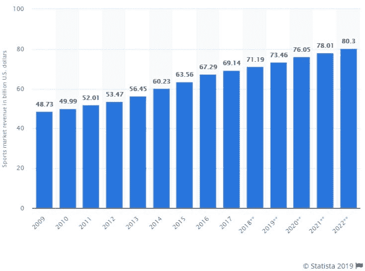

# 深度学习和 AI 正在如何改变体育行业？

> 原文：<https://medium.datadriveninvestor.com/how-deep-learning-and-ai-is-changing-the-sports-industry-2657759a4cfb?source=collection_archive---------1----------------------->

Photo by [Fancy Crave](https://unsplash.com/@fancycrave?utm_source=medium&utm_medium=referral) on [Unsplash](https://unsplash.com?utm_source=medium&utm_medium=referral)

深度学习技术几乎影响了所有其他行业。体育也不例外。深度学习正在帮助与体育相关的企业扩张。

从 NHL 到 MLB、NBA、NFL 和 NASCAR，美国几乎每一个主要的体育联盟都在引入人工智能来拓展业务。

据 [Statista](https://www.statista.com/statistics/214960/revenue-of-the-north-american-sports-market/) 预测，2022 年北美体育市场规模预计将达到 803 亿美元。收入可能来自商品销售、门票收入、媒体权利和赞助。

 [## 2019 年深度学习的终极学习路径及更多...数据驱动的投资者

### 又一个美好的一周，一些好的教育内容将会到来。我最喜欢的&最受欢迎的帖子之一…

www.datadriveninvestor.com](https://www.datadriveninvestor.com/2019/01/07/the-ultimate-learning-path-for-deep-learning-in-2019-more/) 

在体育产业中有许多不同的领域，人工智能在其中发挥着重要作用。例如，可穿戴技术、市场营销、自动化新闻以及融入计算机视觉。

这些智能神经网络可以计算出影响运动员表现的各种参数，并提供建议以防止受伤或疲劳。

这些只是一些用例，概述了人工智能和深度学习的能力。下面提到的是深度学习在体育领域的一些顶级应用。

# 1 —体育产品

深度学习用于创建看起来几乎与专业体育广播相同的全自动体育制作，包括平移、动作的摄像机放大等。

从一个像样的自动化体育产品中，我们至少应该期望识别球员和球。识别足球是一项困难的任务。它可以在地面上的任何地方，例如，球员或守门员手中。

如果你想一想，在所有这些不同的情况下，球“看起来”不同，然而，作为人类，我们可以毫不费力地将它从单个帧中区分出来。

识别球员也不容易，因为系统必须区分场上球员、替补球员和裁判等。

# 2 —承认法院/领域

对于深度学习算法来说，要找出球和球员之间的区别，你首先需要帮助它识别场地/球场。校准将通过在每一帧内发现哪些像素是球场/场的一部分，哪些不是，来限制深度学习算法的选项范围。

通过确定球场/场地的区域，可以区分在球场/场地内的运动员和在球场/场地外的其他人，例如教练、替补队员、观众等。

# 3-数据注释

如上所述，DL 模型训练的一部分是对广泛数据集的需求，以开发 DL 算法的“最终真相”。随着算法的发展和更多数据的收集，这是一个应该定期完成的关键任务。

实现这一点有许多选择。人类必须注释最少数量的帧。除此之外，需要较少努力的几个方法是:

1.  **YouTube/谷歌图片** —在 YouTube 或谷歌上搜索“足球运动员”可以扩充数据集。这将产生包括足球运动员的图像或帧；换句话说，他们已经被“预注释”为足球运动员。
2.  **无监督学习** —这种方法通过将补充的“非 DL”算法应用于潜在玩家区域的第一部分，使用未标记的数据。例如，可以使用已知的背景减法器(如 MOG)来粗略识别玩家。
3.  **增强**——另一种常用的技术是改变或增强图像。例如，修改角度、拉伸角度等。这些扩充产生已经被标记的附加数据集。

# 4 —体育营销

基本上，美国的每个主要体育联盟都可以在任何给定的时间点利用额外的营销来增加联盟的资源并提高他们的投资回报率。

人为干预对于营销活动的成功至关重要，而 DL 算法可以帮助体育工作者实现他们的目标。

今天，有几项人工任务可以被人工智能和大数据取代，包括消费者研究，以生成有助于我们了解客户兴趣的活动。

内容创作作为另一种营销工具，DL 可以在其中发挥作用。此外，技术可以跟踪内容的表现，以确定一个活动做得如何。

# 结论

正如我们所见，借助深度学习技术，计算机可以理解体育动作，为体育生产开辟了以前从未有过的新可能性。

如果使用得当，深度学习可以模仿人类摄像机操作员和视频编辑的决策过程，以合理的成本提供与专业体育直播相同的体验。

这一技术革命将允许半职业和业余体育俱乐部向他们的球迷转播比赛，从而使他们的内容货币化。

*作者 Sandeep Agarwal，Credencys a mobile 和* [*web app 开发*](https://www.credencys.com/web-development-services/) *公司 CEO。*