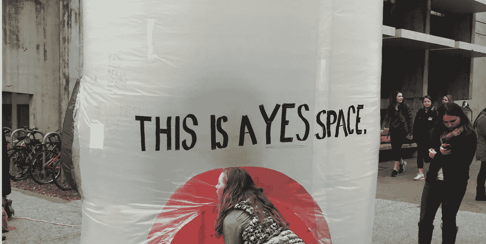
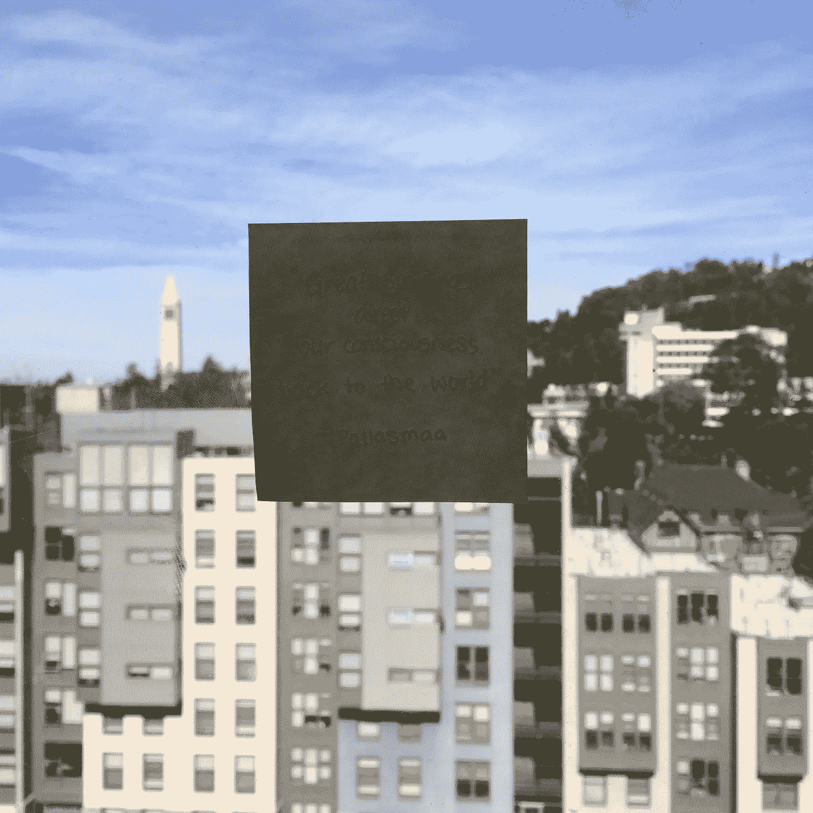

# 为物质世界和你自己而设计

> 原文：<https://medium.datadriveninvestor.com/how-design-brings-our-attention-back-to-the-physical-world-caf86e7f2a66?source=collection_archive---------37----------------------->

## 对于那些夹在设计、建筑和不断变化的世界之间的人。

Photo by Margaret Zhou

伴随着臭名昭著的艰苦建筑工作室的一个悖论是，学生们花了几天几夜痴迷于和设计那些深深植根于他们周围的物理世界的问题，然而许多学生需要找到建筑之外的东西，以便对他们周围不断变化的物理世界感到根植。

在过去的 4 年里，我发现自己在努力解决一些我无法回答的问题，特别是随着全球问题的升级，技术发展变得无情地快于它所依赖的基础设施和社会系统(如果技术是这场提高生活水平的竞赛中的兔子，那么建筑和施工将是乌龟)。一个人如何在设计时保持声音？一个人如何保持对世界的独特视角，同时为那些可能不关心的人，或者那些深深植根于历史、政治和文化中的问题进行设计？我们如何确保我们的想法超越我们的设计？或者这有必要吗？建筑如何跟上变化？设计师、建筑师和可视化者在这幅画中扮演什么角色？对于这个快速变化的物理和数字世界，我们能做些什么？

芬兰建筑师和教授朱哈妮·帕拉斯玛在他的文章《皮肤的眼睛:建筑和感官》中写道

> “伟大的建筑将我们的意识引向世界”。

作为一名新生，我记得做我通常每周指定的阅读，在这一行停下来，写在便利贴上，钉在我宿舍书桌上方的窗户上。最近，我又偶然发现了这张纸条，并想知道为什么它当时会有如此开创性的感觉。作为有抱负的建筑师和设计师，我们被教导为用户设计的重要性，以实现他们的愿景，同时也知道用户通常不知道他们在看什么或寻找什么。一个巧妙构思的计划概念或可持续材料覆层的意图不会转化为一般不知情的路人，而且往往会被忽视。

Photo by Margaret Zhou

一个设计的首要目标是在日常生活中创造一个快乐和欣赏的小瞬间。无论用户对他们周围的建筑环境是知识渊博、理想主义、热情、欣赏、冷漠还是无知，一个设计良好的产品和空间都应该将他们的注意力从他们的思想和生活中转移出来，让他们沉浸在物理世界中，并赋予他们力量。一个看似不可能的悬臂建筑可能会让行人欣赏它的工程独创性和人类正在进行的与地心引力的斗争。一面嵌有回收箱、斜槽和系统的办公楼墙可能会提醒用户，回收已经融入了公司的价值观，而不仅仅是事后的想法。一个拥有大量可移动长椅、椅子和桌子的大型开放式公园可能会提醒用户他们属于他们周围的空间，允许他们为自己做出空间和座位决定。

在对我们周围的空间进行可视化和设计的过程中，可持续性、人类效率、文化背景、环境、健康、科学、技术等因素不是额外的想法，而是潜在的系统。他们的共同目标是创造一个物理空间，提醒用户(人类、动物、环境等)这个世界是如何关心的——有人关心他们的需求。

我曾经和一个好朋友聊过，船为什么只能像现在这样运行，只能以现在的形式存在，因为有些设计在它失败之前，有些在那之前，有些在那之前。我感到欣慰的是，好的设计借鉴了以往的经验，并努力成为自身的改进版本。我们没完没了地吸收信息和批评，并将它们转化为创造比现有方案更好的新方案的灵感。这就是我们——我——喜欢做的事情:不断改进事物，让它们变得更有趣、更完整、更个性化、更舒适、更有体验性、更难忘、更有用。就像我们的父母、看护人、老师、兄弟姐妹试图让我们的生活变得更轻松、更愉快一样，设计师也承担起了养育的角色，承担起了让生活变得更愉快的责任。

因此，设计工作室含蓄地教你如何让世界变得更有爱心。