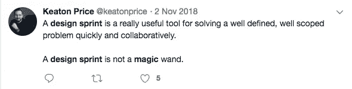
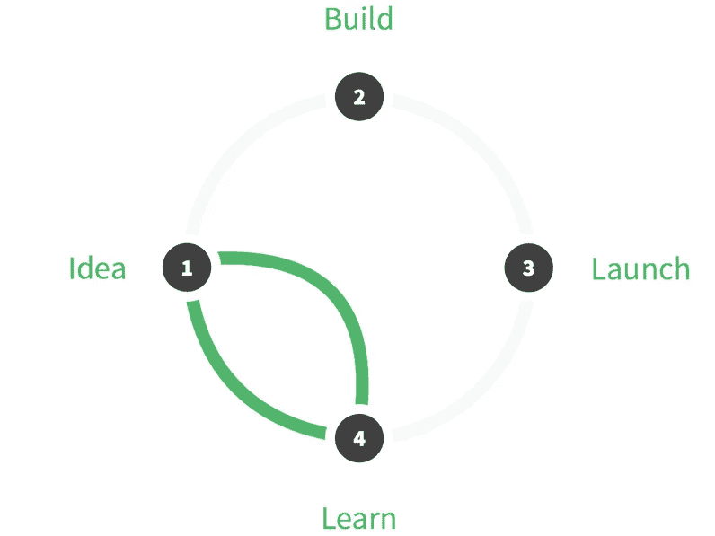

# Design Sprint 如何拯救思域科技？

> 原文：<https://medium.datadriveninvestor.com/how-design-sprint-can-save-civic-tech-5fb29b152190?source=collection_archive---------21----------------------->

A new day for Civic Tech

去年夏天，我在布加勒斯特举行的数字通信网络会议上发言，该会议致力于非营利组织和政府机构的 T2 数字转型。

我提出了一个过去两年我一直关注的话题:为什么公民技术经常失败。

就公民技术而言，我理解任何支持公民社会团体(正式组织、活动家团体、非营利组织、慈善机构、社会企业等)使命的技术。)，由该组织(直接或通过承包商)创建。

那一刻，我在探索这个问题:[我们能从思域科技的失败](https://www.youtube.com/watch?v=szbOyhZeFDo)中学到什么？

在我演讲之后，在喝咖啡的间隙，一位公民技术活动家同事问我:

“好的，我明白你的观点，即市政科技组织需要拥抱发展生命周期和 UX，用心与他们的受众接触，并重新思考他们如何实现财务可持续性。但是他们如何在实践中开始做这些呢？从何说起？”

她似乎在寻找某种我没有的银弹。我不记得我回答了什么，只记得答案不令我满意。

所以这个问题一直困扰着我，在接下来的半年里，我一直试图找到答案。看来今天我可能有:**设计冲刺**。

# 设计冲刺到底是什么？

你可以在网上读到很多关于设计冲刺方法论的文章。我把[做成一个简短的 Q &一个](https://www.sprintux.com/sprint-q-a) 来让人们迅速加入进来，了解 Sprint 的价值和交付。简而言之: **Design Sprint 是一种在短短 4 天内解决大问题和测试新想法的方法论**，在此期间，你的团队将与真实用户一起设计、创建、原型化和测试一个解决方案。

当您在项目/过程开始时运行它，以快速和安全地验证您的假设、测试想法并了解您的受众时，它的效果最好。这种实验性的迭代节省的平均时间和金钱相当于“正常”进度下[3-6 个月的工作](https://phase.com/magazine/whats-the-design-sprint-2-0/)。

本质上，你可以把 Design Sprint 描述成一本由设计思维、敏捷和精益的 UX“厨师”编写的食谱。这是一套简单的食谱，几乎任何人都可以遵循，所以他们可以烤一个漂亮的蛋糕。

想象一下用[杰米·奥利弗](https://www.jamieoliver.com/)写的书[《15 分钟膳食》](https://www.amazon.com/Jamies-Minute-Delicious-Nutritious-Super-Fast/dp/071815780X)做饭。是不是把厨艺大师的知识传给你了？是啊！这足够你做一顿美味的午餐了吗？还有，是的！你设法多快得到结果？非常快！你在它上面花了多少钱？几乎没有。现在，将这种体验(在时间、成本和结果方面)与去烹饪学校、雇佣杰米·奥利弗为你做午餐或者只是每天去餐馆并将其投射到你的创新工作中进行比较。这就是设计冲刺的价值。

All you need is to follow the recipe

# 设计 Sprint 如何适用于非营利工作？

由 [Google Ventures](http://www.gv.com/sprint/) 开发以帮助初创公司，并由 [Jake Knapp 的书](https://www.thesprintbook.com/)推广，如今，Design Sprint 成为硅谷和财富 500 强公司的黄金标准，如谷歌、易趣、Twitter、Slack、Airbnb、LinkedIn、Flatiron Health、T-Mobile、Lufthansa、KLM、Lego 和许多其他公司。由于设计冲刺，这些公司推出了价值数百万美元的产品和服务。甚至联合国也改进了他们的一个应用程序。

设计冲刺迅速渗透到团队合作和观众满意度是一个因素的各个领域:从医疗服务到机场导航。它可以应用于软件、硬件、web、创新、销售和单个项目；商业、营销、品牌战略；组织变革、数字化转型或新的创业想法。因为这种方法对某些人来说是如此的高效和适应性强，所以它可能会让人感觉很神奇。

Or not. Depends how sceptic you are.

然而，世界上很少有人尝试使用设计冲刺来满足非营利组织和政府机构开发公民技术、政府技术或 philtech 解决方案的需求。

这是我开始 [SprintUX](https://www.sprintux.com/) 的原因之一，在那里我利用我在该领域的专业知识和我在领先的设计 Sprint 机构 [AJ & Smart](https://ajsmart.com/) 接受的培训来调整设计 Sprint 框架。

我相信，对于一个市政科技项目和整个行业来说，Design Sprint 是一个好主意的原因有很多。在本文中，我将从最关键的公民技术挑战的角度来看待这个问题，并解释 Design Sprint 如何解决这些问题。

在 [TechSoup Europe](https://www.techsoupeurope.org/) 运行 [TransparenCEE](https://transparencee.org/) 项目时，我与人合著了一篇研究论文，致力于从中欧、东欧和东南欧的公民技术失败中吸取教训。几个月后，[思域 Hal](https://civichall.org/) [l](https://civichall.org/) 的同事发表了一篇文章专门讨论类似的问题，名为[向思域科技墓地](https://civichall.org/civicist/civic-tech-graveyard/)学习。我将利用两篇文章中确定的主要挑战来说明设计冲刺对于市政技术组织的价值。

# 挑战和解决方案

**缺乏技术技能和沟通不畅**

*挑战*

非营利组织通常依靠少数员工和多名志愿者或外部承包商来完成需要更高技能的任务。因此，这些技能不会留在组织内部。简而言之，非营利组织的工作人员通常在主题问题上经验丰富，但在技术问题上却明显缺乏知识。

通常，根本没有员工能够正确理解技术任务的范围，向承包商解释，或做出技术上准确的工作说明。这导致与对数字产品开发至关重要的承包商(如 IT 工程师和设计师)的沟通不畅，大量的精力花费在澄清上，结果不佳，以及普遍的失望。

与此同时，承包商不被视为团队的一部分，因此他们对非营利项目的积极性、所有权和优先级都很低。最后，非营利组织通常会提出低得多的费用，因此，他们通常不会吸引顶尖人才。

*解决方案*

虽然较低的费用可能仍然是一个问题，但 Design Sprint 为沟通不畅带来了一个解决方案。

任何设计冲刺的第一步都是组建你的冲刺团队。这些应该是 5-7 个主要的关键执行者，他们将参与任务的实施。想想你不能排除的人——承包商和员工。

例如，如果没有一个人能够构建一个好的数字产品(it 工程师)，让它可用(设计师)，推广它(沟通/营销专家)，了解你的受众(社区/外联/销售经理或研究员)和手头的问题(专题专家)，你就很难推出一个好的数字产品。再加上一个协调所有这些工作的人(项目/产品经理)和一个在你的组织中做行政决策的人(总监/CEO)，你将拥有一个完美的 Sprint 团队。

You’ll know your Design Sprint Team has a perfect size if you can do a simultaneous fist-bump

通过将所有这些关键人员纳入设计冲刺的决策过程，您就与他们分享了项目的所有权，并消除了沟通不畅、冗长乏味的讨论、不信任和未满足的期望。

你还有你的决策者，他对概念和战略方向有最终决定权，所以你不必担心你会被引导到错误的方向。不同之处在于，所有重大决策都是由另一个 Sprint 团队的共享专业知识决定的。

最重要的是，在冲刺的第一天，你会带更多的专家到房间里进行简短的咨询。这将有助于你弥合知识差距，并获得关于继续进行的最佳方式的建议，这可能会完全改变你对项目的看法，或者只是证实你的假设。

最重要的是，在设计冲刺阶段结束时，团队将分享对未来解决方案的相同愿景和兴奋，他们将把这种愿景带到实现阶段。

**缺乏财政资源和可持续性**

*挑战*

缺乏财政资源是非营利组织对公民技术失败的另一个理由。诚然，通常公民的科技预算可能远低于营利性部门，但他们的支出效率也相当低。造成这种情况有几个因素:

*   **在黑暗中磕磕绊绊**。非营利组织对解决方案是否正确没有信心，因为内部专家很少，对外部人士缺乏信任。这通常会导致随意浪费枢轴。
*   **不知情的决策**。无论是选择哪种技术，工作成本，还是观众的需求，都会导致金钱和时间的损失。
*   陈旧僵化的管理体系。由于落后的内部规则和系统，无法更快、更有效地创新和做事，导致延迟、不良结果和金钱损失。

我知道非营利组织会有大约 50，000 甚至更多的赠款(也就是说，几乎没有任何附加条件)来开发技术解决方案。他们会把钱花在一项技术上，这项技术经过一年的开发后，可能不会让任何人受益。这些条件比大多数创业公司经历的都要奢侈得多。

与此同时，思域的科技项目通常遵循“先建设，后思考”的逻辑。这给可持续性带来了巨大的挑战。结果，非营利组织在项目结束时耗尽了现金，却没有一个如何让他们继续生存下去的计划。捐赠者很少拨款进行维护，非营利组织也很少拥有内部资源，所以难怪许多公民科技产品最终都成了“坟墓”。

*解决方案*

为什么科技公司都爱设计冲刺？因为它为他们创造了大量的价值，包括节省的现金、时间，老实说，还有与压力相关的心理健康，而对他们的产品/项目开发几乎没有风险。

效率和价值是设计冲刺、敏捷、Scrum 或精益首先存在的唯一原因。公司被利润最大化所引导(同时也受到压力)。许多聪明人思考和实验多年，直到他们想出解决方案和系统，可以帮助更有效地工作，增加价值。

The basic principle of a Design Sprint is to learn before building

非营利组织虽然遵循不同的原则，但也能以类似的方式从这些知识中获益。由于资源往往有限，这对他们来说甚至更为重要。因此，没有理由不希望节省 3-6 个月的工资，并使用 Design Sprint 增强对产品的信心。

非营利组织也应该将设计冲刺视为筹集额外资金和获得更多利益相关者支持的快速方式。手头有了有形的原型、潜在受益者的反馈以及基于项目最初几个月的真实数据得出的分析结论，就为更多的机会打开了大门。

你对捐款人的惊艳效果将取代数月的提案写作和筹款，帮助你脱颖而出。也许，从长远来看，这样的结果甚至会影响捐赠团体对非营利组织产品开发最佳实践的理解。

最后，Design Sprint 促使你从第一天起就思考(或重新思考)你实现财务可持续性的方法。从一开始就探索赚钱的选择(并测试他们如何吸引观众)，会让你对你需要的技术有不同的看法。这也将为你赢得足够的时间来适当准备你的战略，无论是免费增值版本、众包还是 [Patreon](https://www.patreon.com/) 类型的支持。

**缺乏创新**

*挑战*

我经常听到一些非营利组织的领导人说，他们很难“创新”，因为知识和资源的差距太大，他们无法赶上科技行业。他们有时担心他们没有足够的时间或手段来创新，或者他们不想承担额外的风险。

另一方面，有些人在会议上听到一个流行词，第二天会兴奋地过来对你说:“我们都需要开始使用 Scrum。最好了！”，不清楚他们为什么需要它，以及如何在一个只有 5 个人、没有 it 工程师的组织中应用它。

大多数公民技术公司的人都强烈地感到有必要以某种方式赶上这股技术潮流。他们想学习如何把事情做得更好、更有效率、影响更大。他们常常不知道从哪里开始。

Hey, it’s The Technology Train! Hop on!

*解决方案*

Design Sprint 是一个非常棒的启动解决方案，风险和投资都很低，可以启动非营利组织的创新变革。

它提供了一个实用的介绍最新的思想，哲学，最重要的是，硅谷公司的实践。你一步一步来，但是每一步你都学得很快，进步也很快。你不需要花几个月的时间来学习设计思维或敏捷背后的理论，并重组你的内部流程。直接进入这个过程，体验一下，然后决定你是否喜欢它。

这就是 Design Sprint 的全部内容:将任务分成小而有形的部分，尽最大努力完成每一项任务，获得现实生活中的结果，分析它们，并根据这些知识进入下一个难题。它的美妙之处在于你可以现在就开始做！没有特别的准备。

你在这个舞台上失败的风险是最小的，没有人会评判你，所以这减轻了压力。Design Sprint 有助于在你的团队中发展一种实验性的思维模式，而不是寻找“合适的先生”类型的解决方案(我们都知道这并不存在)几个月而没有任何进展。

**缺乏用户参与度**

*挑战*

许多公民技术组织正在努力激励用户使用他们的工具、应用或平台。这导致了团队的冷漠和沮丧，逐渐降低了项目的优先级，最终把它冷藏起来或者干脆忘记它。

用户参与度低可能有很多原因。其中最常见的是:

*   非营利组织不了解他们的受众，也就是“我们不知道谁是我们的受众”；
*   观众的需求太弱或者是零星的，也就是“我们不知道这对我们的观众来说是不是一个重要的问题”；
*   该产品提供了一个过于复杂的解决方案，也就是“我们不知道我们的观众的专业水平”；
*   产品难以使用或理解又名“我们不需要花钱在 UX 设计师或用户测试”；
*   糟糕的推广也就是“我们不知道如何接触我们的观众”。

正如你所看到的，所有这些问题都与缺乏对受众的理解以及缺乏用户研究来缩小这一差距有关。

非营利组织经常处理上述所有问题，这是非营利组织模式的症状(至少在后共产主义地区)。多年来，许多非营利组织与其受益者脱节，因为它们的业务模式严重依赖外国捐赠。因此，他们优先发展与资助者的关系，而忽视了他们的受众。

这通常会导致对受众需求的不准确、不了解情况的战略决策。它们在很大程度上基于员工的假设和组织或个人的专业知识，这不可避免地会带来严重的偏见。

*解决方案*

事实上，要确定你的观众是否需要某样东西，或者他们对你提供的东西有多了解，唯一的方法就是直接与观众沟通。

Design Sprint 提供了一种快速简单的方式来重新与您的受众建立联系，获得对您的解决方案的反馈，并做出明智的改进。这种反馈可以帮助你发现主要问题，重塑你的假设，或者对你的听众有一个更准确的了解。

在设计冲刺阶段，团队构建了一个高保真但低功能的原型(即，它看起来真实，但功能减少/简化了)，并在 5-7 个真实用户中进行测试。这些都是第一阶段的高质量面试，所以五个人就足以得出确凿的结论。

Your prototype will look and function as a façade. Just real enough to get users feedback and test your hypothesis.

即使你对结果不满意，你已经有了大量的数据，可以在早期阶段调整你的解决方案，而编码成本为零，几乎没有风险。

**思域科技的未来**

我坚信 Design Sprint 在改进公民技术、政府技术和菲尔技术产品方面有着巨大的潜力。只有通过不断创新，这些非常重要的部门(以及代表它们的组织)才能与它们应该服务的社区保持关联。设计冲刺方法论可以成为帮助非营利组织提高创新速度和动力的垫脚石。

这将有利于公民技术组织和捐助者社区，他们将看到更大的投资回报和更好地利用创新机会。非营利组织有责任展示最佳产品开发实践的影响，并改善技术领域的拨款条件。

【https://www.sprintux.com/如果您想了解更多关于设计冲刺的信息，请联系或询问任何问题，请访问

**[# design sprint](https://www.facebook.com/hashtag/designsprint?source=feed_text&epa=HASHTAG&__xts__%5B0%5D=68.ARAWBu0KvS00w4bexRQ10c3eEgW8lj88Zz0ixfEFPgSaGXn_1qhn9hQACKRhkhmpsks516tJXslVFnBSZQbOWN0pyUAkdU-9O6Epf5VmLVhcM8j7_ffeXhk8luM2joUfV10BNDJqPtnYB5GJsbUWEmj6Ebo5Vz37ererVSp7bHRUzSyQ4KoyF8KhxrV_lLoVOGHkc6htYUhHD2c_tCv5qpDJMl3lSzzaoShfEIg426-D6QUBMGiwu-Xu6eI3RSIfs4199hzs6XMaVlz4tJzZNaihLuUvy3xILjDpPcTVi61ziLck_bQ-iiDKkg7FIlKao3x4C5c&__tn__=%2ANK-R)[# design thinking](https://www.facebook.com/hashtag/designthinking?source=feed_text&epa=HASHTAG&__xts__%5B0%5D=68.ARAWBu0KvS00w4bexRQ10c3eEgW8lj88Zz0ixfEFPgSaGXn_1qhn9hQACKRhkhmpsks516tJXslVFnBSZQbOWN0pyUAkdU-9O6Epf5VmLVhcM8j7_ffeXhk8luM2joUfV10BNDJqPtnYB5GJsbUWEmj6Ebo5Vz37ererVSp7bHRUzSyQ4KoyF8KhxrV_lLoVOGHkc6htYUhHD2c_tCv5qpDJMl3lSzzaoShfEIg426-D6QUBMGiwu-Xu6eI3RSIfs4199hzs6XMaVlz4tJzZNaihLuUvy3xILjDpPcTVi61ziLck_bQ-iiDKkg7FIlKao3x4C5c&__tn__=%2ANK-R)[# agile](https://www.facebook.com/hashtag/agile?source=feed_text&epa=HASHTAG&__xts__%5B0%5D=68.ARAWBu0KvS00w4bexRQ10c3eEgW8lj88Zz0ixfEFPgSaGXn_1qhn9hQACKRhkhmpsks516tJXslVFnBSZQbOWN0pyUAkdU-9O6Epf5VmLVhcM8j7_ffeXhk8luM2joUfV10BNDJqPtnYB5GJsbUWEmj6Ebo5Vz37ererVSp7bHRUzSyQ4KoyF8KhxrV_lLoVOGHkc6htYUhHD2c_tCv5qpDJMl3lSzzaoShfEIg426-D6QUBMGiwu-Xu6eI3RSIfs4199hzs6XMaVlz4tJzZNaihLuUvy3xILjDpPcTVi61ziLck_bQ-iiDKkg7FIlKao3x4C5c&__tn__=%2ANK-R)[# civic tech](https://www.facebook.com/hashtag/civictech?source=feed_text&epa=HASHTAG&__xts__%5B0%5D=68.ARAWBu0KvS00w4bexRQ10c3eEgW8lj88Zz0ixfEFPgSaGXn_1qhn9hQACKRhkhmpsks516tJXslVFnBSZQbOWN0pyUAkdU-9O6Epf5VmLVhcM8j7_ffeXhk8luM2joUfV10BNDJqPtnYB5GJsbUWEmj6Ebo5Vz37ererVSp7bHRUzSyQ4KoyF8KhxrV_lLoVOGHkc6htYUhHD2c_tCv5qpDJMl3lSzzaoShfEIg426-D6QUBMGiwu-Xu6eI3RSIfs4199hzs6XMaVlz4tJzZNaihLuUvy3xILjDpPcTVi61ziLck_bQ-iiDKkg7FIlKao3x4C5c&__tn__=%2ANK-R)[# gov tech](https://www.facebook.com/hashtag/govtech?source=feed_text&epa=HASHTAG&__xts__%5B0%5D=68.ARAWBu0KvS00w4bexRQ10c3eEgW8lj88Zz0ixfEFPgSaGXn_1qhn9hQACKRhkhmpsks516tJXslVFnBSZQbOWN0pyUAkdU-9O6Epf5VmLVhcM8j7_ffeXhk8luM2joUfV10BNDJqPtnYB5GJsbUWEmj6Ebo5Vz37ererVSp7bHRUzSyQ4KoyF8KhxrV_lLoVOGHkc6htYUhHD2c_tCv5qpDJMl3lSzzaoShfEIg426-D6QUBMGiwu-Xu6eI3RSIfs4199hzs6XMaVlz4tJzZNaihLuUvy3xILjDpPcTVi61ziLck_bQ-iiDKkg7FIlKao3x4C5c&__tn__=%2ANK-R)[#非营利](https://www.facebook.com/hashtag/nonprofit?source=feed_text&epa=HASHTAG&__xts__%5B0%5D=68.ARAWBu0KvS00w4bexRQ10c3eEgW8lj88Zz0ixfEFPgSaGXn_1qhn9hQACKRhkhmpsks516tJXslVFnBSZQbOWN0pyUAkdU-9O6Epf5VmLVhcM8j7_ffeXhk8luM2joUfV10BNDJqPtnYB5GJsbUWEmj6Ebo5Vz37ererVSp7bHRUzSyQ4KoyF8KhxrV_lLoVOGHkc6htYUhHD2c_tCv5qpDJMl3lSzzaoShfEIg426-D6QUBMGiwu-Xu6eI3RSIfs4199hzs6XMaVlz4tJzZNaihLuUvy3xILjDpPcTVi61ziLck_bQ-iiDKkg7FIlKao3x4C5c&__tn__=%2ANK-R)[#科技](https://www.facebook.com/hashtag/technology?source=feed_text&epa=HASHTAG&__xts__%5B0%5D=68.ARAWBu0KvS00w4bexRQ10c3eEgW8lj88Zz0ixfEFPgSaGXn_1qhn9hQACKRhkhmpsks516tJXslVFnBSZQbOWN0pyUAkdU-9O6Epf5VmLVhcM8j7_ffeXhk8luM2joUfV10BNDJqPtnYB5GJsbUWEmj6Ebo5Vz37ererVSp7bHRUzSyQ4KoyF8KhxrV_lLoVOGHkc6htYUhHD2c_tCv5qpDJMl3lSzzaoShfEIg426-D6QUBMGiwu-Xu6eI3RSIfs4199hzs6XMaVlz4tJzZNaihLuUvy3xILjDpPcTVi61ziLck_bQ-iiDKkg7FIlKao3x4C5c&__tn__=%2ANK-R)[#创新](https://www.facebook.com/hashtag/innovation?source=feed_text&epa=HASHTAG&__xts__%5B0%5D=68.ARAWBu0KvS00w4bexRQ10c3eEgW8lj88Zz0ixfEFPgSaGXn_1qhn9hQACKRhkhmpsks516tJXslVFnBSZQbOWN0pyUAkdU-9O6Epf5VmLVhcM8j7_ffeXhk8luM2joUfV10BNDJqPtnYB5GJsbUWEmj6Ebo5Vz37ererVSp7bHRUzSyQ4KoyF8KhxrV_lLoVOGHkc6htYUhHD2c_tCv5qpDJMl3lSzzaoShfEIg426-D6QUBMGiwu-Xu6eI3RSIfs4199hzs6XMaVlz4tJzZNaihLuUvy3xILjDpPcTVi61ziLck_bQ-iiDKkg7FIlKao3x4C5c&__tn__=%2ANK-R)**