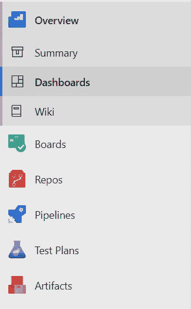
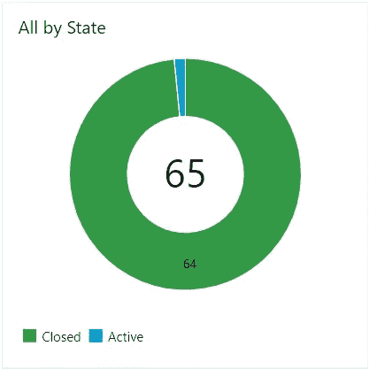

# 我是如何成功获得并完成我的第一个自由职业项目的

> 原文：<https://medium.datadriveninvestor.com/how-did-i-successfully-get-and-complete-my-first-freelance-project-291859d1adbe?source=collection_archive---------4----------------------->

freelance

为了获得财务自由，我想到了做很多事情。作为一名学生，我最初的想法是找一份软件工程师的工作，然后我会在一家好公司有一份稳定的工作，赚很多钱。但加入其中一家后，我意识到这家公司在财务上是独立的，但员工却不是。后来我想到了建立自己的公司。但是我没有疯狂的想法。许多人鼓励我建立一个，但我不敢开始一个。然后我想做自由职业者，我真的做了。我想分享一下我的第一次自由职业经历。通过这篇文章，我想讲述以下内容:

*   我是如何得到这个项目的？
*   *我用过的工具*
*   *我是如何管理时间表的*

# **我是如何获得项目的？**

我第一次尝试没有得到这个项目。我不是一个超级程序员。每个人都可以成为自由职业者。我申请了多个工作网站，自由职业投标。但是，我没有得到积极的回应，因为我没有经验。拒绝对我来说并不新鲜。我一直在努力。拒绝让你变得更强大。

Making a shape

一些自由职业的技术写作人员对我没什么兴趣，但是看到我的作品后，他们没有给我机会。随着时间的推移，我能够建立一个强大的网络。一个在专业上了解我的人指望我，给了我一个项目。因为这是我的第一个项目，所以我并没有期望很高的报酬，但是我通过它得到了一大笔钱。我就是这样开始我的旅程的。

# 开始使用…！！！

How to get started…!!

得到一个项目让我肾上腺素激增。但是由于缺乏经验，我有点困惑，有点害怕接手这个项目。让我告诉你这个项目，以及我如何克服内心的恐惧。

该项目是建立一个 android 应用程序。我不是 android 方面的专家，但如果你懂 java，这就不是火箭科学了。感谢上帝！Android 在网上有非常好的文档。此外，感谢大型在线社区，特别感谢 stackoverflow :p。

 [## 数据科学和软件工程哪个更有前途？数据驱动的投资者

### 大约一个月前，当我坐在咖啡馆里为一个客户开发网站时，我发现了这个女人…

www.datadriveninvestor.com](https://www.datadriveninvestor.com/2019/01/23/which-is-more-promising-data-science-or-software-engineering/) 

我从客户那里拿到了一份描述他们需求的技术文件。我非常着迷，因为我是第一次做这个。我思考了一下这个过程。在 SDLC 上给出了相当多的读数。我研究了技术细节。在开始之前，有几件重要的事情需要考虑。

*   项目管理工具
*   与客户协商时间表

最重要的一点是坚持时间表。如果我们错过了他们，那可能会给你留下负面的印象。

> 但是千万不要在质量上妥协。如果你不在轨道上，提前通知客户。

Quality and Timeline Hand in Hand

# 项目管理工具

预付了几块钱后，我开始着手这个项目。管理软件开发生命周期总是需要一个好的项目管理工具。在市场上的众多选择中，我选择了*A*[zure devo PS作为我的项目管理。最初，我做了这些事情:](http://dev.azure.com/)

*   从文档中创建用户故事。
*   为各自的用户情景创建任务。
*   将任务/用户故事分成一周冲刺。

还有很多其他的项目管理工具。几乎所有这些都提供了或多或少相同的功能。你可以选择其中一个。

# 我是如何管理时间表的

> 到目前为止一切顺利。计划准备好了。行刑的舞台已经准备好了。我脑子里有很多问题。我能把这个脱下来吗？我总是说的唯一答案是——是的！

我已经把这些任务分成了几个冲刺阶段，每个阶段一周。我向客户承诺了可交付成果。我在连接手机的硬件方面遇到了一些技术难题。我已经毫不犹豫地和客户讨论了这些问题。我告诉他们一些障碍，并告诉他们因为打嗝会导致的延迟。他们同意了，因为我事先通知了他们。

Status

在每次冲刺的最后，我都会向客户展示一个演示。如果需求之间有任何不匹配，他们会给我反馈。我过去常常与他们就他们建议的改进或变更进行协商。幸运的是，所有的讨论都非常健康，积极和知识共享。

我试图毫不拖延地按时完成任务。仪表板给了我项目的鸟瞰图。

这让我对进步有了清晰的认识。Azure DevOps 本身具有构建免费私有 git 库的特性。免费工具帮了我大忙。我曾经有固定的时间来做项目。然而，当我感到懒惰，习惯于堆积我的任务。我试着花更多的时间来掩盖那些冬眠。但那很有趣:)。

> 保持专注，保持坚定

希望这对你有帮助。如果你喜欢这篇文章，请鼓掌。感谢阅读。