# 我如何使用 Salesforce 和 Tableau 简化工作时间报告

> 原文：<https://medium.datadriveninvestor.com/how-did-i-use-salesforce-and-tableau-to-simplify-hours-worked-reporting-fd1d54866257?source=collection_archive---------4----------------------->

## 使用 Lightning 组件和 Tableau Online 提高工作效率


Photo by [Austin Distel](https://unsplash.com/@austindistel?utm_source=medium&utm_medium=referral) on [Unsplash](https://unsplash.com?utm_source=medium&utm_medium=referral)

作为一名顾问，记录你工作中的每一个小时是非常重要的。在 Bera Group S.A.S，我们使用通用的 Excel 格式，公司的所有员工都必须在月底完成该格式才能获得报酬，这也是避免项目在预计时间内失败的一种方式。

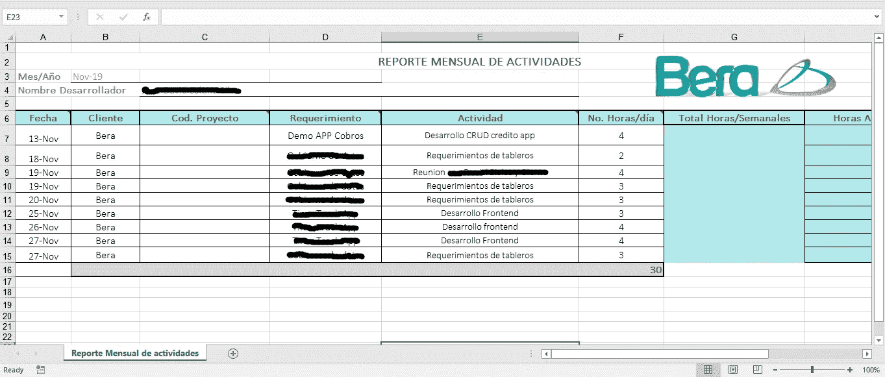

Excel format example

这种格式的最大问题是，你需要有极好的记忆力来记住你在一天中的每个小时做了什么，并且没有办法获得你的项目细节的完整概述，你甚至可以为相同的项目或需求取不同的名字！

[](https://www.datadriveninvestor.com/2019/02/12/ready-or-not-the-revolution-is-upon-us/) [## 不管准备好了没有，革命就在我们面前|数据驱动的投资者

### “对于技术如何影响我们的生活和重塑经济，我们必须形成全面的全球共识……

www.datadriveninvestor.com](https://www.datadriveninvestor.com/2019/02/12/ready-or-not-the-revolution-is-upon-us/) 

作为 Tableau(最近又成为了 Salesforce)的顾问，我建立了一个解决方案，它与格式的目的相同，允许我和我的老板在一个月的任何时候跟踪我在做什么。使用自定义对象、照明组件、Salesforce 移动应用程序、Tableau Desktop 和 Tableau Online，我现在可以在我的计算机或智能手机上记录项目和活动，同时有一个自动作业从 Salesforce 获取我的数据，并构建一个更新的 Tableau 仪表板来汇总我的工作时间。

架构看起来是这样的:

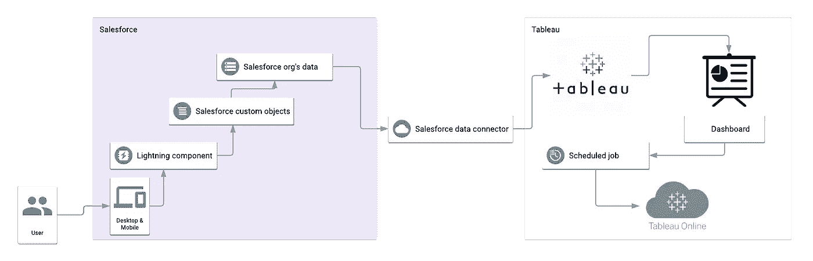

# 销售队伍发展

Salesforce 解决方案部分包括创建两个定制对象*项目*和*活动*，它们通过主-从关系相互连接。项目有一个汇总汇总字段，汇总与项目相关的每项活动所花费的时间，活动有表示开始日期(自动计算)、所花费的时间以及所做工作描述的字段。

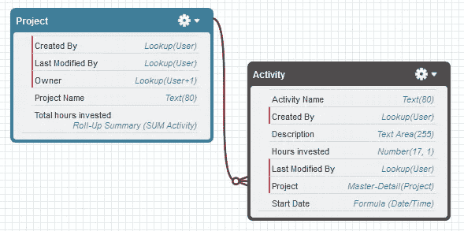

Custom object schema

现在为闪电部分建造了两个组件。第一个用于创建项目，是使用 aura 构建的。

```
<aura:component implements="flexipage:availableForAllPageTypes" access="global" > <aura:attribute name="fields"
                  type="String[]"
                  default="['Name']"/> <lightning:recordForm objectApiName="Project_Bera__c"
                        fields="{!v.fields}"/></aura:component>
```

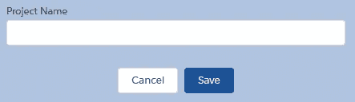

第二个是创建活动的表单，其中有一个查找元素将活动与现有项目关联起来。它是使用屏幕流创建的。

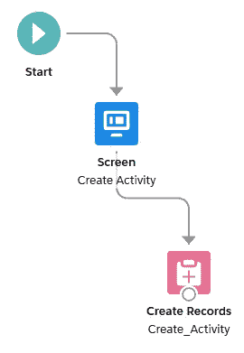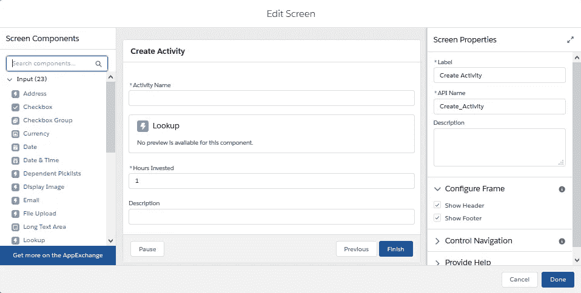

这些组件被添加到 Salesforce 自定义应用程序的主页，其中包括 lightning 报告和仪表板。

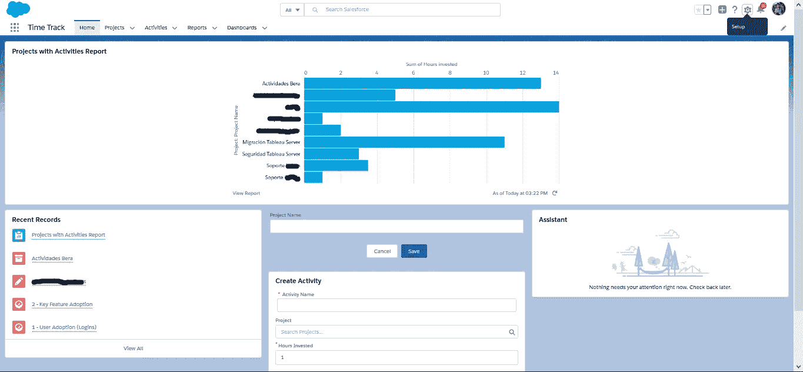

还创建了一个手机定制页面。

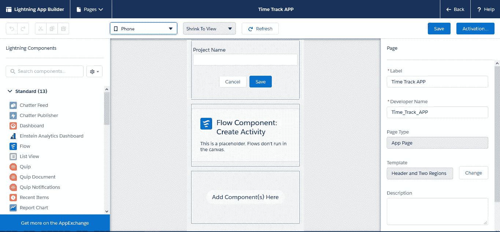

现在，组件已经完全正常工作。

# （舞台上由人扮的）静态画面

使用 Tableau Desktop，我建立了到我的 Salesforce 数据的连接，并使用层次结构构建了一些图表来汇总小时、项目和活动的总数。最后，我建立了一个仪表板，在一个屏幕上显示一切。

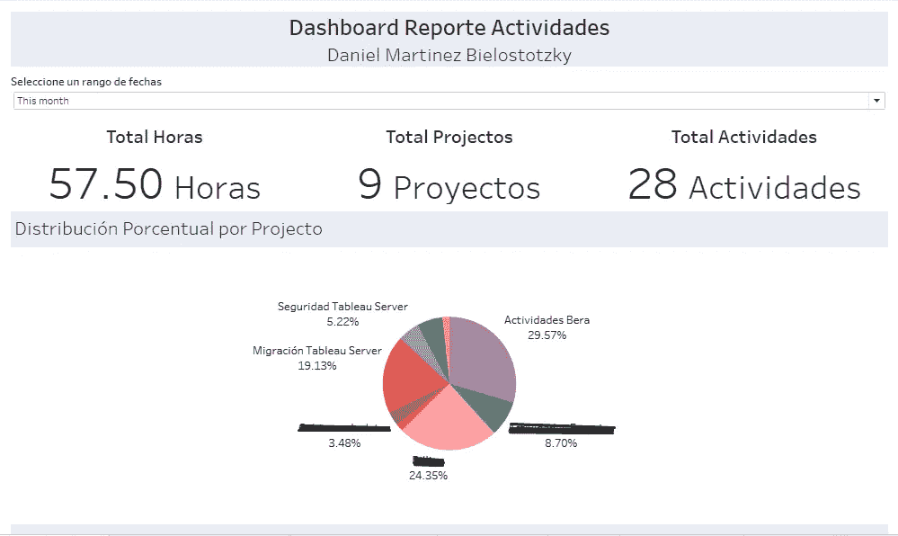

Tableau dashboard using Salesforce data

最后，仪表板被部署到 Bera Tableau Online 服务器，其中计划作业被设置为每天午夜刷新来自 Salesforce 的数据。

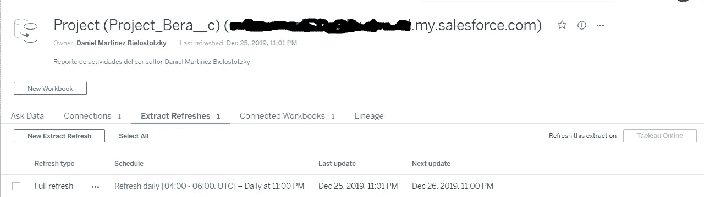

现在，仪表板会自动更新，可以在一个月内的任何时间查看。

# 决赛成绩

有了这个解决方案(使用这两种工具最多需要 4 个小时),我现在可以在任何地方使用 Salesforce 移动应用程序来创建我的工作时间记录，同时通过自动化仪表板消除手动 Excel 格式，使我可以跟踪我在工作日的大部分时间都在哪里度过。

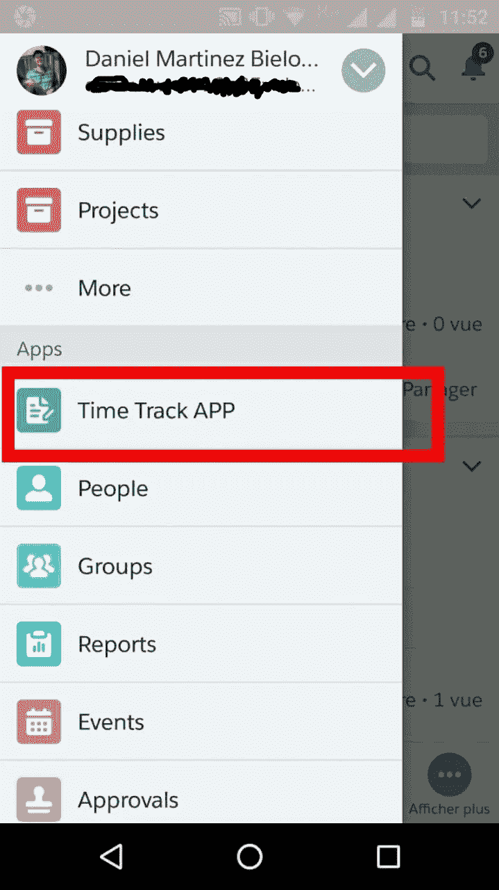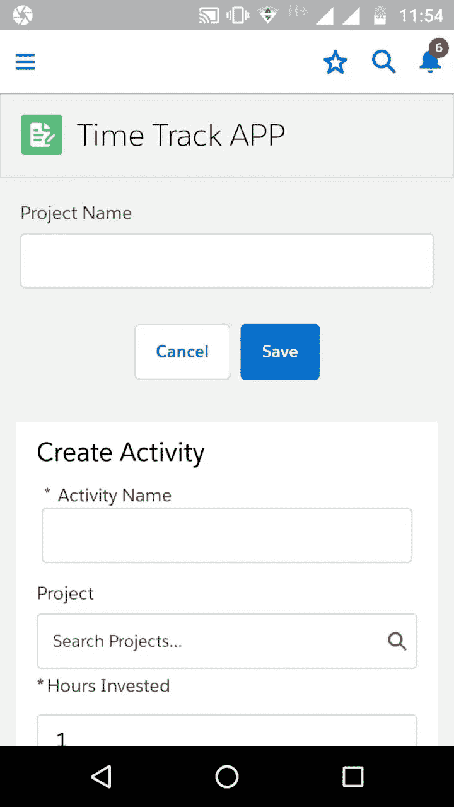

我甚至可以用手机上的 Tableau 移动应用程序查看仪表盘！


# 我是谁？


我叫丹尼尔·马丁内斯，是哥伦比亚波哥大 Bera 集团 SAS 公司 Tableau 的首席商务智能顾问。我对机器学习和数据科学充满热情，目前我拥有 Tableau 桌面专家认证，但作为一名顾问，我有大约一年的时间从事仪表板的构建、使用 Tableau 的 BI 解决方案的架构以及 Tableau 服务器的管理。

如果你想联系我，你可以发邮件到我的邮箱[daniel.martinez@bera.com.co](mailto:daniel.martinez@bera.com.co)或者在 LinkedIn 上联系我。

[](https://www.linkedin.com/in/daniel-martinez-bielos/) [## 丹尼尔·马丁内斯·比洛斯托茨基——Tableau 顾问——Bera Group SAS | LinkedIn

### 我是诺特大学最后一个学期的本科生，学习数据科学、机器学习…

www.linkedin.com](https://www.linkedin.com/in/daniel-martinez-bielos/) 

也可以在我的个人博客中读到更多关于我其他项目的信息。

[](https://sites.google.com/view/danielmartinezbielos) [## 丹尼尔·马丁内斯

sites.google.com](https://sites.google.com/view/danielmartinezbielos) 

如果你想更多地了解我们在 Bera Group SAS 的工作，你可以查阅用[西班牙语](https://drive.google.com/file/d/11HaMRr_FdDf4_68SYCzaoS5j4-Ms7bOO/view?usp=sharing)和[英语](https://drive.google.com/file/d/1pMfel89Gqqgocfesm9PEyOxY0v8f66qX/view?usp=sharing)编写的关于我们服务的小册子。