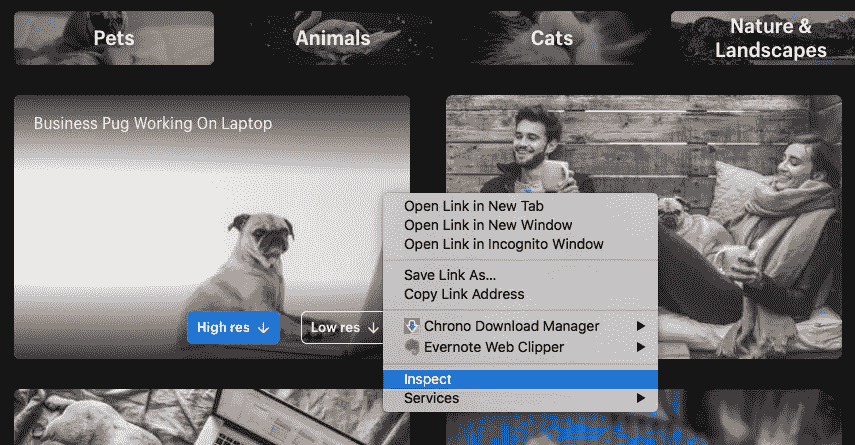
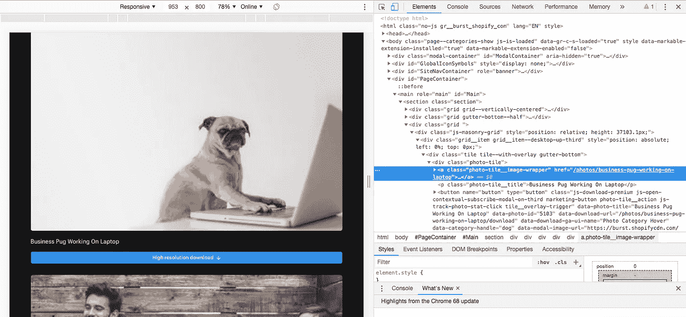

# 你是如何废弃这些数据的？

> 原文：<https://medium.datadriveninvestor.com/how-did-you-scrap-this-data-d10706d0dcd3?source=collection_archive---------1----------------------->


> *你只是厌倦了做手工吗？你的朋友们正在看一些科幻电影，而你正在为你的下一个项目下载图片吗？如果上面问的一切都有积极的方向。你来对地方了！*

如果你只是想探索代码，请跟随 git repo[we b-scrapper-python](https://github.com/zujoio/web-scrapper-python)否则，继续吧！

*深度学习*已经成为解决*现实世界问题*最有前景的方法。是针对*机器学习问题*最具革命性的创新。

深度学习算法一直工作得很好，需要大量数据。出于同样的目的，已经对大规模带注释的数据集进行了探索。我们拥有的注释数据越多，我们的模型表现得就越好。


Deep Learning: Performance vs Amount of Data

但是很好地收集注释良好的数据既费时又费钱。与使用网上报废的传统手动方法相比，该过程可以自动化。

今天的文章是关于使用 Python 的 web 报废。

# HTML 简介

我假设你知道基本的 HTML 标签，但是如果我的假设是错误的，那么请点击链接 [HTML 教程](https://html.com/)。

不管怎样，你已经意识到 HTML 标签有像`class`和`id`这样的属性，这对于定位网站的非结构化数据非常有用。

废弃时，将使用相同的 HTML 属性和标签来收集有关数据结构的信息。

# 建议

开始前的几条建议:

1.  出于商业目的，请遵守服务条款(ToS)。
2.  在未验证数据许可或未获得版权所有者书面许可的情况下，不要重新发布您的抓取数据或任何衍生数据集。
3.  不要把你的整个生意建立在数据搜集的基础上。你抓取的网站最终可能会屏蔽你。

要了解更多信息，我推荐阅读伟大的文章[网络抓取和爬行是完全合法的，对不对？](https://benbernardblog.com/web-scraping-and-crawling-are-perfectly-legal-right/)作者[本·伯纳德](https://benbernardblog.com/about-me/)

我将在接下来的章节中一步一步地解释网络报废的实现，路线图如下:

1.  入门指南
2.  Web 检查器
3.  代码入门
4.  Selenium Web 驱动程序的高级用法
5.  线程的高级用法
6.  Scrapy 的高级用法
7.  参考

激动吗？让我们一步一步开始。

# 入门指南

我们将使用强大而简单的 Python 作为我们的报废语言。

*   要安装 Python，请从 https://www.python.org/downloads/[下载兼容版本的 Python](https://www.python.org/downloads/)

此外，我们需要使用 Python 的包管理工具`pip`安装`BeautifulSoup`和`cssutils`。

```
pip install BeautifulSoup
pip install cssutils
```

如果您无法执行命令，请在每个命令的末尾添加`--user`或尝试使用`sudo.`

# Web 检查器

Web Inspector 是一个工具，它将帮助我们找到任何特定网站背后的 HTML。

让我们以[页的 burst.shopify.com](http://localhost:8000/posts/how-did-you-scrap-this-data/burst.shopify.com)页为例。打开页面，选择类别狗，然后右键单击图像。它将打开浏览器的检查器来检查网页。如下图所示:



Web Inspector inspect element



Web Inspector Source Code

它将显示代码的源代码，其结构可能如下所示:

```
<div class="tile tile--with-overlay gutter-bottom">
    <div class="photo-tile">
        <a class="photo-tile__image-wrapper">
            
```

HTML 标签由标签的属性唯一标识。因此，现在我们知道了在报废过程中唯一标识的数据的位置。

# 代码入门

以下是需要放入`config.py`文件的配置。这个全局配置将在不同的脚本中使用。

```
# Target dataset path
DATASET_PATH = "./dataset"# Fake user agent for avoiding 503 error
HEADERS = {
    'User-Agent': 'Mozilla/5.0 (X11; Linux x86_64) AppleWebKit/537.36 (KHTML, like Gecko) Chrome/42.0.2311.90 Safari/537.36'
}# Base url of scrapping
BASE_URL = "[https://burst.shopify.com](https://burst.shopify.com/)"# Advanced parameters
# Categories want to scrap
CATEGORIES = ["dog","cat"]# Page limit to search images from URL
PAGE_FROM =1
PAGE_TO = 2# Number of workers for downloading pages and images for better and faster performance
WORKERS = 4
```

现在，让我们用代码来弄脏我们的手。导入一些库以开始实际代码:

```
from bs4 import BeautifulSoup
import os
import urllib.request
from tqdm import tqdm
import ssl
```

`BeautifulSoup`用于抓取网页和图片，导入`urllib`用于下载网页和图片。`tqdm`仅用于显示进度，`ssl`用于创建请求的假验证。

另外，我们需要导入`config.py`文件来使用全局配置。

```
from config import *
```

开始之前，我把一些本地配置，这将被用于如下。

```
timeout = 60 # Request timeout
url = BASE_URL + "/dog" # URL being scrapped
target_dir = os.path.join(DATASET_PATH,"dog") # Target directory for scrapping data
```

为了下载页面的源代码，我使用了`urllib`库，其中`context`指定了一个假的 SSL 证书以避免 SSL 异常，而`HEADERS`是从全局配置中导入的，以避免 web 服务器生成 503 异常。

```
# Bypass SSL verification
context = ssl._create_unverified_context()# Read HTML page and save as long string
req = urllib.request.Request(url, headers=HEADERS)
response = urllib.request.urlopen(req, timeout=timeout, context=context)# Read page source
html = response.read()
```

下载的 HTML 源代码需要被解析以访问 HTML 标签的属性。`BeautifulSoup`将用于相同的上下文。它有经过很好优化的类和方法，通过它们独特的属性来访问 HTML 标签。

```
# Parse HTML source using BeautifulSoup
soup =  BeautifulSoup(html, "html.parser")
```

现在我们有了一个名为`soup`的处理程序，它是 HTML 源代码的解析版本，可以附加到任何受支持的`BeautifulSoup`类的方法上。

正如我们之前了解到的数据的唯一标签。`soup`有一个`select()`方法，它将帮助我们从解析的 HTML 内容中找到特定的标签。因为我们有独特的``类标记。

下面这段代码将从一个类被定义为`js-track-photo-stat-view`的页面中获取所有的``标签。

```
image_grids = soup.select('.js-track-photo-stat-view')
```

接下来，我们必须提取图像的 URL，这有助于下载图像。

`image_grids`包括如下所示的``的多个条目。正如您所看到的，``标签有一个名为`data-srcset`的属性，其中包括图像的 URL，分辨率为 1x、2x 等等。

```

```

我们可以使用`get()`方法访问``标签的属性。下面的代码将获取`data-srcset`属性的内容，并预处理数据以从中找到最高分辨率的图像。

```
image_urls = []
for image_tag in tqdm(image_grids,desc="Find Images"): # Fetch data tag which includes sequence of URLS
    image_url = image_tag.get('data-srcset') # Extract highest resolution image from data tad
    image_url = image_url.split(',')
    high_resolution_pair = image_url[-1].split(' ')
    high_resolution_image_url = high_resolution_pair[1].replace("@2x", "@3x") # Stack all image urls
    image_urls.append(high_resolution_image_url)
```

现在，我们已经将一个 URL 列表堆叠到了`image_urls`列表中。我们需要做的就是将图像下载到目标目录中。下面的脚本将完成剩下的工作。

```
# Download images into target directory
for image_url in tqdm(image_urls,desc="Download Images"): # Extract name of file from URL
    file_name = image_url.split("/")[-1] # Build target path of image
    image_path = os.path.join(target_dir, file_name) # Create directories
    if not os.path.exists(target_dir): os.mkdir(target_dir) # Write image to file system
    if not os.path.exists(image_path): # Read image from web
        req = urllib.request.Request(image_url, headers=HEADERS)
        response = urllib.request.urlopen(req, timeout=timeout, context=context) # Write it down to file system
        f = open(image_path, 'wb')
        f.write(response.read())
        f.close()
```

提取的每个图像都将下载到目标目录中。上面的脚本将显示如下输出，它可能会根据您的计算机的性能和互联网速度而改变！

```
Find Images: 100%|###########################################################################################################################################| 50/50 [00:00<00:00, 107933.71it/s]
Download Images: 100%|###########################################################################################################################################| 50/50 [00:42<00:00,  2.81it/s]
```

你可以在 github repo `[basic_scrapper.py](https://github.com/zujoio/web-scrapper-python/blob/master/basic_scrapper.py)`找到完整的脚本

你可以在 [BeautifulSoup](https://www.crummy.com/software/BeautifulSoup/bs4/doc/) 的官方文档中找到`BeautifulSoap`的其他方法和用法

# Selenium Web 驱动程序的高级用法

simple `urllib`的问题是它不支持从指定的 URL 下载动态 HTML 内容。

HTML 将在 javascript 执行后加载，并动态生成页面内容。此时`urllib`将下载页面源，但不包括下载图像所需的页面源。

例如，从[Amazon.com](https://www.amazon.com/Old-Man-Sea-Ernest-Hemingway/dp/0684801221/ref=sr_1_1?ie=UTF8&qid=1540649353&sr=8-1&keywords=old+man+and+the+sea)打开任何产品页面。产品的全部内容将在 javascript 完成后生成。

这个 javascript 问题可以通过使用`selenium` web 驱动程序下载页面源代码来解决。它将自动打开网页，并等待页面上的每个脚本都将被执行。

从`selenium`开始，您必须使用以下链接根据您的系统配置安装特定的浏览器 web 驱动程序绑定。就我而言，我打算在 Mac OS 上使用 Firefox。

## 官方 Selenium Python 包页面:

[https://pypi.org/project/selenium/](https://pypi.org/project/selenium/)

## 下载 Firefox Web 驱动程序绑定:

[https://github.com/mozilla/geckodriver/releases](https://github.com/mozilla/geckodriver/releases)

使用以下脚本安装 selenium 包

```
pip install selenium
```

现在导入 web 驱动程序并用下面的代码替换获取页面源:

```
from selenium import web driver# Use selenium firefox driver to get page source
browser = webdriver.Firefox()
browser.get(url)# get page source
html = browser.page_source
```

它将打开一个自主的 firefox 窗口，并在整个页面加载成功后关闭它。你可以从[selenium-python.readthedocs.io/](https://selenium-python.readthedocs.io/)中找到更多`selenium`的用例

# 线程的高级用法

上述代码是基本的，所以它不会利用可用的资源。为了解决这个问题，线程可以用来提高 scrapper 的性能。使用 python 的内置`concurrent`包的`ThreadPoolExecutor`可以并行下载网页和图片。

Bolow 代码使用多线程下载带有`images_urls`数组的图像。`download_image` is 函数将图像的单个`url`和请求的`timeout`作为输入。图像将被下载并行使用以下脚本。

```
# Initialize thread pool executor
executor = concurrent.futures.ThreadPoolExecutor(max_workers=5):# Start the load operations and mark each future with its URL
future_to_url = {executor.submit(download_image, url, timeout): url for url in image_urls}
count_images = 0
for future in concurrent.futures.as_completed(future_to_url):
    files = future.result()
    count_images = count_images + len(files)
```

从 [concurrent.futures](https://docs.python.org/3/library/concurrent.futures.html) 了解更多关于`ThreadPoolExecutor`的信息

# Scrapy 的高级用法

`Scrapy`可作为报废时的推进。它包含丰富的类和方法来从多个来源提取数据。

首先，使用以下命令安装 scrappy:

```
pip install scrapy
```

`Spiders`是您定义的类，`Scrapy`使用它们从一个网站(或一组网站)收集信息。它们必须是 scrapy 的子类。Spider 并定义要发出的初始请求，可以选择如何跟踪页面中的链接，以及如何解析下载的页面内容以提取数据。

让我们从一个简单的例子开始，这个例子从多页内容中提取一个博客的标题。

首先我要导入 scrapy 库，实现从`scrapy.Spider`基类扩展的类`BlogSpider`。我必须分别使用`name`和`start_urls`来声明蜘蛛的名称和 URL。如下图所示:

```
import scrapy"""
    Abstraction of Blog Scrapper
"""
class BlogSpider(scrapy.Spider):
    # configure name of blog spider and URL
    name = 'blogspider'
    start_urls = ['[https://blog.scrapinghub.com](https://blog.scrapinghub.com/)']
```

现在，我必须重写`parse`方法来从指定的 URL 中删除数据。下面的代码将从类为`post-header`的页面中找到`<h2>`，然后提取第一个元素的文本。

```
"""
    Implement parser 
"""
def parse(self, response):
    # extract titles from page
    for title in response.css('.post-header>h2'):
        yield {'title': title.css('a ::text').extract_first()}
```

之后，我为定义的 URL 中的每个页面递归调用了`parse`方法。使用`Scrapy`要容易得多，相对来说需要的代码也要短得多。

```
def parse(self, response):
    # extract titles from page
    for title in response.css('.post-header>h2'):
        yield {'title': title.css('a ::text').extract_first()} # move to the next page
    for next_page in response.css('div.prev-post > a'):
        yield response.follow(next_page, self.parse)
```

整个代码定义如下:

```
import scrapy"""
    Abstraction of Blog Scrapper
"""
class BlogSpider(scrapy.Spider):
    # configure name of blog spider and URL
    name = 'blogspider'
    start_urls = ['[https://blog.scrapinghub.com](https://blog.scrapinghub.com/)'] """
        Implement parser 
    """
    def parse(self, response):
        # extract titles from page
        for title in response.css('.post-header>h2'):
            yield {'title': title.css('a ::text').extract_first()} # move to the next page
        for next_page in response.css('div.prev-post > a'):
            yield response.follow(next_page, self.parse)
```

在官方文档链接找到更多关于`Scrapy`的信息:[https://scrapy.org/](https://scrapy.org/)

伙计们，这都是我这边的。您可以从下面的库中找到代码。

[https://github.com/zujoio/web-scrapper-python](https://github.com/zujoio/web-scrapper-python)

希望你喜欢这篇文章。如有任何问题，欢迎在下方留言。

最初发布于:[https://Arjun-kava . github . io/posts/how-do-you-scrap-this-data/](https://arjun-kava.github.io/posts/how-did-you-scrap-this-data/)

# 参考资料:

1.  [https://www . data camp . com/community/tutorials/web-scraping-using-python](https://www.datacamp.com/community/tutorials/web-scraping-using-python)
2.  [https://www . analyticsvidhya . com/blog/2015/10/初学者指南-web-scraping-beautiful-soup-python/](https://www.analyticsvidhya.com/blog/2015/10/beginner-guide-web-scraping-beautiful-soup-python/)
3.  [https://docs . python . org/dev/library/concurrent . futures . html # concurrent . futures . threadpoolexecutor](https://docs.python.org/dev/library/concurrent.futures.html#concurrent.futures.ThreadPoolExecutor)
4.  [https://scrapy.org/resources/](https://scrapy.org/resources/)
5.  [https://docs.scrapy.org/en/latest/intro/tutorial.html](https://docs.scrapy.org/en/latest/intro/tutorial.html)