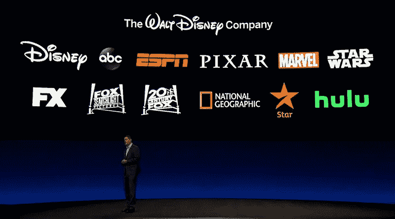
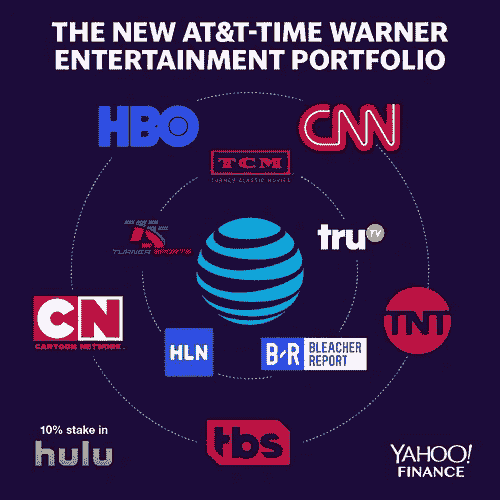

# 迪士尼+和 Prime Video 将如何主导流媒体大战

> 原文：<https://medium.datadriveninvestor.com/how-disney-and-prime-video-will-dominate-the-streaming-wars-3cdfc422e429?source=collection_archive---------4----------------------->

现在是 2030 年，你的家人正准备在周六晚上去看电影。你打开电视，停下来思考应该使用哪种服务:迪士尼+、Prime Video 还是网飞。你没有更多流媒体服务。你最终只能满足于迪士尼+上的《复仇者联盟 7》，这是一个家庭的最爱。爆米花好了。

网飞在 2007 年推广了流媒体电影的概念，并在 2013 年其内部制作《纸牌屋》首映时巩固了这一想法。能够观看几乎“任何”电影的承诺让网飞征服了家庭视频领域，并将百视达挤出了市场。

几年来，网飞享受着弱竞争，并为其在线流媒体服务积累了大量电影。到 2016 年，网飞[每年在内容上花费 60 亿美元](https://www.hollywoodreporter.com/features/netflix-backlash-why-hollywood-fears-928428)，截至 2019 年 4 月，这家媒体公司在全球拥有超过 1.48 亿付费订户。有了如此迅速的成功，可以理解其他公司试图效仿，今天网飞面临着其他数十家也提供原创内容的流媒体服务的竞争:Prime Video、HBO、Hulu、Vudu、YouTube Premium、DC Universe 等。

*Streaming services by user count — Graphic: David Foster/*[*Yahoo Finance*](https://finance.yahoo.com/news/when-will-america-hit-peak-streaming-wars-netflix-disney-132552252.html)

由于如此多的服务通过订阅模式争夺用户的注意力，华纳媒体、迪士尼或 NBC 环球等全球媒体制作公司意识到，他们的内容对于任何在线流媒体服务都具有不可思议的价值。用户加入(和离开)订阅服务完全是基于它提供的内容。HBO Max，Disney+，甚至 Apple TV+这样的服务就是这样产生的。他们都试图通过收回自己的知识产权来打入网飞市场。

*Disney properties —* [*Investor Day 2019*](https://dtcimedia.disney.com/investor-day-photos)

不幸的是，这场流媒体战争对客户来说意味着他们将不得不为每项单独的服务付费。例如，喜欢看《T4 老友记》和《漫威电影》的人将不得不为 HBO Max、Disney+和仍未命名的 NBC 环球服务付费。

*WarnerMedia properties — Graphic: David Foster/*[*Yahoo Finance*](https://finance.yahoo.com/news/att-time-warner-combining-turner-sports-hbo-what-it-means-for-streaming-213526926.html)

但从长远来看，一些服务最终将被关闭，媒体公司将把它们的内容恢复到目前的许可模式。哪些服务？所有那些内容库不够强大，不足以让客户支付一个月的订阅。像迪士尼或亚马逊这样的大公司可以长期玩这个游戏，因为他们的主要收入来源不依赖于他们的流媒体服务。其他公司，如网飞，完全依靠他们的订阅模式来实现可持续发展。

 [## 苹果会成为新的网飞吗？数据驱动的投资者

### 有可能。然而，该公司肯定会与大公司竞争。许多人不得不看到这一天的到来…

www.datadriveninvestor.com](https://www.datadriveninvestor.com/2019/02/15/will-apple-be-the-new-netflix/) 

鉴于迪士尼已经拥有的大量内容，以及其新产品的吸引力(迪士尼是第一家在一年内拥有五部 10 亿美元电影的工作室),我预计迪士尼+将在 2030 年底成为订阅用户最多的流媒体服务。这项服务肯定会取得看似成功的推出，这是基于大肆宣传和这样一个事实，即在发布日期前几个月，迪士尼网站在 Disney+上提供了大幅折扣，[在人们争相获得 33%折扣的交易时崩溃了](https://www.businessinsider.com/d23-website-crashes-down-during-from-disney-plus-deal-2019-8)。

亚马逊拥有其 Prime 会员的权力；许多用户订阅寻求免费的当天和一天送达选项，并最终获得黄金视频作为一个很好的副作用。这种捆绑策略使亚马逊能够在 Prime Video 产品的基础上，用亚马逊音乐、无限照片存储和免费 Kindle 电子书等额外好处来吸引客户。亚马逊可以吸引那些原本不会对其他订阅感兴趣的顾客。结合越来越多的原创电影和电视节目，我相信到 2030 年，Prime Video 将成为第二大提供商。

我有意让网飞退居第三，因为尽管它目前是最大的玩家，但它的订阅模式是唯一稳定的收入来源。迪士尼和亚马逊有不同的收入来源，可以负担得起亏本提供流媒体服务的奢侈，这将有助于他们继续扩张。为了平衡这种情况，网飞一直在不断增加内容支出，[在 2019 年达到 150 亿美元](https://variety.com/2019/digital/news/netflix-content-spending-2019-15-billion-1203112090/)。在国际上，网飞已经建立了强大的存在，购买了已经成功的节目的流媒体版权，并给予当地创作者发言权。这使得传统媒体公司无法以前所未有的方式协调跨国发行，像*罗马*、*黑暗*或*金钱抢劫*这样广受好评的作品就是很好的例子。

2019 年 3 月，福布斯[发表了](https://www.forbes.com/sites/tonifitzgerald/2019/03/29/how-many-streaming-video-services-does-the-average-person-subscribe-to/)一项研究，指出普通美国人只订阅三项在线服务，70%的美国家庭至少订阅一项。由于像这样的市场分析，媒体提供商知道他们需要进入前三名，以保证他们的长期生存。那些低于截止线的公司可能会通过许可他们的内容来获得更好的交易。例如，NBC 环球可能最终会通过向网飞授权《侏罗纪公园》获得更多价值，而不是等待用户加入另一个流媒体服务。

在 2000 年代末，亚马逊视频、Hulu、iTunes、网飞和 YouTube 使得取消传统电视服务成为可能(也称为剪线)。2010 年是第一个用户数量逐季下降的年份。现在，传统媒体行业正在用新的流媒体服务反击，而不是旧的有线电视捆绑。以前难以支付大电视捆绑的客户现在可以根据他们想要观看的内容，从大量内在更便宜的流媒体服务中进行选择。有趣的是，这些传统媒体公司正在卷土重来，玩着曾经威胁要让它们出局的游戏。

**你喜欢这篇文章吗？** [**订阅**](https://geekonrecord.com/subscribe/) **通过邮件获取新帖。**

***免责声明*** *:即使我为亚马逊工作，本帖内容纯属个人观点，不以任何方式代表亚马逊。*