# 助推算法是如何工作的？

> 原文：<https://medium.datadriveninvestor.com/how-do-boosting-algorithms-work-5d2c734aca4c?source=collection_archive---------3----------------------->

视觉向导

如果你正在关注 Kaggle 竞赛，你一定已经注意到，boosting 算法赢得了“结构化数据”类的大多数竞赛。在本文中，我将尝试解释 boosting 算法是如何工作的，以及它们的力量来自哪里。

通常，boosting 算法试图通过组合每次迭代中创建的弱学习器来获得强学习器。我将首先使用 Adaboost 算法来说明这对于分类问题意味着什么。然后我们来看一个梯度推进的回归问题。

如果你想详细检查共享的图形或代码并做实验，你可以通过我的 [GitHub](https://github.com/sozker/how-do-boosting-algorithms-work) 账号接触到它们。

# adaboost 算法

Adaboost 由 Robert Schapire 和 Yoav Freund 于 1996 年开发，作为第一个成功的 boosting 算法获得了著名的哥德尔奖。

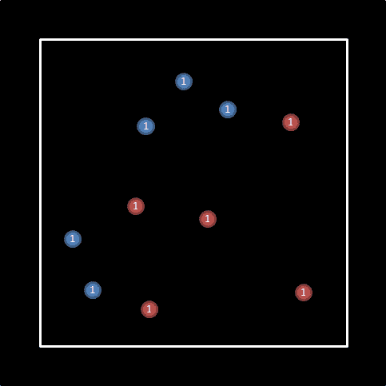

假设我们有一个分类问题，我们试着把左边的蓝点和红点分类。

当我们可以将它可视化时，解决方案似乎非常容易，但大多数时候我们没有机会处理可以通过这种方式可视化的数据。

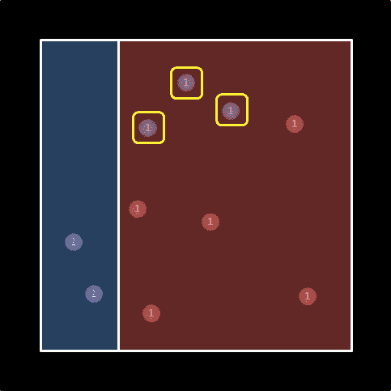

1st iteration (correct: 7 — incorrect: 3)

该算法将在所有点都相等的第一次迭代中得出最佳解。在这种情况下，将在左侧创建一个区别。如你所见，我用黄色标记的 3 个点在错误的一边。为此，我们需要在第二次迭代中增加它们的权重。但是怎么做呢？

在第一次迭代中，我们有 7 个正确分类的点和 3 个错误分类的点。让我们假设我们想要使我们的解决方案达到 50/50 的平衡。然后我们需要把分类不正确的点的权重乘以(正确/不正确)也就是(7/3 ≈ 2.33)。如果我们将错误分类的 3 个点的权重增加到 2.33，我们的模型将是 50–50%。我们把第一次分类的结果记在脑子里，然后进行第二次迭代。

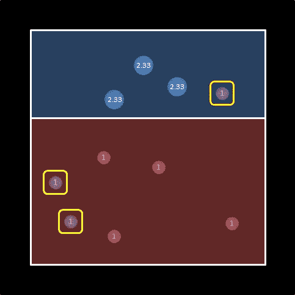

2nd iteration (correct: 11 — incorrect: 3)

在第二次迭代中，最佳解如左图所示。正确分类的点的权重为 11，而错误分类的点的权重为 3。

为了使模型回到 50/50 平衡，我们需要将错误分类的点的权重乘以(11/3 ≈ 3.66)。

使用新的权重，我们可以将模型带入第三次迭代。

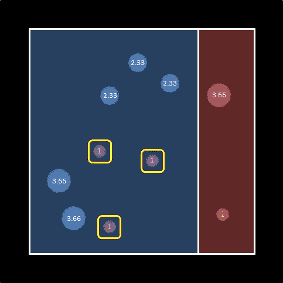

3rd iteration (correct: 19 — incorrect: 3)

第三次迭代的最佳解决方案如左图所示。正确分类的点的权重是 19，而错误分类的点的权重是 3(再次)。

我们可以继续迭代，但是假设我们在这里结束。

我们现在已经到了结合 3 个弱学习者的阶段。但是我们怎么做呢？

**ln(正确/不正确)**似乎给了我们想要的系数。

例如，如果我们稍微思考一下，一个正确和不正确的权重相等的解决方案对我们没有帮助。于是，ln (1) → 0 符合我们的预期。

随着正确数的增加，公式的系数会逐渐向无穷大增加，给出所有结果正确的解的权重也将是无穷大— ln(∞)→∞。

一个给出大量不正确信息的模型也有助于我们。我们只需要反转模型。一个完全做出不正确假设的模型将会有一个负的无穷大权重——ln(0)→-∞

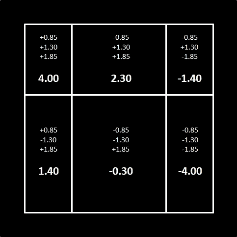

如果我们认为蓝色区域为正，红色区域为负；我们可以像左边的图片一样组合 3 次迭代的结果。

随着我们在每次迭代中对每个部分的权重求和，结果慢慢开始显现。如果我们用蓝色表示阳性部分，用红色表示阴性部分，就可以看到我们算法的结果。

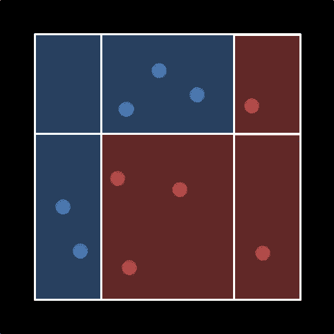

Adaboost 以一种奇妙的方式解决了我们的问题。

在创建这个例子时，我受到了 Udacity 机器学习工程师 Nanodegree Boosting 算法部分的启发。在该解决方案中，我们使用了一个 AdaBoostClassifier，该 AdaBoostClassifier 使用了一个最大深度为 1 的 DecisionTreeClassifier 进行 3 次迭代。我们的代码如下。

# 梯度推进

这个算法是基于 [Leo Breiman](https://en.wikipedia.org/wiki/Leo_Breiman) 的研究。

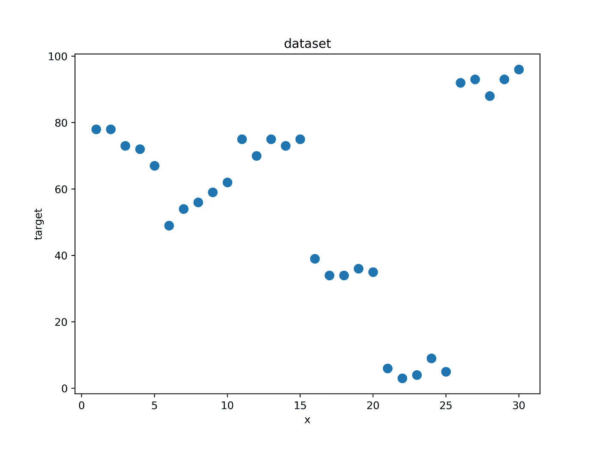

让我们假设有一个回归问题，我们试图预测左边图表的目标值。

在第一次迭代中，梯度推进创建一个函数“F ”,用给定的数据计算预测值。然后，它计算实际值(目标值)和预测值之间的差值(残差),并为残差创建一个函数“h”。在第二次迭代中，该算法结合函数“F”和“h ”,进行新的预测，并计算预测值和实际值之间的差异。这样，通过在函数“F”上连续加法，它试图增加其成功率并最小化残差。

在下图中，您可以看到模型在第一次迭代后的预测，如左侧图表中的红线所示。我已经在右图中显示了每个 x 值的预测值和目标值之间的残差。

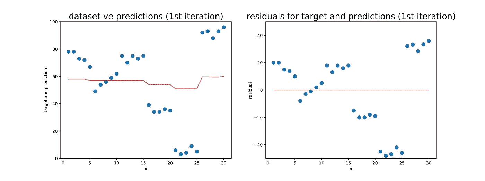

results of the 1st iteration

随着迭代的进展，模型的成功将会增加。下面你可以看到第 10 次迭代的结果。

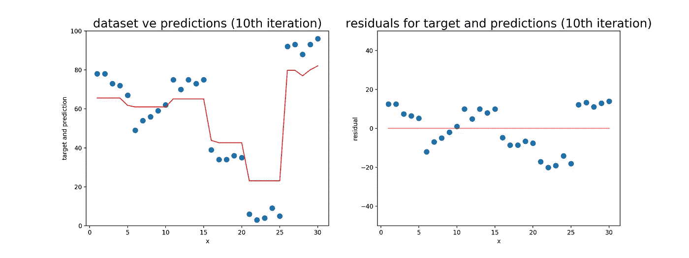

results of the 10th iteration

在第 25 次和第 50 次迭代结果中，您现在可以看到模型的预测和目标差异接近于零。事实上，第 50 次迭代的结果表明，模型开始有点过度拟合。为了避免过度拟合，将结果与单独的验证数据集进行比较并找到适合您的迭代次数是很有用的。

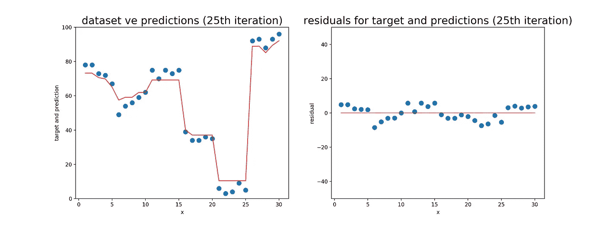

results of the 25th iteration

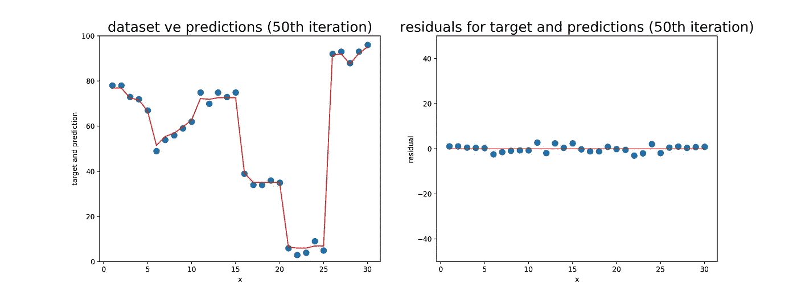

results of the 50th iteration

XGBoost 是由 Tianqi Chen 和 Carlos Guestrin 创建的，并在梯度推进逻辑中添加了一些高级功能，现已成为 Kaggle 竞争对手使用最广泛的算法。该算法被用于优步、Airbnb、亚马逊和谷歌云等公司的一些产品中。

**资源**

1.  [https://en . Wikipedia . org/wiki/Boosting _(machine _ learning)](https://en.wikipedia.org/wiki/Boosting_(machine_learning))

2.[https://hacker noon . com/gradient-boosting-and-xgboost-90862 daa6c 77](https://hackernoon.com/gradient-boosting-and-xgboost-90862daa6c77)

3.【https://en.wikipedia.org/wiki/Gradient_boosting 

4.[https://en.wikipedia.org/wiki/XGBoost](https://en.wikipedia.org/wiki/XGBoost)

5.[https://homes.cs.washington.edu/~tqchen/](https://homes.cs.washington.edu/~tqchen/)