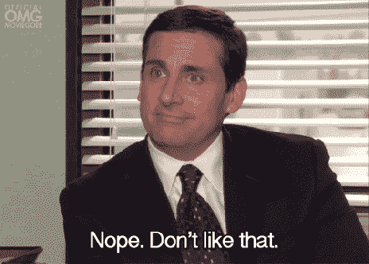
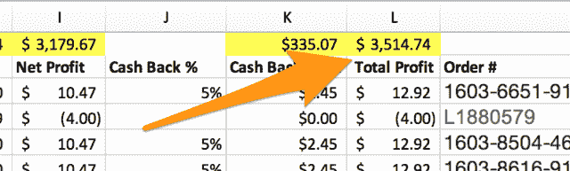
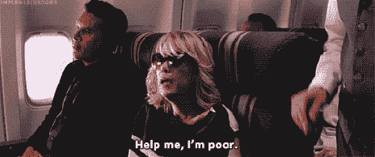
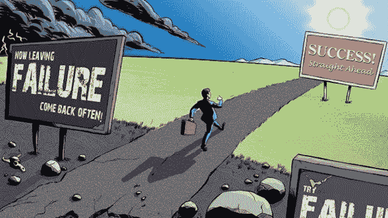

# 我必须如何以不同的方式思考金钱，才能开始创造远程收入流？

> 原文：<https://medium.datadriveninvestor.com/how-do-i-have-to-think-about-money-differently-to-start-creating-remote-streams-of-income-983e99ce4b70?source=collection_archive---------16----------------------->

让我实话实说…

你们都没问过我这个问题。

那么，为什么我要花一整个星期写一篇博文来回答一个你们都没问过我的问题呢？

因为…

你开始以不同于现在的方式看待金钱，这对实现你自由旅行的梦想绝对至关重要。

当然，你可能在想…

*什么意思？我和金钱的关系很好——我不需要有任何不同的想法。*

好吧——很公平。

让我证明给你看。

你有多少存款？

你们大多数人会说两件事中的一件…

> [获得我的 7 个每月 1000 多美元的远程收入创意](https://freedomtraveler.blog)

要么…

1.  你有一些钱在储蓄，以备不时之需。
2.  或者你靠薪水过活，没有任何存款。

这可能会让你吃惊，但是这两种情况都代表了一种被误导的思考金钱的方式。

你有一些积蓄，以备不时之需。

问题是，你没有足够的钱来储蓄。*不是*，至少，如果你想在睡觉的时候追逐环游世界和赚钱的梦想。

交易是这样的:在建立你自由旅行者生活方式的早期阶段，你需要钱。

为什么？

因为建立新的收入来源总是一项投资。一些类型的流比其他的更贵，但是它总是会进入你的钱包。

然而，这种心态的转变说起来容易，学起来难。

每个人都教过你(感谢戴夫·拉姆齐),你需要没有债务，你需要在银行账户中有至少 6 个月的收入，你需要每个月拿出 10%的钱…

问题是，那需要*永远…*

想想这个。

如果你不是用你朝九晚五的工作在未来 10 年还清债务，而是建立 3 个新的收入来源，帮助你在两年内还清债务，会怎么样？

如果你从这些新的收入流中赚了很多钱，可以在 6 个月内还清债务，会怎么样？

这里有一个更有意思的问题…

如果你不是每个月都把钱存起来，而是把钱投资到一个新的收入流中，让它有机会自我增值，会怎么样？

例如，3 个月前，我和妻子投资 500 美元参加亚马逊销售培训。从那以后，这一培训已经为我们赚了 3，514.74 美元。

但是我知道你在想什么…

如果我失业了，而且没有任何存款，该怎么办？

这就是恐惧，不是吗？

你的老板马上要解雇你(否则你会被解雇)，你必须为你和你的家人买一个好的旧纸箱…

只不过那是一种虚假的恐惧。

让我问你这个…

如果明天你失业了，你会怎么办？

你会坐在家里闷闷不乐两个月而不申请任何其他工作吗？

你会放弃晚上吃多力多滋，白天整天看幸运轮吗？

因为如果你明天失业了，你就要开始住在纸箱子里了。

让我再说一遍…

为了让你对失业和成为下一个街头流浪汉的恐惧成为现实，你必须变成一个完全不同的人。

为什么？

因为总有新的临时工作要做。

如果一份工作不能支付账单，你可以找第二份工作。

事实是，在那种糟糕的情况下，你会尽一切努力去支付账单…

即使这意味着挨家挨户去修剪草坪。

你会想出办法的。

机会是，你不会被你的工作弄得措手不及…

你绝对不会在一夜之间变得无限懒惰或吸毒成瘾…

你愿意为此而努力，这意味着你永远不会失业太久。

如果你是，你会找到一个新的。

**那么，你应该如何以不同的方式看待金钱呢？**

好吧，如果你已经有存款，那么——不要为永远不会到来的雨天存钱——考虑投资创造一个新的收入流，让这些钱有自我增值的潜力。

你靠薪水过活，没有任何存款。

如果你没有任何存款，那么看看你的财务状况，想想你把你的奢侈品都花在哪里了…

你每天都买咖啡吗？你大多数晚上出去吃饭吗？你经常租电影吗？你购买许多电子游戏吗？

然后删掉一些东西，这样你就可以为启动资金存一点钱。

不过，现在你有了另一个顾虑…

*如果新的收入流没有实现，你失去了你的钱，该怎么办？*

我的回答一开始听起来有点没用，但是请跟我来…

谁在乎呢。

如果你试图投资自己的钱，而你的第一笔远程收入没有成功，谁会在乎呢？

谁在乎你“失败”了？

谁在乎呢。

毕竟，你会花 500 美元、1000 美元或 1500 美元去了解你自己和你以前从未学过的创业技能吗？

我会的。每一个。单身。时间。

你也应该愿意。

因为你失败得越多，你就离成功越近。

暗示一个关于创业和失败的陈词滥调…

关键是，你必须停止害怕失败，因为这不是失败，而是一次学习的经历。

当你投资一个新的收入来源时，试着把你的钱赚回来，但是如果不成功也不要伤心。深呼吸，找出问题出在哪里，存钱，尝试其他的东西。

我无法用一只手数清我尝试过的完全失败的事情的数量…

以下是我自己的失败清单。

1.  quest——我努力发展的教堂。
2.  book trep——我试图建立的电子邮件列表。
3.  时髦的 sweet ums——一家我试图创办的电子商务商店。
4.  MB 内容——这是我试图起步的内容创作业务。
5.  新生命教会——另一个我试图帮助成长的教会(它从来没有做到)。
6.  无代码——一份我以为会成功但没有成功的工作。
7.  送报路线——这从一开始就是一个糟糕的主意，我不打算在这里赘述。
8.  angle tangle——一个我试图启动的博客。
9.  脸书广告业务——这并没有持续很久*。*

还有很多(问问我老婆就知道了)。

但是事情是这样的:尽管每一次尝试都失败了，我还是学到了一些有价值的东西。

例如，Booktrep 告诉我，从开始写博客开始，我就必须努力赚钱。

Codeless 告诉我，比起工作时间和挣的钱，我对生活质量更感兴趣。

Swanky Sweetums 教会我，在电子商务中，你应该总是在把产品交付给客户之前订购自己的产品(我知道……这似乎是显而易见的)。

我们都会有失败的时候…

但诀窍是让这些失败给我们一个教训，而不是把它们作为彻底放弃的借口。

事实上，它们只是你走向财务独立的重要垫脚石…

去环游世界。

你必须像拥抱成功一样拥抱它们*。*

也许更多。

所以，简而言之…

1.  不要保存。投资。
2.  当事情不顺利时，从你的错误中吸取教训，再试一次。

最后，把你的钱视为构建你梦想生活的资产。

> [获得我的 7 个每月 1000 美元以上的远程收入想法](https://freedomtraveler.blog)