# LSTM 网络如何解决梯度消失的问题

> 原文：<https://medium.datadriveninvestor.com/how-do-lstm-networks-solve-the-problem-of-vanishing-gradients-a6784971a577?source=collection_archive---------0----------------------->

## 一个简单直接的数学解释

Greenport New York

当深入研究递归神经网络(RNNs)和长短期记忆(LSTM)网络背后的理论时，出现了两个主要问题:

1.为什么 RNNs 会遭遇消失和爆炸梯度？

2.LSTMs 如何防止渐变消失或爆炸？

当我试图回答这些问题时，我寻找一个数学解释来更好地理解这些网络是如何工作的。我很难找到对我来说足够明白和清楚的证据。在阅读了处理这些问题的推荐论文和知名博客后，我写了一个对我有用的解释，让我觉得我更好地理解了问题和解决方案。

## RNNs 和消失渐变

rnn 支持对依赖于时间和顺序的数据任务进行建模，例如股票市场预测、机器翻译、文本生成等等。

然而，rnn 受到消失梯度问题的困扰，这阻碍了长数据序列的学习。梯度携带在 RNN 参数更新中使用的信息，并且当梯度变得越来越小时，参数更新变得不重要，这意味着没有进行真正的学习。

让我们简单回顾一下 RNNs 是什么样子的。我们将与一个简单的单一隐藏层 RNN 单一输出序列。网络看起来像这样:

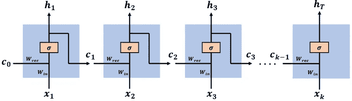

网络具有向量的输入序列[x(1)，x(2)，…，x(k)]，在时间步长 t，网络具有输入向量 x(t)。过去的信息和学习到的知识被编码在网络状态向量[c(1)，c(2)，…，c(k-1)]中，在时间步长 t，网络具有输入状态向量 c(t-1)。输入向量 x(t)和状态向量 c(t-1)被连接起来以构成时间步长 t 处的完整输入向量[c(t-1)，x(t)]。

该网络具有两个权重矩阵:Wrec 和 Win，将输入向量[c(t-1)，x(t)]的两个部分 c(t-1)和 x(t)连接到隐藏层。为简单起见，我们在计算中省略了偏置向量，表示为 W = [Wrec，Win]。

sigmoid 函数用作隐藏层中的激活函数。

网络在最后一个时间步长输出一个向量(RNNs 可以在每个时间步长输出一个向量，但我们将使用这个更简单的模型)。

## RNNs 中的时间反向传播(BPTT)

在 RNN 输出预测向量 h(k)之后，我们计算预测误差 E(k ),并且使用通过时间的反向传播算法来计算梯度

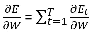

The gradient of the error term in an RNN

梯度用于通过以下方式更新模型参数:

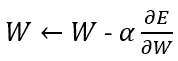

并且我们使用梯度下降(GD)算法继续学习过程(在本工作中我们使用 GD 的基本版本)。

假设我们有包括 T 个时间步长的学习任务，k 个时间步长上的误差梯度由下式给出:

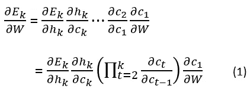

注意，由于 W=[Wrec，Win]，c(t)可以写成:

计算 c(t)的导数，得到:

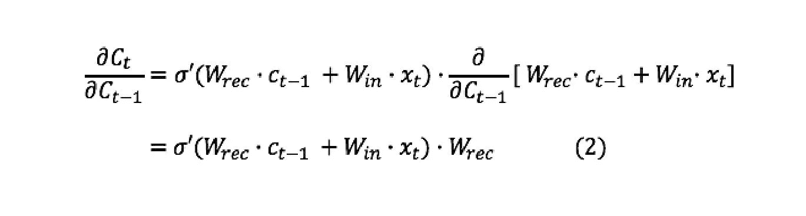

将(2)代入(1)，得到我们的反向传播梯度

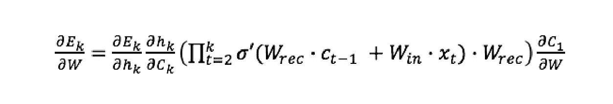

当 k 较大时，最后一个表达式**趋于消失，这是由于双曲正切激活函数的导数小于 1。**

**导数的乘积也会爆炸**如果权重 Wrec 大到足以压倒较小的 tanh 导数，这就是所谓的爆炸梯度问题。

我们有:

因此，在一段时间内，步骤 k:

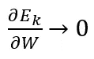

我们的完全误差梯度将会消失

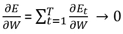

网络的权重更新将为:

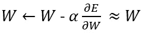

并且在合理的时间内不会完成任何重要的学习。

## LSTMs 如何解决这个问题？

我推荐阅读 [Colah 的博客](https://www.google.com/url?sa=t&rct=j&q=&esrc=s&source=web&cd=1&cad=rja&uact=8&ved=2ahUKEwjGu_Kb9qHfAhUD0RoKHYSjAgwQFjAAegQIAhAC&url=http%3A%2F%2Fcolah.github.io%2F&usg=AOvVaw1GKlzuXDPgSuty6MfhWlol)来深入了解 LSTMs，因为我们在这里只会有一个简短的提醒。

LSTM 网络在时间步长 t 具有输入向量[h(t-1)，x(t)]。网络单元状态由 c(t)表示。在连续时间步长 t，t+1 之间通过网络的输出向量用 h(t)表示。

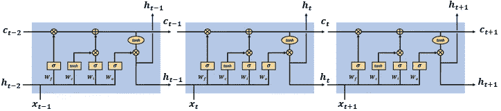

LSTM network cells at time steps t-1, t, t+1

LSTM 网络有三个门来更新和控制单元状态，它们是遗忘门、输入门和输出门。门使用双曲正切和 sigmoid 激活函数。

假定新的信息比进入网络的信息多，遗忘门控制单元状态中要遗忘的信息。

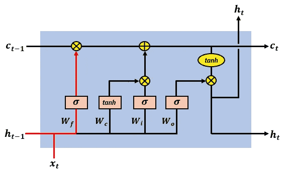

The LSTM forget gate update of the cell state

遗忘门的输出由下式给出:

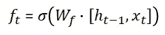

给定新的输入信息，输入门控制什么新的信息将被编码到单元状态中。

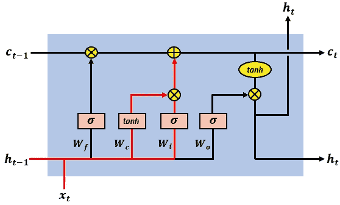

The LSTM input gate update of the cell state

输入门的输出具有以下形式:

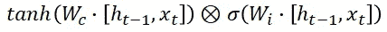

并且等于两个完全连接的层的输出的逐元素乘积:

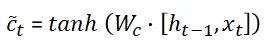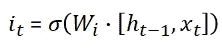

输出门控制在单元状态中编码的什么信息在随后的时间步骤中作为输入被发送到网络，这通过输出向量 h(t)来完成。

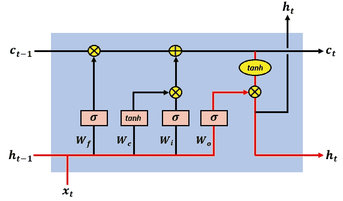

The LSTM output gate’s action on the cell state

输出门的激活由下式给出:

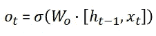

电池的输出向量由下式给出:

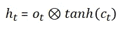

## **LSTM 电池状态**

长期依赖性和关系被编码在单元状态向量中，并且是单元状态导数可以防止 LSTM 梯度消失。LSTM 单元状态具有以下形式:

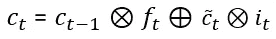

## **lst ms 中的时间反向传播**

如同在 RNN 模型中，我们的 LSTM 网络在第 k 个时间步输出预测向量 h(k)。编码在状态向量 c(t)中的知识捕获顺序数据中的长期依赖性和关系。

数据序列的长度可以是数百甚至数千个时间步长，这使得使用基本的 RNN 学习变得极其困难。

我们计算用于更新网络参数的梯度，计算在 T 个时间步长上完成。

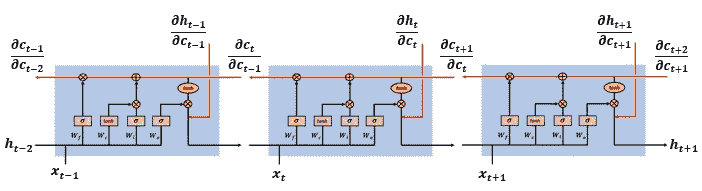

Backpropagating through time for gradient computation

与 RNNs 一样，误差项梯度由以下 T 梯度之和给出:

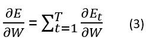

The gradient of the error in an LSTM

为了使完整的误差梯度消失，所有这些 T 子梯度都需要消失。如果我们把(3)想成一个函数的级数，那么根据定义，如果它的部分和的序列趋于零，这个级数就收敛到零，所以

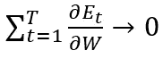

如果部分和的级数

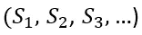

在哪里

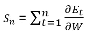

趋向于零。

**因此，如果我们希望(3)不消失，我们的网络需要增加至少一些子梯度不会消失的可能性**，换句话说，使(3)中的一系列子梯度不收敛到零。

## LSTM 网络中的误差梯度

某个时间步长 k 的误差梯度具有以下形式:

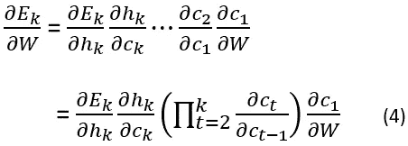

正如我们所见，以下产品会导致渐变消失:

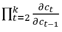

在 LTSM 中，状态向量 c(t)具有以下形式:

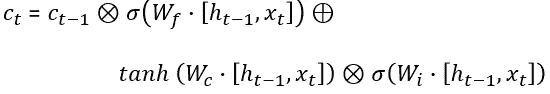

可以简洁地写成

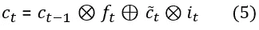

注意，状态向量 c(t)是以下元素的函数，在反向传播期间计算导数时应考虑这些元素:

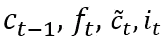

计算(5)的导数，得到:

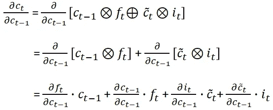

我们计算(详细的计算在文章的结尾给出)四个导数项，并写出:

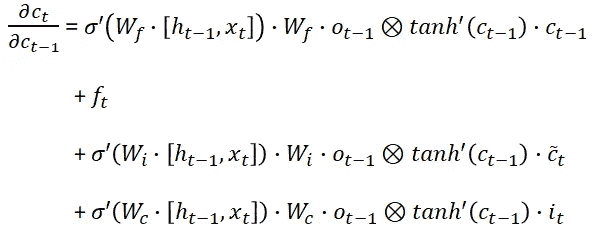

通过以下方式表示组成单元状态导数的四个元素:

我们将加性梯度写成:

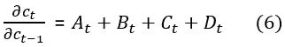

将(6)代入(4)，得到 LSTM 状态梯度:

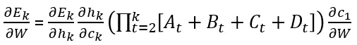

## 防止误差梯度消失

**注意，梯度包含遗忘门的激活向量，这允许网络在每个时间步使用遗忘门的适当参数更新来更好地控制梯度值。**遗忘门激活的存在允许 LSTM 在每个时间步决定某些信息不应被遗忘，并相应地更新模型的参数。

让我们回顾一下这个属性是如何帮助我们的。假设对于某个时间步骤 k

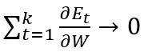

Then for the gradient not to vanish, we can find a suitable parameter update of the forget gate at time step k+1 such that:

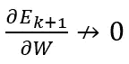

**，在梯度项中存在遗忘门的激活向量以及附加结构，这允许 LSTM 在任何时间步骤**找到这样的参数更新，并且这产生:

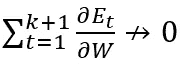

梯度不会消失。

**需要注意的另一个重要特性是，单元状态梯度是一个加法函数**，由四个元素组成，分别表示为 A(t)，B(t)，C(t)，D(t)。这种相加的特性使得在反向传播过程中能够更好地平衡梯度值。LSTM 更新并平衡四个分量的值，使加法表达式更有可能不会消失。

例如，假设对于{2，3，…，k}中的每个 t，我们将以下四个邻域值作为梯度中的平衡组合:

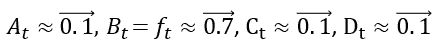

这产生了:

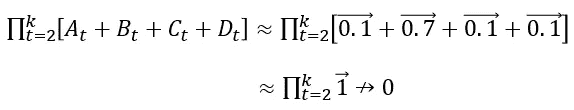

产品不会消失。

这种相加的性质不同于 RNN 的情况，在那里梯度包含产品内部的单一元素。**在 RNNs 中,( 3)中的和是由具有类似行为的表达式构成的，这些表达式可能都在[0，1]中，这导致了消失梯度。**

**然而，在 LSTMs 中，遗忘门的存在，以及单元状态梯度的加性，使得网络能够以这样的方式更新参数，使得(3)中的不同子梯度不一定一致**并且以相似的方式表现，使得(3)中的所有 T 梯度不太可能消失，或者换句话说，函数序列不收敛到零:

我们的梯度不会消失。

如前所述，如果(3)中的和是由具有相似行为且都显著大于 1 的表达式组成的，则 RNN 梯度也会爆炸。

综上所述，我们已经看到，rnn 受到消失梯度的影响，并且是由小值的长系列乘法引起的，减小了梯度并导致学习过程变得退化。以类似的方式，rnn 遭受受大梯度值影响的爆炸梯度，并阻碍学习过程。

LSTMs 使用独特的附加梯度结构解决该问题，该结构包括直接访问遗忘门的激活，使网络能够在学习过程的每个时间步使用频繁的门更新来鼓励来自误差梯度的期望行为。

## 参考

[1]长短期记忆，Sepp Hochreiter，Jurgen Schmidhuber

[2]关于训练递归神经网络的难度，Razvan Pascanu，Tomas Mikolov，Yoshua Bengio

[3]循环神经网络中的长短期记忆，Felix Gers

[4]克里斯托夫·奥拉赫的博客

[5]诺亚·韦伯的博客(weberna 的博客)

## 小区状态梯度计算所需的附加计算:

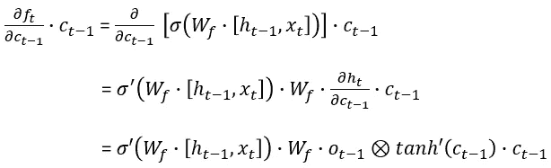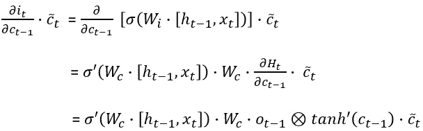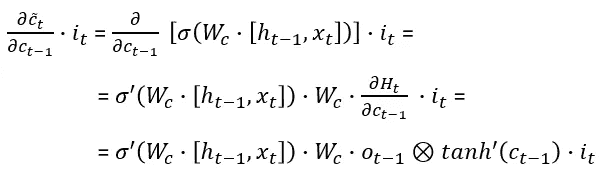