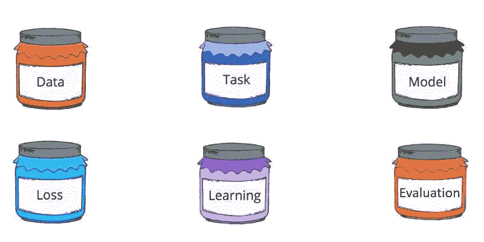

# 机器是如何学习的？

> 原文：<https://medium.datadriveninvestor.com/how-do-machines-learn-f44555e2e68c?source=collection_archive---------14----------------------->

## 通过机器学习的六个罐子来理解

*这篇帖子是基于课程“* ***深度学习的第一门课程”****by*[***One four labs***](https://padhai.onefourthlabs.in/)*但它可能会有错误，因为我是一个人。*

## 专家系统和机器学习

> 在人工智能中，**专家系统**是模拟人类专家决策能力的计算机系统。

根据上面的定义，专家系统可以使用一组预定义的规则来做出决策，这些规则通常由人类通过 if-else 条件来设置，但它不会适应数据的变化，因此我们必须从编写规则转向学习规则。机器学习这个术语来了。

> **机器学习**是人工智能(AI)的一种应用，它为系统提供了自动学习和根据经验改进的能力，而无需显式编程。

人类有学习、分析和决策的能力，但他们受到大脑计算能力的限制，而另一方面，机器有能力处理大量数据。如果我们将这两种能力结合起来，这将为一种叫做机器学习的新范式打开大门。

# 机器学习的六个要素:

现在机器学习所涉及的因素，很难用自己的意义去理解。为了解决这个问题，我们将使用一种创新的方法来思考元素，或者你可以说术语是装满信息的罐子。让我们逐一解决每一个攀登阶梯的问题，以便更好地理解。

Image Source: Lecture 1.3 — Six Jars of ML by One Fourth Labs

# 数据

数据是机器学习的敲门砖。没有数据，你什么也做不了，因为数据是输入，没有数据就没有输出。在机器学习中，我们将处理不同类型的数据，包括来自不同来源的大量数值、文本(脸书帖子、电子邮件)、图像(脸书、Instagram)、视频(YouTube)、音频(电话录音或有声读物)等表格。这必须使用适当的方法编码成数字，例如记下图像中每个像素的 RGB 值、语音信号的振幅/频率等。这种编码使得数据通常是高维的。

现在，为了获取数据，我们有许多方法可供我们使用。我们可以使用像谷歌人工智能这样的数据库网站，或者雇佣人力资源来为我们收集这些数据。例如，你可以雇佣一些人，给他们提供 100 张食品图片，让他们记下不同的细节，比如产品的成分、过敏信息、营养成分、重量等等…

# 工作

我们已经获得了数据，下一步怎么办？现在，我们可以以许多不同的方式利用数据来分配不同的任务，如导出两个不同文本数据之间的关系，并使用该关系产生新的数据，如根据电子邮件的内容确定对电子邮件的自动回复，识别图像中的人脸(脸书)，位置等。

## 任务有两种类型:

*   **受监控(两个‘x’输入&‘y’输出)**

在这种类型的任务中，您提供执行这些任务后产生的输入和输出，以便机器可以从模式中学习，并将该方法应用于测试用例。这些可以是回归或分类。监督学习是机器学习成功背后最重要的方面。它包括二元分类和多类分类。

*   **无人监督(仅“x”输入)**

在这里，您提供输入，然后基于一组规则或算法，我们得到可以被有意义地利用的输出。它包括聚类或生成。

# 模型

如果我们把 x 作为输入，y 作为输出，那么它们之间的关系就是“y = f(x)”中的函数。在寻找不同类型的数据之间的函数的情况下，对于为汽车速度绘制的数据，可以像直线方程 y= mx + c 一样简单，其中 m &c 是参数。但通常情况下，包含 25 个或更多变量的方程是非常困难的。因此，我们需要复杂的方程，但我们不能总是使用复杂的方程，即使它不是必需的，因为机器需要它来计算方程的参数值。

控制模型制作的术语包括偏差-方差权衡、过拟合和正则化。

# 损失函数

现在，对于 x 和 y 的值，您可以导出不同的函数，但是参数的值可以根据不同类型的用户而改变，从而导致不同的模型，因此我们必须设计一种方法来确定可用解决方案中的最佳模型。所以我们使用一种叫做损失函数的方法，即 *L=Sum(实际输出-实验输出)*

计算不同的损失函数，我们可以选择最好的模型并使用它。我们也有不同的损失，如平方误差损失，交叉熵损失和 KL 散度。

# 学习算法

这里我们解决了寻找模型参数的问题。我们可以使用强力搜索，但是在高阶模型的情况下这是不可行的。这里的座右铭是找到参数 a，b，c 的值…..从而优化损失函数。

我们可以使用不同的算法，如梯度下降、Adagrad、RMS prop 和 Adam

# 估价

在做了上述所有事情之后，我们仍然需要一个用于不同机器学习模型的基准系统，因此我们通过比较真实输出与预测输出来评估它，以便我们获得准确率百分比，或者我们可以使用另一种方法，在大量输出中选择少量输出，其中一个是确定的答案。

该方法包括精度、召回率、(Top-k)和 F1。这个元素允许我们测试不同模型的性能，因为解决方案有不同的方法，我们只想要其中最好的一个。

感谢你阅读这篇文章。我为这篇文章中的任何错误道歉。我希望你也能看到我的下一篇文章。