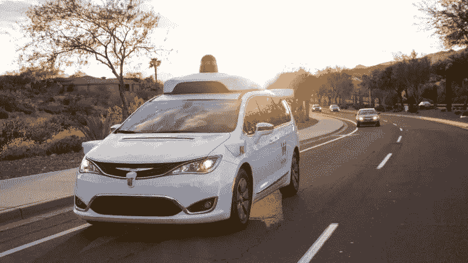
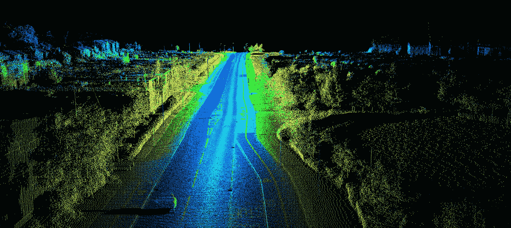
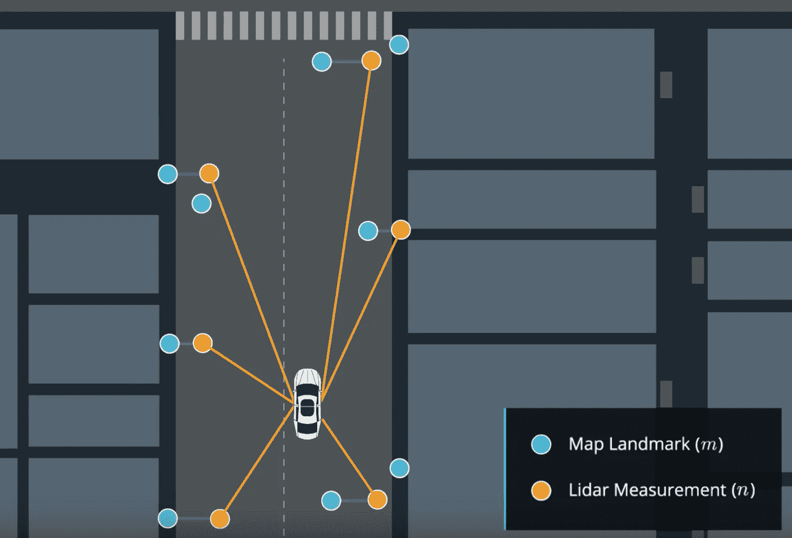
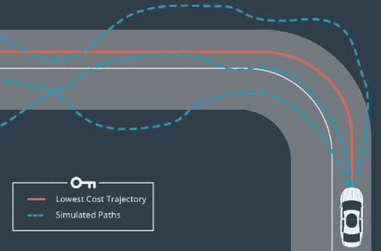
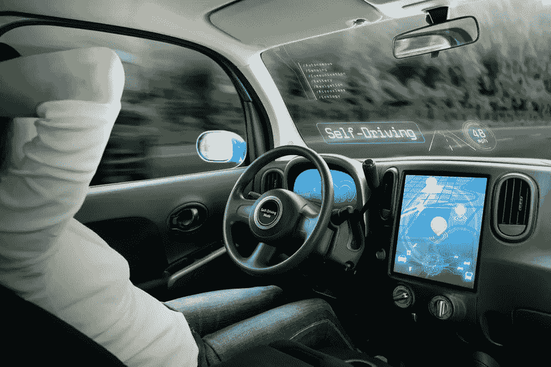

# 自动驾驶汽车是如何工作的？

> 原文：<https://medium.datadriveninvestor.com/how-do-self-driving-cars-work-f5807a693bab?source=collection_archive---------10----------------------->

许多人认为自动驾驶汽车是交通的未来。随着人工智能每一天都变得越来越先进和强大，这只是提出了一个问题；“为什么他们还没有接管人类司机？”。虽然这看起来是一个简单的任务，但是已经有了很多技术进步，才有了我们今天的成就。在这篇文章中，我们讨论了自动驾驶汽车的关键部件。

## 无人驾驶汽车背后的技术

目前，自动驾驶汽车使用五种关键技术的组合来实现完全自主的最终目标。这些是:

An example of a computer recognizing images through deep and reinforcement learning

**计算机视觉—** 这是一个使用相机图像和视频，并使用深度学习过程进行分析的过程，可以帮助识别道路上的物体，如车道线和路标。由于计算机不能以我们的方式“看”世界，我们必须通过深度和强化学习来教它们如何感知世界。

This is an image of a landscape mapped using LIDAR technology

**传感器融合**——单靠相机不足以完全了解我们周围的世界。这是因为相机在雨天、雾天和下雪天容易失效。他们也只能看到 2D 表面上的物体，然而，我们的世界是三维的，因此需要的不仅仅是图像。我们需要能够在三维尺度上测量距离和物体。这就是我们使用激光雷达的地方。激光雷达是一种使用短脉冲激光通过计算反射回来所需的时间来测量距离的技术。通过将它与传感器图像结合起来，我们可以描绘出一幅准确的风景图。

An example of localization

本地化——现在我们已经了解了我们周围的环境，我们现在必须找出我们在这个世界上的位置。目前，全球定位系统不是答案。GPS 虽然精确，但不够精确(精确到 1-2 米)。考虑到 1-2 米可能相当于撞到人行道上的行人，它不够准确，不能作为依据。在这里，我们可以使用地标三角测量来计算我们在世界上的位置，精确到厘米。这就利用了上面的特征，来发现和识别我们周围的特征，然后利用它们的距离来准确地找出我们的位置。

An example of a neural network analyzing different potential pathways

**路径规划** —现在我们知道了自己在世界上的位置，我们必须想出一种方法，以最快、最有效的方式到达目的地。这是我们可以使用强化学习的地方，即通过测试所有不同的可能路线，并使用分数来获得最佳路线。我们还必须考虑到路上会有其他汽车挡住我们的路，算法会实时做出相应的调整。

**控制** —这是最后一步。它使用所有上述输入，并使用卷积神经网络(CNN)，它将相应地决定它将采取的行动。例如，如果前方道路畅通，他们会踩油门，但如果灯是红色的，他们会停下来。所有上述因素都被输入，根据情况，CNN 将做出决定。最终，这是驱动汽车本身的部件。

## 公司目前在做什么？

目前，包括 Waymo(谷歌旗下)、福特、通用、奥迪、宝马、奔驰、优步和雷诺在内的许多公司都在研究自动驾驶汽车技术。他们看到了这个市场的潜力，这项技术将是他们的未来。

据统计，到 2030 年，自动驾驶汽车行业的价值将达到 2850 亿美元。随着时间的推移，这个数字预计还会增加。

他们也取得了重大进展。谷歌的 Waymo 最近获得了在加州山景城总部附近测试自动驾驶汽车的许可。

通用汽车计划从 2019 年开始大规模生产自动驾驶汽车。它还计划推出类似于优步的叫车服务，但使用完全自动驾驶的车辆。有趣的是，他们计划每英里只收取 1.5 美元，比传统的替代方案便宜 40%。

# 关键要点

*   自动驾驶汽车基于计算机视觉、传感器融合、定位、路径规划和控制的结合来工作。
*   据英特尔分析师预测，到 2050 年，自动驾驶汽车市场将达到 7 万亿美元。
*   随着自动驾驶汽车越来越接近现实，这个行业有着巨大的市场潜力。

# 在你走之前

1.  给这篇文章一些掌声
2.  请在下面留言，或者随时给我发电子邮件，地址是 derektanbusiness@gmail.com

> “谷歌正在研发无人驾驶汽车。它们似乎很有效。人们驾驶汽车的能力如此之差，以至于计算机不一定要那么好才能好得多。”