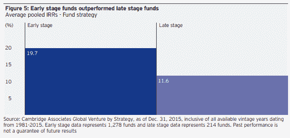

# 风投如何找到并资助你的创业公司？交易流程的 4 个主要途径

> 原文：<https://medium.datadriveninvestor.com/how-do-vcs-find-and-fund-your-startup-the-4-major-paths-of-deal-flow-751208f5d28d?source=collection_archive---------15----------------------->

上一篇文章的后续"[风投烂？这里有 5 个实用的方法可以让企业家将痛苦最小化。风险投资会收到大量商业提案，正如你所料，风险投资越受认可，生态系统越发达，这一数字就会呈指数级增长。一般来说，投资者有四种获得交易流的主要方式，下面按命中率大致递减的顺序列出。](https://www.linkedin.com/pulse/vcs-suck-here-5-practical-ways-entrepreneurs-minimize-amit-garg/)

1.  **其他投资者**——风投和天使投资者从彼此那里获得大量交易流，你可以将这些分为三个不同的类别。一种是较小的投资者将交易(通常是他们自己的交易)交给较大的投资者进行下一轮交易。二是较大的投资者将一笔交易(通常是他们感兴趣的交易)发送给较小的投资者进行更早一轮的投资。三是投资者希望在这一轮中引入其他人，通常是为了稀释风险。相比之下，早期投资者合作更多，因为风险更高，而后期投资者竞争更多，因为他们在争取一家公司更大的份额。问任何投资者，他们都会向你证实，他们最大的交易往往来自其他投资者，这应该是有道理的，因为已经有了一个审查过程。例外情况是，当一家公司需要救助，而风险投资家正试图让其他人帮忙时，这一点在前期或尽职调查过程中会变得很明显。

 [## 风险投资家在给创业公司播种时会考虑什么标准？数据驱动的投资者

### 2017 年，风险投资资金攀升至十年来的最高水平。你的创业公司目前吸引风险投资的机会是…

www.datadriveninvestor.com](https://www.datadriveninvestor.com/2018/04/20/what-criteria-do-venture-capitalists-consider-when-seeding-a-startup/) 

对每一个投资者来说，自己的人脉——大学和研究生院的前同学、以前公司的前同事、种族和文化背景、朋友和家人都是交易流的自然来源。广泛的研究支持[邓巴的数字](https://en.wikipedia.org/wiki/Dunbar%27s_number)即人类可以同时维持大约 150 个稳定的社会关系，这不会转化为投资者之间的巨大差异。真正不同的地方实际上来自二度网络，一个通常大 100 倍的个体集合。一个强大的网络投资者特别从这些专业关系中获得企业家和共同投资者的介绍。很明显，不仅仅是数量，尤其是联系的质量，总体而言，[梅特卡夫定律](https://en.wikipedia.org/wiki/Metcalfe%27s_law)对个人关系网也适用。

**3)外向** —参加活动、发表文章或在会议上发言都是外向活动的一部分。但问问任何精明的投资者，他们都会告诉你，这更多的是参与生态系统(品牌、学习、回馈等)，交易流是附带的好处。对于风投来说，一个特定的场所越普通，它就越容易被稀释，甚至那些专注于广泛投资论文的人也会认为，就联系最优秀的企业家而言，专业论坛的投资回报率更高。此外，企业家应该警惕投资者将基金规模与基金业绩等同于基金敞口。成为早期或晚期基金是一个战略问题，它们在每个类别中都有大量成功的基金，事实上，数据一致显示，规模较小的基金总体表现更好。

**4)陌生电话** —这并不常见，但的确如此，投资者确实会打电话。当他们这样做的时候，是因为他们想避免向别人求情或透露太多他们的投资策略。也就是说，如果你接到一个投资者的陌生电话，不要想当然地认为你会感兴趣。肯定有投资者只是试图了解一个领域(即可能会过度占用你的时间)或试图发现竞争对手的数据(他们应该提前说明潜在的利益冲突，但并不总是发生)。此外，后期基金更有可能打电话，因为他们通常对一家公司有更多的信息。总的建议是——抵制诱惑，不要在不具备资格的情况下自动接受陌生电话，除非你的公司表现很好(你知道为什么会有兴趣)或表现很差(你需要帮助)。

*我是*[*Tau Ventures*](https://www.linkedin.com/pulse/announcing-tau-ventures-amit-garg/)*的管理合伙人和联合创始人，在硅谷有 20 年的从业经验，涉足企业、创业公司和风险投资基金。这些都是专注于实践见解的有目的的短文(我称之为 GL；dr —良好的长度；确实读过)。我的许多文章都在 https://www . LinkedIn . com/in/am garg/detail/recent-activity/posts**上，如果它们能让人们对某个话题产生足够的兴趣，从而进行更深入的探讨，我会感到非常兴奋。如果这篇文章有对你有用的见解，请在 Tau Ventures 的 LinkedIn 页面* *上对这篇文章和* [*给予评论和/或赞，感谢你对我们工作的支持。这里表达的所有观点都是我自己的。*](https://www.linkedin.com/company/tauventures)