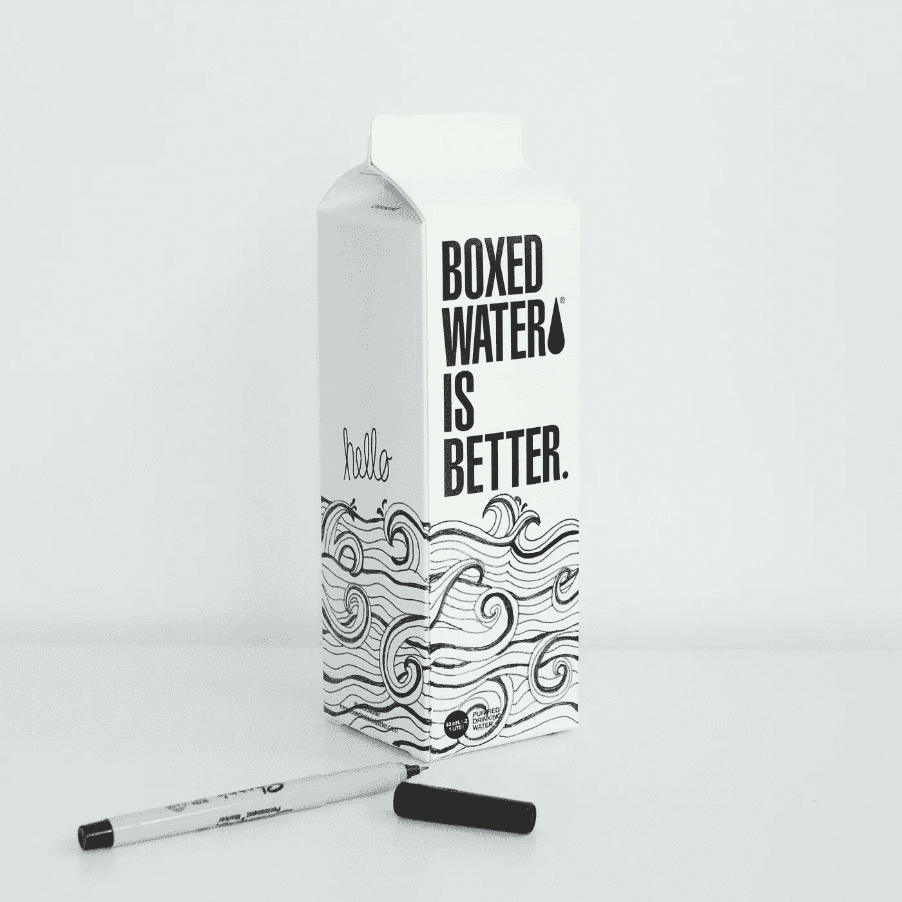

# 我们如何看待设计？你是为正确的客户打造的吗？

> 原文：<https://medium.datadriveninvestor.com/how-do-we-think-about-design-are-you-building-it-for-the-right-customer-31f53ca5b5d3?source=collection_archive---------8----------------------->

Photo by [Boxed Water Is Better](https://unsplash.com/@boxedwater?utm_source=unsplash&utm_medium=referral&utm_content=creditCopyText) on [Unsplash](https://unsplash.com/s/photos/design?utm_source=unsplash&utm_medium=referral&utm_content=creditCopyText)

当我戴上系统工程师的帽子时，我有时会思考我们是如何制造东西的。设计、预算、制造和销售我们购买的产品的实际生产过程。

**让我们举一个例子来搭建舞台**

以谷歌眼镜为例。2012 年，谷歌开始以眼镜的形式销售其可穿戴技术。人们将戴上眼镜，能够与世界互动。当时，谷歌眼镜缺乏使其愿景成为现实的计算能力；除了技术上的限制，这个产品失败还有其他原因。人们认为它对顾客没有用处。为什么？

 [## 金融科技初创公司正在颠覆全球银行业|数据驱动的投资者

### 传统的实体银行从未真正从金融危机后遭受的重大挫折中恢复过来…

www.datadriveninvestor.com](https://www.datadriveninvestor.com/2018/10/20/fintech-startups-are-disrupting-the-banking-industry-around-the-world/) 

谷歌的可穿戴设备带有一些很酷的功能:菜单滚动、检测用户运动的能力、照片和视频功能，以及扬声器，这些都被很好地设计到了设备中。它制作精良，谷歌的团队花了很多钱来营销该产品。与 Oakley 和 Ray-Ban 的合作伙伴关系，以及杂志、在线资源和零售商促销计划中的媒体闪电战都支持此次发布。到 2015 年，该计划被停止。

**这怎么可能不成功呢？**

谷歌眼镜经过精心设计、研究和支持，但当它向公众发布时，人们对它的使用方式越来越不信任。隐私问题是中心议题。用户是否在酒吧捕捉顾客的视频？为什么人们走来走去随意拍照？它是如何被使用的，人们是否在监视其他人？所有这些都令人担忧。

产品卖不出去，因为目标受众不信任产品。

你可以说它制作得很好，但没有为它的目标受众——每个人——做好设计。如果这款产品是专门为飞行员制作的平视显示器，或者是为医生可以在手术中获取患者信息的医疗领域，或者是为需要收集信息并快速处理周围环境的执法情况而制作的，也许它会更适合它的功能用途。

**你的设计原则是什么？**

当我们考虑我们的设计原则时，我们关注的是简单和使用吗？

我们关心成本吗？那会改变设计的用途吗？

是时尚性感还是功利？需要时尚吗(想想苹果)？

我们在为谁打造产品？我们是在为每个人做吗——我们应该做吗？

给市场带来什么价值？

怎么独特？

实验意味着犯错，我们应该从中吸取教训。

就初创企业而言，我们没有谷歌当时拥有的资源。这不会改变答案——我们应该从错误中吸取教训。我们也应该问自己一些设计问题，并从我们可用的大量信息中学习。