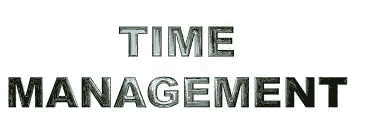
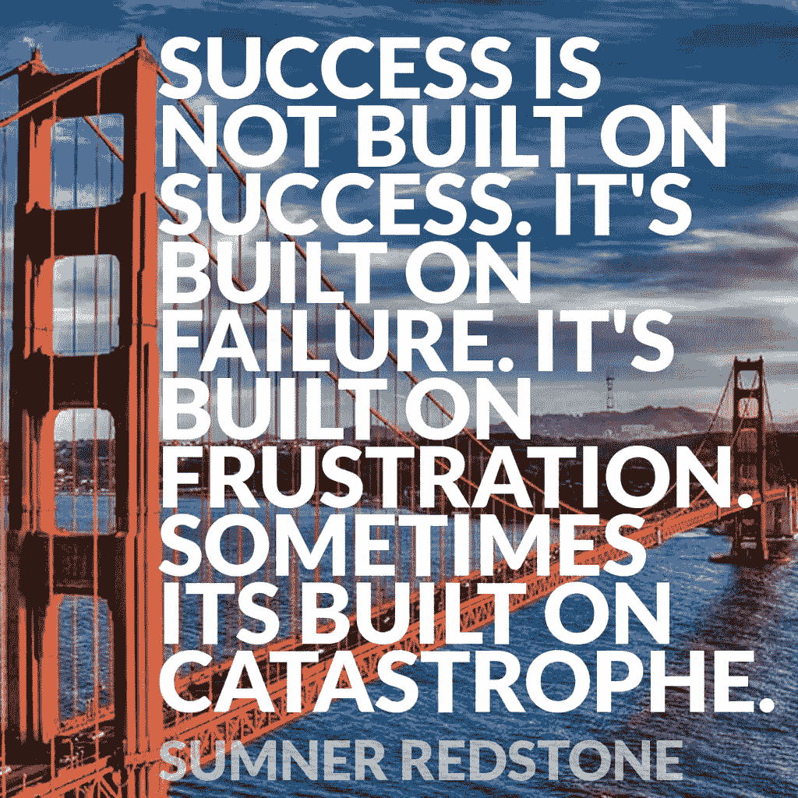

# 在创业公司如何避免倦怠？

> 原文：<https://medium.datadriveninvestor.com/how-do-you-avoid-burnout-when-building-a-startup-company-2e6854d3b1de?source=collection_archive---------10----------------------->

13 Point to know how to avoid burnout when building a startup

在我开始之前，让我澄清一下，这里写的信息是基于我自己在创业公司的个人经历，以及我自己的商业咨询和辅导实践，以及作为一家风险投资公司的一部分。

那么，你认为你有一个伟大的想法吗？你有什么秘方，新的应用程序，新的加密玩法，新的重磅炸弹区块链业务——无论什么？好的，太好了！恭喜你，但是要做好准备，创业是一场马拉松。你最好做好长期准备。

需要注意的倦怠迹象包括但不限于焦虑和/或易怒程度升高、抑郁、自信心下降、长期压力、与朋友、家人、重要的其他人或团队成员发生异常争吵或冲突。这些都是常见的早期预警信号(EWS)，但通常大多数人都无法判断他们是否正在接近精疲力竭，因为它悄悄地悄悄靠近你——除非你持开放态度，允许人们提供反馈并与你讨论这个问题。

有一些点可能会对你的生活造成严重破坏，导致精神枯竭。不是每个人都能很好地应对压力，也不是每个人都有倾诉的对象。所以这里有一些关键的发现，已经被证明可以对抗/避免经历倦怠。

1.  **给自己腾出时间**

一定要给自己留出时间。停止一切；如果可能的话，甚至关掉你的手机。出去散步 10 分钟，白天关闭你的思维。我还建议你每天每小时至少抽出 5 分钟停止工作，离开你的办公桌或空间，散散步或喝点水，然后精神饱满地回去工作。当工作到很晚的时候，有时去水池边往脸上泼些水也会有所帮助——这相当提神并且令人愉快。

除此之外，确保那些给你带来快感的事情是可以体验的。我有一个客户，他喜欢吉他，但没有时间弹。我建议她把吉他带到办公室，放在膝盖上，尽可能地弹一点点，尤其是当她大脑一片空白的时候。顺便说一句，这也是一件令人舒缓和放松的事情——额外收获！

Friends and family are your foundation

**2。为家人和朋友腾出时间**

除非你是一个“孤独者”*(请原谅术语)*，为家人、朋友和你的另一半腾出时间(如果适用)。提前计划你的日程，不要让这些人失望，因为他们通常是你最大的支持者。哪怕只能“吃了就跑”，也比没有时间好。此外，一个家庭有办法帮助你保持积极和踏实，然而，你可能需要在有关业务的问题上设定界限。

**3。有知己**

不管你有没有心理医生、最好的朋友、商业教练或导师——不管是什么。你需要能够向某人倾诉你的所有问题，最好是能提供建议帮助你的人。这是防止精疲力尽的一个主要因素，因为我多年来一直与数百家初创公司合作，创始人的反馈也证实了这一点——在他们聘请商业教练之前，他们承受的压力要大得多。

**4。适当的营养和睡眠**

想想食物和睡眠，如果不是同等重要的话，也差不多和干净的空气和水对你的健康一样重要。我并不是说你永远不能晚睡或者熬夜。我并不是说你应该放弃油腻的充满胆固醇的双层培根芝士汉堡、鲜切薯条和浓郁的奶昔——不，偶尔一次也可以，因为这都是关于适度的。我想说的是，如果你没有足够的快速眼动睡眠，你就不能指望你的身体和大脑正常工作。此外，如果你想做到最好，让你的身体充满含糖饮料、高碳水化合物食物等只会适得其反。所以计划吃得聪明点。

Take time to plan your time

**5。组织每日计划**

避免精疲力尽的部分原因是避免不必要的压力。你可以这样做的一个方法是在开始工作的前一天晚上或者一大早，当你吃早餐或者喝咖啡的时候，设定目标和目的(待办事项清单)。这将有助于你保持注意力集中，并减少压力，因为你会知道你在完成事情的清单上处于什么位置。我个人认为使用 SaaS 的应用程序“ [todoist](https://todoist.com/seeYou) ”是一个很棒的工具。

**6。练习**

啊…对一些人来说这是一个艰难的问题，对另一些人来说，这是一个关于健康的问题。释放压力的一个好方法是通过锻炼。这可以是体育运动、健身，甚至是在你的工作日中加入一些“黑客”活动。我发现走路和说话有助于人们更好地集中注意力；对于注意力缺陷障碍(ADD / ADHD)的人来说尤其如此。如果你在家工作，在房子里走来走去，围着餐桌，上下楼梯，等等。如果你在办公室，买一个无线耳机如果你用的是普通的电话系统，或者如果你用的是手机，买一个有线或无线耳机，在办公室、办公桌或其他地方走动。如果你像这样锻炼，它不会感觉像锻炼，因为它会像背景噪音一样，在你知道它之前，你会在一天内完成 5000 步以上——不算太差。

**7。社交**

我们人类是群居动物，对大多数人来说，社交就像是大脑的食物。如果你是一名个体企业家，这一点尤其适用于社交处于商业环境的工作环境——这也是不可接受的。所以，走出去参加社交活动，无论是在杂货店、餐馆、快餐车，还是其他什么地方——和陌生人搭讪，都很好。谁知道呢，也许你会在去咖啡馆喝咖啡的时候进行一次商业接触。

**8。管理酒精和/或娱乐性药物**

请注意，我既不支持也不反对。对于经常喝酒或吸毒的人来说，即使是轻度娱乐性的，在初创公司长时间努力工作也会导致过度使用，就像拐杖一样，最终导致滥用。严格要求自己，消耗的速度不要超过你在创业前正常消耗的速度。哦，开车时千万不要喝酒或吸毒。

**9。管理你的咖啡因摄入量**

咖啡是一种药物，是一种兴奋剂——永远不要忘记这一点。经常喝咖啡(无咖啡因或无咖啡因)的人会因为咖啡因戒断而头痛。这里的要点是，你应该再一次以不超过你在创业前正常消耗的速度消耗咖啡(或含咖啡因的产品)。

误用或过度使用可能导致的问题包括睡前摄入过多或过晚，使您无法入睡，从而导致不良的睡眠习惯。你也可以如此沉迷于此，如果你没有它，你会感到懒散，迫切需要一个回升。你的选择，但我认为必须通过咖啡而不是你自己的头脑来提振是一种拐杖，我宁愿喝一些水、水果或一些健康的东西，这些东西将提供自然和健康的能量。

**10。缺少零钱**

单调很令人烦恼，而且经常被忽视。(几乎)任何东西太多都不好。因此，答案是养成打破单调的好习惯，比如去餐馆开会、在咖啡馆工作、步行或骑自行车去上班，甚至在白天和某人散步，打破乏味和可预测的生活。

11。过度扩展您的资源

这里显而易见的是关于你个人的财务健康和稳定。许多创始人未能正确规划或根本没有规划好他们获得创业资金的时间。这导致陷入财务困境，因为许多人会把所有时间都投入到创业中——放弃任何收入来源。我在这里只能说保守的计划，计划，预算。如果可能的话，如果融资时间比预期的长，要有一个备用策略。你也可以为此做好准备，减少你的支出，以帮助延长你的能力，坚持到资金到位。

另一种资源是你自己的时间。这里的重点是同时向多个方向延伸你的个人能量。我经常听到的一个表达是“蜡烛两头烧”。所以现实地计划你的时间，而不是激情或欲望。

**12。知道何时关闭**

这是我叔叔在我第一次创业时教我的，并一直坚持着，因为它非常有效。他的建议是，你必须学会关掉——停止——不再谈生意，当你离开办公室或工作场所时，不要再讨论它。

这尤其适用于在家工作的人。如果你在家里有一个办公的地方，把它盖起来，关上笔记本电脑，关掉所有的东西，或者关上你工作房间的门——直到下一个工作日才进去。

为了明哲保身，想法是给自己停止工作的许可。每个人都需要休息，你的大脑也需要休息，如果你让工作渗透到你的整个生活中，你会更快地筋疲力尽。

Mistakes are learning moments that last the test of time

**13。失败并不是一次糟糕的经历**

我要阐述的最后一点与失败的概念有关。对于创业公司的大多数人来说，这是一个四个字母的单词，但一个真正的企业家会接受风险和失败的事实。大多数成功企业家的一个关键区别是，他们把失败当作一次学习经历。事实上，我记得在我的女王 EMBA 课程中，我的商业战略、销售和营销教授告诉我们“*如果作为一名企业家，你 80%的时间都没有失败，那你就不够努力*”。如果这是真的还是假的，我可以告诉你，大多数企业家第一次并不成功。你只能尽力而为，之后就不是你能决定的了。

如果你失败了，不要惩罚自己，这也适用于创业过程中的小失败。你需要正视失败，直面它。理解它，拥有它，从中学习，并利用经验来防止同样的事情再次发生——是的，你总会有第二次尝试创业的机会。

我希望这几点可以帮助每个人在创业公司期间拥有更好的生活质量，并一直到你的长期成功。记住，要对人们敞开心扉，让他们能够告诉你，你是否正陷入倦怠或抑郁的泥潭。听听他们的意见，不要否认，最好谨慎行事，在事态恶化成更糟糕的情况之前进行调查。

我是 Avy-Loren，我为全球不同行业的公司提供战略业务咨询和执行顾问服务。我与初创公司和创始人一起工作，与上市公司的首席执行官一起工作，当我们一起克服障碍时，我帮助公司和高管带着尊重和自豪实现他们的个人和职业目标。在过去的 10 年里，我共同创立了三家公司，目前是一家科技公司的联合创始人和首席运营官/首席市场官，作为天使投资人投资了一些早期初创公司，担任了一家美国风险投资公司的顾问，并指导了数百名个人和初创公司。欲了解更多信息，请访问[www.avylorencohen.com](http://www.avylorencohen.com)

我感谢您花时间阅读我的文章，并非常欢迎您的评论，您自己的经验，等等。我们都生活在这个创业和初创企业的世界里——它就像一个大家庭，所以结识新朋友总是一件令人愉快的事情。

***我也鼓励你把这篇文章分享给你认为能从中受益的每一个人，因为它可能会对很多人非常有用。***

Please CLAP and SHARE this article :)

**请关注我:**

推特[https://twitter.com/AvyLorenCohen](https://twitter.com/AvyLorenCohen)

https://www.facebook.com/AvyLorenCohen 脸书

领英[https://www.linkedin.com/in/avyloren-cohen/](https://www.linkedin.com/in/avyloren-cohen/)