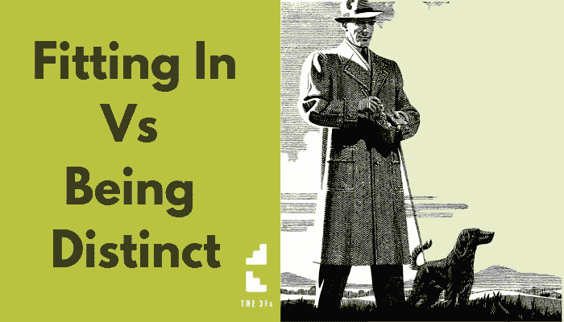

# 你如何描述你的工作？

> 原文：<https://medium.datadriveninvestor.com/how-do-you-describe-what-you-do-5dd3761e7f12?source=collection_archive---------16----------------------->

如何回答“你是做什么的…？”

你对自己有什么看法？

很多人给出的答案是*‘社会可接受’。*

作为人类……我们*非常*擅长与他人合作和一起工作。

这个……*的司机我们需要融入*。

这可以追溯到我们的祖先……作为哺乳动物(或动物),可能发生在我们身上的最糟糕的事情就是孤独……这让我们变得脆弱。所以，我们合作，努力适应。

作为人类，我们可以思考*超越*这种本能。但是我们仍然有那个*驱动*来适应。

那么……当有人问你是做什么的时候，你怎么回答？

说一些能让你脱颖而出的话会让人感觉不舒服。描述你所做的事情更容易让人理解。

但你不觉得那很无聊吗？

它淡化了你的独特之处。

当*这个*是你采用的身份时，它削弱了你的主张……你变得不那么独特。

这会让客户更难选择你！

“我是教练”或“我是设计师”或“我是顾问”。

… *其他人也是如此*。

你可能认为与他人竞争的唯一方法是宣称你更好……你有更多的经验或者更好的 T21 资格。

变得更好并不是必须的立场。

**秘密**

突出自己与众不同的地方要有效得多，而不是更好。

与众不同可能会让人感到害怕，但是……当你与其他人不同，当你与众不同时，客户会理解你如何帮助他们，并理解替代解决方案中可能缺少的东西。

想想电钻和手摇钻……一个*比另一个*好吗？

本能地，你会说电钻*更好，因为它更容易、更快。*

…但是，如果这项工作需要细心和精确，电钻可能不是更好的选择。

所以… *对于这个问题*手钻比电钻*更合适*。

这就是你描述自己与众不同的方式……你为你正在解决的某个特定问题提供一个合适的工具。

不要随大流，也不要和其他人一样，把自己描述成与众不同，而不是更好。

当你能做到这一点…并且你的“工具”是解决你客户问题的*完美解决方案*…你将会实现你想要的。

前往[博客](http://www.strategicmentors.co.uk/blog)页面获取更多类似的帖子。

*原载于 2019 年 1 月 30 日*[*【http://www.strategicmentors.co.uk/blog/】*](http://www.strategicmentors.co.uk/blog/)*。*