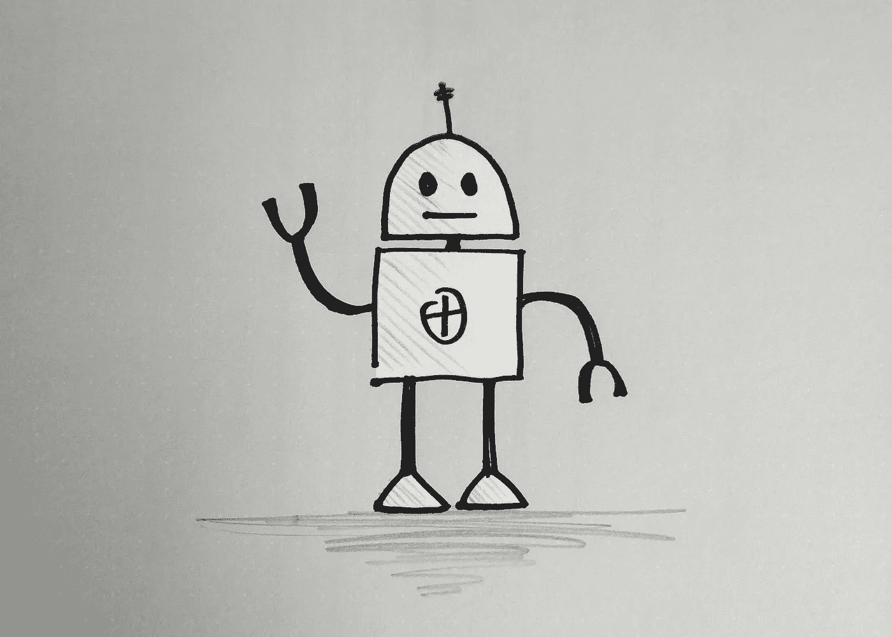
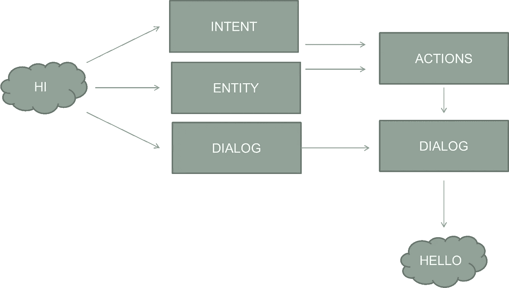
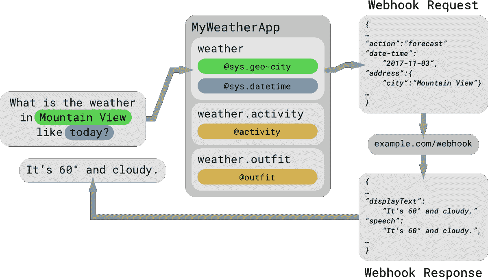

# 你认为，谷歌助手是如何工作的？

> 原文：<https://medium.datadriveninvestor.com/how-do-you-think-google-assistant-works-97a7e0b4a45b?source=collection_archive---------8----------------------->

> *你在日常生活中使用谷歌助手或 Siri 的频率有多高？*

像**谷歌助手**和 **Siri** 这样的即时聊天机器人已经成为我们生活中非常重要的一部分。它们可以做很多很酷的事情，比如订购披萨，给你最好的朋友打电话，进行谷歌搜索等。这些机器人背后的工作原理可能看起来很简单，但确实很复杂。在 80 年代和 90 年代，第一个名为 **Eliza** 的机器人诞生了，它使用模板来回答你的问题。甚至在今天，一些真正酷的东西是由基于模板的聊天系统完成的。 **Sophia** ，世界上第一个获得一个国家公民身份的机器人，是使用 AIML 产生响应的最著名的例子之一。但我们的一些日常伙伴，如谷歌助手，并没有基于模板的方法。相反，他们使用机器学习方法。

像谷歌助手和 Siri 这样的机器人，依靠各种小模型来产生类似人类的反应。每个基于机器学习的聊天机器人都使用 3 种基本机制…

***实体提取***

***意图识别***

***对话框生成***

# **实体提取**

诸如日期、时间、地点、姓名、电话号码等实体被提取出来，并用于对它们执行**动作***(如打电话给电话号码)*。可以通过机器学习算法或者通过进行词法分析来提取实体。

# **意图识别**

机器学习模型正在识别输入查询的意图。该意图进一步用于对话生成和确定**动作** *(如打电话)。*

# **对话框生成**

最后一部分，机器学习序列模型用于根据输入查询和查询的意图生成响应。这是商业秘密发挥作用的部分。Google Assistant，Siri，Alexa，每个人都有自己的对话模型。

Dataflow of a simple chatbot

这里，输入查询“ *Hi* ”流经聊天机器人的不同部分…实体提取模型提取“ *Null* ”，因为它没有实体。输入查询的意图是说，“*问候*”。这一意图决定了行动，在这种情况下将是“*无行动*”。意图和输入查询被传递给对话模型以生成响应。在这种情况下“*你好*”。这是一个简单的查询，没有任何实体和动作。有点复杂的对话也是可能的。

在本例中，意图是"*天气*，实体是"*山景*作为城市，以及"*今天*作为日期时间。“*weather*Intent 负责操作(解析天气数据)，返回实体“ *60* ”作为温度，返回实体“*多云*”作为天气状态。

对话框模型生成的对话框看起来像“ ***它是****【temp }****和*** *【天气 _ 状态}* *。*”。对话框内的实体随后被其相应的值所取代( *60* 和*多云*)。

这就是我们如何从*得到*“今天 60 度，多云”*“今天山景城的天气如何？”*总而言之*。*