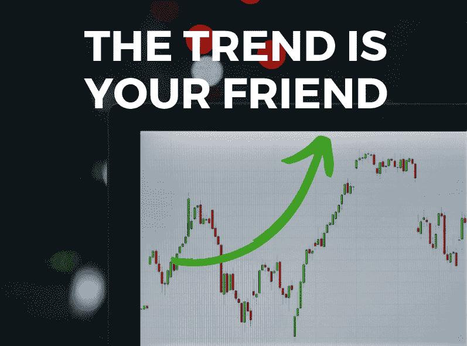
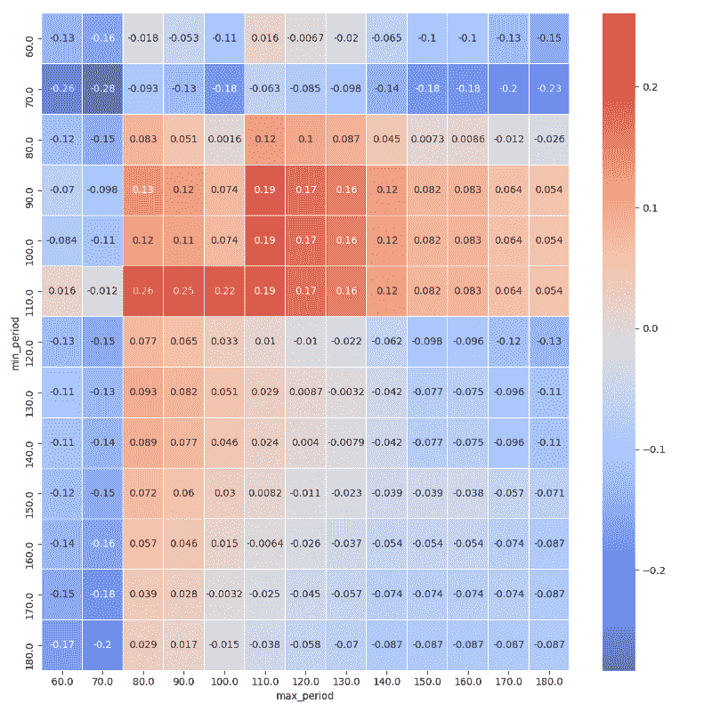
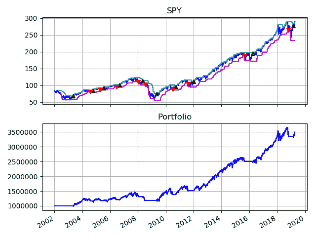

# 你如何交易市场趋势？—数据驱动的投资者

> 原文：<https://medium.datadriveninvestor.com/how-do-you-trade-trends-in-the-market-data-driven-investor-32f69e04dd68?source=collection_archive---------4----------------------->

历史上最成功的趋势跟踪者之一，[理查德·丹尼斯](https://en.wikipedia.org/wiki/Richard_Dennis)使用了海龟策略，他借了 1600 美元，据说十年赚了 2 亿美元。该策略规定，当工具价格达到 3 个月高点时，我们买入。当一个工具的价格跌至 3 个月低点时，我们卖出。该策略为投资者提供了一种有效的资本保护形式，同时允许投资者参与市场的上涨。

# 回溯测试海龟策略

为了测试海龟策略的有效性，我用用 [Python](https://www.datadriveninvestor.com/glossary/python/) 构建的回溯测试框架模拟了这个策略。

 [## 股票市场投资的机器学习——数据驱动的投资者

### 当你的一个朋友在脸书上传你的新海滩照，平台建议给你的脸加上标签，这是…

www.datadriveninvestor.com](https://www.datadriveninvestor.com/2019/01/30/machine-learning-for-stock-market-investing/) 

模拟的工作原理是:

1.  把标准普尔 500 交易所交易基金的历史价格放到我的数据库里。
2.  通过使用 3 个月窗口期的滚动最大值/最小值建立交易信号。
3.  每当产生买入或卖出信号时提交订单。
4.  生成图表以显示回溯测试的结果。

下面的图显示了我的模拟结果。顶部的图显示了标准普尔 500(深蓝色线)的价格，夹在它的滚动最大值(浅蓝色线)和滚动最小值(紫色线)之间。遵循海龟策略的规则，当指数价格超过滚动最大值时，我们做多指数。当指数价格低于滚动最小值时，我们平仓。

下图显示了投资组合的损益(PNL)值。在 2002 年投资 100 万美元，今天会有 250 多万美元。虽然回报可能看起来不起眼，但交易员通常会使用期货合约等高杠杆金融工具来放大收益。这是可能的，因为提供下跌保护的策略风险较低。例如，在 2008 年经济衰退期间，投资组合相对于市场仅亏损 18%(下跌 56%)。

然而，对大多数投资者来说，这种策略不会有吸引力，因为它的周转率很高。我们可以看到，要采用这种策略，投资者需要频繁地买卖指数。这非常不方便，并且会导致高交易成本。

# 我们能做得更好吗？

最初的海龟策略使用 3 个月的信号周期来交易市场(也就是说，当价格达到 3 个月高点时，他们买入指数，当价格达到 3 个月低点时，他们卖出指数)。借助计算机，我们可以轻松地针对信号范围使用不同的参数来运行该策略，并计算出可实现最佳性能的参数集。

这是结果。我用来衡量策略表现的指标是[夏普比率](https://www.investopedia.com/terms/s/sharperatio.asp)，它衡量风险回报率。夏普比率越高，特定风险水平下的策略回报越高。结果表明，使用 80 天的最大滚动窗口和 110 天的最小滚动窗口的策略具有最高的夏普比率 0.26。

现在让我们使用这些参数重新运行我们的模拟。结果显示，2002 年投资的 100 万美元将会产生今天略高于 350 万美元的收益。这比最初的海龟策略高出了 170%。交易的频率也低得多，更容易实施，交易成本也更低。

说到投资，每个人都有自己的风格和策略。我依赖系统策略，因为我可以模拟他们的表现，说服自己他们可以跑赢市场。

如果这个故事对你有帮助，请[跟着](https://medium.com/@ivannfok)我。

在[脸书](https://www.facebook.com/pyinvesting/)和 [Instagram](https://www.instagram.com/pyinvesting/) 上与我们连线。

Ivan 是一家对冲基金的技术专家，负责该基金技术堆栈的开发。他之前在一家资产管理基金担任定量研究员，专注于机器学习和大数据在企业绩效和可持续发展方面的应用。

*原载于 2019 年 4 月 23 日*[*https://www.datadriveninvestor.com*](https://www.datadriveninvestor.com/2019/04/23/how-do-you-trade-trends-in-the-market/)*。*