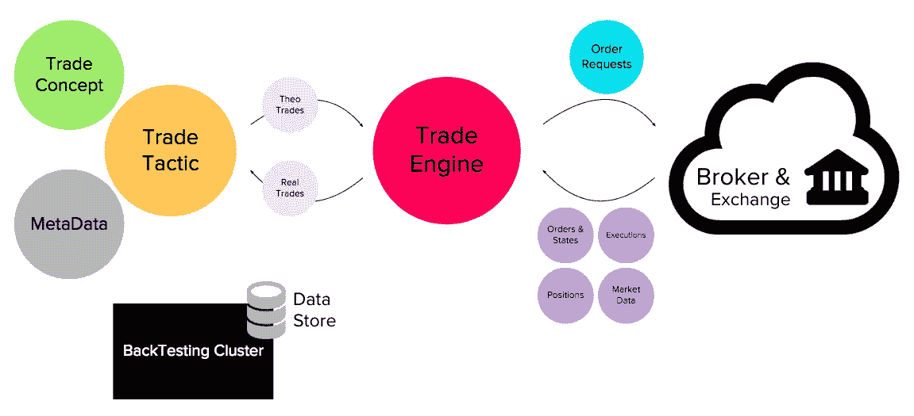
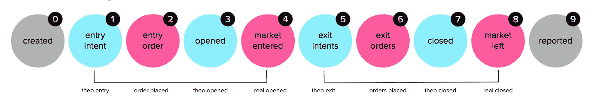

# 我可以建立自己的交易系统！

> 原文：<https://medium.datadriveninvestor.com/how-does-an-auto-trading-system-work-3baef2c67c84?source=collection_archive---------1----------------------->

## 自动交易系统的技术指南

梦想用全自动交易系统赚点钱？**好主意**不是吗？嘿，从一开始就说:我不会在这里解雇你，我也不会试图卖给你一些神秘的东西，假装我已经破解了代码来赚大钱，而我却在海滩上闲逛。真的没有！


# 相关文章

[为什么你伟大的交易想法起初是次要的](https://medium.com/datadriveninvestor/why-your-great-trading-idea-is-secondary-at-first-7282d206fd7a)
关于期货交易你需要知道的 6 件事

这纯粹是一个技术上的考虑，当你真的想认真对待一个项目时，如何有效地开始这样一个项目。这篇文章是为每一个试图或计划深入这个话题的人而写的。在某个时候，你已经或将要意识到，即使是像“运行你的交易想法”这样的基本前提，作为一个算法，也是一个相当棘手的技术问题。这篇文章不关注承诺赚钱的交易想法，相反，它帮助你得到你的引擎，它执行你的交易想法，坚固和可靠。

[](https://www.datadriveninvestor.com/2019/03/22/the-seductive-business-logic-of-algorithms/) [## 算法诱人的商业逻辑|数据驱动的投资者

### 某些机器行为总是让我感到惊讶。我对他们从自己的成就中学习的能力感到惊讶…

www.datadriveninvestor.com](https://www.datadriveninvestor.com/2019/03/22/the-seductive-business-logic-of-algorithms/) 

我将不得不保持交易引擎的几个非常复杂的方面非常通用和高水平，以确保这篇文章可以集中在最重要的方面。

# 1-组件

下面是一个简单交易系统的大致基础架构:



*   **经纪人**:你需要一个经纪人或者直接连接到电子交易所，为你想要交易的任何工具提供市场数据，并且能够接受**订单**和通知**执行**、**订单状态**和**头寸**。这也意味着你有一个有效的武装帐户(或纸交易帐户)，你有一个与你的经纪人的 API 适当的集成。我只和*互动券商*合作过，举个例子。
*   TradeConcept :这是你的交易理念的实际实现，使用任何对你来说方便的编程语言，也可以和你的经纪人 API 一起工作。你的交易理念是利用市场数据，利用你认为的任何逻辑来产生积极的结果。预计它会产生**进场意向**和/或**理论交易**(包括在某些点止损离场)，它独立于你想要交易的实际工具。
*   **TradeTactic** :由于 TradeConcept 独立于实际的工具，我们将 TradeTactic 定义为与概念相关的元数据的组合。例如，它应该包含您想要交易的工具、您想要多少股票、您想要使用哪种订单类型来输入和潜在的多个退出订单，以及一些更多的细节，如“*生效时间*”、“*全有或全无*”等等
*   这是你的经纪人和你的交易策略之间的连接点。TradeEngine 从您的概念中获取输入，将其转换为 orderRequest 发送给您的经纪人，并接收订单更新、执行和市场数据，这些数据将反馈到概念中。
*   **回测聚类&数据**:假设你想回测你的交易想法，看看至少在过去是否盈利(这当然很有道理)。你需要一定的计算能力，某种回溯测试集群，因为你很可能需要不止一个大盒子，它能够根据你想要交易的工具的历史数据运行你的交易概念代码。回溯测试只创建理论交易，包括它们的进/出点和结果表现/损失。根据你的交易想法的时间角度(几周的长期或非常短的短期和当天)，你必须使用不同的历史数据细节(例如，当天回溯测试的实时分笔成交点)。回溯测试本身就是一个巨大的话题，我不会深入细节，只是说:它肯定有好的一面，也有不好的一面。好的一面是，你能感觉到你离这条路有多近或多远。缺点是，取决于你参数化你的概念的强度，当你为过去优化它时，你很容易冒过度拟合的风险，这几乎肯定不会给你未来。因此，如果进行回溯测试，你可能不会在你的结果表现上多花几分钱，而是尽可能保持简单，并考虑你的进场/出场对未来的普遍适用性。

> 任何有抱负的系统交易者能想到的第一个也是最重要的认识是，就准确性和可信度而言，回溯测试/优化结果大致相当于二手车推销员的推销。

# 2 —事件和数据模型

Broker 和 TradeConcept 都是我们引擎的事件源。让我们看看这些事件源应该产生的具体事件是什么，以及所需数据模型的一些主要部分:

*   **trade concept::entry tents—**这些是在未来可能(或不可能)发生的特定市场条件下进入市场的尚未执行的计划，例如“*在价格达到 xyz 时买入 abc 股票*
*   **trade concept::theo trades**—这些是具体的，即使是理论上的(theo)进场和出场考虑，形成了产生一些想象结果的交易，例如“*在 abc 做多，在 xyz 做空，结果(或业绩/亏损)= xyz-abc* ”。正如我上面强调的，我们需要这个 theo 交易来检验和证明你的交易想法是有意义的，并且通常会产生合理的利润。
*   **trade tactic::real trades**—这些实体最终涵盖了市场上正在进行的真实交易。它由进场执行而生，直到到达止损点(止损点或止盈点)，然后它关闭，产生一些影响你账户余额的实际表现/损失。在一个理想的世界里，真实的贸易与你的贸易概念产生的贸易完美匹配。
*   **Broker::orderState** —这假设您向您的经纪人发送了订单，并且其确认收到了订单和/或通知了订单的状态变化(例如，它是否是**预先提交的**，被经纪人接受但尚未发送到交易所或得到交易所确认/ **提交的** / **填写的** / **取消的** a.s.o)
*   **Broker::execution** —在关联交易所执行了向您的经纪人发出的订单，您的经纪人正在通知有关该执行的详细信息(例如，多少股票，平均价格是多少)。执行还会开启或关闭实际的真实交易。
*   **经纪人::持仓** —通常伴随着执行，因为您在您交易的工具上的持仓发生了变化(例如，工具 *abc* ，在进场执行后持有 1 份合约)

好了，我已经描述了实际的交易实体——现在让我们来看看一个交易可能具有的状态:

# 3 —贸易及其生命周期

既然我们假设你使用交易概念来实现你的交易想法，我相信当我们谈论交易时，我们需要捕捉它的理论和实际观点。theo 交易产生于这个概念，它或多或少是一种欲望，伴随着一个行动(买入、卖出)，以及进场和出场价格。TradeEngines 的工作是将其转换为订单请求并将其发送给经纪人，经纪人必须将这些请求转发给交易所，并提供订单状态更改和执行的更新。虽然订单请求是订单转化为执行的种子，但它们是我们实际交易的生和死。因为滑点的原因，你的理论和实际交易肯定会略有不同。所以当我们谈论贸易状态时，我们总是不得不考虑它的理论和现实方面。这样我们就可以区分三类贸易状态:**核心**(灰色)**西奥**(蓝色)**雷亚尔**(红色)。



*   这只是创建一个未来交易实例的交易和技术准备工作的框架。
*   **1 —进入意图可用** (theo):这意味着交易概念清楚地知道它希望交易引擎如何以及在哪里进入市场*(例如，以价格 xyz 做多)。*
*   **2 —发出的挂单**(真实):根据提供给交易引擎的挂单意图，它选择正确的操作、订单类型和不同的其他元数据(如实际工具、股份数量、生效时间、a.s.o ),并将其发送给经纪人。代理返回订单更新，从其角度提供订单的实际状态(例如，*预提交，提交*，a.s.o)
*   **3 — opened** (theo):在现实世界中，你的经纪人不断传递你所订阅的市场数据，也就是你所交易的工具的价格。现在有了一个进来的价格，先前的进场意图达到了，我们标记一个 theo 交易以意图的价格开盘(或者你采取更保守的方法，加上滑点，这不是最坏的想法)。因为我们在市场上已经有了一个真实的挂单，我们期望它的执行能够在这个 theo 交易和我们期望从中获得的真实交易之间产生一个很好的匹配。
*   **4 —进入市场**(真实):这里，我们刚刚从经纪人那里收到一个执行事件，告诉我们我们的挂单已经执行(或者在后面更复杂的场景中，当我们想要一个以上的股票时，我们可能会得到多个部分执行，我们必须以某种方式合并它们)。我们现在有了一个或多或少适合西奥交易的真实交易，现在只考虑入门价格。止损单到位后(见 5)，我们可以计算此时的初始风险(R)。
*   **5 —退出意图** (theo):每当 theo 交易开始(3)时，我们想确保我们能很好地保护它免受全部损失，所以我们至少需要一个止损点。根据你的交易想法，你可能只需要一个止损点，当价格向你的方向发展时，你跟踪止损点，希望你能进入有利可图的区域，或者你可能想执行获利策略。在这种情况下，你会有两个止损点，一个是止损点，另一个是止盈点，市场会在某个时候到达其中一个止损点。无论哪种方式，这仍然是理论上的订单意向，首先必须发送给你的经纪人，以实际下单。
*   **6 —发出的止损单**(真实):我们已经从(5)收到订单请求，并通过您的经纪人将它们发送到市场。正如我们在(2)中看到的，代理返回订单更新，提供订单的实际状态(如*预提交，提交*，a.s.o)
*   **7 —成交**(theo):theo 交易正在进行，我们收到了更多的市场数据，我们交易的工具的价格最终达到了我们的一个止损点，所以我们结束了 theo 交易，并预计很快就会进行真正的交易。事实上，这甚至可能反过来发生，我们可以看到真正的贸易关闭第一。当 theo 交易结束时，我们可以最终计算其产生的绩效/损失(PL)值，并将其与初始风险进行比较，以生成风险/利润比率。
*   **8 —市场左侧**(真实):同样，我们在(4)中看到，我们收到了一个执行(或多个执行)，这表明我们的一个止损单已被执行，我们不再拥有作为交易对象的工具的头寸。让真实交易平仓还可以让我们计算它产生的业绩/亏损(PL)值，并将其与真实交易进行比较，以确定可能由滑点引起的潜在缺口。
*   **9 —报告**(核心):假设我们在这里有一些清理工作要做，比如取消额外的挂单(如果我们没有使用条件挂单或括号挂单的话)，或者让某个通知引擎给你的手机发送一条消息，或者类似这样的事情。

假设我们在每次交易中存储和维护这些交易状态(例如，作为 JsonObject 上的 tradeState=key ),这将提供一个非常可靠的机制来捕获这个[不确定的有限自动化](https://en.wikipedia.org/wiki/Nondeterministic_finite_automaton)的状态。它可能看起来有点像这样:

```
"tradeStates" : {
    **"0-CREATED"** : {
        "utcTimestamp" : <some timestamp>,
        "tradeId" : <tradeId>,
        "shares" : 2,
        "instrument" : {
            "symbol" : "ES",
            "tradingClass" : "ES"
        }
    }, 

    **"1-ENTRY_INTENT"** : {
        "utcTimestamp" : <some timestamp>,
        "entryIntent" : {
            "direction" : "LONG",
            "operator" : "HIGHER_EQUAL",
            "price" : 2785.0,
            "timestamp" : <some timestamp>
        }
    },

    **"2-ENTRY_ORDER"** : {
        "utcTimestamp" : <some timestamp>,
        "ENTRY" : {
            "CustomNew" : {
                <order details>
            },
            "PreSubmitted" : {
                <order details>
            },
            "Filled" : {
                <order details>
            }
        }
    },

    **"3-OPENED"** : {
        "utcTimestamp" : <some timestamp>,
        "direction" : "LONG",
        "price" : 2785.0,
        "entryIntent" : {
            "direction" : "LONG",
            "operator" : "HIGHER_EQUAL",
            "price" : 2785.0,
            "timestamp" : <some timestamp>
        }
    },

    **"4-MARKET_ENTERED"** : {
        "utcTimestamp" : <some timestamp>,
        "direction" : "SHORT",
        "shares" : 2,
        "price" : 2782.25,
        "entryExecution" : {
            <execution details> 
        }
    }, **"5-EXIT_INTENTS"** : {
        "utcTimestamp" : <some timestamp>,
        "stopLossExitIntent" : {
            "direction" : "SHORT",
            "operator" : "LOWER",
            "price" : 2747.25,
            "timestamp" : <some timestamp>
        }
    }, **"6-EXIT_ORDERS"** : {
        "utcTimestamp" : <some timestamp>,
        "STOPLOSS" : {
            "CustomNew" : {
                <order details>
            },
            "PreSubmitted" : {
                <order details>
            },
            "CustomCancelSent" : {
                <order details>
            }
            "Cancelled" : {
                <order details>
            },    
        },
        "EXIT" : {
            "CustomNew" : {
                <order details>
            },
            "PreSubmitted" : {
                <order details>
            },
            "Submitted" : {
                <order details>
            },
            "Filled" : {
                <order details>
            }
        }
    },

    **"7-CLOSED"** : {
        "utcTimestamp" : <some timestamp>,
        "price" : 2798.5,
        "EXIT" : {
            "direction" : "SHORT",
            "operator" : "LOWER_EQUAL",
            "price" : 2798.5,
            "timestamp" : <some timestamp>
        }
    },

    **"8-MARKET_LEFT"** : {
        "utcTimestamp" : <some timestamp>,
        "direction" : "SHORT",
        "shares" : 1,
        "price" : 2798.5,
        "exitExecution" : {
    <execution details> 
        }
    } **"9-REPORTED"** : {
        "utcTimestamp" : <some timestamp>,
        "message" : <some message>"
    },
}
```

# 4-元数据

我们在上面已经了解到，把一个 theo 交易变成现实需要的不仅仅是进场和出场的欲望。作为最低要求，我们必须添加以下元素:

*   **工具**:选择一个你想交易的工具(任何你想要的股票、期货、期权)。这个仪器有什么特点？它是否支持“全有或全无”(如果你打算交易多股)，它能否在正常交易时间之外交易，它是否有乘数(适用于大多数期货)？
*   **订单类型**:订单类型与你将看到的滑动量密切相关。你关心你是否真的得到了你想要的进场/出场价格，这样你就可以使用**市价(MKT)** 或更好的**止损(STP)** 订单了吗？这当然适用于长期交易，在这种情况下，几个点的滑动不会产生大的影响。或者你的交易理念依赖于最小化滑点，因为你日内交易，几个点的滑点可能会破坏你的预期盈利？然后你宁愿选择**限价(LMT)** 或**止损限价(STP-LMT)** 订单，以确保你得到你想要的。不过要小心，即使是 LMT 或 STP-LMT 订单也不安全，因为您的订单可能会在进场和出场时被忽略，尤其是在交易量较低的仪器上。如果你选择这种据称更安全的方式，确保你有某种“灾难恢复”至少在出口处，以确保如果你想要的出口订单没有实现，你以某种方式离开真实的交易。你看，你必须找到适合你和你的乐器的平衡。就我个人而言，当关注未来的自动交易时，我经历了合理的结果，STP 作为进场订单类型，STP LMT 作为止损订单类型，LMT 作为获利者订单类型。
*   滑点:好的，我们知道你的经纪人，你使用的交易所都不能保证你的交易价格，我们必须接受这个事实。然而，你可能想要限制潜在滑点的范围，至少在入口端。这是你可以引入的另一个标准，它基本上设定了一个水位线和范围(包括滑点在内的期望进场价格),以确保当它超过时你不会接受进场。这也取决于你选择的挂单类型，就我个人偏好的 STP 订单而言，当达到我想要的止损价格并且滑点不再可控时，它们就会变成 MKT 订单。
*   **股份/数量**:这个话题可能会让我们陷入一场围绕头寸&风险管理的大讨论，我不会在本文中谈到这个话题。你*只需要*确保你不会因为你交易的股票数量所承担的风险而毁掉你的账户，尤其是如果你交易的是像期货这样的高杠杆工具。当你交易一个以上的股票时，你的交易引擎也必须支持多个执行的合并，除非你工作(并且你的工具支持“全部或无”)
*   **生效时间(TIF)** :此标志允许您定义订单有效的时间范围，举例来说，通常可以是 GTC(有效期至取消)或日(就在今天)。同样，这取决于你的交易理念，以及选择正确的价值是长期的还是短期的。

# 结论

自动交易真的有那么复杂吗？嗯，你在这篇文章中看到的只是冰山一角，但如果你想认真对待，这是很重要的一点。这是一个激动人心的技术问题，需要深思熟虑的策略、数据模型、架构和实现。除了核心技术要求，如捕捉&实现交易生命周期，我们还看到一些细节(如元数据决策)高度依赖于你的交易想法、时间视角和你想要交易的实际工具。

如果你喜欢这个故事，并想在 medium 上阅读成千上万个这样的故事，你可以成为 medium 会员，每月仅需 5 美元。如果你愿意支持我的写作，请使用我下面的推荐链接，我将免费获得你的一部分会员资格。

[**https://medium.com/@thomas.reinecke/membership**](https://medium.com/@thomas.reinecke/membership)