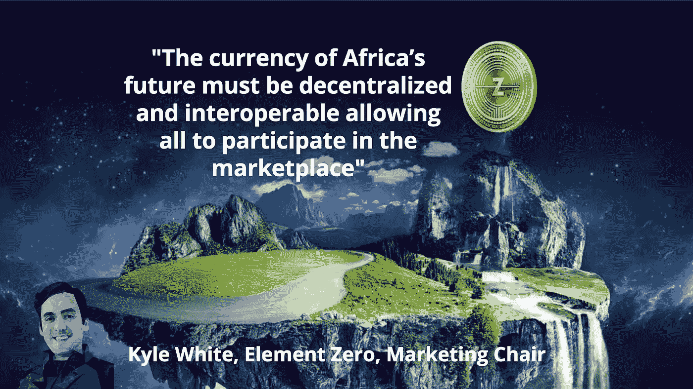

# 比特币如何融入非洲金融科技生态系统

> 原文：<https://medium.datadriveninvestor.com/how-does-bitcoin-fit-into-the-african-fintech-ecosystem-9beddcc0cf02?source=collection_archive---------17----------------------->

Jointer CMO，凯尔怀特的专家意见被选为 [Paxful 专家综述。](https://paxful.com/blog/bitcoin-and-the-african-fintech-ecosystem/)

比特币已经与非洲新兴经济体无缝融合(可能令许多人感到意外)。在利用以比特币为中介的 P2P 金融力量方面，非洲远远领先于西方国家(T2)。

一些比特币业务已经出现，汇款变得更快，最终，银行不足的人群开始慢慢进入非洲金融生态系统。

 [## 分散金融的出现|数据驱动的投资者

### 当前的全球金融体系为拥有资源、知识和财富的人创造了巨大的财富

www.datadriveninvestor.com](https://www.datadriveninvestor.com/2019/03/14/the-emergence-of-decentralized-finance/) 

看到许多人认为最不可能的地方如此快速地被采用，我们想深入挖掘，并向该行业的一些知名人士提出以下问题:

# 比特币如何融入非洲金融科技生态系统？

货币波动加剧了非洲的困境，尽管比特币可以在未来实现收益，但它目前并不能改善基础设施和与波动货币相关的动荡。金融体系需要一个稳定的价值储存库，才能让市场繁荣发展。

因此，对于非洲国家货币的日常交易和强劲的市场，我认为稳定的货币对目前非常不稳定的非洲金融体系最为有利。

此外，非洲的许多银行和金融机构都是由政府控制的地方机构。

加密货币不受地域限制。

我们必须确保这些货币不仅仅是本国法定支持的稳定货币，因为这只会延续中央集权对人民的长期控制。

非洲未来的货币必须是分散的、可互操作的，让所有人都能参与市场。

数字货币提供的是推动非洲经济向前发展的真正机会，而这可以通过去中心化来实现。它将中央银行从机构中移除，并将控制权放在使用货币的人手中。

此外，这些货币提供了防止腐败的保护，可以帮助个人和小企业管理投资。

Jointer 的附属 [Element Zero](https://elementzero.network) 是非膨胀的，完全去中心化的稳定协议。Jointer 将利用 [Element Zero SmartSwap](https://www.elementzero.network/ezo-beta/how-its-work.html) 来支持 Jointer 令牌生态系统内的交易。