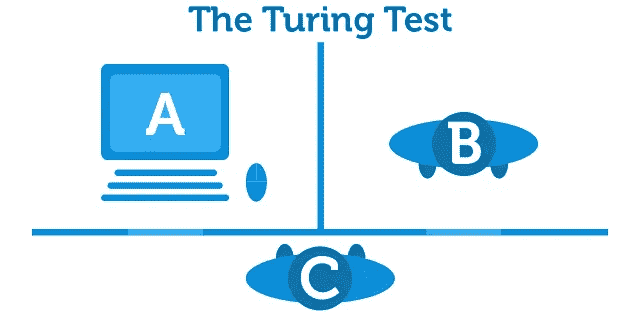
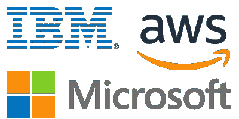
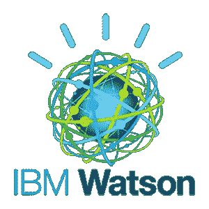

# 商业智能和人工智能有什么不同？

> 原文：<https://medium.datadriveninvestor.com/how-does-business-intelligence-differ-from-artificial-intelligence-79ef0f394087?source=collection_archive---------40----------------------->

Image | Rawpixel from Unsplash

人工智能最初是玛丽·雪莱在她的小说《弗兰肯斯坦》中使用的一种讲故事的设备。我敢肯定，我们都记得这是如何与村里的当地人！在某种程度上，现实生活中的人工智能也受到了国际社会的类似抵制，因为人们很难相信一个数学方程能够做出影响他们生活的决定。在现实世界中，人工智能指的是通过数学过程开发的算法，允许计算机分析情况，并建议用户采取最佳行动。一个简单的例子是卫星导航系统，该系统在考虑了行程长度、道路速度限制、交通报告和道路工程时间表之后，向用户建议最佳的行进路线。那么，现在我们有计算机为我们做决定，这将如何影响商业世界？人工智能在商业系统中已经有了很多应用，在过去的十年中，超市在他们的股票订购过程中使用了各种各样的 ***电子销售点系统*** (EPOS)。

# 简史

The Turing test for Artificial Intelligence

正如我们今天所知，人工智能是一种理论，即给定一套规则或算法的计算机可以根据输入的信息做出决策。这个想法首先来自第二次世界大战期间数学家艾伦·图灵，当时他正与英国军队合作破译纳粹密码。战后，图灵致力于发展理论计算机科学和人工智能。图灵测试是人工智能的一个标尺，在这个标尺中，一个人类用户与一台计算机(A)和另一个人(B)进行交互，而两者都是隐藏的。初始用户必须与计算机和另一个人进行对话，如果 C 不能区分哪个是来自 A & B 的人，那么计算机通过测试，被称为具有人工智能。另一个受欢迎的测试是中文教室论证，它遵循一个类似的叙述，测试计算机用智能答案回答智能问题的能力。人工智能世界的最新发展发生在 11 月 9 日，中国新闻机构“新华社”推出了他们的*不知疲倦的*人工智能主播，他们努力一年 365 天一天 24 小时提供最新的新闻故事。关于人类在未来新闻广播中扮演的角色，这已经引起了很多争论。然而，分析印度杂志指出，这不是真的人工智能，因为新闻主播无法自己汇集新闻故事，而是一种广播服务，很像听写服务。

# 什么是商业智能？

商业智能是一个总括术语，用于任何和所有使用计算机系统来收集、分析和处理商业功能中的数据。一个容易解释的例子是许多大型超市的 EPOS 系统。商业智能在公司中的作用是提供可操作的见解，以帮助决策过程。高质量的决策是企业中一个人所能拥有的最重要的技能。

想想你一天可能会做多少决定；

> 早上穿什么好呢？
> 
> **早餐吃什么？**
> 
> **到办公室后，你想喝杯咖啡还是茶？**
> 
> 你午餐吃什么？

当你做出选择的时候，你很可能会认为发生在你脑海中的过程是理所当然的。你可能会想象这些选择的结果，并预见你的决定会如何影响你的一天。商业决策也不例外，但你的选择可能会产生更大的后果。正是由于这个原因，整理和分析这些结果的相关数据是质量决策的一个重要阶段。商业智能系统被从销售和市场营销到制造业到金融服务业等众多行业的组织所使用。对于现代决策者来说，他们必须能够访问所有必要的信息和场景规划，从而做出明智的决策。许多云提供商提供 BI 工具作为其业务服务的一部分。Vytas 在他关于自动化和 DevOps 的文章中提到的技术——微软 Azure、亚马逊 Web 服务和 IBM Cloud 都将商业智能作为一种产品提供给用户。

# 决策支持系统

商业智能的一个工具是决策支持系统(DSS)。这些涉及决策过程中使用的信息管理。例如，一家企业收集选定时期的财务记录数据。然后，他们可以使用这些信息对未来一段时间的可能收入进行有根据的预测，由此他们可以设定 SMART 目标，以确保业务保持成功。DSS 程序在计算机出现之前就已经存在，尽管最近这些系统在预测未来趋势和情况方面取得了令人难以置信的进步，微软、SAP 和 IBM 等公司现在提供真正智能的服务，用于高级情况报告和战略规划。公司可以根据其历史财务记录和市场趋势以及这些系统自动执行的分析来制定长期计划。2018 年商业智能市场报告显示，最受欢迎的商业智能工具提供商是微软，超过一半的受访者使用该工具，当你考虑到微软在其 Azure 产品中包含的大量服务时，这并不奇怪。纯粹的可扩展性使它们成为任何需要两种或两种以上服务的企业的最具成本效益的选择。

# 机器学习

数据智能领域的最新创新是机器学习或机器智能。SAS 注意到机器学习的定义是一种自动建立分析模型的数据分析方法。它是人工智能的一个分支，基于这样一种想法，即系统可以从数据中学习，识别模式并在最少的人工干预下做出决策。这将智能系统在企业中的作用提升到了一个新的水平，因为它们开始融入人工智能哲学，以创建可以根据情况和可预见的未来可能发生的事情做出决策的系统。最著名的机器学习产品是 IBM 的 Watson 平台。“四大”之一的毕马威(KPMG)是这项服务的忠实粉丝，声称在他们的流程中实施 Watson 的直接结果是生产力得到了巨大的提高，将他们的努力简化为更有价值的服务。

## 你在决策时会采用什么技术？

*作者裴浩灿*

# 分享

【www.applauseit.co.uk】最初发表于**。**