# Java 中的垃圾收集是如何工作的？

> 原文：<https://medium.datadriveninvestor.com/how-does-garbage-collection-work-in-java-da8f75ec6899?source=collection_archive---------0----------------------->

*By 毕宣*。

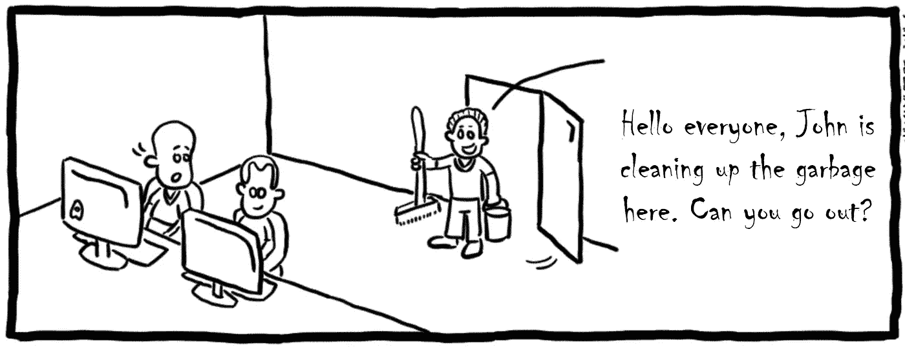

当我在学校时，有一个流行的迷因(类似于上面的一个)说，如果人们在食堂吃完饭后收拾餐具，他们必须是 [C++](https://www.geeksforgeeks.org/garbage-collection-java/?spm=a2c41.13644014.0.0) 程序员。这个迷因进一步说，那些吃完饭就直接离开的人必须是 [Java](https://www.java.com/en/) 程序员。

的确，这个迷因有点道理。一般来说，在 Java 中，我们似乎不需要像在 C++中那样过多关注[垃圾收集](https://www.geeksforgeeks.org/garbage-collection-java/)(缩写为 GC)。许多初学者在不理解 GC 的情况下，仍然可以开发出运行良好的程序或系统。但是，这并不意味着 Java 中的 GC 不重要。相反，它非常重要，但也很复杂，因此对初学者来说往往是不同的。

[](https://www.datadriveninvestor.com/2019/02/21/best-coding-languages-to-learn-in-2019/) [## 2019 年最值得学习的编码语言|数据驱动的投资者

### 在我读大学的那几年，我跳过了很多次夜游去学习 Java，希望有一天它能帮助我在…

www.datadriveninvestor.com](https://www.datadriveninvestor.com/2019/02/21/best-coding-languages-to-learn-in-2019/) 

然而，也不全是坏事。现在让我们深入 Java 中的垃圾收集(GC ),看看它都涉及到了什么。

# 什么是垃圾收集？

顾名思义，垃圾收集(GC)是一种释放被废料或垃圾占据的空间，并避免[内存泄漏](https://www.geeksforgeeks.org/what-is-memory-leak-how-can-we-avoid/?spm=a2c41.13644014.0.0)的方法。通过执行 GC 机制，可以有效地使用可用的内存。此外，通过这个过程，内存堆中死的或长时间未使用的对象将被删除，这些对象使用的内存空间将被回收。

在 Java 语言出现之前，程序员致力于编写 C 或 C++程序。在这样一个时代，存在着一个严重矛盾的现象。当用 C++和其他语言创建对象时，你必须不断地分配空间。当您不使用这些对象时，您还必须释放空间。因此，你必须同时编写[构造函数](https://www.quora.com/What-is-constructor-in-C?spm=a2c41.13644014.0.0)和[析构函数](https://beginnersbook.com/2017/08/cpp-destructors/?spm=a2c41.13644014.0.0)。在许多情况下，内存分配和回收都需要重复这两个功能。然后，有人提出，如果能写代码实现这个目的。当您分配和释放空间时，您可以重用代码，而不必重复编写这两个函数。

1960 年，GC 的概念在基于 MIT 的 Lisp 中首次提出，当时 Java 还没有发明出来。事实上，GC 并不是 Java 的专利。GC 的历史比 Java 的历史要长得多。

# 如何定义垃圾

要执行 GC，我们必须首先了解什么是垃圾，并弄清楚需要回收哪个内存空间。

# 引用计数算法

[引用计数算法](https://blogs.msdn.microsoft.com/abhinaba/2009/01/27/back-to-basics-reference-counting-garbage-collection/?spm=a2c41.13644014.0.0)在对象头中分配一个字段来存储对象的引用计数。如果此对象被另一个对象引用，其引用计数将递增 1。如果删除了对该对象的引用，引用计数将减 1。当该对象的引用计数降至零时，该对象将被垃圾回收。

```
String m = new String("jack");
```

首先，让我们创建一个字符串，其中“jack”被 m 引用。

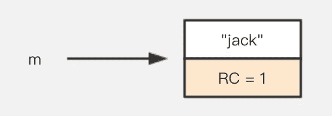

然后，将 m 设置为空。“jack”的引用计数为零。在引用计数算法中，将回收“jack”的内存。

```
m = null;
```

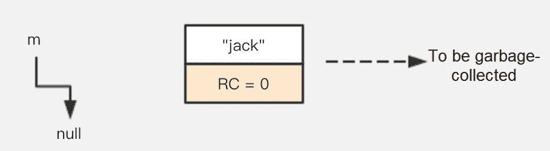

引用计数算法在程序执行过程中执行 GC。该算法不会触发停止世界事件。Stop-The-World 意味着在堆中的所有对象都被处理完之前，程序的执行被暂停。因此，该算法并不严格遵循 Stop-The-World GC 机制。

它看起来非常适用于 GC。然而，我们知道 Java 虚拟机(JVM)上的 GC 遵循停止世界的机制。我们为什么放弃引用计数算法？让我们看看下面的例子:

```
public class ReferenceCountingGC { public Object instance; public ReferenceCountingGC(String name){}
}public static void testGC(){ ReferenceCountingGC a = new ReferenceCountingGC("objA");
    ReferenceCountingGC b = new ReferenceCountingGC("objB"); a.instance = b;
    b.instance = a; a = null;
    b = null;
}
```

我们首先定义两个对象，然后相互引用这些对象，最后将每个对象的引用设置为 null。

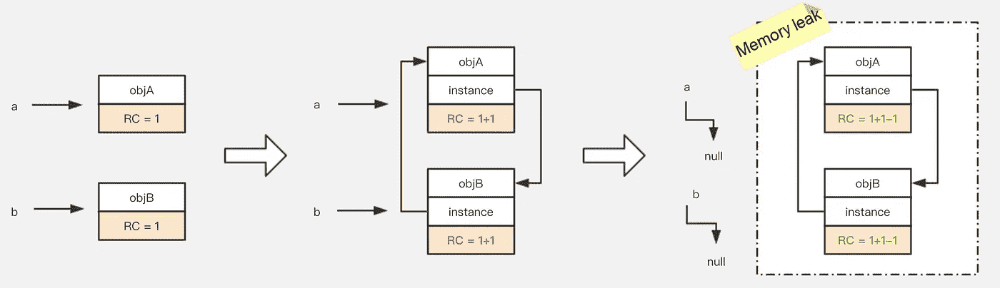

我们可以看到这两个对象都不能再被访问。但是，它们相互引用，因此它们的引用计数永远不会为零。因此，GC 收集器永远不会被通知使用引用计数算法对它们进行垃圾收集。

# 可达性分析算法

可达性分析算法的基本思想是从 GC 根开始。GC 遍历内存中的整个对象图，从这些根开始，沿着从根到其他对象的引用。该路径称为引用链。如果一个对象没有指向 GC 根的引用链，即不能从 GC 根访问该对象，则该对象不可用。

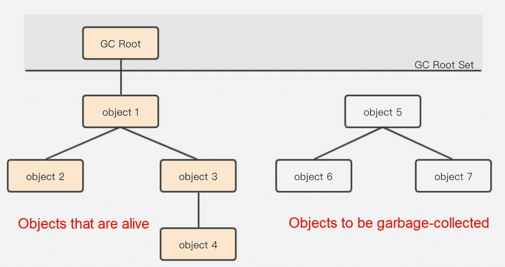

可达性分析算法成功地解决了引用计数算法中的循环引用问题。只要对象不能与 GC 根建立直接或间接的连接，系统就确定该对象将被垃圾收集。然后，另一个问题出现了。什么是 GC 根？

# Java 内存空间

在 Java 中，GC 根可以是四种类型的对象:

*   虚拟机(VM)堆栈中引用的对象，即堆栈框架中的局部变量表
*   方法区域中由类静态属性引用的对象
*   方法区域中常量引用的对象
*   本机方法堆栈中由 JNI(本机方法)引用的对象

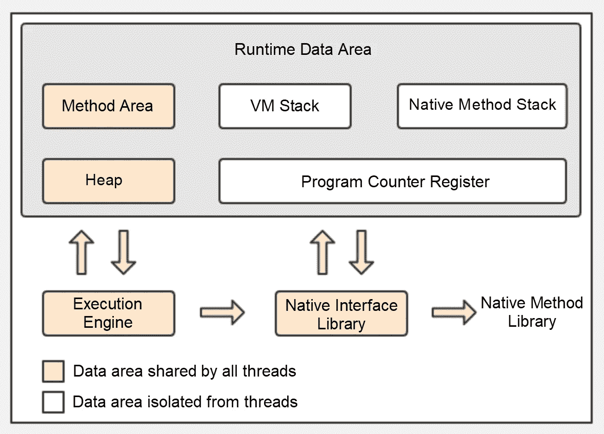

**虚拟机堆栈中引用的对象，即堆栈框架中的局部变量表**

在这种情况下，s 是 GC 根。当 s 设置为 null 时，localParameter 对象的引用链与 GC 根断开，该对象将被垃圾收集。

```
public class StackLocalParameter {
    public StackLocalParameter(String name){}
}public static void testGC(){
    StackLocalParameter s = new StackLocalParameter("localParameter");
    s = null;
}
```

**方法区中类静态属性引用的对象**

当 s 是 GC 根并且 s 被设置为 null 时，在 GC 之后，s 指向的 properties 对象被垃圾收集，因为它不能与 GC 根建立连接。作为一个类静态属性，m 也是一个 GC 根。参数对象仍然连接到 GC 根，所以在这种情况下，参数对象不会被垃圾收集。

```
public class MethodAreaStaicProperties {
    public static MethodAreaStaicProperties m;
    public MethodAreaStaicProperties(String name){}
}public static void testGC(){
    MethodAreaStaicProperties s = new MethodAreaStaicProperties("properties");
    s.m = new MethodAreaStaicProperties("parameter");
    s = null;
}
```

**方法区**中常量引用的对象

作为方法区域中的常量引用，m 也是 GC 根。在 s 被设置为 null 之后，最终的对象将不会被垃圾收集，尽管它没有带有 GC 根的引用链。

```
public class MethodAreaStaicProperties {
    public static final MethodAreaStaicProperties m = MethodAreaStaicProperties("final");
    public MethodAreaStaicProperties(String name){}
}public static void testGC(){
    MethodAreaStaicProperties s = new MethodAreaStaicProperties("staticProperties");
    s = null;
}
```

**本机方法堆栈中引用的对象**

本机接口总是使用本机方法堆栈。如果本机方法接口是使用 C 连接模型实现的，则其本机方法堆栈就是 C 堆栈。当一个线程调用 Java 方法时，VM 创建一个新的堆栈框架，并将其放入 Java 堆栈中。然而，当它调用本机方法时，VM 保持 Java 堆栈不变，不再将新帧放入线程的 Java 堆栈中。相反，VM 动态连接并直接调用指定的本机方法。

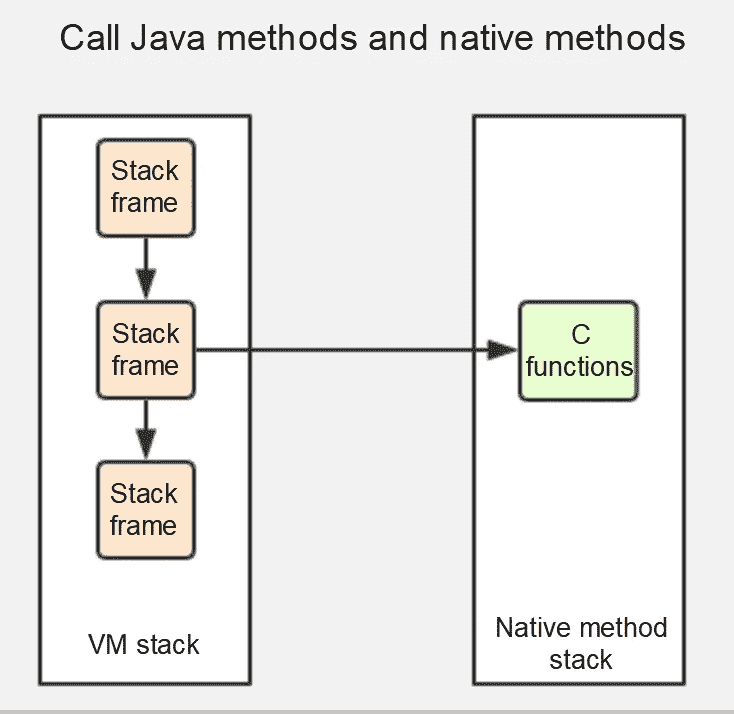

# GC 是如何工作的

确定要收集的垃圾后，垃圾收集器开始工作。然而，这涉及到一个问题:我们如何高效地执行 GC？JVM 规范没有明确定义如何实现垃圾收集器。因此，来自不同制造商的虚拟机可以以不同的方式实现垃圾收集器。下面说说几种常见的 GC 算法的核心思想。

# 标记扫描算法

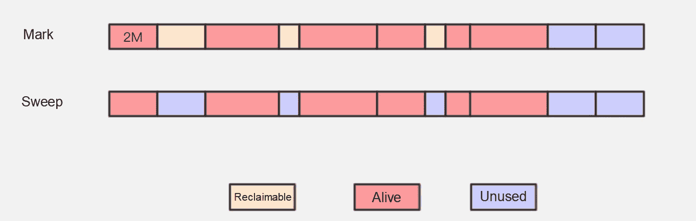

标记-清除算法是最常见的垃圾收集算法，它执行两个操作。它首先在内存空间中将对象标记为垃圾收集，然后从堆中清除标记的对象。如上图所示，垃圾占用的内存空间在收集后变得未被占用，可以重新使用。

该算法逻辑清晰，易于操作。但是，它有一个很大的内存碎片问题。

在上图中，假设中间的方块是 2 MB，较小的方块是 1 MB，较大的方块是 4 MB。回收这些内存空间后，内存在许多段中可用。我们知道，内存只能以连续的块的形式分配。在这种情况下，如果我们需要 2 MB 的内存空间，这两个 1 MB 的空间就不能被利用。因此，许多内存段都被浪费了。

# 复制算法

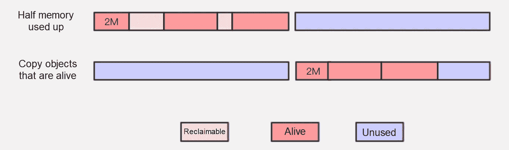

复制算法是从标记扫描算法发展而来的，用于解决内存碎片问题。该算法将可用内存分成两个大小相等的半空间。一次只有一个半空间是活动的。当活动的半空间变满时，活的对象被复制到另一个半空间。然后，活跃但已满的内存空间被清空。这确保了内存可以连续分配。因此，在内存分配过程中不会出现内存碎片等复杂情况。同时，逻辑清晰，操作高效。

上图还暴露了另一个问题。也就是说，实际上只能使用一半的内存。这个成本太高了。

# 标记紧凑算法

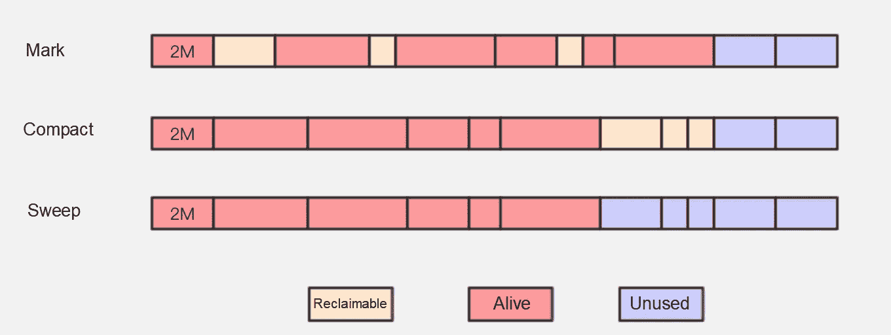

标记压缩算法与标记清除算法具有相同的标记过程。但是，该算法并不直接清除可以进行垃圾收集的对象。相反，它将所有有生命的对象移动到一端，然后回收超出端边界的内存空间。

标记压缩算法从标记清除算法升级而来，解决了内存碎片问题。此外，该算法避免了复制算法只能使用一半存储空间的缺点。这个算法看起来挺不错的。不幸的是，如上图所示，它对内存进行了更频繁的更改，并且需要整理出所有活对象的引用地址，这比复制算法的效率低得多。

# 分代收集算法

严格来说，分代收集算法不是一种思想，也不是一种理论，而是前三种算法的结合。它为不同的场景提供了不同算法的组合。

内存是根据对象的不同寿命来分块的。一般来说，Java 堆分为年轻一代和老一代。您可以使用适用于每一代的最合适的 GC 算法。在年轻一代中，在一次 GC 循环之后，总是可以发现大量的死对象，只有少数对象存活下来。在这种情况下，采用复制算法，通过只复制少数活体来完成采集。在老一代中，采用标记清除算法或标记压缩算法，因为对象具有高存活率，并且没有特别为分配保留额外的存储空间。

于是，更多的问题出现了:内存分为哪些部分，每个部分适用哪种算法？

# 内存模型和收集策略

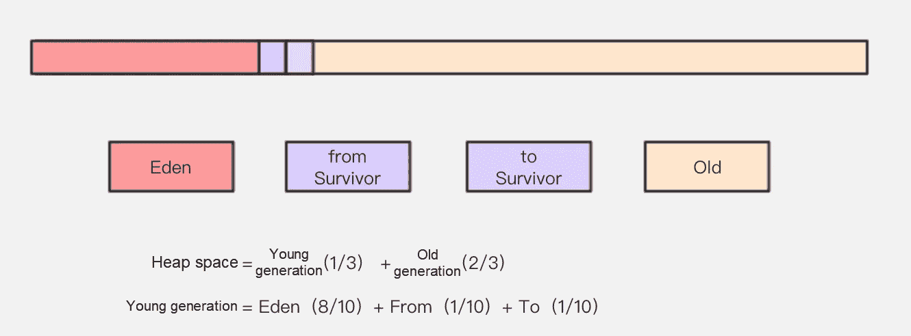

Java 堆是 JVM 管理的最大内存，堆是垃圾收集器管理的主要空间。这里主要分析 Java 堆的结构。

Java 堆主要分为两个空间:年轻一代和老一代。年轻一代被分为伊甸园空间和幸存者空间，而幸存者空间又被进一步分为从空间和到空间。我们可能会有以下问题:为什么需要幸存者空间？为什么幸存者空间又细分为两个以上的空间？放轻松。让我们详细看看如何创建和删除对象。

# 伊甸园空间

如 [IBM](https://www.alibabacloud.com/blog/www.ibm.com) 进行的一项专业研究所示，近 98%的对象都是短命的。因此，对象主要分配在年轻一代的伊甸园空间中。当 Eden 空间对于内存分配来说不够大时，VM 启动一个小的 GC。次要垃圾收集比主要垃圾收集发生得更频繁，并且具有更快的收集速度。在一次小的 GC 之后，Eden 空间将被清理，并且 Eden 空间中的大多数对象将被垃圾收集。在小 GC 中幸存下来的对象将被移到 From 空间。如果 From 空间不够大，这些对象会直接移到老一代。

# 幸存者空间

类似于交通中的黄灯，幸存者空间充当了伊甸园空间和老一代人之间的缓冲。幸存者空间又细分为两个空间:一个是“从”空间，另一个是“到”空间。在 Eden 空间和 From 空间的每个次要 GC 中幸存下来的对象被移动到 to 空间。如果 To 空间不够大，就直接晋升老一代。

## 为什么需要幸存者空间？

似乎一个物体从新一代的伊甸园空间传到了老一代。为什么这么复杂？假设没有幸存者空间，那么在每次小 GC 之后，伊甸园空间中的活对象将被发送到老一代。所以老一代很快就会被填满。虽然许多对象在一次小的 GC 之后不能被删除，但是它们不会存在很长时间。它们可能会被第二个或第三个小 GC 清除。在一次小规模 GC 之后将它们转移到老一代并不是一个明智的决定。

因此，幸存者空间的存在是为了减少发送到老一代的对象数量，从而减少主要 GC 的发生。幸存者空间的预筛选确保了只有能够经受住 16 次轻微 GC 的对象才会被提升到老一代。

## 为什么幸存者空间进一步分为两个空间？

划分的最大好处就是解决了内存碎片的问题。

我们假设只有一个幸存者空间。在一次小的 GC 之后，Eden 空间被清理，有生命的对象被移动到幸存者空间。先前存在于幸存空间中的对象也可能需要被删除。于是，一个问题出现了:我们如何才能清除它们？在这个场景中，我们只能使用[标记-清除算法](https://www.geeksforgeeks.org/mark-and-sweep-garbage-collection-algorithm/)，但是我们知道这个算法最大的问题是内存碎片。在对象寿命较短的年轻一代中，标记-清扫算法必然会造成严重的内存碎片。由于有两个幸存空间，在一个小的 GC 之后，先前 Eden 和 From 空间中幸存的对象将被复制到 to 空间。在第二个小 GC 中，From 和 To 空格的角色互换了。存在于伊甸园和目标空间中的对象被复制到源空间。这种在两个幸存空间之间复制活体的过程重复几次。

最能从这种机制中受益的是，总会有一个空的幸存者空间，而另一个幸存者空间总会没有碎片。那么，为什么幸存者空间要细分成更多的空间呢？例如，将幸存者空间分成三个、四个或五个空间是否可行？嗯，如果幸存者空间进一步细分，每个分区的空间会比较小，很容易填满。因此，两个幸存者空间可能是折衷后解决方案的最佳规格。

# 老一代

旧的一代占据了堆内存空间的三分之二，只有在执行主要的 GC 时才会被清除。每个 GC 触发停止世界事件。内存越大，停止运行时间越长。因此，内存越大并不总是越好。复制算法在对象存活率高的老一代中执行许多复制操作，导致效率低。因此，在老一代中采用标记紧凑算法。

此外，借助提升失败处理机制，无法放入幸存者空间的对象将直接提升到老一代。以下对象也将放在老一代。

## 大型物体

大对象是指需要大量连续内存空间的对象。一个大对象，不管它的寿命有多长，都会直接到老一代。大对象被放在老一代中，以便在 Eden 空间和两个幸存者空间之间可以避免大量的复制操作。如果您的系统中有大量短命的大型对象，请多加注意。

## 长寿命的物体

VM 为每个对象设置一个年龄计数器。在正常情况下，对象不断在“从”和“到”幸存者空间之间移动。对象在一次较小的 GC 中幸存下来后，它们的年龄会增加 1。当一个对象的年龄增加到 15 岁时，它将被提升到老一代。当然，JVM 也支持设置年龄阈值。

# 动态对象年龄

JVM 不要求对象的年龄必须是 15 岁，这样它才能被提升到老一代。如果同年龄的对象占据了幸存者空间的一半以上，那么大于或等于这个年龄的对象可以直接提升到老一代，而不必等待“足够老”。

这实际上有点像[负载平衡器](https://www.nginx.com/resources/glossary/load-balancing/)。轮询是一种负载平衡器，确保每台机器都能接收到相同的请求。看似平衡，但每台机器的硬件都是断开的，状态也不一样。我们可以根据每台机器收到的请求数量或每台机器的响应时间来调整我们的负载平衡算法。

# 原始资料

[](https://www.alibabacloud.com/blog/how-does-garbage-collection-work-in-java_595387?spm=a2c41.13644014.0.0) [## Java 中的垃圾收集是如何工作的？

### 阿里巴巴科技 2019 年 9 月 24 日 2064 年我上学的时候，有这么一个流行的模因(类似于上图)…

www.alibabacloud.com](https://www.alibabacloud.com/blog/how-does-garbage-collection-work-in-java_595387?spm=a2c41.13644014.0.0)