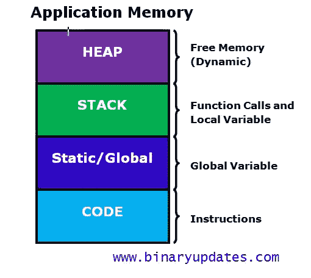
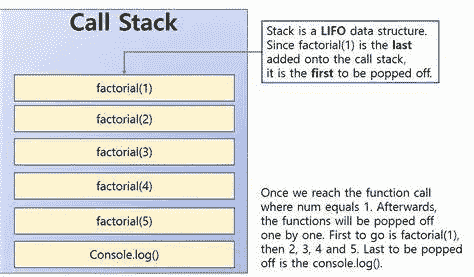
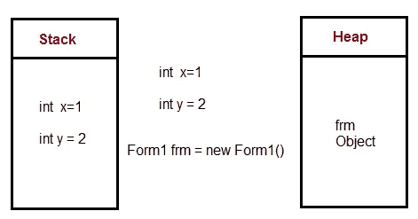
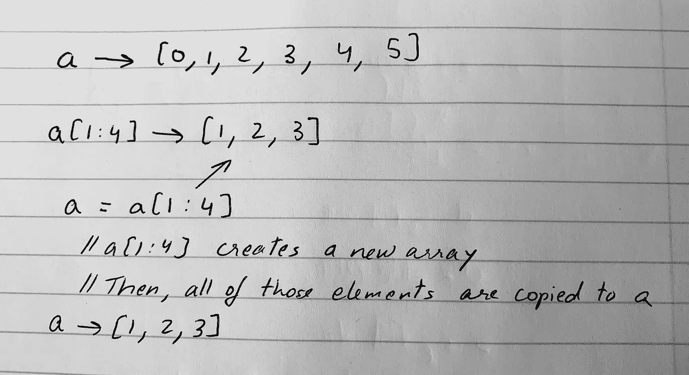
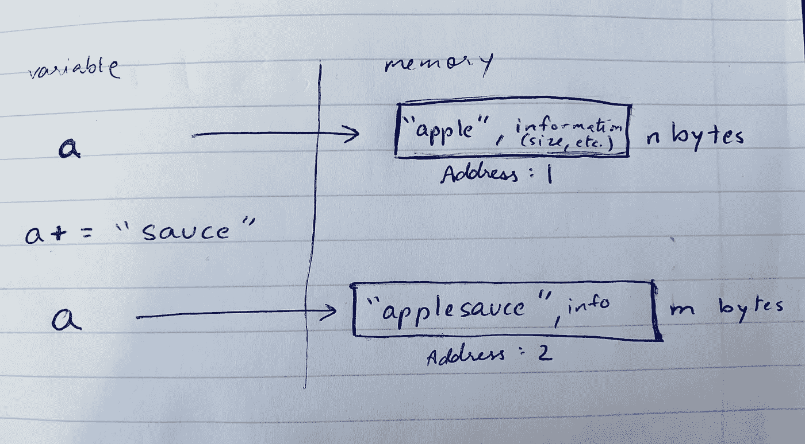
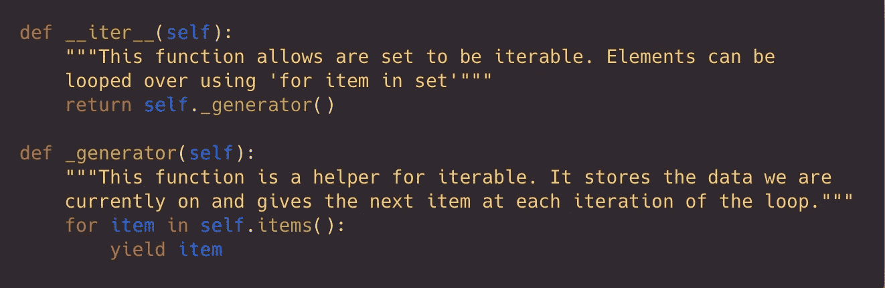

# Python(和其他语言)中的内存分配是如何工作的？

> 原文：<https://medium.datadriveninvestor.com/how-does-memory-allocation-work-in-python-and-other-languages-d2d8a9398543?source=collection_archive---------0----------------------->

*Image Credit:* [*Alex Thomas Sadler*](https://clark.com/technology/what-to-delete-when-smartphone-storage-is-full/)

你是一个希望你的应用程序不会因为太慢而被删除的开发者吗，即使你写了高效的代码？我们和我们的用户经常会从他们的设备上删除大量的应用程序和文件，因为他们的设备上打开了太多的应用程序，无法运行。我当然希望我的应用程序不会被删除。因此，我最关心的事情之一就是让我的应用程序尽可能节省内存。如果多个应用程序在计算机上运行时使用内存，如果它使用的内存超过可用内存，我们的应用程序就无法并行运行！

为了实现空间效率，有必要了解您的编程语言及其广泛使用的内置操作的内存分配方式。这有助于实现空间优化的策略和最佳实践。

 [## 2019 年最值得学习的编码语言——数据驱动的投资者

### 在我读大学的那几年，我跳过了很多次夜游去学习 Java，希望有一天它能帮助我在…

www.datadriveninvestor.com](https://www.datadriveninvestor.com/2019/02/21/best-coding-languages-to-learn-in-2019/) 

## **那么，内存分配是如何工作的呢？**

内存分配是将一个程序分配给计算机内存中一个特定的空白空间块的过程。在 Python 中，所有这些都是由 Python 内存管理器在后端完成的。由于 Python 是使用 C 编程语言实现的，所以这个过程是以 C 方式处理的——开发人员分配和释放内存(通过为 Python 创建垃圾收集器),这样用户就不必手动进行*垃圾收集*。由于 C-backend 处理这些，Python 用户不需要担心。

打住，什么是*垃圾收集*？垃圾收集是解释器在你的程序不使用内存时为你释放内存。Python 能够做到这一点是因为 python 的开发者在后端为我们实现了一个垃圾收集器。这个 Python 垃圾收集器使用了一种称为“引用计数”的技术，当程序中不再有对对象的引用时，对象被释放。

然而，C 没有垃圾收集器，所以垃圾收集必须由 C 开发人员自己处理。因此，如果我们使用 C 编程语言，我们将一个指针分配给内存中的一个空间，我们需要确保在退出程序之前释放它，方法是从内存中的那个地址删除我们的数据。如果没有处理好这一点，我们就会以垃圾收集告终。

那么…内存是怎么分配的呢？内存可以存储在堆栈(用于静态内存分配)或堆(用于动态内存分配)上:

[Image Credit](https://binaryupdates.com/dynamic-memory-allocation-in-c-programming/)

**堆栈分配:**

堆栈分配存储静态内存，即只在特定函数或方法调用中需要的内存。当一个函数被调用时，它被添加到程序的调用栈中。特定函数内部的任何本地内存分配(如变量初始化)都临时存储在函数调用堆栈中，一旦函数返回，调用堆栈就会删除这些内存，并继续执行下一个任务。这种对连续内存块的分配是由编译器使用预定义的例程来处理的，开发人员不需要为此担心。

*什么是调用栈？*

[Image Credit](https://www.thecodingdelight.com/understanding-recursion-javascript/)

计算机程序使用堆栈数据结构来存储活动的子程序——任务或函数调用——按照它们被调用的顺序。这就是所谓的调用堆栈。所以，当我们运行一个程序时，所有的函数调用首先被编译器添加到调用栈中。然后，这些函数调用被弹出堆栈并被调用。

**堆分配:**

堆分配在全局范围内存储动态内存，即程序中使用的内存。这些变量在特定的方法或函数调用之外是需要的，或者在多个函数中全局共享。与堆栈分配不同，堆分配与它的对应物(即堆数据结构)无关。它只是一个很大的内存空间，可用于分配和释放一些随机地址，这是根据被存储对象所需的空间找到的。

这种分配是由 C 开发人员手动完成的，并且*必须*小心执行以防止内存泄漏。在堆上分配的所有内存，例如指向链表中的节点或其他对象的指针，必须在程序结束时或不再需要时释放。对于链表和树数据结构这样的实现，当一个节点被删除时，释放内存必须格外小心，并且对内存中该地址的访问(通常使用指针)丢失。

下面是一个程序的函数变量如何分配到堆栈和堆上的例子。请注意局部变量是如何存储在堆栈中的，然而，表单对象是存储在堆中的。这是因为内置操作“new”在堆上分配动态内存。

[Image Credit](http://net-informations.com/faq/net/stack-heap.htm)

## 但是，我使用 Python，我不这样做…

如果您使用 python，那么这已经由 python 的内存管理器为您完成了，它是使用 C 实现的。由于 python 的后端是用 C 实现的，Python 编程语言的开发人员小心翼翼地为 Python 实现了内存管理，因此我们不必处理它。然而，python 中的内存管理确实涉及私有堆，因此必须小心处理。

## Python 中内存分配或空间复杂度的一些最佳实践是什么？

1.  **避免列表切片**

列表索引导致为一个全新的数组分配内存，该数组独立于原始数组，其中复制了所需的元素。

> 例如:对于 a = [0，1，2，3，4，5]，a[1:4]分配一个新数组[1，2，3]

上面的例子显示了列表切片在空间和时间方面的代价，尤其是在处理大量数据的时候！必须分配和复制新的数组。因此，最好的做法是 ***尝试使用函数参数或单独的变量来跟踪索引，而不是切片或改变列表。***

**2。谨慎使用列表索引**

如果可能，在使用“for index in range(len(array))”之前，尝试使用“for item in array”对数组进行循环，以节省空间和时间。*如果索引不是必须的，你的程序没有它也能工作，那就不要分配！*

**3。字符串串联**

如果可能，避免使用“+”进行字符串连接，因为字符串是不可变的。每次向字符串中添加一个元素，Python 都会创建一个新的字符串，并将其分配到一个新的地址！

python 中的每个字符串都需要基于字符和长度的固定数量的内存空间，并在初始化时分配给这个数量的内存。因此，当对字符串进行更改时，它需要不同数量的内存并需要重新分配。

让我们运行一个示例程序，并在内存中查看它:

> a = "苹果"
> 
> a +=“酱”
> 
> 打印(a) //“苹果酱”

***对于字符串串联，不用“+”，用*** `***''.join(iterable_object)***` ***或*** `***.format***` ***或*** `***%***` ***！当程序处理更多的数据和/或更长的字符串时，这会产生巨大的影响。***

**4。使用迭代器和生成器**

迭代器会在您需要时给出您需要的值，但最初不会计算每个值。在处理大型数据集时，这对于时间和内存都是有效的，因为您可以立即开始使用数据，而不必等待程序先处理整个数据集。生成器是帮助函数，允许我们创建迭代器函数。

在这里阅读如何实现迭代器和生成器以及它们如何节省内存空间

下面是一个集合实现的迭代器实现的例子。迭代器函数调用特殊的生成器函数。生成器使用 yield 来保存我们所在的元素，并且只给出那个值，只在循环的下一次迭代中移动到下一个值。

**5。尽可能利用图书馆**

如果您正在实现已经作为 python 库实现并可用的方法，如果它比您的代码更节省空间和时间，请考虑使用该库！此外，这样做可以节省时间，这样您就可以处理程序的细节。

[这里有一篇 O'Reilly 关于 20 个有用的 python 模块的文章](https://www.oreilly.com/learning/20-python-libraries-you-arent-using-but-should)

哇，你成功了！简单回顾一下:我们知道在程序中使用堆栈和堆来管理内存——嗯，只是 Python 的私有堆。我们还学习了编写高效内存代码的技巧和诀窍！