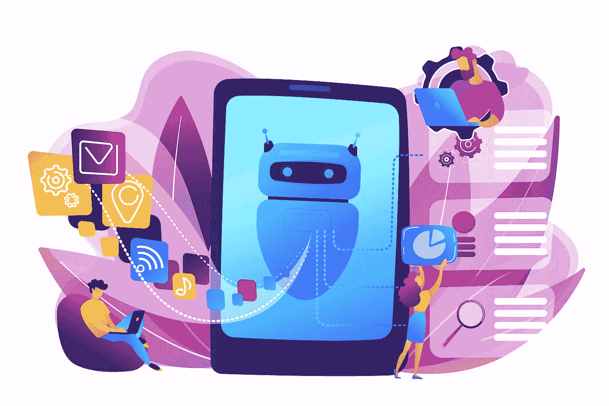
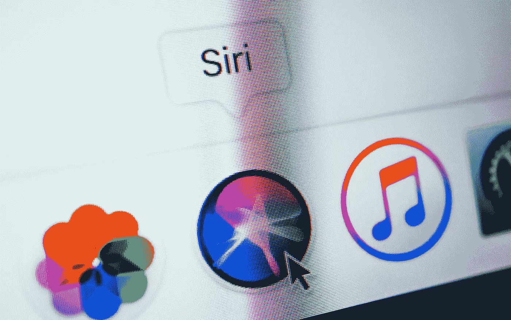

# Siri 是如何工作的:技术和算法

> 原文：<https://medium.datadriveninvestor.com/how-does-siri-work-technology-and-algorithm-5d828fa0fe92?source=collection_archive---------36----------------------->

自从我们看了科幻电影，如《T2》、《星际迷航》、《T4 2001:太空漫游》,我们就迷恋上了可以与人通信的电脑。最后，在 2010 年，我们的梦想实现了，Siri 跳出了我们的想象，进入了我们的手机和平板电脑。

大多数 iPhone 用户喜欢手机内置的个人虚拟助理 Siri。你可以使用 Siri 做几乎任何事情，例如查找 GPS 导航、组织日程安排、打电话或发短信以及许多其他功能，由于 Siri 的语音识别软件，这些功能变得更加简单。然而，Siri 背后的技术到底是什么？让我们仔细看看。

# Siri 在技术上是如何工作的

Siri 使用两种主要技术:语音识别和自然语言处理(NLP)。第一项技术是把人类说的话转换成文本形式。实际上，当以“嘿，Siri”开始一个句子时，你会激活苹果的语音识别软件，将你的话转换成书面形式。然而，这并不简单，因为每个人都有独特的音色和口音，这可能因州和国家而异。

苹果使用庞大的数据集为 Siri 提供有效的语音识别模型，然后在由许多人的语音样本组成的不同数据集上进行训练，这使得 Siri 可以识别各种口音、语调和语速。

# Siri 技术

在过去的几年里，深度学习有了很多发展，这类软件的错误率已经下降到 10%以下。当你给 Siri 一个命令或问一个问题时，Siri 会理解你的语音，但它会将转换后的文本发送回 Apple 进行进一步处理。苹果的服务器会运行额外的 NLP 算法来获取你的问题或请求的要点。例如，有许多方法可以让 Siri 提醒您参加会议。一个选项是“嘿 Siri，你能提醒我明天 11 点的会议吗？”或者“你能提前告诉我明天 11 点的会议吗？”Siri 首先需要从各种方式中找出你希望它提醒你明天 11 点有个会议的请求或问题。

如果你的手机没有连接到互联网，这可能是一个问题，因为 Siri 不会在你的手机上处理你的语音，但从好的方面来看，也有一些好处。首先，通过将大部分工作卸载到功能强大的计算机，它允许您节省宝贵的资源和收集的数据，用于不断改善 Siri 的性能。

这种对你意图的分析需要大量的数据来训练 NLP 算法。这就是为什么苹果雇佣了许多以前从事过上述技术的工程师来训练 Siri 算法。此外，我们不要忘记，当 Siri 收到来自苹果服务器的响应时，它必须接收文本并将其转换为语音，这与处理用户命令相比并不困难，但仍然需要 Siri 的努力。

# 最后的想法

如果我们回到我们之前提到的电影 *2001:太空漫游*，在这部电影中有一台名为 Hal 的超级计算机，当有人问它一个问题“生命的意义是什么？”它返回了一个幽默的答案:“24”就像电影中的超级计算机一样，今天的技术无法掌握用户的意图，检测讽刺，幽默，机智和我们每天使用的许多表达形式。现在，尽管[开发了一种软件](https://skywell.software/)，可以检测我们所有的意图，甚至更多的 NLP 训练和更大的数据集，用于训练 IBM 的沃森。为了让 Siri 更上一层楼，需要有额外的信息检索和自动推理层来检测我们讲话中存在的所有微妙之处，即使我们几乎没有注意到它。

即使我们提到过，NLP 和深度学习技术已经取得了很多进展，但用户有时会对 Siri 缺乏理解力感到沮丧，并经常禁用 Siri。随着新款 iPhones 的推出，请密切关注 Siri 技术的新发展，因为它不仅能够检测你的语音，还能检测音调和声音模式，这样你就不必说“在句子末尾加个感叹号”之类的话了一切都会自动完成。所以下次你拿出 iPhone 问 Siri 一个问题时，请记住几秒钟内发生的复杂过程，因为它标志着智能技术的新时代。

*最初发表于*[*sky well . software*](https://skywell.software/blog/how-does-siri-work-technology-and-algorithm/)*。*