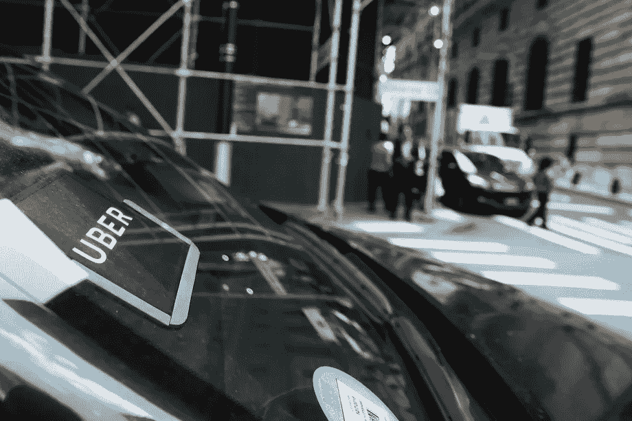

# 为什么像优步这样的共享乘车服务会给乘客和司机带来好处？

> 原文：<https://medium.datadriveninvestor.com/how-does-uber-make-its-brand-worth-72-billion-in-10-years-7e5757a56f21?source=collection_archive---------29----------------------->

Photo by Spencer Platt/Getty Images

在 2018 年 2 月的最新评估中，在 Alphabet 的 Waymo 和优步之间的和解中，优步的估值为 720 亿美元。让我们来看看优步的几个关键[统计数据](http://www.businessofapps.com/data/uber-statistics/):

*   优步可在全球 65 个国家和 600 多个城市使用
*   每天完成 1500 万次优步旅行
*   全世界已经完成了超过 50 亿次旅行
*   数据各不相同，但优步在美国打车市场的份额估计在 69%至 74%之间
*   优步司机的平均收入是 364 美元/月
*   美国优步每小时工资中位数可能低至 8.55 美元
*   全球有 300 万名优步司机，美国有 75 万名，世界其他地区有 225 万名

所以问题是，像优步这样一家不拥有任何运输业务的运输公司是如何取得成功的？

[**汽车**](https://www.mckinsey.com/industries/automotive-and-assembly/our-insights/disruptive-trends-that-will-transform-the-auto-industry) **和运输行业被打乱**

优步一直在改变游戏规则。优步将技术和连通性作为其优势，以三种方式改变消费者的行为:

*   人们有了另一个选择，那就是优步，作为交通工具，而不是开车或使用公共交通工具。
*   优步之旅比打车便宜，不像公共交通那么拥挤，而且与拥有一辆汽车相比，没有额外的费用，如停车费、保险费和维修费。因此，拼车服务可能会降低未来私家车拥有者的比例。
*   此外，据预测，消费者将使用优步或任何其他拼车服务进行日常短途旅行。

**优步如何创造先发优势**

*   社交媒体是传播谣言、吸引年轻人、让他们好奇、让他们谈论并鼓励他们尝试的关键组成部分。社交媒体成为瞄准新兴市场人群的主要工具。
*   赞助当地活动是让顾客尝试优步服务的另一种方式。您只需在预订活动乘车时输入促销代码，并以折扣价格乘车即可。

**利用技术和“酷功能”刺激需求**

*   “推荐给朋友”功能是一个伟大的功能，为客户介绍，分享，并邀请他们的朋友使用该服务。
*   评级功能鼓励人们给予反馈，并使其变得更好。它针对的是年轻人参与社会并为社会做出贡献的需求。
*   与评级一起，向客户提供即时支持服务是使年轻人对服务满意的关键特征之一。

**对乘客和司机都有好处**

*   对于乘客来说，优步的价格比传统的出租车服务更便宜。此外，他们甚至可以选择更便宜的选择，即 UberPool，以降低价格，并在途中与其他乘客分享可用的座位。
*   对于潜水员来说，工作时间非常灵活，优步还奖励表现优异的司机[。](https://www.theverge.com/2018/11/1/18047746/uber-driver-high-performing-earnings-free-college-tuition-pro)
*   越多的需求和越多的乘坐要求，越多的司机将加入。其结果是，它为客户提供了全天候服务，也为司机创造了更好的收入。

安妮做的。