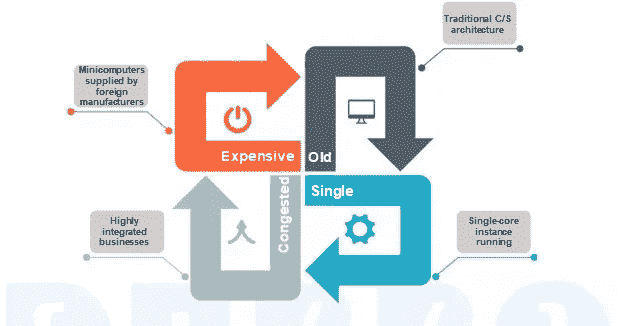
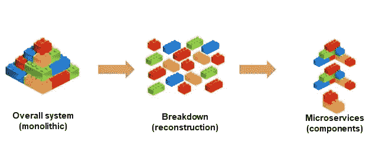
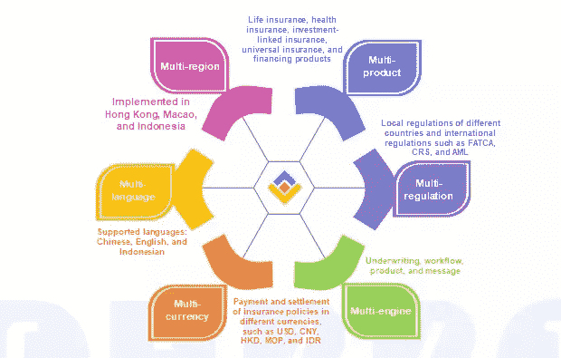
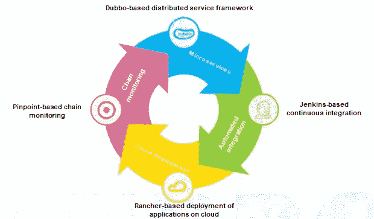
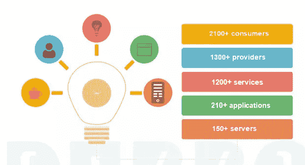
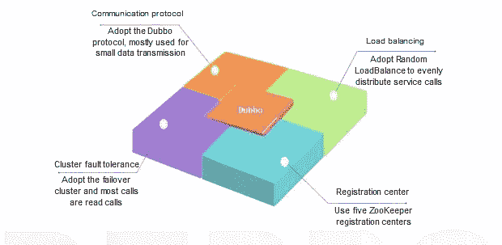
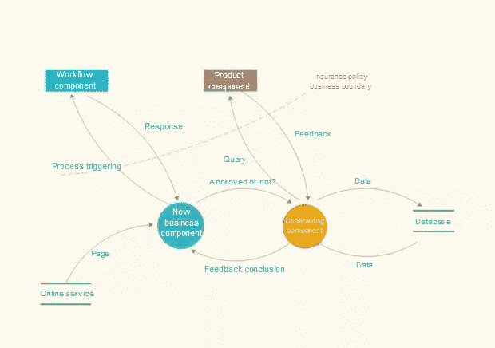
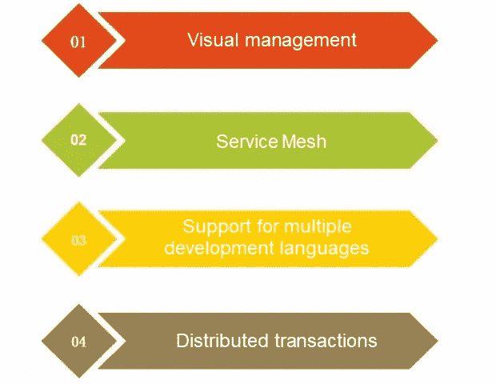

# 保险公司如何使用基于 Dubbo 的微服务

> 原文：<https://medium.datadriveninvestor.com/how-dubbo-based-microservices-are-used-in-insurance-companies-a2d48ea1fc7c?source=collection_archive---------2----------------------->

本文根据中国人寿保险(海外)有限公司深圳中心技术总监黄在深圳举办的社区开发者日期间的演讲撰写。

中国人寿保险(海外)有限公司负责中国人寿在 mainland China 以外的海外市场的业务发展，包括香港、澳门、新加坡和印尼。与其在中国的国内业务不同，其海外业务遵循不同的标准、不同的法律法规，需要使用不同的语言和货币，当然也面临不同的挑战。更具体地说，所有这些都导致了业务支持方面的一些技术挑战。在本文中，我们将仔细了解中国人寿应对这些挑战的经验。

 [## 在中国做生意:如何优化您的运营|数据驱动的投资者

### 中国是一个受本地和外国公司欢迎的商业中心。在一个国家设立实体存在…

www.datadriveninvestor.com](https://www.datadriveninvestor.com/2019/03/17/doing-business-in-china-how-to-optimize-your-operations/) 

# 我们来谈谈杜博

2013 年，在中国人寿，我们正在寻找一个 [RPC 框架](https://searchapparchitecture.techtarget.com/definition/Remote-Procedure-Call-RPC?spm=a2c41.13703291.0.0)来转变我们的整个业务数据库。当时，市场上很少有成熟的产品，不像今天有大量的产品，例如 [Spring Cloud](https://spring.io/projects/spring-cloud?spm=a2c41.13703291.0.0) 和 [Dubbo](https://dubbo.apache.org/en-us/?spm=a2c41.13703291.0.0) 等等。我们所寻找的是一个已经在现实生产环境中大规模应用的框架。Dubbo 在淘宝已经实施了很长时间，阿里巴巴的商业模式和我们的商业模式不相上下。例如，我们的业务模型需要支持来自几个不同海外地区的请求，每个地区都有自己的业务需求。

考虑到所有这些，我们开始使用 Dubbo，也是在 2013 年。我们的业务系统于 2016 年在香港和澳门推出，2019 年 5 月在印度尼西亚推出。未来，我们的业务系统也将在新加坡和整个东南亚快速部署，这在一定程度上要归功于 Dubbo 的使用。

Dubbo 在部署效率和降低成本方面帮了我们很多。在本文中，我将讨论我们在 Dubbo 之前使用的架构，这是许多传统保险公司常见的架构，然后讨论我们如何使用 Dubbo 以及我们的架构如何变化。

# 保险公司过去做了什么

在服务器硬件方面，我们使用的是其他许多传统保险业务系统会使用的[小型计算机](https://www.techopedia.com/definition/4615/minicomputer)，它们通常来自 IBM 和 HP。当时只有这两个系统可用，并且都运行基于 UNIX 的操作系统。

在业务架构方面，以前的软件开发主要使用[客户/服务器架构](https://www.techopedia.com/definition/438/clientserver-architecture)。在这种架构下，一个强大的中间件叫做 [Tuxedo](https://www.oracle.com/technetwork/middleware/tuxedo/overview/index.html) ，用于分布式事务管理，它提供了出色的一致性和高并发性能。那么，我们为什么要取代燕尾服呢？第一个原因是价格高，第二个原因是相关 O & M 人员紧缺，第三个原因是造成业务运营高度集成，导致分布式、跨平台场景下性能和调度差。第四个原因是 Tuxedo 是为整体应用程序设计的。结果，我们再也不敢把它分开了。

# 核心业务系统如何转型

该图显示了与单一应用程序相比，微服务的优势。Dubbo 充当不同组件之间交互的刺刀，类似于乐高玩具中的凸凹部分。它实现通信管理和服务治理。在这种设计的支持下，我们打破了传统的大型核心架构。

OneLife 是我们的业务支持平台。顾名思义，一个平台可以处理所有保险业务运营，形成一个内部生态系统，并为包括图像、新服务、保存和理赔在内的几个不同领域提供支持。它还提供引擎，如工作流、产品引擎、承保引擎和消息引擎。这些业务能力对任何保险公司来说都是必不可少的。

# 用 Dubbo 开发的保险业务处理平台

背靠杜博，构建了全新的保险业务处理平台，实现“六多”保险业务处理。“六个多”代表了拥有多个业务系统、产品系列、要遵循的规则集、引擎以及货币语言的想法。例如，要生成一个保险单，您需要确定是用英语、汉语还是印尼语生成保险单。这当然也需要我们与各自的业务部门合作，然后还要设计和开发一个合适的处理平台。

# OneLife 分布式系统的形成

如图，以下四个部分可以形成一个闭环:基于 Dubbo 的微服务调用、 [Jenkins](https://jenkins.io/) 的持续集成、 [Rancher](https://rancher.com/) 的云部署应用、基于 Pinpoint 的链式监控。印尼版的云部署方面，我们一直在和阿里云讨论。未来印尼的系统可能会率先迁移到阿里云。在精确定位链监控方面，显示的拓扑非常清晰。然而，基于该拓扑，我们可以看到它的几个问题，例如形成中断或呼叫失败。今年，在精确定位链监控的帮助下，我们发现了系统中的 100 多个漏洞。针尖链监控和 Dubbo 的结合非常出色。

# Dubbo 在香港和澳门是如何分布的

Dubbo 拥有超过 150 台服务器、超过 210 个应用程序、超过 2100 个消费者和超过 1300 个提供商，分布在香港和澳门。一个保险公司，尤其是自己的业务系统，高频交易并不是非常多。大多数高频交易发生在前端。虽然业务系统并不总是处于高频状态，但我们能够确保所有业务部门的稳定和准确输出仍然很重要。这也是我们选择 Dubbo 的原因之一。

# 中国人寿保险(海外)有限公司

我们大约 70%的业务使用早期的 Dubbo 版本(具体来说是 2.4.9)。我们之前在 Dubbo 的基础上做了一些代码修改，比如对分布式事务的补偿。后来，我们发现由于代码的重大修改，该版本无法升级。那么，你可能会想，我们剩下的 30%业务运营使用的框架是什么？嗯，我们只敢在我们的外围设备上尝试最新版本。同样，该版本只有在被实际应用证明可行后，才应用于核心业务架构。目前，中国人寿保险(海外)有限公司的 Dubbo 每天被调用超过 2100 万次，自 Dubbo 部署以来从未发生过系统崩溃。

# Dubbo 配置结构

我们将在这一部分分享我们的配置。强调了两个问题。第一个问题是重试机制。这种方法的问题是，当服务中断时，控制平台用于人工干预，或者如果服务是关键服务，则通过重复交易来替代地补偿服务。第二个问题是，使用 ZooKeeper 注册中心有一些缺点，因为在高峰期网络消耗巨大。Dubbo 版本中的元数据概念很有前途。未来我们会尝试看看是否可以用 Dubbo 以后的版本来克服 ZooKeeper 的缺点或者优化 ZooKeeper。

# Dubbo 微服务的一个应用场景

上图展示了 Dubbo 微服务的应用。应用程序从在线服务页面开始，然后转到新的服务组件。然后触发工作流，查询核保结果。根据核保结果，自动查询保费计算结果并返回给前端。当核心业务系统和销售系统部署在印尼时，低成本是强制性要求。此外，业务部门必须相互分离。这涉及到基础开发模式。基地发展模式是什么？

当业务分布在多个地区时，每个地区都必须有自己的特定版本。只要公共基础版本相同，就可以提高工作效率。比如总部有一些基础服务，但是印尼有自己的监管要求。如果以后香港也有这个需求，在基础版通过一定级别的审核后，基础版回滚到基础版，然后针对不同地区发布不同的基础版。也就是说，在复杂的情况下，基础版本支持不同业务逻辑的分层分离、分层代码管理以及分层和基于区域的服务治理。

# 建议

第一，加强可视化管理。

第二，引入服务网格，打包成一个包，在微服务系统中提供更多的功能，包括网络调用、流量限制、断路、服务间的监控等。

第三，支持多种语言。Dubbo 目前提供 PHP、Node.js、Python 和 Go 客户端，预计将来会支持更多的客户端。

第四，我们不建议 Dubbo 支持分布式事务管理。当我们第一次使用 Dubbo 时，我们确定支持分布式事务是必要的。所以我们在 Dubbo 的基础上改了代码。申请过程很顺利，代码可以确保我们的交易的一致性，甚至跨平台。然而，当一个服务失败时，所有要提交的事务都崩溃了，这给数据库带来了致命的风险。

因此，我们更愿意让 Dubbo 提供更多对消息机制的支持，并在进行业务开发的同时补偿分布式事务。这是我们通过实际应用得出的一些想法和建议。

# 常见问题

**Q1** :用微服务组件替换单片应用程序的过程是逐步进行的还是一次性完成的？完成更换流程需要多少人力、多少资源？

**A1** :一是现有结构模块化，模块之间相互独立。对于最重要的数据结构，业务逻辑必须分离。然后设置数据库碎片或权限，逐步更换模块。在开发之前，应该很好地规划整个替换过程。第一个模块开始的时候，我们只有五个人，但是他们都是技术过硬，在各自的业务领域都很精通。当务之急是获得公司管理层的支持。

**Q2** :如果系统中没有分布式事务控制，如何检测数据不一致？这个问题怎么解决？

**A2** :基于精确定位的链监控使 O & M 人员能够快速发现问题，纠正故障，然后进行人工干预。我们对关键服务使用 MQ 机制。然而，这种机制耗费大量的时间和人力。我们建议不要大规模使用分布式事务控制。

**Q3** :当公司内部数据量较大时，如何在将数据从旧系统迁移到新系统时替换 Oracle 数据库？你能回答这个问题吗？

**A3** :在数据库层面，你必须保证 Oracle 数据库的表结构和数据与其他数据库一致。可以使用 ETL 等工具进行对比。在应用程序级别，您可以采取两个步骤。第一步是自动化处理。您可以使用自行编译的工具在两个数据库上执行应用程序的 SQL 语句，并及时纠正错误。在第三轮执行时，几乎所有的 SQL 语句都可以正常执行。第二步，抽查关键算法或接口，将业务数据与新接口输出的数据进行对比。

# 原始资料

 [## 保险公司如何使用基于 Dubbo 的微服务

### 本文是根据黄的一次演讲撰写的

www.alibabacloud.com](https://www.alibabacloud.com/blog/how-dubbo-based-microservices-are-used-in-insurance-companies_595512?spm=a2c41.13703291.0.0)