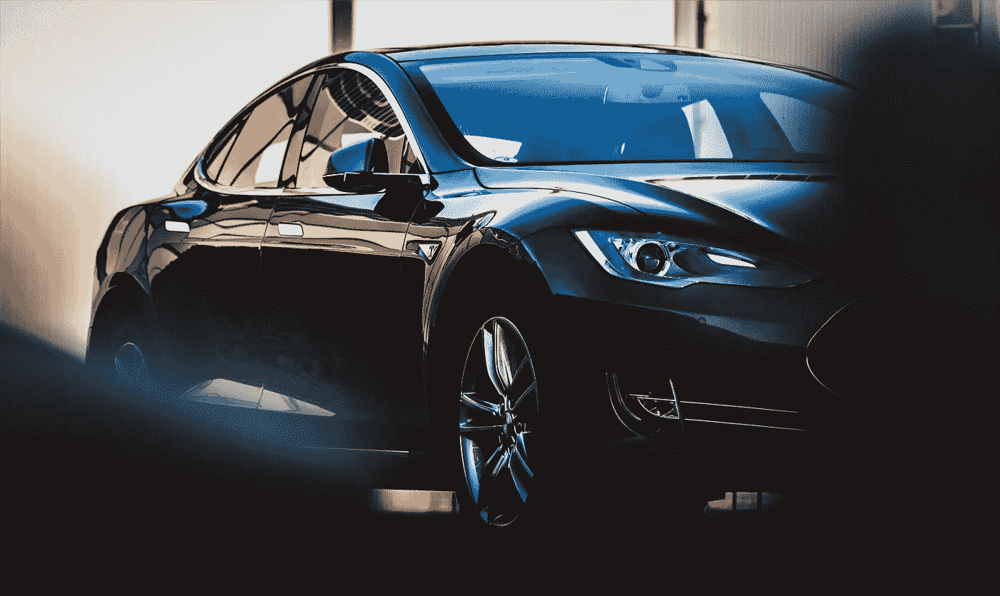
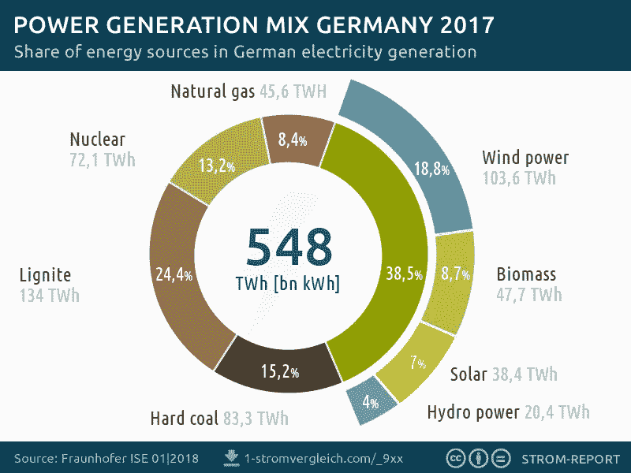
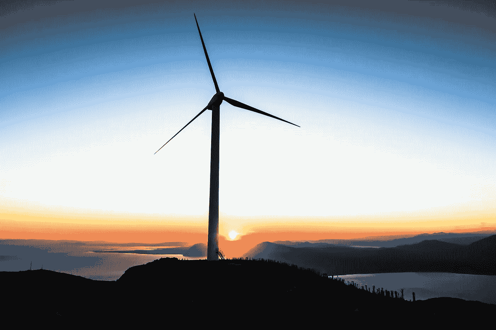
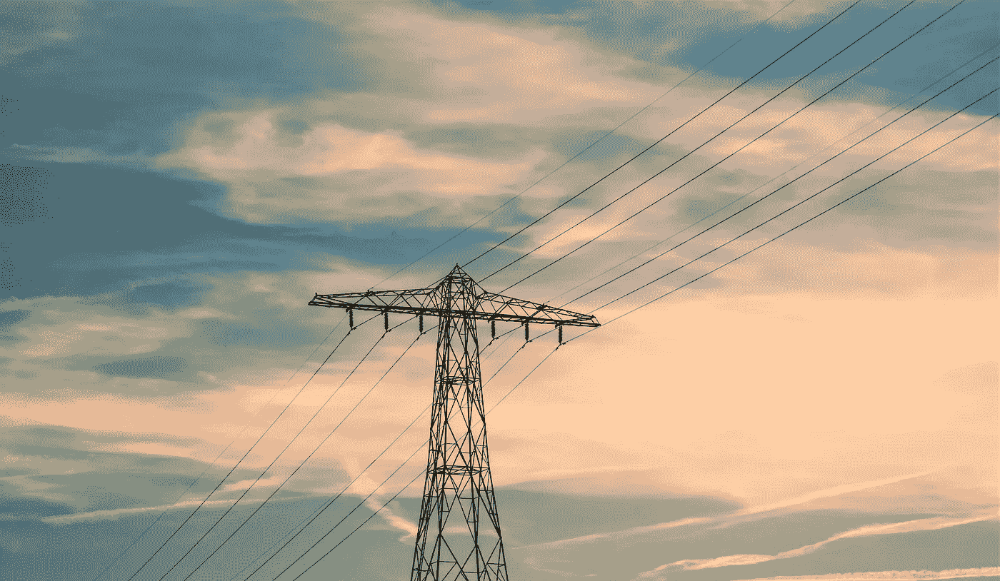

# 电动汽车到底有多环保？

> 原文：<https://medium.datadriveninvestor.com/how-eco-are-electric-cars-really-1cc1bb588e96?source=collection_archive---------19----------------------->

Photo by [Taneli Lahtinen](https://unsplash.com/photos/qy5sq8-ymps?utm_source=unsplash&utm_medium=referral&utm_content=creditCopyText) on [Unsplash](https://unsplash.com/search/photos/tesla?utm_source=unsplash&utm_medium=referral&utm_content=creditCopyText)

## 电动汽车在当今世界是一件大事。但是，我们走上了电动化的正确道路吗？

电动汽车比内燃机汽车有优势。它们不排放任何二氧化碳或氮氧化物，非常安静，也非常容易驾驶。因此，乍一看，我们会说，电动车非常环保。

但是想一想:这些汽车使用的电力有多少来自可再生能源？

## 电动汽车并不总是比燃烧汽车有更好的碳足迹

在德国，2017 年德国只有 **38.5%** 的发电量是可再生的。

[https://1-stromvergleich.com/download/germanys-power-generation-mix-2017/](https://1-stromvergleich.com/download/germanys-power-generation-mix-2017/)

不多，对吧？

这意味着一个人用德国电源插座的电力给一辆电动汽车充电，将需要驾驶 **10 万公里**(6.2 万英里)产生比驾驶传统发动机汽车更少的二氧化碳。

**但还有更多。**

根据弗劳恩霍夫建筑物理研究所的说法，生产一辆电动汽车需要的能源是汽油驱动汽车的两倍。总部设在布鲁塞尔的运输环境运动组织的电子交通专家约翰·勒·珀蒂也证实了这一点:

> “如今制造一辆电动汽车比制造一辆传统燃料汽车更加耗能。”

仅电池的生产就排放了 20 吨二氧化碳*(相比之下，7.5 升/100 公里的汽油在 100，000 公里或 62，000 英里时排放 17.4 吨二氧化碳*)。他们还需要像钕这样的稀土，其开采经常导致侵犯人权和破坏生态。

如果我们总结所有这些，很明显电动汽车的总体二氧化碳平衡表现如何。

瑞典的一项研究表明，使用 100%绿色能源，汽车(取决于类型和电池大小)需要 3 到 8 年才能达到更好的二氧化碳平衡。

Photo by [Jason Blackeye](https://unsplash.com/photos/9HEY1URQIQY?utm_source=unsplash&utm_medium=referral&utm_content=creditCopyText) on [Unsplash](https://unsplash.com/search/photos/renewable-energy?utm_source=unsplash&utm_medium=referral&utm_content=creditCopyText)

## 加快可再生能源的发展是必要的

只有当有足够的环保能源可用时，电力和交通的部门耦合才有意义。

这意味着，为了让向电动交通的转变最有效，各国必须生产更多的绿色能源。

使用可再生能源的电动汽车在使用寿命期间产生的问题气体比汽油车少六倍。

Photo by [Aaron Mello](https://unsplash.com/photos/gN2X5e8th8w?utm_source=unsplash&utm_medium=referral&utm_content=creditCopyText) on [Unsplash](https://unsplash.com/search/photos/electricity?utm_source=unsplash&utm_medium=referral&utm_content=creditCopyText)

## 对更多电动汽车的需求

如上所述，我们需要更多的绿色能源。与此同时，城市必须改造基础设施，以应对给数百万辆汽车充电的挑战。如今大多数城市的电网都无法承受这么大的负荷。除此之外，我们还需要更多的充电站。许多人的主要标准是汽车的范围和价格。EEHH 的[调查](https://www.google.com/url?sa=t&rct=j&q=&esrc=s&source=web&cd=4&cad=rja&uact=8&ved=2ahUKEwjsnqu9zvHeAhUNC-wKHQOHACwQFjADegQICBAC&url=https%3A%2F%2Fwww.erneuerbare-energien-hamburg.de%2Fde%2Fnews%2Fuebersicht%2Fdetails%2Fforsa-umfrage-zu-elektromobilitaet-und-oekostrom.html%3Ffile%3Dfiles%2Feehh-website%2Fupload%2Feehh%2FDE%2Fpressemeldungen%2F20170831%2FEEHH-Cluster%2520PM_Umfrage_E-Mobilita%25CC%2588t.pdf&usg=AOvVaw0o_UhPIgYeMrMan_LhYTwe)显示，里程必须至少为 500 公里，价格必须与传统汽车相同或更低，才能让人们选择。

## 我们走上了电动化的正确道路吗？

如果你问我，我们做得不坏，但也不好。大多数政治家和科学家都意识到了这种情况，并设定了生产更多可再生能源的目标。所以，时间会证明一切。