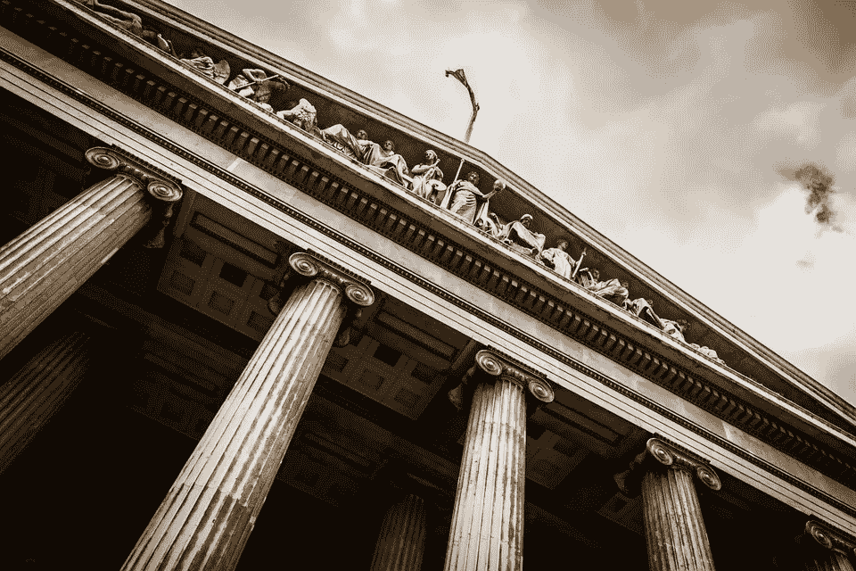

# 八国政府如何应对区块链

> 原文：<https://medium.datadriveninvestor.com/how-eight-governments-are-responding-to-blockchain-64dadb1ce375?source=collection_archive---------4----------------------->

虽然许多人很难在脑海中区分加密货币和区块链，但它们并不是同义词。事实上，世界上几个高度监管或完全禁止加密货币的政府实际上是区块链技术的口头支持者。他们了解它解决许多重要问题的巨大潜力，并热切地探索它的用例及应用。

第一代分布式账本技术(DLT)主要用于实现著名/臭名昭著的加密货币，包括比特币和莱特币，而六年后出现的第二代 DLT 实现了第一个智能合约，旨在超越纯粹的象征经济学，进入新的未知领域。区块链的后代着眼于医疗保健、身份认证和管理、税收、选举诚信、安全银行和其他领域。

# 迪拜

迪拜酋长国是阿拉伯联合酋长国的一部分，是一个巨大的旅游目的地。不像它的许多邻国，它是一个石油贫乏的国家，相反，它的经济依赖于房地产开发和豪华旅游的收入。迪拜目前拥有世界上最高的建筑，160 层的迪拜塔，以及包含室内滑雪场的购物中心。为了处理与旅游业相关的所有文件，其领导人表示，希望成为第一个由区块链掌权的政府，并确定 2020 年为实现这一目标的目标日期。

# 中国

该国尽最大努力遏制甚至禁止加密货币的购买、出售和交易，但在拥抱区块链技术方面进展迅速而有力，甚至将区块链的经济价值描述为“比互联网的经济价值高十倍”说实话，按收入、利润、资产和市场价值计算，世界上最大的五家公司中有三家是中国公司，并且都坚定地承诺采用 DLT 来存储和管理大量的文档、支持现有的商业投资、实现新的业务合作伙伴关系以及简化内部运营。

# 直布罗陀

直布罗陀一直是英国的领土，西班牙也宣称对其拥有主权。直布罗陀正试图成为总部位于区块链的金融科技公司的全球中心。根据一份官方声明，直布罗陀区块链交易所(或称 GBX)是直布罗陀证券交易所的子公司，旨在成为“世界领先的机构级令牌销售平台和数字资产交易所”。他们“试图为密码行业创造一个信任、开放和全球接受的新时代，一次一个优质的令牌列表。”直布罗陀的明确目标是成为加密货币商务的国际门户，特别关注投资者安全和监管方面的行业最佳实践。

# 瑞士

另一个对区块链技术进行大量投资的欧洲小国，它是区块链巨人以太坊的所在地。根据 BlockShow Europe 2018 对 48 个欧洲国家的调查，它在创办区块链公司的最佳地点中排名第一。它在楚格州建立了首批加密货币中心之一“加密谷”，被描述为“一个全球中心，新兴的加密、区块链和其他分布式账本技术和业务可以在一个安全、支持和充满活力的环境中蓬勃发展。”更不用说它还是区块链投资者的免税天堂。

# 爱沙尼亚

在东欧，也是 Skype 的发源地，它是最早开始探索政府使用 DLT 的国家之一，其努力可以追溯到 2008 年(在比特币发布之前)，并在 2012 年使用第一个区块链解决方案来支持其政府活动。爱沙尼亚的 DLT 也让公民对自己的数据有更多的控制权。例如，每个公民都可以即时、透明地访问自己的健康记录，并且能够看到谁在何时、出于什么目的访问了这些记录。政府本身计划发行自己的国家加密货币 ESTcoin，其中将包括第一个政府支持的 ICO。

# 联合王国

几年前，英国加入了这场竞争，开始计划将区块链技术整合到政府中，主要是为了减少其主要由纸张驱动的流程中的错误、腐败和欺诈。DLT 现在被用来记录福利支付和学生贷款的发放。但这仅仅是开始。政府的技术机构“创新英国”(Innovate UK)正在寻求区块链技术来改善政府在各种应用领域的业务流程，包括金融科技和医疗保健。

# 新加坡

这个亚洲城市国家自诩为区块链创新发展的中心，政府最近拨款超过 2 . 25 亿美元将 DLT 纳入其政府运作。北欧国家也表达了类似的意图，瑞典央行计划在两年内发行数字货币，丹麦也计划发行自己的克朗代币。虽然用于支持这些货币的确切技术尚未确定，但 DLT 解决方案是一个很好的可能性。

# 美国

不用说，美国政府行动缓慢。例如，看看美国向云计算过渡的缓慢步伐。每个机构内部都存在繁琐的官僚主义、极其繁琐的采购流程，以及严重的安全担忧，所有这些都阻碍了采用新技术的进程。然而，亡羊补牢，联邦政府终于来了。

第一个授予区块链技术合同的机构是国土安全部。这笔钱很少——只有 19.9 万美元——然而，它标志着对 DLT 态度转变的开始。DHS 希望提高从美国边境的传感器和设备获取数据的速度、准确性和安全性。目标是限制设备中记录被破坏的可能性，使其更难被欺骗。

去年，美国食品和药物管理局发布了一份“寻找来源”通知，寻找区块链的一项申请，以“在美国重大疾病和损伤追踪小组网络内实现患者级数据的交换”该项目的主要重点是在 FDA 和美国危重病和损伤试验(USCIIT)小组之间交换流感患者数据，该小组由美国国立卫生研究院资助。

甚至国防部也加入了进来。其运输指挥部希望区块链提高其物流和运输交易记录的安全性和准确性。

# 全球利益

虽然区块链可能已经开始成为加密货币的发展之路，但它作为一项创新技术的真正潜力直到现在才被认识到，这项技术可以改善生活的几乎每个方面。国际商务世界可能是早期采用者，但世界各国政府也纷纷效仿。看着吧，最好的还在后面。

**关于雪球**

雪球是第一个智能加密投资自动化(SCIA)平台，能够访问专业策划的投资组合，让每个人都像合格的投资者一样投资。

作者:

Parul Gujral, CEO-Snowball

*最初发表于*[T5【themarketmogul.com】](https://themarketmogul.com/8-governments-responding-blockchain/)*。*