# 爱因斯坦求和的工作原理及其在深度学习中的应用

> 原文：<https://medium.datadriveninvestor.com/how-einstein-summation-works-and-its-applications-in-deep-learning-1649f925aaae?source=collection_archive---------1----------------------->

# 介绍

在本文中，我将解释如何使用爱因斯坦求和来执行常见的矩阵运算。我首先通过一些简单的例子来说明符号是如何工作的，并以一个实际的深度学习应用程序来展示这种方法的好处。我假设读者知道 [numpy](https://docs.scipy.org/doc/numpy-1.15.1/reference/generated/numpy.einsum.html) 、 [PyTorch](https://pytorch.org/docs/stable/torch.html?highlight=einsum#torch.einsum) 或 [TensorFlow](https://www.tensorflow.org/api_docs/python/tf/einsum) 中的 einsum()函数。

 [## 用 7 个步骤解释深度学习——数据驱动投资者

### 在深度学习的帮助下，自动驾驶汽车、Alexa、医学成像-小工具正在我们周围变得超级智能…

www.datadriveninvestor.com](https://www.datadriveninvestor.com/2019/01/23/deep-learning-explained-in-7-steps/) 

复制简单示例的代码是这里的**而复制实际示例的代码是这里的。**

# **爱因斯坦求和的定义**

**根据[维基百科](https://en.wikipedia.org/wiki/Einstein_notation)，爱因斯坦求和是一种符号约定，用于简化公式中一组索引项的求和。例如，我们通常将两个三维向量之间的点积写为:**

**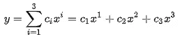**

**使用爱因斯坦求和，这可以简化如下:**

**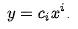**

**正确书写爱因斯坦求和的关键是理解其规律。下面几节将通过一些例子来理解这些规则的突出方面。之后，你可能想阅读 [numpy 文档](https://docs.scipy.org/doc/numpy-1.15.1/reference/generated/numpy.einsum.html)以获得更全面的描述。**

# **简单的例子**

## ****转置矩阵****

**假设你有一个矩阵 **A** 定义如下:**

**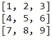**

**你想转置它得到:**

**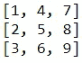**

**数学上，你可以这样写:**

**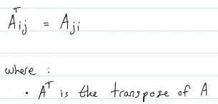**

**这读作 A 的转置中第 I 行第 j 列的元素是 **A** 的第 j 行第 I 列的元素。**

**如果您想在 PyTorch 中使用 einsum()来执行这个转置，您可以按如下方式编写它:**

**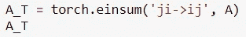**

**这告诉 PyTorch， **A_T** 的第 I 行第 j 列的值等于 **A** 的第 j 列第 I 行的值。**

**注意，我们在'--> '的右边指定了输出的索引，而'--> '左边的任何内容都告诉 PyTorch 如何根据 **A** 中的元素获得该值。**

## **提取矩阵的对角元素**

**继续前面的例子，假设您想要提取 **A** 的对角元素，即给定:**

****

**您希望拥有:**

**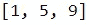**

**从数学上来说，你可以这样写:**

**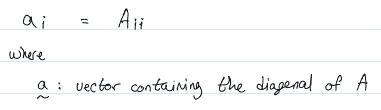**

**在 PyTorch 中使用 einsum()翻译成:**

**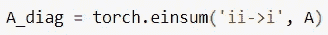**

**这告诉 PyTorch，要获取 A_diag 的第 I 个元素，只需获取 A 的第 I 行第 I 列的元素。**

## **对矩阵的对角元素求和**

**现在假设你想对 **A** 的对角元素求和。从数学上讲，这看起来如下:**

**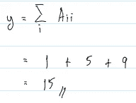**

**这相当于 PyTorch 中使用 einsum()的以下代码:**

**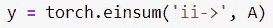**

**注意，与前面的例子不同，我们没有为输出指定任何索引('--> '的右侧)。这是有意义的，因为我们的输出是一个标量，所以给它分配任何索引都没有意义。因此，'--> '的左侧将导致 PyTorch 迭代矩阵 **A** 以提取对角线(因为我们指定了' ii ')，并通过求和将这些元素折叠成一个标量，这与我们想要的一致。**

**这个例子演示了下面的爱因斯坦求和规则:**

**如果一个索引出现在'--> '的左侧而不是右侧，那么由该索引从相应的输入矩阵中提取的任何元素(例如 **A** )将通过这些元素的求和折叠成一个标量。**

**基于这一规则，应该不难看出:**

**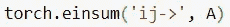**

**将对 **A** 中的所有元素求和。**

## **转置矩阵乘法**

**假设你有两个 3×5 矩阵 **A** 和 **B** 其中 **A** 是:**

**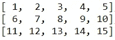**

**而 **B** 是:**

**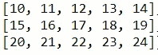**

**如果目标是通过将 **A** 乘以 **B** 的转置来生成矩阵 **C** ，那么 PyTorch 中的一种方法是:**

**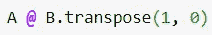**

**或者，这可以使用 einsum()来完成，如下所示:**

**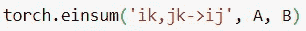**

**注意'--> '的左边有一个逗号。在一个 einsum 表达式中，逗号用于分隔不同输入矩阵/向量的索引(如 **A** 和 **B** )。**

**要构建“ik，jk -> ij”，您需要认识到 **C** 将是一个 3 x 3 矩阵，并且 **C** 中的每个元素计算如下:**

**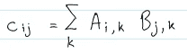**

**换句话说，这表示在 C 的第 I 行和第 j 列中的元素是通过使用一个我们称之为 k 的自由变量(根据构造，范围从 1 到 5)迭代第 I 行的 **A** 和第 j 行的**B**j。在 k 的每一步，我们将从 **A** 和 **B** 中提取的元素相乘。在 k 的末尾，我们将所有乘法的结果相加。**

**此示例显示您可以通过以下步骤构建正确的 einsum 表达式:**

1.  **写出你想用指数和及乘积来执行的运算**
2.  **将等式左侧的索引映射到'-> '的右侧，将等式右侧的索引映射到'-> '的左侧**

**希望这张图表能阐明您需要采取的步骤:**

**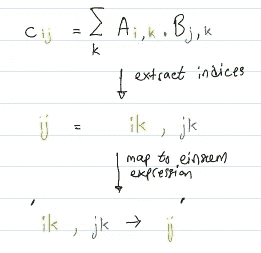**

## **列式点积**

**让我们用一个更复杂的例子来结束这一部分。**

**假设你有矩阵 **A** 定义为:**

**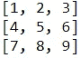**

**并且矩阵 **B** 定义为:**

**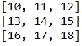**

**你想产生一个向量 **c** 如下:**

**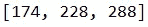**

**其中 **c** 的第 I 个元素是 **A** 的第 I 列和**b**的第 I 列的点积**

**你可以用下面的一和求和来实现:**

**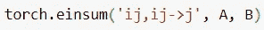**

**因为使用前面示例中描述的步骤:**

**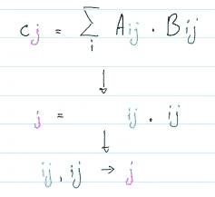**

# **实际例子**

## **利用相对位置表征有效实现自我注意**

**[Shaw 等人(2018)](https://arxiv.org/pdf/1803.02155.pdf) 介绍了一种变压器的自我关注机制，该机制采用一种称为相对位置表示的新型位置编码。这种机制的细节超出了本文的范围。感兴趣的读者可以参考[这篇](https://medium.com/@_init_/how-self-attention-with-relative-position-representations-works-28173b8c245a)博客文章，详细解释这个机制是如何工作的。**

**在这一节中，我们对论文中描述的一批输入的注意机制的计算细节感兴趣。更具体地说，我们希望实现以下等式的高效批处理版本:**

**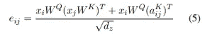**

**我们将把注意力集中在分子上，因为分母只是一个标量。分母是两项之和，即:**

**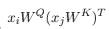**

**和**

**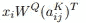**

**第一项只是 word i 的查询向量与 word j 的关键向量的点积。第二项是单词 I 的查询向量与单词 I 和单词 j 之间的相对位置嵌入的点积。**

**对于一批输入，输入的查询向量将是一个具有形状(批量大小、注意头数量、序列长度、嵌入大小)的张量，它也是输入的关键向量的形状。另一方面，相对位置嵌入是一个形状张量(序列长度，序列长度，嵌入大小)，这样(I，j，:)将给出单词 I 和 j 之间的相对位置嵌入。**

**计算一批输入的第一项仍然很容易，因为这相当于单一矩阵乘法。然而，第二个任期更具挑战性。作者们使用了一些张量整形技巧来实现它。下面是它在[代码](https://github.com/tensorflow/tensor2tensor/blob/9e0a894034d8090892c238df1bd9bd3180c2b9a3/tensor2tensor/layers/common_attention.py#L1556-L1587)中的样子:**

****

**这是使用爱因斯坦求和的代码:**

**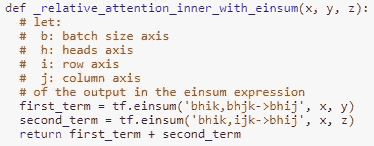**

**注意，使用爱因斯坦求和，我们只需要两行代码(一项一行)。相比之下，最初的实现需要多行代码，因为计算第二项需要几次张量整形和转置操作，这些操作需要在以后撤消以获得正确的形状。**

**接下来，我将解释爱因斯坦求和实现背后的逻辑。对*第一学期*的计算应该看起来很熟悉。这是前一节描述的使用转置进行矩阵乘法的批量版本。关于*第二项*，可以用下面的例子来理解它的 einsum 表达式:**

**让:**

*   ****Q** : a (b，h，10，3)查询张量其中 b 表示批处理轴，h 表示头轴。在这个例子中，给定头部的一批输入是 10 个单词的序列，其中每个单词是 3 维向量。**
*   ****E** :相对位置编码的(10，10，3)张量，其中(I，j，:)将给出单词 I 和 j 之间的相对位置编码。注意，每个相对位置编码也是一个三维向量，以便与 **Q** 中的单词维度一致。**
*   **R :一个张量，它将包含我们所寻求的结果**

**我们的目标是遍历 **Q** 中的每个单词，并将其与 **E** 中的所有相对位置编码点积，例如，将 **Q** 中的所有单词 1 与单词 1 和 1、单词 1 和 2、单词 1 和 3 等的相对位置编码点积。这意味着 **R** 必须是形状为(b，h，10，10)的张量，并且 **R** 中的每个元素可以计算如下:**

**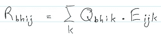**

**这允许我们导出 einsum 表达式如下:**

**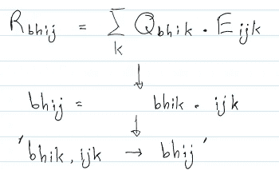**

## **基准**

**我计算了使用作者的原始实现和 einsum 实现计算分子所需的时间，方法是在 Google Colab 上用 GPU 运行时运行它们。以下是最初实现的结果:**

**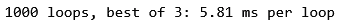**

**这是 einsum 的实现:**

**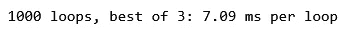**

**einsum 实现仅略微慢了约 1 ms，但是，如果我们仅考虑计算第二项所需的时间，则差异会变得更小。以下是最初实现的时间:**

**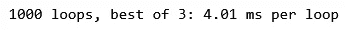**

**下面是相应的 einsum 实现的时间:**

**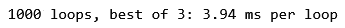**

**我认为这表明，与单个张量运算(如张量乘法)相比，einsum 通常更慢。然而，如果我们使用 einsum 来代替多个张量运算，例如在计算 *second_term* 时，那么相对于使用内置张量运算，它的性能是非常有竞争力的。**

# **结论**

**在本文中，我展示了如何使用爱因斯坦求和在 PyTorch 和 TensorFlow 中执行常见的矩阵运算。我们已经看到，与使用内置函数编写一系列张量运算相比，爱因斯坦求和产生的代码更少，性能损失可以忽略不计。此外，使用爱因斯坦求和法编写的代码可读性很高，而且非常简洁。**

**如果你有任何问题，请在评论中告诉我。**

# **参考**

**[爱因斯坦符号](https://en.wikipedia.org/wiki/Einstein_notation)；维基百科。于 2019 年 4 月 21 日访问。**

**[自我注意与相对位置表征](https://arxiv.org/pdf/1803.02155.pdf)；肖等人 2018。**

**[Einsum 是你所需要的全部——深度学习中的 Eintein 求和](https://rockt.github.io/2018/04/30/einsum)；洛克特尔。2018.**

**[Numpy 的一个基本介绍](http://ajcr.net/Basic-guide-to-einsum/)；ajcr。2015.**

**[爱因斯坦用 Numpy 求和](https://obilaniu6266h16.wordpress.com/2016/02/04/einstein-summation-in-numpy/)。比拉纽克。2016**

**[自我注意与相对位置表征如何工作](https://medium.com/@_init_/how-self-attention-with-relative-position-representations-works-28173b8c245a)；__.2019.**