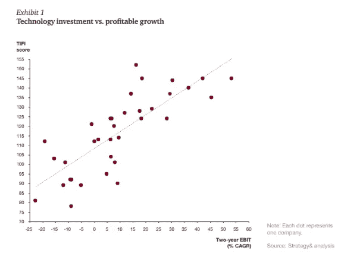
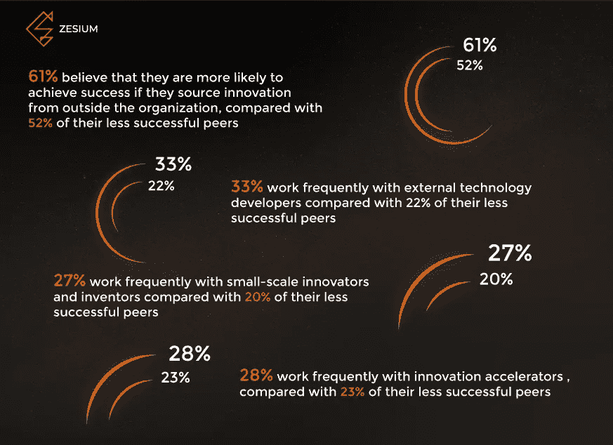
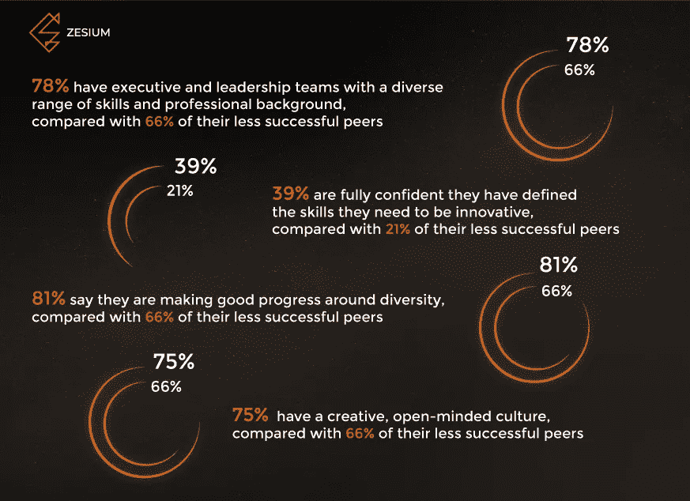

# 企业如何创新？

> 原文：<https://medium.datadriveninvestor.com/how-enterprises-innovate-efc04268f2ba?source=collection_archive---------13----------------------->

> *“创新的目的是用新的或更好的产品、更高效的流程或增强的商业模式来不断发展和更新企业，”*沃尔特·范·戴克

新技术为企业创新提供了机会。创新总是有助于推动企业家的创造力。但是创新不仅仅是引入新技术。公司正在重新定义他们的工作，变化发生得非常快。

尽管如此， [PA 咨询集团](https://www.paconsulting.com/insights/2016/innovation-hub/)的研究显示，太多的公司错过了创新的机会。66%的参与者确认他们的组织没有创新将无法生存，但只有 24%的人完全相信他们已经定义了创新所需的技能和活动。此外，50%的人认为他们的领导人没有充分展示创新所需的远见和激情。尽管近年来发生了变化，特别是在技术方面，37%的人说他们的组织没有对其创新方法做出任何改变，或者只有很小的改变。

# **什么是创新？**

业务创新是为客户和公司创造新的价值。它可能是关于使用一种新的商业模式，改善客户体验或改变你将产品或服务推向市场的方式。所有这些领域都可以通过创新得到改善。每一项业务创新都应该改进现有的服务、产品或流程，解决企业存在的问题或接触新客户。

巴勒斯坦权力机构的研究表明，许多企业错过了这个机会，似乎不愿意这样做。尽管他们周围的技术、业务和社会发生了快速变化，但 37%的人表示他们的创新方法在过去三年中没有发生任何变化，或者变化很小。这意味着他们的速度太慢，跟不上不断变化的业务需求，并且浪费了时间和精力。

# **为什么企业会错过创新的机会？**

在最近一项针对以开发扰乱市场的新产品和服务为核心使命的企业的研究中，54%的企业表示他们经常拒绝这些颠覆性的想法，尽管他们知道这些想法有巨大的潜力。阻止企业涉足未知领域的一些原因包括害怕犯错、认知偏差、管理风险和规避风险的文化。

与他们不同，创新领导者清楚地知道他们在哪里创造价值，并根据这一核心目标来安排他们的创新重点。这些可以是比竞争对手更快地将产品推向市场，增加客户数量，为您的客户提供最佳用户体验。

这些目标听起来显而易见，但许多企业做出了错误的努力，混淆了优先事项，导致 39%以增长为核心目标的组织在开发新的收入来源以降低成本上花费的时间和精力与他们在创新上花费的时间和精力一样多。

# 敏捷技术有什么帮助？

越来越多的创新领导者开始在他们业务的所有领域使用[敏捷](https://www.cprime.com/resources/what-is-agile-what-is-scrum/)思维。这使他们能够在大型组织中实现更多、更快的变化并提高采用率。

许多企业没有很好地孵化想法，因为他们不能提供合适的组织环境来培育和加速他们的成功。IT 架构可以支持或限制敏捷性。正确的技术、流程和商业灵活性对于支持敏捷环境至关重要。

企业将[孵化视为其核心优势之一](https://www.paconsulting.com/insights/2016/innovation-hub/) : 51%的企业称自己“非常擅长”扩大创新，相比之下，39%的企业称自己不太成功。创新领导者也更擅长治理，包括扼杀不起作用的项目:54%的成功创新者认为扼杀项目的能力是核心优势，而在不太成功的同龄人中，这一比例仅为 40%。这些项目可能持续数年，耗费投资、精力、领导时间和善意。消除它们是保持创新活力的重要部分。

根据[普华永道报告](https://www.strategyand.pwc.com/media/file/Maximizing-the-value-from-technology-investments.pdf)，投资规模和财务表现之间没有直接关系。然而，当投资与公司的目标能力相一致，并得到正确的运营模式和实施技能的支持时，盈利增长与投资有很强的相关性。普华永道开发了技术投资健康指数(TIFI)作为这一分析的一部分。其功能是对公司在识别和优先化 IT 计划以确保高商业价值实现方面的有效性进行评分。如下图所示，指数得分较高的公司更有可能成功地将 IT 投资转化为有意义的商业价值(以两年的 EBIT 增长来衡量)。

# **构建创新网络**

对于企业来说，创新被认为是漫长而昂贵的，但事实并非如此。在你的企业之外，有大量的公司可以帮助你进行创新。每年都有数十亿美元投入到寻找新的有价值的产品、解决方案和服务中。创业公司、投资者和加速器每天都在创造新的未来和创新。这是创新领导者认识到的事情——61%的人说，如果他们从外部获得一些创新，他们更有可能取得成功。

因此，为了从投资中获得最大收益，有必要将一些企业资源提供给外部方。企业意识到他们不能自己做所有的事情，需要在组织之外建立一个合作伙伴网络。

这些企业认识到，他们花的每一美元都有回报，即使他们看不到有形的投资回报。回报的形式可以是增加对合作伙伴的信任，为他们的团队带来新的人际交往技能，或者仅仅是对他们的创新努力更有信心和动力。

# **给创新领导者的建议**

从 PA Consulting Group 的“创新问题”研究中收集的见解已被合并为“创新领导者”的四个关键特征这些是:

*关注未来*

认识到哪些快速涌现的技术和业务模式对您的组织现在和未来都有价值。确保创新围绕您的客户设计，激励您的员工并鼓励所有人创新。

*将创新设计融入您的组织*

使您的创新目标与您组织的核心目标保持一致，并设计创新框架，将想法快速转化为行动。在业务的所有领域使用敏捷思维——从最初的业务案例一直到扩大规模和商业化。

*创造创新文化*

确保创新能够在您的组织中蓬勃发展。创造一种文化，保护和表彰创新者，奖励创新失败并从中学习，并投资吸引和留住新人才。

*构建创新网络*

在你的组织之外建立一个伙伴关系网络，让你能够学习。创建思想网络，使员工和合作者能够自由尝试新的创造性方法。

# **总结…**

正如史蒂夫·乔布斯所说,*创新区分领导者和跟随者,*由企业决定他们想成为什么样的人。