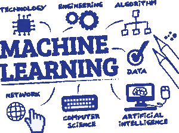

# 大学学位对找到高薪工作有多重要？？？

> 原文：<https://medium.datadriveninvestor.com/how-essential-is-a-university-degree-for-finding-a-job-2cca80e975b5?source=collection_archive---------12----------------------->

*围绕 ***数据科学*** 的*热潮已经吸引了很多计算爱好者，对数据科学专业人才的需求似乎与日俱增。

> 此外，熟练专业人员的可用性和需求之间的差距相当大，这使得它更是一个令人兴奋的职业道路。

*在*这个场景中，如果你正打算踏入数据科学领域，那么对于 [***事业***](https://en.wikipedia.org/wiki/Business) **或者** [***事业***](https://magnimindacademy.com/all-courses/data-science/) 应该遵循哪些步骤？你真的需要大学学位才能在这个领域找到一份体面的工作吗？在这篇文章中，我们试图确定大学学位是否是绝对必要的。

 [## 零工经济如何改变未来的就业前景——数据驱动的投资者

### 随着自动化的发展和 Z 世代的出现，劳动力的构成和动态正在发生变化…

www.datadriveninvestor.com](https://www.datadriveninvestor.com/2018/12/19/how-is-the-gig-economy-changing-the-future-jobs-landscape/) 

但是在我们开始之前，这里有一些你在继续之前必须问自己的问题。

*   你喜欢编程和统计吗(**编码、数据科学、机器学习**等)？
*   你会接受在数据科学领域找一份工作吗，即使薪水一般？
*   你想在一个需要不断学习最新技术( **AI、区块链**等)的领域工作吗？

如果你对所有这些问题的回答都是“是”，那么你就在正确的轨道上。

首先，数据科学需要的最简单的解释是积累、分析和解释数据的*过程*——所有这些都有技术的帮助。那么，作为一名数据科学专业人员，你实际上会做些什么呢？

# 可能的工作职责

*你可能会*通过对大数据实施 ***机器学习*** 来解决不同的问题。以下是一些例子:

*   识别 [***数据异常***](http://jhigh.co.uk/Higher/dbases/anomalies.html)
*   预测客户取消订阅的可能性
*   将客户分成相关的群组，以及
*   计算收入预测等

除了不断学习和适应，你还需要在统计、数学和编码方面有坚实的基础。让我们稍微详细地看一下这些技巧。

# 关键技能

## 1-统计

[***统计***](https://en.wikipedia.org/wiki/Statistics) 是**数据科学**的一部分，处理*分析和解释数据*。对统计学中使用的方法有充分的理解将有助于你测量概率，概率是指事件发生的可能性。这些 [***现象***](https://dictionary.cambridge.org/dictionary/english/phenomena) 有助于解读未来技术(就像***AI、机器*** ***学习***……)

## 2-数学

*核心*数学基础作为学习 ***成为数据科学专业*** 所需其他重要技能的基础。你应该能自如地处理数学概念。这些概念；

*   线性代数，
*   回归，
*   概率论，
*   核心 ML 方法，
*   数值分析。

如果你有一颗务实的心，你可能会发现在数据科学的*环境中数学更令人愉快*，数据代表现实世界的概念 [***跳板数据科学评论***](https://www.techpoweredmath.com/springboard-data-science-review/) 。

## 3-训练营中的编码

如果你知道数据交流的语言，你就只能理解一个分类良好的数据块。一个好的程序员可能不是一个*数据科学专家*，但是一个*数据科学专家*肯定是一个好的程序员。当你参加硅谷知名专业讲师 [***的*** 六周数据科学，你会有一个美好的未来。](https://www.siliconvalley.com/)

 [## 如果你破产了，如何学习数据科学

### 去年，我自学了数据科学。我从数百个在线资源中学习，学习了 6-8 个小时…

towardsdatascience.com](https://towardsdatascience.com/how-to-learn-data-science-if-youre-broke-7ecc408b53c7) 

# 结论

A *part* 综上所述，有一些显而易见的技能，如对数据库的透彻了解、数据管理(俗称**数据争论**)、**机器学习**等，这些都是成为数据科学专业人士所需要的**。**

虽然获得数据科学的大学学位是进入该领域的快速而可靠的方式，但也有一些机构和公司提供数据科学专业和基础的在线课程( ***如 Magnimind Academy*** )。

当谈到*如何在数据科学*领域进行面试时，你可能会发现一些公司明确提到他们只会鼓励拥有大学学位的求职者。然而，许多公司更愿意雇用在该领域有足够知识的候选人，即使他们没有大学学位。

 [## 马格尼明德学院

### 数据是有价值的信息。你准备好了解更多了吗？点击 https://buff.ly/2R6QY2B #有价值的#知识…

www.facebook.com](https://www.facebook.com/magnimindacademy/photos/a.256868294982447/297587640910512/?type=3&theater)  [## 大学学位对于在数据科学领域找工作有多重要？-马格尼明德学院

### 。。围绕数据科学的讨论越来越多，已经吸引了许多计算爱好者和对数据科学的需求。

magnimindacademy.com](https://magnimindacademy.com/how-essential-is-a-university-degree-for-data-science/) 

> *订阅接收* [*我们的顶级故事在这里。*](http://eepurl.com/gjDwwP)