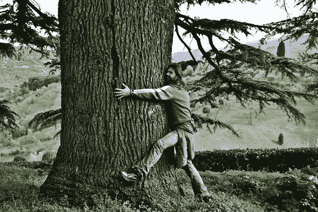
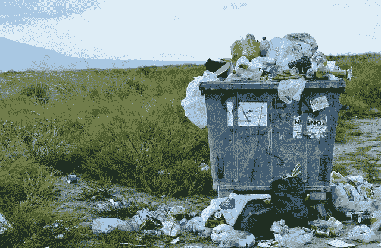
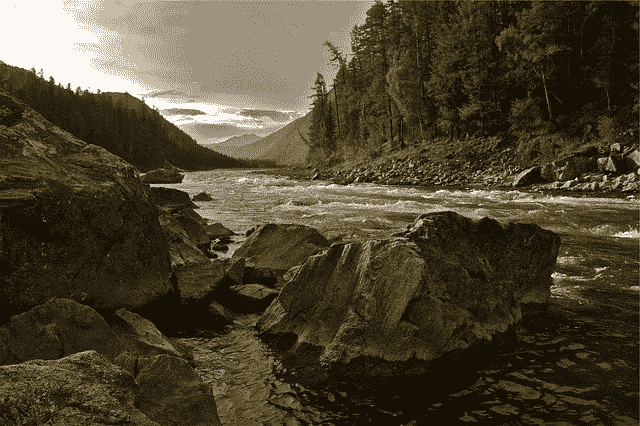

# 道德 ETF 有多道德？贝塔股评论

> 原文：<https://medium.datadriveninvestor.com/how-ethical-are-ethical-etfs-betashares-review-7d235dd5b1e7?source=collection_archive---------2----------------------->

我们最近发表了一篇文章，提出了一个问题:你是否能确定自己是一个道德投资者。

我认为，即使你想成为一名道德投资者(而且有充分的理由超越温暖模糊的感觉)，你也永远无法完全确定自己是。这主要归因于价值链的不透明——稍后会有更多介绍。

 [## 算法交易的机器学习|数据驱动的投资者

### 当你的一个朋友在脸书上传你的新海滩照，平台建议给你的脸加上标签，这是…

www.datadriveninvestor.com](https://www.datadriveninvestor.com/2019/01/30/machine-learning-for-stock-market-investing/) 

在发表了那篇文章后，读者 Jeremy 建议写一篇关于道德投资的实用性和道德 ETF(交易所交易基金)的文章会很棒。这正是我们今天要做的。

我们将看看由 BetaShares 管理的两只道德 ETF——ASX:ETHI(投资于国际股票的精选名单)和 ASX:FAIR(澳大利亚精选版)。

我们将看看为什么道德投资如此困难，这些交易所交易基金投资什么，也看看他们给出什么样的回报。毕竟我们都想赚钱，对吧？

# 什么是道德投资？

现在，让道德投资站在道德的*一边几乎是不可能的。你个人的道德准则和我不一样，更别说其他人了。*

显而易见的是，人们越来越愿意做出合乎道德的投资决定。在澳大利亚，[几乎一半的管理基金](https://www.afr.com/business/banking-and-finance/ethical-investments-soar-to-nearly-1-trillion-20190702-p5239b)被归类为“负责任”投资。事实上，我们自己的极不科学的 Twitter 民意调查发现，67%的受访者愿意放弃一定程度的投资回报，因为他们知道这是一个道德选择。

虽然有些人会避免投资军火公司，但枪支爱好者会喜欢拥有一部分他们最喜欢的品牌。那么谁对谁错呢？你如何界定什么是道德投资？

可以理解，这是一个黑暗的世界，涉及到不同的道德筛选门槛。决定单个公司、基金和指数是否符合他们的个人道德标准，这最终取决于个人投资者。

一般来说，涉及枪支、烟草、热矿和不可再生能源等行业的公司会被筛选掉。其他领域包括动物福利、色情和赌博。

此外，还有其他一些更难调查的因素。

在能源领域，范围 1、2 和 3 的排放与公司及其产品的能源使用有关。范围 1 的排放是由一家公司直接产生的——比如说从地下挖煤的公司。范围 2 的排放是指燃煤发电所产生的排放(这也是你期望人们对煤所做的事情)。范围 3 的排放是电力的使用方式(可能是从为医院供电到运行麻醉实验室的任何事情)。

单个公司对他们的产品有多大的责任？

在我看来，这归结为老炮不杀人，人杀人的论调。

因此，如果你真的想深入了解一家公司的道德规范，想想一家公司涉及哪些产品和服务，以及如何使用它们。

但更糟的是。

公司融资是一个难以探索的黑暗领域。谁资助他们，谁资助 T2 他们？这是一个竞争激烈的领域，在一个充满信托、子公司和海外避税天堂的世界里，除非是世界级的法务会计师，否则几乎不可能知道到底谁从一家公司中受益。

Think ethical investing is about tree hugging? It can be, but environmental stocks are just part of the picture.

# 价值链和道德投资

我之前提到过价值链，在我看来，价值链是道德投资中最难的部分。

价值链是将产品推向市场的各个步骤。例如，你认为投资苹果农场是道德投资吗？它们以健康的方式帮助人们进食；苹果树吸收大气中的二氧化碳，一些人有了工作——都很好，对吗？

这不一定那么简单。

那个农场从外部公司采购化肥和杀虫剂之类的东西(如果它是一个不使用化学品的有机农场，它可能会有较低的作物产量——所以这是一种道德上有效的土地利用吗？).这些产品本身可能对环境或人类有害，而那些供应商可能对他们的员工不好。

农场本身可能已经清理了土地(以一种完全合法的方式)，砍伐了为动物和昆虫提供栖息地的树木。

农场生产的苹果可能会通过一家使用旧卡车的公司运输，这些旧卡车不仅维护不善——危及卡车司机的安全——而且还污染环境。

一旦苹果到达城市销售，它们将在超市出售，超市由像 Woolworths 这样的公司拥有，该公司还有其他商业利益，如酒精和游戏(尽管他们已经宣布他们[将离开这个地区](https://www.abc.net.au/news/2019-07-03/woolworths-to-pull-the-plug-on-pokies-and-pubs/11273802)——但毫无疑问将保留对新实体的兴趣)。

如果你认为这是一种延伸，那么它实际上只是对复杂的价值链的一点皮毛。

澳大利亚公司(以及其他领先国家的公司)大多受到良好的监管，并被要求履行一定程度的环境和社会责任。然而，有各种各样合法的行业会造成伤害。

但更重要的是，我们现在生活在一个全球化的世界中，并不是每个国家都有道德优先事项，甚至不屑于口头上履行企业社会责任(CSR)。

开始发现问题了吗？是的，我的头也疼。

因此，考虑到这些因素，让我们来看看道德 ETF 贝塔股提供的，以及你必须考虑的。

让我们深入了解这两只道德 ETF 的具体细节。

# BetaShares 全球可持续发展领导者 ETF (ASX:ETHI)

BetaShares [ETHI ETF](https://www.betashares.com.au/fund/global-sustainability-leaders-etf/) 持有 100 家国际公司，于 2017 年 1 月推出，目前规模为 3.4 亿澳元。我没有以任何方式进入每个持有的公司(还记得价值链兔子洞吗？)，但我稍微探头探脑了一下，也看到了一些令人侧目，值得一说的东西。

ETHI 中最大的一只股票是苹果，它实际上是我一直在谈论的一个很好的例子。

你很有可能正在苹果电脑、笔记本电脑、手机或平板电脑上阅读这篇文章，这些电脑的零部件和劳动力来自世界各地，只是为了把它们送到你的手中。这是给*一个*产品的。

例如，该技术可能由苹果公司开发，但也可能由签约公司在第三方国家建造，可能使用海外制造的材料，可能使用从冲突地区或环境法规宽松地区开采的原材料。无论如何，苹果对中国工人权利的侵犯也是众所周知的。

## 苹果案例研究

我联系了 BetaShares 询问此事，值得称赞的是，他们很乐意回答为什么苹果被包括在内，以及选择投资的标准是什么。BetaShares 联合创始人兼战略主管伊兰·伊斯雷尔斯塔姆(Ilan Israelstam)表示:

“多年前，苹果公司在对待工人和环境足迹方面名声不佳。这导致消费者和投资者的反弹，给苹果带来了很大的压力，要求其表现更好，他们的回应是大力投资，改变其运营方式，提高其透明度和环保做法。

“如今，苹果在气候影响方面处于领先地位，并且在技术透明度和供应链管理方面享有最佳声誉。虽然它肯定不是完美的，尽管它的规模很大，但当发现问题时，它的响应速度令人难以置信，并且似乎真诚地按照其治理标准和策略行事。作为有道德的投资者，我们认为这是合理的，并且知道，通过投资苹果当前的活动，而不是惩罚它以前的不端行为，我们向科技行业的其他人证明，花时间和精力以符合道德的方式行事是有经济回报的。”

这*有点*令人欣慰(同时注意到最近发表的文章*链接到上面*显示还有*的*问题)，我同意关于证明道德努力有经济回报的声明是重要的。

## 其他 ETHI 控股公司

我还带着一些黑色幽默的娱乐注意到，在写这篇文章的时候，ETHI 最大的两家公司是万事达和维萨。

在这个个人理财领域，我们经常看到信用卡债务对人们的影响。这些公司只提供一种服务，而这种服务经常被人们滥用。但它给那些往往一无所知的人带来了无尽的痛苦，也给他们的家庭成员带来了间接伤害。精神食粮。

在研究指数中一些我不认识的公司时，我在 Vulcan Materials Company 网站上看到了一个露天开采的矿山，并深入挖掘了一下。不，他们不是在开采煤或铀，而是在挖掘集料材料，用于路基之类的东西。

他们正在造成环境破坏吗？是的。但是材料需要吗？也是的。

看看道德 ETF 面临什么？

# 澳大利亚可持续发展领导者 ETF (ASX:公平)

在撰写本文时，有 77 家公司持有 [BetaShares FAIR ETF](https://www.betashares.com.au/fund/australian-sustainability-leaders-etf/) ，该基金于 2017 年 11 月推出，目前规模为 3.2 亿美元。

比起海外公司，我对澳大利亚公司更熟悉，所以这对我来说更容易一些。再次感谢没有任何巨大的红旗。但是有些领域我可以很容易地唱反调。

FAIR 提供了对公司的投资，如良性股票，如 ASX(运营主要的澳大利亚证券交易所)，以及健康公司，如 CSL，声波医疗保健和耳蜗。然而，它也持有 Mirvac 和 Stockland，这两家公司开发住宅用地(以及其他)。作为其中的一部分，它们导致了城市扩张(这意味着人们需要[开更长时间的车去上班](https://hishermoneyguide.com/traffic-wasting-time-for-work-while-not-even-at-work))，以及本土野生动物栖息地的丧失。

他们的开发可能会超出市中心区域，即使他们不是在未开发的丛林地带进行建设，他们也会让更多的人进入以前没有的地区。这增加了人们接触野生动物的次数。在那种情况下，你不需要猜测哪一方会输。

像 Orora 这样的公司使用塑料、铝、玻璃和纸板来制作包装——这些东西不是由公司本身而是由消费者丢弃的。我知道这家公司在增加回收材料和可再生能源的使用方面取得了长足的进步——他们明白 CSR(企业社会责任)在其运营中的重要性。但是埃莉和我已经看到了像废弃瓶子这样的事情的影响。

同样值得一提的是，作为他们对我们的回应的一部分，BetaShares 表示，他们的投资有一个“性别多样性屏幕”。这意味着他们筛选掉董事会中没有足够女性代表的公司。因此，在严格的公司运营之外，对这些投资决策有一个“整体”的看法。如果你有回报意识，性别多元化不应该仅仅被视为平等问题，它有助于思想的[多元化，这有助于公司业绩。](https://www2.deloitte.com/insights/us/en/topics/talent/diversitys-new-frontier.html)

Ethical ETFs can look to invest in companies that *don’t do harm*, rather than do good.

# 道德 ETF 回报

我们将假设，如果你正在进行一项投资以实现[财务独立](https://hishermoneyguide.com/what-is-financial-independence)，你希望它能带来金钱收益。

那么，这些道德 ETF 与其他投资相比如何呢？

这里要注意的最重要的一点是，这两只 ETF 都只存在了很短的时间。他们还没有经历过像 GFC (2008 年)、网络泡沫(2001 年)或亚洲金融危机(1997 年)那样的大衰退。所以我们最多只能比较他们去年的直接收益。

我们将它们与一对先锋信托基金进行比较:[先锋澳大利亚股票指数 ETF](https://www.vanguardinvestments.com.au/retail/ret/investments/product.html#/fundDetail/etf/portId=8205/?performance) (ASX:VAS)与 FAIR 进行比较，[先锋摩根士丹利资本国际指数国际股票 ETF](https://www.vanguardinvestments.com.au/adviser/adv/investments/product.html#/fundDetail/etf/portId=8212/assetCode=equity/?overview) (ASX:VGS)与 ETHI 进行比较。这两只先锋 ETF 都存在了更长时间，所以比较长期回报是值得的。(注意:所有这些基金都是在 GFC 之后成立的，所以它们从未面临过任何*的重大阻力)。*

好，好，好。

我们可以看到，除了一个时期(FAIR 上个月的结果低于 VAS)之外，这两个道德 ETF 在每个时期都表现得更好。

惊讶吗？

在很多方面，我其实不是。我在我的退休金中持有长期的全球道德头寸(在过去的 6 或 7 年里)，它击败了我们所有其他的超级回报。因此，以年度为单位来看，看到这种情况并不令人震惊。

同样，围绕回报的警告是它们的短期性质，显然，全球股市最近一直处于大牛市。ETHI 可能永远不会返回 18.57%。VAS 及其 9.86%的回报率将更接近长期目标(我再说一遍，它还没有面临大规模的金融低迷)。

也就是说，看看 Argo Investments 这样的[上市投资公司](https://hishermoneyguide.com/changing-thoughts-on-shares)和他们的[2018 年年报](https://www.argoinvestments.com.au/assets/docs/asx-announcements/2018-Argo_Annual_Report-V1.pdf)，他们显示，作为一个案例研究，10，000 美元的投资在 15 年内(从 2003 年到 2018 年)的再投资总回报(包括邮资已付信贷)将为 306.9%，或 20.5%的年复合回报率。因此，或许 18%以上的长期回报率并不那么异想天开？

# 我们的道德投资偏好

如果这看起来像是我在抨击道德 ETF 的概念，我真的只想指出，在现实中，这比仅仅抛出一个绿色口号要难得多。

然而，与此同时，这两个道德 ETF 中没有任何公司让我感到愤怒。这份精选的名单比许多财富 500 强公司或 ASX 200 强公司要干净友好得多。

如果看起来我对投资有一种比你更神圣的态度，那将是一个错误。在澳大利亚方面，我们作为个人股东投资了本文中提到的一些公司。我们的投资组合中也有赌博公司的风险，而通过我们的上市投资公司持股和退休金，我们也有其他令人讨厌的角色的风险。

我们的态度通常是把“范围 3”的影响放在一边，因为如果人们对他们的产品做了错误的事情，公司是不负责的。

但是，即使我们刻意去做正确的事情，我们也不能保证它真的像广告中所说的那样。

在之前的[季度净值更新](https://hishermoneyguide.com/quarter-2-2019-net-worth-update)中，我提到我们最近进行了道德投资。

我们投资的一家公司使用低价值的稀土来改善环境水质。这是好事，对吧？是啊！

但除了投资搬起石头砸自己的脚，尽管我希望这是一项合乎道德的投资，*是吗？*

再来一次唱反调，挖那些低品位的稀土矿对环境有什么影响，那些员工的工作条件呢？我真的不知道。我*希望*有净收益，但我不能*保证*有净收益。你的底线在哪里？这由你决定。

埃莉和我不会不惜任何代价去赚钱，但是这种投资，尽管不确定性一直存在，却符合我们的要求。

So, beyond warm and fuzzy feelings, is it worth investing?

# 是否投资道德 ETF？

我们将考虑在未来进入道德 ETF，如 ETHI 和 FAIR(主要是 ETHI 作为一种国际多样化的形式，这是我们目前的投资组合所缺乏的)。然而，我们的核心投资理念是为我们的高收入提前退休提供资金的红利回报，而不是资本增长。

无论如何，正如我在[原始道德投资文章](https://hishermoneyguide.com/the-ethical-dilemma-of-investing/)中所说，通过投资，我们(和你)都在从事赚钱的生意。

如果你想做正确的事情，投资肯定不容易。

房地产开发商对私人司机撞上过马路的考拉不负责任，包装公司对有人把空罐头盒扔进排水沟不负责任。但是他们*参与了*，这些相当于他们的“范围 3”贡献。

尽管从根本上来说，这些都是人类的影响。

这两个道德基金包括一些我会毫不犹豫地称赞的公司和其他我可能会耸耸肩的公司。

但是，如果道德投资是首要考虑的，如果你是 ETF 的粉丝，这两只基金值得你考虑。

不管你是否对道德投资感兴趣，最重要的是你要尽快开始投资。

干杯，

*亚历克斯*

PS:公司的道德 ETF 投资是否符合你对道德投资的期望？

*原载于 2019 年 8 月 1 日*[*https://hishermoneyguide.com*](https://hishermoneyguide.com/how-ethical-are-ethical-etfs/)*。*