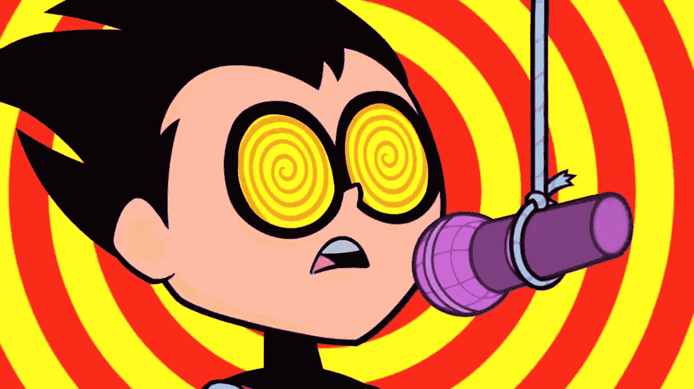
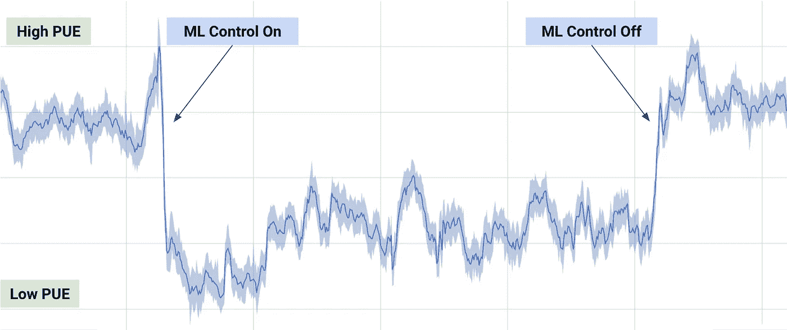

# 人工智能怎么会强迫你自杀

> 原文：<https://medium.datadriveninvestor.com/how-facebook-will-force-you-to-commit-suicide-ce9239bec1fe?source=collection_archive---------31----------------------->

想象几年后的未来。不是 50，但可能超过 5。

想象一下，看着一个屏幕，比如你的智能手机(或未来的等价物)，突然屏幕开始闪现令人眼花缭乱的图像、颜色、声音和文字。突然你觉得很难过。悲伤似乎不知从何而来，但它完全淹没了你。你无法移开视线，感觉被迫继续寻找。极度悲伤和绝望的感觉将你吞没，让你陷入情感黑洞。屏幕上显示的是图像、颜色、文字和形状的荒谬混合物。你觉得没有希望了。在一瞬间，你决定生活是无望的，并把自己扔在一辆汽车前，结束这一切。

From Fight Club

刚刚发生了什么？

你在看一个屏幕，比如你的智能手机，或者类似的东西。该屏幕配备了一个前置摄像头。一个运行复杂的情绪跟踪人工智能的应用程序正在观察你。它读取你的面部表情，并基于他人情绪的大型数据集，这个数据集由图像、视频和类似的数据点组成，再加上来自你的*个人*档案等的大量数据点。它，人工智能，以不可思议的精确度决定你当前的情绪状态。

接下来，它会快速连续或缓慢地向你展示单词、声音和/或颜色，以控制你的情绪。每秒钟有几千次，该算法评估你的情绪，并计算出将你推向“目标”感觉的最佳可能方式。人工智能决定向我们展示的东西不一定有意义，但它永远不会对我们产生预期的效果。我们不会知道为什么这些看似随意的单词、颜色和声音的组合会让我们感到如此悲伤，它们就是这样。与此同时，人工智能将继续评估你，并提供输入*，特别是*，旨在让你感觉越来越糟糕。一旦人工智能记录了你下降的情绪，它就会更努力地推动。

你的情绪现在被劫持了，就像一头被车灯照着的鹿，你无法动弹。数据集不是假的。作为一个物种，我们并不独特。恰恰相反，我们非常相似。我认为这也许值得特别关注。如果你给计算机输入足够多关于人类心理和我们情绪运作的信息，它最终会变得非常善于理解我们的感受。有了这种洞察力，它也会变得非常善于理解如何改变我们的情绪。

有了 10 亿人的情感反应，人工智能确切地知道向我们展示什么来引出想要的反应。而且从一个时刻到另一个时刻，以每秒几万亿次计算的速度运行，它会准确地知道*如何将你的感觉从一种状态转移到下一种状态。新西兰科学家[已经发表了成果](https://www.nzherald.co.nz/nz/news/article.cfm?c_id=1&objectid=12118327)，可以在你做之前的一瞬间预测你将要做什么。*

虽然我们可能喜欢我们有自由意志的古老观念；我们被赋予了某种缥缈、神秘的力量，让我们从“灵魂深处”做出决定。就像世界是平的这一观点一样，这一观点现在不得不接受严酷的现实(坦白地说，这有点伤人)。因为我很喜欢我不仅仅是一台肉做的机器的想法。)我们没有‘自由意志’。

在 DeepMind 的一篇博文中，他们解释了如何使用 ML 来降低他们一个数据中心的能耗。

The effects of letting the AI run the show for a little while

DeepMind 的文章解释了“为什么”,但在“如何”方面没有说太多。有人怀疑工程师们并不确切知道“如何”。这应该会吓到你。

这个故事的寓意是，有了庞大的数据集、极其强大的算法和无数万亿次浮点运算来运行它们，计算机很可能会选择我们似乎无法理解的路径，但在操纵我们方面做得比我们想象的好得多。如果落入坏人之手，这可能会带来致命的后果。

## 教训:别看屏幕！

## 延伸阅读:

浏览时发现了这篇很棒的文章:

 [## 技术是如何劫持你的思想的——来自一位前圈内人士

### 技术在哪里利用了我们大脑的弱点？

medium.com](https://medium.com/thrive-global/how-technology-hijacks-peoples-minds-from-a-magician-and-google-s-design-ethicist-56d62ef5edf3)