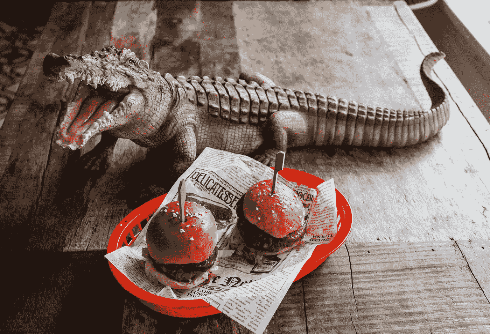

# 你能看多远？

> 原文：<https://medium.datadriveninvestor.com/how-far-can-you-see-c33e2d8f0e8d?source=collection_archive---------13----------------------->

> “我们的想法和想象力是我们可能性的唯一真正限制”——奥里森·斯韦特·马登

我们只能实现我们所能想象和计划的。

所有人都有想法。有些好，有些不好。一个人建造一个大项目和另一个人不建造一个大项目的唯一区别是他们想象一个可能的未来和提前计划到达那里的能力。

 [## 成功人生的 25 种自我提升方式|数据驱动的投资者

### “我活得越久，学到的就越多。学的越多，体会的越多，知道的越少。”―米切尔·莱格兰德时间到…

www.datadriveninvestor.com](https://www.datadriveninvestor.com/2019/03/12/25-self-improvement-ways-for-a-successful-life/) 

## 你能看多远？

***你最大的梦想是什么？***

现在…除了你想象中的梦想，你还有更狂野、更宏大、更大胆的梦想吗？如果是，为什么这不是你的第一选择？

通常，当我们被问及我们最大的梦想时，我们并不总是选择最狂野的。因为那会很疯狂，对吗？嗯，看起来我们倾向于避免全力以赴，避免因为害怕而过于大胆和梦想太大。然而，我们唯一的限制是我们自己的头脑。我们能想象的越多，我们能计划的越多，我们得到的回报就越多。

Photo by [Erin Song](https://unsplash.com/@erindesong?utm_source=unsplash&utm_medium=referral&utm_content=creditCopyText) on [Unsplash](https://unsplash.com/search/photos/imagine?utm_source=unsplash&utm_medium=referral&utm_content=creditCopyText)

1937 年，迪克和莫里斯两兄弟在加利福尼亚的帕萨迪纳开了一家小型免下车餐馆。他们的小餐馆获得了巨大的成功，1940 年，他们决定将业务转移到靠近洛杉矶的圣贝纳迪诺。一旦他们做到了这一点，业务就会爆炸式增长。年销售额达到 20 万美元。一笔可观的数目。

1948 年，他们发现时代在变化，于是对他们的餐馆进行了改造。他们尽可能优化。他们减少了菜单，只专注于卖汉堡。为了更快更有效地为客户服务，他们发明了一种叫做快速服务系统的系统，类似于装配线，每个员工都专注于快速服务。兄弟俩的目标是在不到 30 秒的时间内交付每位顾客的订单。他们做到了，业务也不断增长。

***这个故事听起来耳熟吗？*** 回到当年，你可能已经发现，开车去这家小餐馆，你可以看到一个霓虹灯招牌，上面简单地写着麦当劳汉堡。

麦当劳兄弟非常聪明，毫无疑问，他们能够优化顾客服务和厨房组织。这种才能导致了一种新的餐饮服务体系的产生。他们梦想建造一个伟大的餐厅，他们看到了，他们做到了。

1954 年，兄弟俩认识了一个名叫雷·克洛克的人。当他参观商店时，他看到了它的前景和潜力。在他的脑海中，他可以看到餐厅走向全国，甚至全世界。他很快与迪克和莫里斯达成协议，并在 1955 年，他开始麦当劳系统公司，后来被称为麦当劳公司。

在 1955 年到 1959 年的短短 4 年时间里，Kroc 成功地开了 100 家餐厅，而不是一家。四年后，有 500 家麦当劳。它们一直在生长。

Photo by [Louis Hansel](https://unsplash.com/@louishansel?utm_source=unsplash&utm_medium=referral&utm_content=creditCopyText) on [Unsplash](https://unsplash.com/search/photos/burgers?utm_source=unsplash&utm_medium=referral&utm_content=creditCopyText)

从这个故事中，我们可以了解到有一种东西可以无中生有地创造美…那就是想象力。

> 你最疯狂的想法是什么？
> 
> **你试过你最疯狂的想法吗？它是如何工作的？**

# 轮到你了

通过这个名为“**、分钟心态、**的系列文章，“我正在帮助你建立一个稳固的心态，就我们日常生活中遇到的不同话题写下我的观点。我坚信，一旦我们能够理解一个主题，我们就可以接受这个想法或者完全拒绝它。这两种方式都在帮助我们成长和发展我们自己看待世界的方式。

***如果你喜欢我的作品，拍拍它，分享给你的朋友，关注我。***

最终，一切都从我们开始，从我们的思想，我们的自我，甚至我们的故事开始。我们可以选择行动或者不行动。

如果你的健身教练可以帮助你在健身房健身，我会帮助你获得健康的心态。下面我们连线[媒](https://medium.com/@aurelianvictorcotuna?source=post_page---------------------------)、 [Linkedin](https://www.linkedin.com/in/aurelian-victor-cotuna-a0a0a553/?source=post_page---------------------------) 、 [Twitter](https://twitter.com/@aureliancotuna?source=post_page---------------------------) ，分享一些**的想法。**