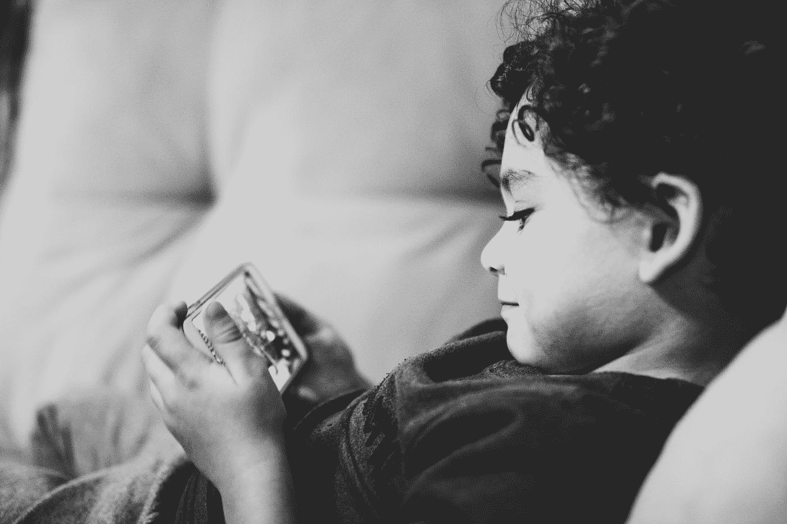
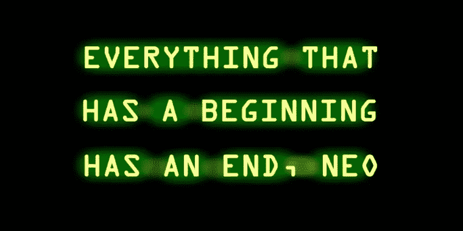

# 我们应该让机器“接触”我们多远？

> 原文：<https://medium.datadriveninvestor.com/how-far-should-we-let-the-machines-touch-us-40acde5ba78?source=collection_archive---------16----------------------->

“photo of girl laying left hand on white digital robot” by [Andy Kelly](https://unsplash.com/@askkell?utm_source=medium&utm_medium=referral) on [Unsplash](https://unsplash.com?utm_source=medium&utm_medium=referral)

上周末，我和我的家人一起参加了一个生日聚会。在所有的乐趣之后，三个家庭留在后面继续谈话。我的女儿阿丘喜欢和其他孩子一起玩气球。

过了一会儿，阿丘向我跑来，靠在我的腿上问:“爸爸，我可以用你的电话吗？”。我的声音里充满了对她的爱，我说“不”！她从来没有这么绝望地问过我的电话。我环顾四周寻找其他孩子，他们似乎都已经在沙发上安顿下来。他们每个人要么随身带着手机，要么与他人共用手机。我意识到我的女儿正处于严重的“同辈压力”之下，这迫使她向我索要手机。

Photo by [Diego Passadori](https://unsplash.com/@dipassadori?utm_source=medium&utm_medium=referral) on [Unsplash](https://unsplash.com?utm_source=medium&utm_medium=referral)

我在“更大的”讨论中休息了一会儿，试图让阿楚不去想她对电话的需求。我开始给她看我相机里的照片，那是我在生日庆祝时拍的。她开始在每张照片中寻找自己的脸，当她没能捕捉到足够多的脸时，她开始感到不安。然后我开始训练她使用相机，让她通过取景器对焦拍几张照片。她似乎很感兴趣。过了一会儿，她开始漫不经心地转动相机的旋钮和按钮，提醒我她太小了，一个人拿不动 DSLR。我从她手里拿回了相机。我抱住她，让她陪着我。我参与到正在进行的谈话中，再次“忙碌”起来。我没有注意到阿丘溜了进来，加入了其他孩子的行列。后来我看到她脸上发出蓝光，我猜她能说服她的朋友分享屏幕。

回家后，我的思绪一直围绕着女儿的行为。我开始担心我女儿对智能手机的偏好。我不想对这一事件置之不理，这是如今孩子们的一种常态。让我告诉你我为什么担心。

我是所谓的“Y 一代”或千禧一代的一部分。21 岁时，我买了第一部手机(诺基亚 3220，主要用于打电话、发短信和玩弹跳和贪吃蛇)。26 岁时，我拥有了一部早期的智能手机(诺基亚 5800 Xpress Music)。与此同时，脸书和其他社交应用在年轻人中开始流行。这里要注意的事实是，25 年来我经历了没有智能手机的生活，我知道那是什么感觉。在接下来的 6 年里，我完全沉迷于智能手机和社交媒体。在这 6 年中，我购买了 7 部智能手机(诺基亚 5800、三星 Nexus、三星 Nexus S、诺基亚 Lumia 700 Mango、三星 S4、三星 Note 4、三星 S7)和 4 部平板电脑(东芝 Thrive、华为 Mediapad、三星 Galaxy Note 8、iPad Mini)。我已经在每一个新出现的社交媒体应用程序中创建了账户。你要什么，我就有什么。不，我不是在吹嘘我的成就。相反，我带着遗憾回忆那 6 年。

为什么有人会沉迷于社交媒体？答案就在我们心中。多巴胺是一种“感觉良好”的化学物质，当我们感觉受到奖励时，大脑会产生这种化学物质。对一些人来说，感觉良好的因素可能是吸烟、饮酒、可卡因或赌博。因为有些人在摄入这些物质的同时感觉良好，他们倾向于再次摄入。他们会上瘾。你猜怎么着？当我们使用脸书、Instagram、Youtube 等社交应用时。会产生同样的多巴胺。在我们的帖子上发现越来越多的赞和评论，我们感觉很好，因为我们感觉得到了回报。许多社交媒体应用程序都有算法，通过它们的奖励系统来提高多巴胺的产量，这将使你与他们的应用程序保持联系。

> 阅读哈佛医学院研究技术人员特雷弗·海恩斯的文章，了解更多关于这些社交应用如何利用多巴胺驱动的学习的信息。

 [## 多巴胺、智能手机和你:争夺你的时间——新闻中的科学

### 由特雷弗海恩斯数字由丽贝卡克莱门茨“我感到非常内疚，”承认查马斯帕里哈皮蒂亚，前副…

sitn.hms.harvard.edu](http://sitn.hms.harvard.edu/flash/2018/dopamine-smartphones-battle-time/) 

我们生活中的大多数事情都有开始和结束。我们的一天开始又结束。一个电视节目开始和结束，在几集之后。一部电影有开头和结尾。每个季节都有开始和结束。每场比赛都有开始和结束。我们读的这本书有一个结尾。当我们呼出最后一口气时，我们的生命就结束了。但你有没有注意到，社交应用的订阅源永远不会停止。我们继续滚动，直到我们的拇指开始疼痛。

智能手机和社交媒体应用不会很快消失，所以作为用户，我们要决定我们要在它们身上投入多少时间。除了智能手机和社交应用，还有一系列智能机器随时准备潜入我们的日常生活——亚马逊 Alexa、谷歌助手、Siri 等等。他们都需要我们的时间和数据。是的，这正是一个人可以享受与家人在一起的时光，与孩子一起玩耍，阅读一本书，学习一些新的东西，做一个新的项目或提高自己。

作为一个能够思考和做出理性决定的 26 岁的人，我仍然沉迷于社交应用和智能手机 6 年，想想我们的孩子会发生什么，他们需要帮助做出正确的选择。如果我们不上前握住他们的手，他们就会开始相信并生活在虚拟世界中。由于我有 25 年的“真实”生活经验，我可以比较并意识到我出了问题。今天的孩子生来手中就有智能手机。只有我们能重新创造并帮助他们体验“真实”的生活。

让我说清楚。我并不反对这些让机器更加智能的创新技术。事实上，作为一名技术极客，我对人工智能和机器学习领域的进步感到非常兴奋。我清楚地了解机器学习的可能性，以及人类利用这项技术可以达到的高度。因为我知道可能性，所以我明白危险。我意识到有必要减少机器对我日常生活的干扰。我不想看到我的女儿问 Alexa 我能回答的问题。是我们需要决定机器应该“接触”我们多远。

Photo by [Jude Beck](https://unsplash.com/@judebeck?utm_source=medium&utm_medium=referral) on [Unsplash](https://unsplash.com?utm_source=medium&utm_medium=referral)

> 思考:你有没有想过为什么脸书和 Instagram 是免费的？为什么谷歌地图是免费的？为什么 Gmail 和 Youtube 仍然提供免费服务？每项服务都有维护服务器、避免停机和存储需求的运营成本。这些仍然是免费提供的。答案就在几个月前我听到的一句话中——“如果你不付钱，那么你就是产品”。