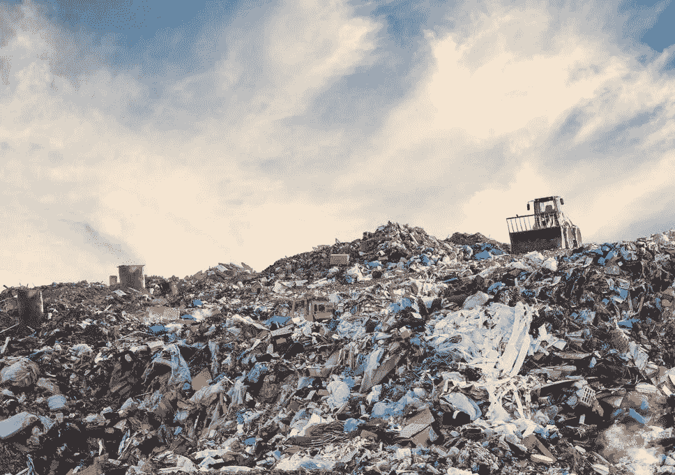
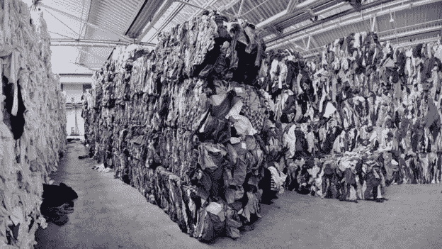
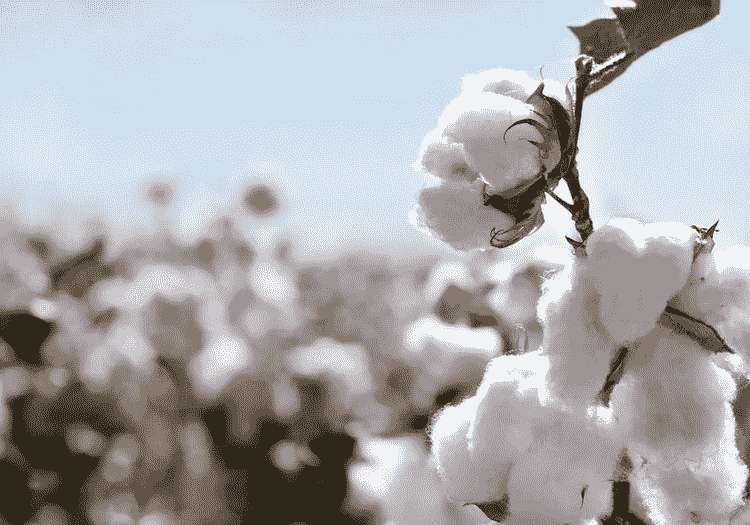

# 时尚正以多快的速度窒息着我们的衣柜和我们的星球

> 原文：<https://medium.datadriveninvestor.com/how-fast-fashion-is-suffocating-our-wardrobes-and-our-planet-737c93b7d94a?source=collection_archive---------3----------------------->

StockPhoto, by Vchalup

我们停止使用塑料，我们停止吃肉……当我们打开衣柜，我们完全停止思考。作为全球公民，我们的环保意识比以往任何时候都高，我们中的许多人都在积极努力相应地改变我们的消费行为。与此同时，我们被最新的趋势和最新的系列轰炸，当我们打开笔记本电脑以利用即时发货、免费退货和永远持续的销售时，我们原谅自己。

奇怪的是，我们忘记了(或者忽略了？)时装业是世界上污染最严重的行业之一。尤其是行业中的“快时尚”部分。快速时尚的简短描述，给那些不知道的人。快速时尚可以被最好地描述为廉价、时尚的服装，它从时装秀、名人文化或高级时装中汲取灵感，并以令人难以置信的速度将它们转化为服装。你在普通大街上发现的大多数服装店都是快时尚零售商。另一个避免去那里的好借口。

 [## 忘记石油吧，水是未来。数据驱动的投资者

### 我们不会耗尽燃料的替代品。能源行业曾经是投资者的荣耀，无论…

www.datadriveninvestor.com](https://www.datadriveninvestor.com/2018/11/14/forget-about-oil-water-is-the-future/) 

买便宜的衣服很容易，很诱人，甚至可以理解；毕竟，我们都牺牲了地球母亲来换取这样或那样的价格交易。但是，让我们把事情放在一个角度来看，并分析一下快速时尚衣柜到底有多有害。

**纺织品浪费的程度**

我们不再穿衣服，直到它散架了(或者我们还在穿，但只是因为我们的快速时尚服装质量差)。相反，一种相反的，也许是极端的心态适用于我们现在购买的所有东西，这种心态就是我们总是落后于热门的、新的和/或创新的东西一步。自 2000 年以来，全球服装产量翻了一番，但我们穿衣服的频率却下降了 50%[【I】](#_edn1)。2014 年标志着时装业生产了 1000 亿件服装。这相当于地球上每个人有 14 件衣服。其中 30%甚至永远也卖不出去[【二】](#_edn2)。

此外，在过去十年中，服装制造商的年度系列增加了一倍多，从每年两个系列增加到五个以上。像 Zara 和 H&M 这样的快时尚零售商似乎每周都会推出新的服装——如果你想从极其便宜的服装中获利，这是有道理的。快时尚的整个商业模式围绕着尽可能多、尽可能快地销售，以便从低利润中获得最大利润。

BBC

这个计划导致大量的衣服被生产、购买、穿着和扔掉，所有这些都是在快速的连续过程中完成的。2014 年，美国人平均购买 16 公斤的衣服。这相当于平均每人 123 件中号棉混纺 t 恤。这也许有助于我们理解在美国每小时是如何收集足够多的不需要的衣服来填满三个奥林匹克游泳池[【第四】](#_edn4)。这还不包括 15%的面料最终被丢弃在裁剪室的地板上——这一浪费水平几十年来一直被时装业所容忍和忽视。

我们需要停止把衣服看作是你穿几次就扔掉的东西。走过 Zara 不应该导致以不到一杯咖啡的价格买到另一件破旧的 t 恤。我们应该愿意花更多的钱购买更高质量的服装，使用可持续的优质材料。只有到那时，我们才会意识到衣服的真正价值，更好地保护它们，而不是扔掉衣服本身，而是不再穿它们的“需要”，并最终扔掉它们。购买服装是一项投资，是基于逐渐建立一个你真正喜欢穿的、你引以为豪的服装系列。

**水、空气和化学废物的污染**

许多人不知道，时装业在许多关键方面是世界上污染最严重的行业之一，即:水污染、二氧化碳排放和化学废物。服装行业占全球二氧化碳排放量的 10%，比所有国际航班和航运的总和还要多。有趣的是:服装是交通和航运排放增加的主要原因。随着快速时尚和免费送货和退货的兴起，我们最有可能得出相关性甚至因果关系。生产基地在服装消费国之外，几乎所有的快时尚零售商都宣传他们的免费送货和退货政策，导致人们不必要地在网上订购服装——只是为了试穿——然后全部退回。导致交通排放的增加。

帮助我们理解这一惊人趋势的另一项统计数据是，2016 年标志着自 1976 年以来，美国交通运输排放的二氧化碳首次超过发电厂。那么，我们似乎只剩下极端的选择:无人机送货已经是一种选择了吗，或者我们应该减少消费(或者根本不消费)？

**一切从棉花开始**

随着我们和我们消费的产品越来越脱节，有些人可能很难意识到你穿的衬衫曾经是原棉，就像你在超市买的牛排曾经是一头活牛一样。棉花是一种经济作物，为全世界提供了数百万个就业岗位，但它也是一种劳动密集型和水密集型作物。制造一件 t 恤所需的棉花需要 2700 升淡水。这些水足够供应一个人未来两年半的饮用水。想象一下把你衣柜里的所有东西都拧出来——你的房间很可能完全被水淹没了。

除了非常需要水，棉花也是地球上最依赖化学物质的植物之一。尽管世界上只有 2.4%的耕地种植棉花，但这种作物却占全世界所有农业化学品的 10%和所有杀虫剂的 25%。

除了棉花，聚酯等合成材料也越来越多地用于服装生产。这些是在实验室里通过化学反应由石油、煤和其他化学物质合成的。当你洗合成衣物时，微塑料纤维会释放到环境中。据估计，每次洗涤负载会释放多达 700，000 个微塑料纤维。这些合成纤维沿着食物链进入你的盘子，破坏了环境，更不用说你的食欲了。使得这些材料在多个层面上是有害的和污染的。

StockPhoto

作为一名消费者，你可能觉得没有办法做正确的事情来保护环境。事实是你可以。稍后，在我们深入到时装业人性的一面，或者更确切地说，它不人道的一面之后，我们会有更多的介绍。

**对人的影响**

时尚产业是一个价值 1810 亿美元的庞然大物，由 176400 家公司组成，雇佣了 170 万人[。时尚产业拥有世界上最复杂的全球价值链之一。欧洲和美国的大部分产品都是在这些地区之外的低技能劳动力国家制造的，如孟加拉国、越南和土耳其。仅欧盟就从第三世界国家进口了价值 1120 亿美元的纺织品(T4)。](#_edn6)

作为消费者，我们必须了解我们购买的产品来自哪里，以及它在进入商店之前经过的路径。那条 15 美元的裙子不是从天上掉下来的。Inditex (Zara、Bershka、Pull & Bear、Stradivarius、Massimo Dutti 等)能够提供廉价服装的全部原因是，在地球上的某个地方，在低工资国家，有人在恶劣的条件下工作，而工资却非常低。在一些工厂里，通常是女性的工人一小时要生产 100 件衣服，门口有武装警卫，窗户也关了起来。工厂主很少关心安全问题，他们不得不应对时装公司不断提出的廉价生产需求。自 2005 年以来，孟加拉国近 1700 名时装业工人死于建筑物倒塌、火灾、窒息和化学物质。最引人注目的是首都达卡外的拉纳广场倒塌，1136 名工人丧生，数百人受伤。当这些工人抗议他们的低工资和致命的工作环境时，他们几乎总是会遇到暴力。例如，就在去年 2 月，孟加拉国 5000 名服装工人因反抗雇主而被解雇。对孟加拉国的工厂主来说，工会显然是一个陌生的概念。

我强烈推荐观看纪录片《真实成本》，它记录了我们的服装从跑道到贫民窟，从棉田到血汗工厂的历程。这是一个大开眼界的机会，让每个人都愿意扩大他们对快速时尚和廉价服装的认识。

**你能帮上什么忙？**

为了对更可持续的世界和衣柜做出贡献，你不需要太多就可以开始。这一切都是从买衣服的时候开动脑筋开始的。停止消耗你的内脏。花点时间看看你的衣柜里现在有什么，你需要什么，你打算去哪里买。看到你已经拥有的衣服的价值，并且在消费的时候记住这三条规则:购买有机的，购买当地的，有意识的购买。

如果你开始盘点你已经拥有的东西和未来几个月需要的东西，你会意识到你实际上需要买的东西是多么少。注意到需要和想要的区别了吗？

不要害怕在衣服上多花钱。相信我，它会让你穿得更久，你会更好地照顾它，你会意识到你穿的衣服的价值，并感谢对它的关注和付出。如果你决定在快速时尚零售商那里买一件基本的白色 t 恤，试着去寻找他们最可持续的材料或系列。快时尚零售商理解可持续发展的必要性，并通过创造由有机棉或回收材料制成的服装来迎合这种情绪。但是，请让我们尽一切努力避免将快速时尚作为一个概念。

我们都有责任减少碳足迹，减少浪费，互相关爱。是时候摘下我们的眼罩，睁开我们的眼睛，意识到我们的服装、消费和行业会有多大的破坏力了。只有这样，我们才能真正改变自己，并开始为一个更美好、可持续的世界、行业和衣柜做出贡献。

[【I】](#_ednref1)圆形纤维倡议，2017 年

[【二】](#_ednref2)麦肯锡，2016

[【iii】](#_ednref3)绿色和平组织，2014 年

[【iv】](#_ednref4)发人深省的咨询，2019

[【v】](#_ednref5)能源部，2016

[【VI】](#_ednref6)欧洲期货交易所，2017

[【VII】](#_ednref7)欧洲期货交易所，2017

[【VIII】](#_ednref8)路透社，2019