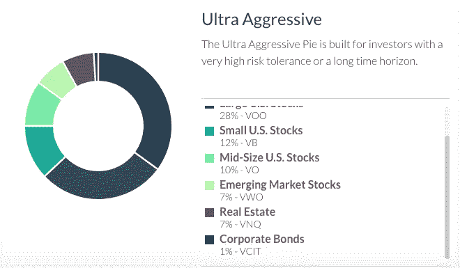
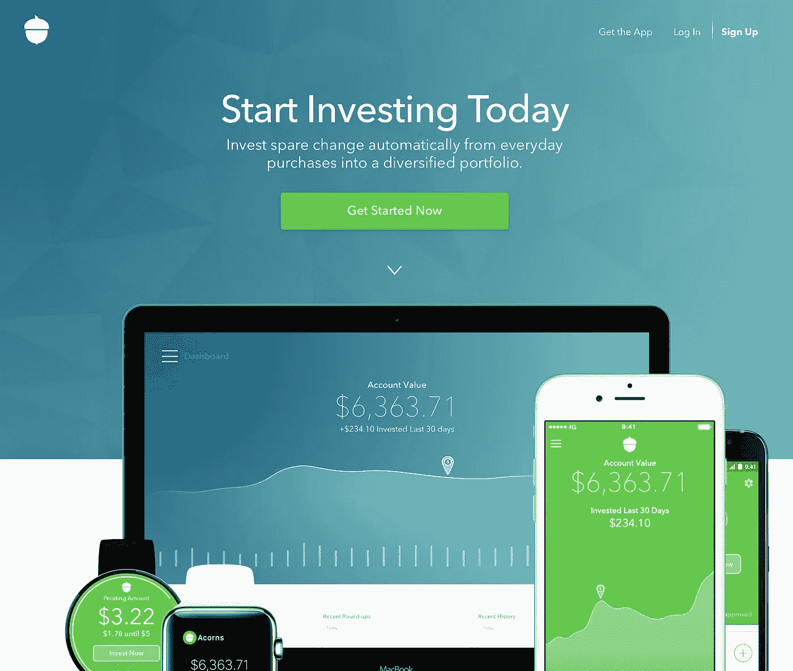
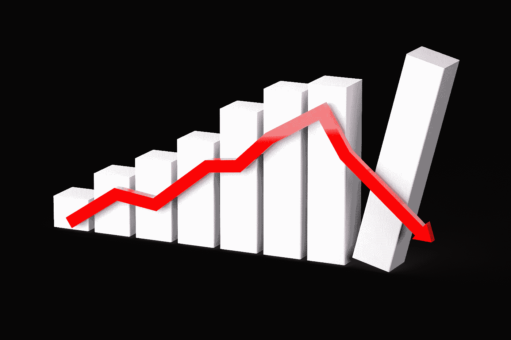

# 分数投资如何改变一切

> 原文：<https://medium.datadriveninvestor.com/how-fractional-investing-is-changing-everything-8cee5587f505?source=collection_archive---------2----------------------->

Image: [Stock Exchange](https://pixabay.com/en/photos/stock%20exchange/) [Wall Street](https://pixabay.com/en/photos/wall%20street/) [Business](https://pixabay.com/en/photos/business/) [Stock](https://pixabay.com/en/photos/stock/) [Market](https://pixabay.com/en/photos/market/). Source: Monica Volpin, Pixabay.com

不久前，普通投资者投资任何东西都需要一个经纪账户和至少 1 万美元的最低存款，大多数经纪公司都是如此。你还必须明白市场是如何运作的，并对你制定的投资策略有很好的理解，或者至少相信你的投资经理会替你知道。这两种模式的问题在于，它们都没有给你提供有保证的回报或保证资本投资不会损失，也不要求你有钱开一个账户。快进到今天。任何与经纪公司或上市公司的员工没有关系的人，都可以开设一个没有最低存款额的现金管理或经纪账户。交易费用从每笔交易 0 美元到 1 美元不等。许多交易网站提供研究工具，这些工具非常广泛，有时超出了普通投资者的理解范围。

近年来，投资公司开始提供指数基金。指数基金是行为类似于市场指数的基金。与这些基金挂钩的股票通常更贵，因为它们的需求更高，因此交易量也更大。它们的波动性也较小，因为需求总是存在的。例如，对于每一个卖方的要价，在离要价不远的地方就有一个买方的出价，反之亦然。由于任何股票的目标都是跑赢市场指数，因此一些股票，尤其是小盘股、成长股和新兴市场的股票，通常更容易被接受。它们也往往被认为风险和波动性更高。这是因为围绕这些股票通常有更多的投机活动。尽管如此，从投资网站购买任何股票都需要资金。例如，今天买的最好的股票都很贵。有多贵？截至 2019 年 2 月 11 日，尝试用[1，103](http://www.marketwatch.com/investing/stock/googl/charts) 美元购买一股谷歌股票(字母表 CI A)，用[346](https://www.marketwatch.com/investing/stock/nflx/charts)美元购买一股网飞股票。投资这些股票的唯一方法是分别以 1，103 美元和 346 美元的价格买入。普通美国人，尤其是刚毕业的大学生，没有钱做这件事。这就是部分投资进入房间的地方，它完全颠覆了我们所知道的关于如何投资的一切。

部分投资是指根据你的投资能力，只购买股票或基金的一部分。通过部分投资，你可以购买任何股票当前价值的任何部分。更重要的是，有大量的投资平台允许你买卖违规行为。分批购买股票让你有能力慢慢购买你通常买不起的理想股票。例如，你可能无法购买一股谷歌股票，但花 10 美元，你可以购买不到百分之一的股票(如果谷歌的交易价格是 1100 美元)。你可以用 35 美元购买十分之一的网飞股票(如果网飞的股价是 350 美元)。

Image: [Business](https://pixabay.com/en/photos/business/) [Businessman](https://pixabay.com/en/photos/businessman/) [Cellphone](https://pixabay.com/en/photos/cellphone/) [Checking](https://pixabay.com/en/photos/checking/) [Closeup](https://pixabay.com/en/photos/closeup/). Source: RawPixel, Pixabay.com

每天都有许多新的投资平台涌现出来，为新投资者量身定制。这些投资平台将指数基金模式与分数投资结合起来，因此你可以购买热门指数基金的分数，这些指数基金不会试图跑赢市场，而是表现与市场一致。这降低了波动性，增加了长期收益超过通胀率的可能性。人们可以选择将他们的钱作为一次性存款或定期存款从他们选择的支票账户中存入。然后，根据短期和长期目标，将资金进行部分投资。

Image: M1 Finance Portfolio Pie. Source: [M1Financ.com](http://m1finance.com)

我最喜欢的投资平台是 [M1 金融](https://www.m1finance.com/)。M1 金融允许你创建自己的投资组合，你可以混合指数基金，债券和股票。当您进行定期存款时，系统会根据您为股票和固定收益资产创建的百分比自动重新平衡您的投资组合。没有费用，也没有最低限额，尽管你可能需要支付与管理基金费用率相关的费用。

如果你想要一个投资平台，为你做所有的工作，甚至买卖持股以最大化税收损失或*税收损失收获，那么*只需看看[改善](https://www.betterment.com/)、[橡子](https://www.acorns.com/)和[财富前线](https://www.wealthfront.com/)。

Image: Acorns Sign Up. Source: [Acorns.com](http://acorns.com)

所有这些投资平台都会自动将你的钱投资到流行的投资组合中，健康地混合股票和固定收益资产。如果你想要自动投资的便利，但你想要对你最重视的行业有所控制，那么只需看看 [Stash](https://www.stashinvest.com/) 和 [Motif](https://www.motif.com/) ，在那里你可以根据行业、使命和价值从精选的股票组合中进行选择。许多精选的股票基于社会责任汇集在一起，这引起了千禧一代的兴趣。

为什么分数投资改变了一切？好吧，让我们考虑一下这个问题。部分投资让更多的人了解市场投资。这不仅稀释了股票和行业的投资者数量，也稀释了个股的投资者数量。当某一特定公司或行业发布公告时，零股投资者不太可能买卖头寸，从而减少股票和整个市场的突然波动。

Image: [Graph](https://pixabay.com/en/photos/graph/) [Diagram](https://pixabay.com/en/photos/diagram/) [Recession](https://pixabay.com/en/photos/recession/) [Economic Downturn](https://pixabay.com/en/photos/economic%20downturn/). Source: Mediamodifier, Pixabay.com

可以得出的结论是，由于散户投资者计划的被动经常性存款导致新的投资资本不断流入市场，市场最近的下跌和波动可能已经被更高的波动所抑制。这种拉平效应与近二十年前充斥市场的日间交易者创造的波动形成鲜明对比，今天，这种波动只能与加密货币市场目前的狂野西部相提并论。与一般不太关注市场的散户投资者不同，日内交易者混合使用多种方法，唯一的目的就是战胜市场。他们多次买卖证券，从短期价格波动中获利。头寸是在短期基础上持有的，日内交易者主要依赖于逐时情绪。情绪取决于许多因素，包括上市公司的新闻、分析师评级和预测、股价波动、行业指标、美联储公告，当然还有就业报告。大多数日内交易者很少使用实际基金经理使用的复杂模型。

被动分数投资平台的引入可能意外地创造了一个全新的投资者群体，反映了一个更成熟的投资者，他不关心日常情绪，而是长期表现，更关心长期回报，而不是战胜市场的短期押注。我们的希望是，我们不仅可以投资稳健的公司，还可以投资对社会负责的公司，至少是部分投资。

*披露:数据驱动投资者和我并未因本文包含的任何信息而获得报酬。数据驱动投资者和我不代表或认可本文中列出的任何投资平台。数据驱动的投资者和我在这篇文章中不提供任何金融建议，这篇文章中提供的任何信息不应被解释为如此。请注意，投资任何非 FDIC 保险的证券都可能导致包括初始资本损失在内的损失。在你投资之前，和一个认证的财务顾问讨论风险和你的最佳选择。*

## 来自 DDI 的相关故事:

 [## 为什么数据将改变投资管理——数据驱动的投资者

### 有人称之为“新石油”虽然它与黑金没有什么相似之处，但它的不断商品化…

www.datadriveninvestor.com](https://www.datadriveninvestor.com/2019/01/25/why-data-will-transform-investment-management/)  [## 金融中的机器学习——数据驱动的投资者

### 在我们讲述一些机器学习金融应用之前，我们先来了解一下什么是机器学习。机器…

www.datadriveninvestor.com](https://www.datadriveninvestor.com/2019/02/08/machine-learning-in-finance/)