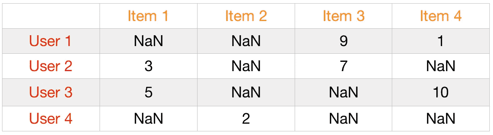
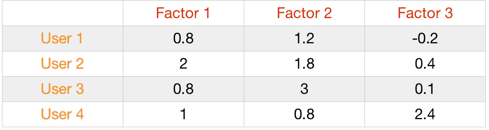
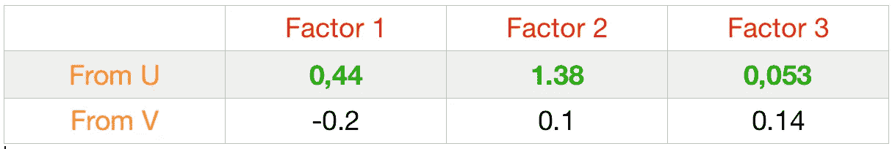
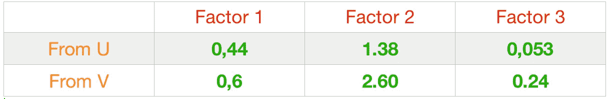
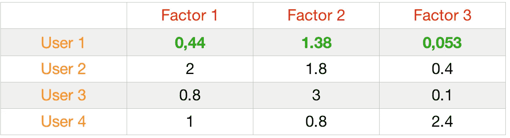
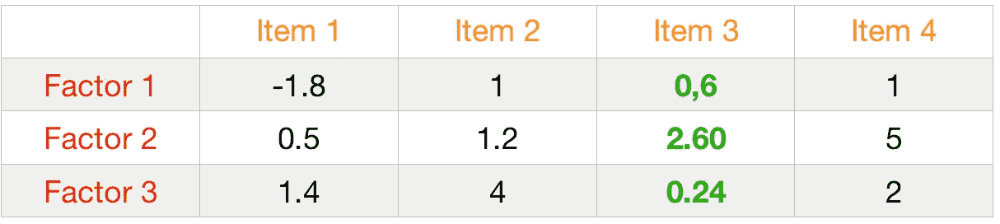

# Funk 奇异值分解算法在推荐引擎中是如何工作的？

> 原文：<https://medium.datadriveninvestor.com/how-funk-singular-value-decomposition-algorithm-work-in-recommendation-engines-36f2fbf62cac?source=collection_archive---------4----------------------->

我将以一个简单的问题开始这篇博文:

> 如果您想在部署推荐引擎并在实际情况中使用它之前，先了解一下它工作情况，该怎么办？

为了回答这个问题，我们需要一种非常流行的机器学习技术，称为奇异值分解或 SVD。

SVD 可以让我们预测每个用户-项目对的评分。所以你可能会问自己，为什么我们需要预测收视率？我们只是想提出建议。事实上，如果我们可以预测低误差的评级，我们可以使用这个预测的评级来找到与预测的最高评级相关的项目。这就是 SVD 有用的地方，因为它允许我们使用基于回归的指标，如 MSE 或 MAE 来评估性能。通过这种方式，在向客户部署我们的建议之前理解指标。

在执行 SVD 时，我们按项目创建一个用户矩阵，用用户评级或其他东西来评估整个矩阵中的项目。这个矩阵没有关于用户或项目的具体信息，只有它们各自的 id 和与。在这个矩阵上使用 SVD 可以让我们找到与项目和用户相关的潜在特征。

> 什么是潜在因素？

在我们的数据中没有观察到潜在的因素，相反，我们根据用户给项目的值(评级)来推断。假设用户给两部谈论人工智能的电影打 9/10 分，给两部谈论动物的电影打 2/10 分。分数和电影的内容(AI 和狗)有关系。但是人工智能和狗不在我们的数据中，这些特征被称为潜在特征。

在现实生活中，奇异值分解在数据上并不奏效。为什么？

因为 SVD 可以在非稀疏数据上获得非常好的结果，我指的是在没有丢失值的数据上。但是我们中有多少人在每部电影或购买结束时给出分数呢？嗯，不多。

事实上，推荐引擎的真实数据集可能非常稀疏，您可以找到超过 95% NaN 值的用户项目矩阵。这就是 Funk SVD 的用武之地。

> Funk SVD 算法是如何工作的？

Funk SVD 将忽略这些缺失值，并找到一种仅使用已知值计算潜在因子的方法。要使用 Funk SVD 实现这种矩阵分解方法，需要遵循以下步骤:

1 建立两个矩阵 u 和 V^T，分别是根据所选潜在因素的数量的用户矩阵和根据项目的这些相同潜在因素的矩阵，并用随机数填充这些矩阵。

在这一步，我们有 3 个矩阵:

用户-项目矩阵

U 矩阵(用户用随机值填充潜在因子)

V^T 矩阵(用随机值填充的项目的潜在因素)

2 在用户-商品矩阵中搜索一个用户-商品对的现有价格。找到的第一个评级是由用户 1 对项目 3 给出的 **9** 。所以 **9 是我们的实际值**，真实值。

在 U 矩阵中，我们取与用户 1(行)相关的所有随机值。我们为这个用户准备了[0.8，1.2，-0.2]

请记住，9 是用户 1 给项目 3 的。在 V^T 矩阵中，我们也取与第 3 项相关的所有随机值。这个项目我们有[-0.2，0.1，0.14]^T

4 我们计算找到的行和列之间的点积，以便进行预测。(0.8 x-0.2)+(1.2 x 0.1)+(-0.2 x 0.14)=-0.07

这时我们有:**实际= 9**；**预测值=-0.07**

所以**误差**为(9+0.07) = **82.26**

5 使用梯度下降最小化误差。

公式: **U(i)或 V(i) + ⍺ 2(实际-预测)x V(i)或 U(i)** 其中 U(i)是来自 u 矩阵的随机值，V(i)是与 V^T 矩阵相关联的随机值，⍺是学习率。

让我们回顾一下，这是 U 和 V 的值，并进行预测:

使用梯度下降和⍺=0.1:更新 0.8

新值= 0.8+0.1 x 2(9+0.07)x-0.2 =**0.44**

通过更新 U 的所有值，我们得到 **0.44，1.38，0.053。**所以现在我们有了:

然后，我们可以更新 v 中的值。注意，U 中新更新的值已经影响了我们将从 v 中计算的值。

最后，用同样的公式我们得到:

6 替换 u 和 V^T 矩阵中的更新值

并结束一次迭代。

# 结论

Funk SVD 很容易让我们找到一种方法来评估我们的推荐引擎，并创建良好的 u 和 V^T 矩阵，以便即使我们有一个非常稀疏的矩阵也能进行推荐。但是 Funk SVD 不应该单独使用，因为我们会面临一个推荐引擎中常见的问题，叫做“冷启动问题”。这个问题意味着，我们无法对新用户或新电影进行推荐。一种好的方法是将 Funk SVD 与一种不太先进的方法结合起来，如基于排名的算法或基于内容的方法。通过在 [Github](https://github.com/Mdhvince/Recommendation_engine_module) 上下载我的推荐引擎模块，你可以知道如何用 Python 实现所有这些技术。