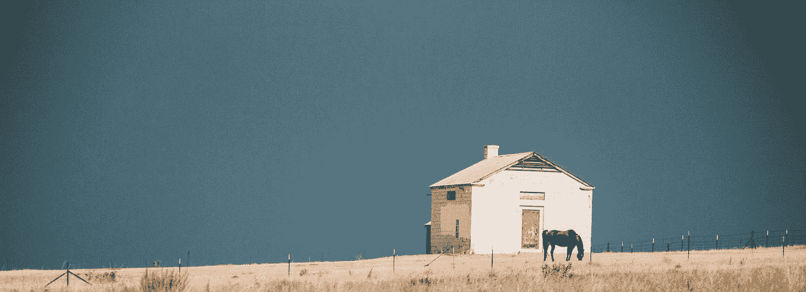

# 进入 1%俱乐部教会了我天赋和努力并不代表一切

> 原文：<https://medium.datadriveninvestor.com/how-getting-into-the-1-club-taught-me-talent-and-effort-isnt-everything-dd402c701bb5?source=collection_archive---------10----------------------->

## 特雷弗·霍夫曼

“Effort Isn’t Everything” by [Massimo Sartirana](https://unsplash.com/@sarti46?utm_source=medium&utm_medium=referral) on [Unsplash](https://unsplash.com?utm_source=medium&utm_medium=referral)

> “从固定的思维定势来看，努力只针对有缺陷的人。当人们已经知道自己有缺陷时，他们不会因为尝试而失去什么。但是如果你对名声的要求没有任何缺陷——如果你被认为是天才、有天赋或天生的——那么你会失去很多。努力可以减少你。”卡罗尔·德韦克***

但是在 D1 和职业篮球界待了二十年后，我必须说:*光靠努力不足以达到百分之一俱乐部*。尽管卡罗尔·德韦克在她的书《T2 心态——成功的新心理学》中谈到了努力(像很多人一样)，但她也错过了一些关于努力的事情，这些事情有助于我们达到最高水平。

在过去的 25 年里，我对篮球充满热情。我看到很多人在高中、大学和职业生涯中付出了很多努力，他们都比普通人做得更多，对自己的激情投入了大量的努力，但他们中的一些人从未成功过。其中一些被炸了。从没见过球场。或者停滞不前，从未发挥出他们的潜力。

# 要进入百分之一俱乐部，一个人必须付出的不仅仅是努力，他们必须对自己的努力有高度的自我意识。

你的百分之一可能和我在不同的领域。我希望如此。我的过去是篮球。现在是写作。创业公司。要达到前 1%需要大量的学习、努力和调整。

但是为什么我打出来的这些字会对你有帮助呢？

因为我从努力进入我的百分之一俱乐部，成为肯特州立大学有史以来的头号得分手，实现我短暂的白人梦想，在 NBA 和欧洲打球中学到了很多。我想激励你把我学到的东西拿来用。偷走它。

" ***做它的宝贝*！"迪奇·维塔莱会说。**

如果成功取决于努力(就像卡罗尔·德韦克写的那样)，当人们在某些方面有天赋而其他人没有时，我们如何衡量不同类型的努力(逻辑、分析、身体等)？

例如，如果你的心率在一次篮球训练中达到 190，而在同一次训练中我的心率只有 130，谁付出了更多的努力？

或者更好，如果我一天拍一千张(*好大的力气！*)而你只拍 300，但你的镜头都是游戏速度，都是游戏镜头，多种多样，加上精神压力，谁的功夫更大？

我的还是你的？

你选了哪一个(*提示，花更聪明的力气*)？

或者也许努力是一种哲学观点——意思是你最好的(最持续的)努力是体育、生活、商业、人际关系和精通中最重要的。这是有一定道理的，当我离开职业体育的世界，并试图了解与我生活的这个新的商业世界相比，是什么让我在那个世界取得成功时，这让我击中了要害。

# 所以也许真正要问的问题是:

“grayscale photo of man touching his face” by [Alex Iby](https://unsplash.com/@alexiby?utm_source=medium&utm_medium=referral) on [Unsplash](https://unsplash.com?utm_source=medium&utm_medium=referral)

## 1.你最大、最持续的努力是否让你感觉被减少了？

## 2.你最大、最持续的努力是否让你感到脆弱？

不可否认的是，最近我确实如此。

尤其是当我适应了打职业篮球，我失去了努力的热情，失去了每天挑战的热情，失去了调整比赛的热情，失去了把自己推到“舒适区”之外的热情。

我会嘲笑这样的想法，比如在水中跑步，或者学习游得更快，或者骑自行车 20 英里，或者让教练教我新的动作。

但让我们回到过去，当我尽最大努力学习或成长没有让我感到分裂，我的内心向全世界展示时，当我真正处于成长模式时，当我真的不在乎别人对我进入百分之一俱乐部的痴迷的想法时。

***成为精英中的精英。***

“你到底要不要这个？我要告诉你多少次？如果你不想要，我就不会花钱帮你到那里。你要么找一份真正的工作，要么开始像打篮球一样工作。

从 12 岁起，我就听过这种说法的更柔和的版本。问题是，当时是早上 6 点，我的脸旁边有一个满是灰尘的除草器。我坐起来想了一会儿，用细细的手指梳理了一下我的金发，看着我对面一排排的油漆罐。

*伙计，去他妈的，*我想。我可以找份工作。赚点钱。谁在乎呢，对吧？反正我回北方找妈妈的时候他也不会在那里帮我。

我听着那个声音，然后把它甩了。我父亲称之为“受害者心态”。我环顾四周。有一把台锯。一张工人长凳和数百件木工工具悬挂在未完工的墙壁上。这里很拥挤。我爸爸和我都睡在他的车库里(那时候，这看起来完全正常，但现在我想:*他妈的什么爸爸*，*真的，为了降低你的生活费用，为了成功地让你更快达到一百万*？)我爸爸穿着一件粉色有领衬衫在我身边徘徊，他的头发用发胶整齐地分开。

“起来吧。是时候决定自己想成为什么样的人了。”

我想知道，为什么我只有 15 岁，却不得不现在做出决定？

有 [**是一个规则和理由**](https://medium.com/@Trevor_Huffman/17-things-i-thought-you-should-know-1a2d0ca9bb32) 为什么他这样对我说话，或者对任何人这样说。我的父亲是由我的祖父母抚养长大的，他们两个是经历了大萧条的农民。他典型的帮助父母的一天从早上 4:30 开始，他 12 岁时就对着“乡巴佬”(他们在农场被称为“乡巴佬”)大喊大叫。17 岁时，他就可以经营整个农场，进行半卡车装卸作业。28 岁成为律师之前，他向我们发誓，他再也不会过农场的生活，也不会陷入贫困。很明显，我父亲有不惜一切代价实现梦想的想法。农场教会了他工作的价值。的努力。学习的能力。最重要的是，尽一切努力去成功并使收支平衡。

# 但这仍然不能解释他为什么那样跟我说话，我的意思是，我不是在农场出生的，我也不是乡下人——我是他的次子。

The Farm Life | by [Sean Foster](https://unsplash.com/@fosterious?utm_source=medium&utm_medium=referral) on [Unsplash](https://unsplash.com?utm_source=medium&utm_medium=referral)

“爸爸，为什么我一大早就要决定这个？”我争辩道。"并不是所有的人都被设计成早上醒来就准备好出发."

“特雷弗，听着，你必须决定你要努力做什么。我知道当你失去焦点时会发生什么。你的思维导图显示的是 D1 篮球，不是 D3。我知道在顶端是什么感觉，和这些家伙竞争。他们是垃圾场的狗特雷弗。他们不在乎你是谁，你从哪里来，他们想赢。你正试图和世界上最好的球员一起比赛。这发生在我身上——女人、聚会、成功——它让我变得懒惰。这就是为什么我没能进入州立大学篮球队。这就是我不得不转会到阿尔比恩的原因，因为我没有保持高水平的努力，没有呆在我的舒适区之外，”他严肃地说。

“爸爸，我能多睡一会儿吗？”

“不，如果你打算整个夏天都和我在一起，你就要起来工作——要么是你的游戏，要么是你的新工作。”

我听了他的话。他是对的。事实是，我大一就进了大学代表队，我实现了我的目标，那就是做我们学校历史上没有其他新生做过的事情。

但是旅程才刚刚开始。它真的会结束吗？

*问他为什么明年不北上*，我的声音说。我想念他和我在一起，帮助激励我，让我站起来，你知道基本的狗屎，在那里，做我他妈的爸爸。我想起了我最好的朋友约翰尼，想起了他的父母和他的姐妹们围坐在一起吃晚饭。

他们的生活很完美。

我的生活就像一颗手榴弹在我体内爆炸，每天早上我的身体都在地板上爆炸。情绪像过山车一样，我会试着捡起碎片并移动它们，哦，这是我的心。是的，那是我的大脑。我的错，你想要这边的大腿吗？

我把酸痛的双腿挪到水泥地上。我想知道，他睡在这狗屎上面？他睡觉的地上只有一个鹅绒被子。我怀疑地看着他。我的父亲，英格玛，就像一座砖房——又矮又宽又结实。他的手像棒球手套一样宽，他的肩膀像巨石一样厚。在夏天剩下的时间里做建筑工作的想法足以让我选择篮球，尽管如此，我的目标和甲级球员我还不能打败。此外，我讨厌噪音，声音，锤打，铲，指甲里的污垢，以及单调的体力劳动。我知道我想要篮球，但是我不想早起去得到它。

*特雷弗，做最好的没有休息日，*另一个声音告诉我。*出发。你能做到的。不要因为父母闹分裂就停下来。因为杰里米在喝酒。快走吧。动起来。*

我站起来，转圈移动臀部。

“我在爸爸那里。但是你要答应一件事？”

“告诉我儿子。”

“你必须搬到佩托斯基去。你必须再次和我们住在一起。”

我想成功实现我脑海中的某个大学或 NBA 篮球运动员的梦想，就像我父亲一样。我只是不知道怎么去那里。

这就是问题所在，你认为让你进入百分之一俱乐部的东西并不总是你所期望的，主要是，努力并不总是你成功所需的唯一变量。

> 本杰明·巴伯，一个即将成为社会学家的人曾经说过，“我不把世界分成弱者和强者，或者成功者和失败者。我把世界分为学习者和非学习者。”

# 努力只是 1%俱乐部公式中的一个变量:

1.  在正确的领域(你有遗传优势的领域)学习是非常重要的，因为你培养自己天生优势的能力可能是让你进入百分之一俱乐部的唯一途径。例如，对于我来说，要进入数学俱乐部的百分之一，即使我把所有的努力、学习和调整都放在实现这个愿景上，我可能实际上只能接触到世界上 50%的顶尖数学头脑(这是一种延伸)。那是因为我真的很纠结数学。我有导师。我有课。为了保持资格，我在高中额外工作。你猜怎么着，我好不容易才勉强通过。
2.  把更多的精力放在学习上。如何每天调整和调整你自己、你的产品、你的生意、你的生活、你的关系是更聪明的努力。今天的努力应该比昨天的努力更有智慧。我今天做得好的是什么？我越来越擅长的事情不再推动我成长了吗？如果你选择一个你天生擅长、好奇或者很快就能学会的爱好，你进入百分之一俱乐部的几率会高得多。你将变得如此优秀，人们、世界、媒体、你的竞争对手将被迫承认你有多优秀。
3.  尽你最大的努力并不意味着停滞不前。如果我尽我最大的努力，每天以同样的方式举重，我永远也长不大。变化是生活的调味品。寻找新的导师、新的流程、新的教练、学习模式和竞争，以推动你走得比你想象的更远。移动到这个培养皿生长的地方。
4.  最后，要有自知之明。一个需要回答和了解的重要问题是，你是否与你的领域、职业、关系、事业、爱好或创业相容？我这么问是因为如果你付出了所有的努力，调整了产品，学习了新的模式和自我提高的实践，我希望你的答案是肯定的。

## 意思是，你喜不喜欢吃你的屎味三明治？**

是的，我赢得了地理和基因彩票(嗯，不是因为我有七英尺高，而是因为我是白人，我的父母有时间和金钱来投资)。事实上，我出生在密歇根州弗林特市萨吉诺街的一个拖车里，因为住在那里很便宜，我父母用他们的积蓄投资房地产，让我们摆脱债务(所有金融崩溃的根源，对吗？)

这就是当 [**百分之一俱乐部的进程真正开始于我**](https://theascent.pub/a-pro-athletes-2-rules-on-mastery-1039515c96dc) **。**

当我还是个孩子的时候，我学到了越来越多的篮球知识，我意识到努力并不重要。这就是为什么天才儿童或神童在年轻时会停滞不前，停止成长。他们从来不知道“失败者生活”的秘方对我来说，这种生活就是从新教练那里学习比赛，看我最喜欢的 NBA 球员比赛几个小时。它在学习如何训练；学习在我的比赛录像中应该注意什么，并相应地调整我下周的练习；学习我九年级时的努力和我大学四年级时的努力相比，简直就像隔了好几光年。

如果一个高中生在大学里像我一样努力工作，他们会真的呕吐(这是一个关于我弟弟和他高中队友的好故事)，我会不停地对他们大喊大叫，让他们离开他们的“舒适区”。

> 小时候，我父亲会反复强调这一点，“这不是你成长的地方——在这里事情太容易了。在那里你永远不会搞砸。”

处于“舒适区”成了禁忌，我不温不火地试图反抗他的清晨制度，但总是遭到纪律约束、找工作的威胁，以及对他的严厉斥责。在我十几岁的时候，父母之间的裂痕越来越大，篮球成了我的治疗方法，我的发泄途径，我开始一天中的所有时间都在打球、学习和练习。这些是我投入大量精力进行游戏和训练的典型时间段。

凌晨 12 点

早上 6 点

晚上 12 点

下午 6 点

# 这是我留出的玩我喜欢的游戏的时间，我通常四次打中两次。实际上，这四个中的三个对我来说是非常常规的。

但是其他的时间都花在了阅读《底特律新闻》上关于伟大球员、体育表现、控球后卫的报道上，我把自己和他们进行了比较。我的竞争对手做了什么？谁训练的比我多？他们是如何训练的？

我想知道，毫无疑问，我比我的对手训练得多，学得多，想得多。这种印记，这种学习、努力、调整我的游戏和设定目标的坚实基础，来自于那些清晨和我父亲的谈话和锻炼。

我从来不觉得我会做得足够好，我想我爸爸知道要达到我的目标有多难。失败者在乎胜算吗？

*地狱号*

> 从这个意义上说，做一个失败者正是我成功并成为 1%俱乐部的一员所需要的，这个俱乐部最终走向了职业体育。旅程结束后，我恍然大悟:成为一名失败者意味着意识到自己有不足，并意识到你可以通过强迫性的、持续的、高度分析的大量努力和反馈来克服它们。

我的童年教会我的不仅仅是努力。当你选择了正确的运动、好奇的职业、合适的伴侣或最真诚的朋友时，短时间的紧张努力会变得更容易。兼容性很重要，但它不是一切。自我意识为你指明了道路。听听你自己。相信你的直觉和你的力量。尽力而为，不要害怕尝试。

那你说说在 1%俱乐部是什么感觉，因为我很怀念。

*我哥哥达蒙和他的朋友在举重房里和我一起锻炼，他们两个都试图跟上我，吐了举重房的橡胶地板一地。具有讽刺意味的是，一个人觉得受到了挑战，另一个人觉得他再也不能像那样举起来了(我哥哥现在是美国队世界排名第三的三对三球员)，另一个人没有参加大学球赛。

** [克里斯·盖奇](http://www.medium.com/krisgage)和[马克·曼森](https://medium.com/u/db77b01f3f54?source=post_page-----dd402c701bb5--------------------------------)，非常喜欢谈论这种在你最喜欢吃屎的地方挣扎(马克称之为吃屎三明治)的想法(然后孤独地死在坟墓里，过着更好、更糟糕、不特别的生活)。

# * * *心态:成功的新心理学平装本——2007 年 12 月 26 日，作者卡罗尔·s·德韦克