# GitOps 如何解决客户的棘手问题

> 原文：<https://medium.datadriveninvestor.com/how-gitops-is-solving-customer-pain-points-877b6b8ba6cc?source=collection_archive---------6----------------------->

作者:刘胜

为了解决涉及云的传统应用程序的常见痛点，如缓慢的升级周期、臃肿的基础架构和难以发现故障，诞生了[云原生](https://www.infoworld.com/article/3281046/what-is-cloud-native-the-modern-way-to-develop-software.html?spm=a2c41.13239679.0.0)的概念。

云原生可以提高应用开发的效率，有助于改变企业的组织结构，甚至影响一个公司的整体决策。今天，云原生应用已经成为云空间中快速流动的洪流。例如，在[的容器世界](https://www.docker.com/resources/what-container?spm=a2c41.13239679.0.0)中， [Kubernetes](https://kubernetes.io/docs/concepts/overview/what-is-kubernetes/?spm=a2c41.13239679.0.0) 已经成为容器编排和管理操作的社区标准，因为它提供了一个可移植的模型，该模型也与云原生应用程序共享，它可以将应用程序服务抽象为多种资源类型，如部署和设备类。

 [## 敏捷管理:好的、坏的、丑陋的|数据驱动的投资者

### 公司不断重塑自己，以获得或保持竞争优势和市场份额。这是…

www.datadriveninvestor.com](https://www.datadriveninvestor.com/2019/03/26/agile-management-the-good-the-bad-and-the-downright-ugly/) 

在这种情况下，整个社区的一个新的兴趣点是如何利用原生云使开发流程(传统上涉及开发运维)更加高效，以实现更高的性能水平。对于许多客户来说，答案是转而将 GitOps 架构与云原生应用一起使用。

# 开发运维的常见难题

与更新的 [GitOps](https://www.weave.works/blog/what-is-gitops-really?spm=a2c41.13239679.0.0) 相比，你可能更熟悉 [DevOps](https://devops.com/?spm=a2c41.13239679.0.0) 。起初，DevOps 旨在打破开发、测试和运营部门之间的壁垒，希望最大限度地减少人为错误，同时提高应用程序版本的迭代效率。这些改进得益于自动化和编程脚本的广泛使用。现在，容器技术凭借其轻量级和标准化的功能，在云原生时代，DevOps 现在比以往任何时候都更有能力通过自动化提高效率。无论技术如何更新迭代，DevOps 的主要核心需求不变，当然是提高应用迭代的频率和效率，降低成本。嗯，GitOps 只是 DevOps 的逻辑扩展。其核心目标是更高效、更安全地发布应用程序。

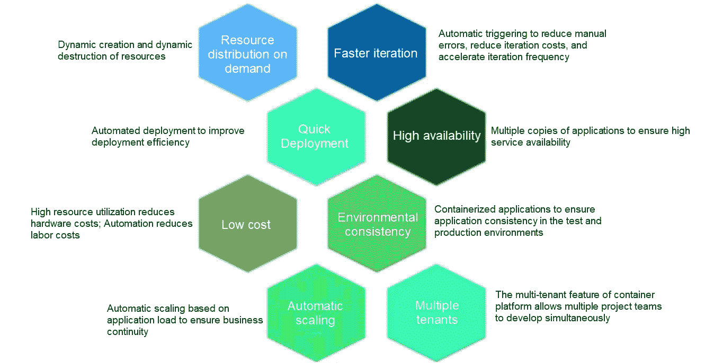

在我们继续讨论其他任何事情之前，让我们先来看看使用 DevOps 的用户的一些痛点。

# 难点 1:非差异应用程序版本的困难

在这些痛点中，第一个可能是用户纠结于如何使用 DevOps 在环境堆栈中自动提升应用的非差异发布。使用 DevOps，您通常有三个环境:测试环境、生产环境和预发布环境。对于一个应用程序，通常的场景是将不同的分支部署到相应的环境中。例如，主分支通常部署到在线环境，最后一个分支部署到预发布环境，其他开发分支部署到测试环境。目前，大多数实践是创建不同的作业，拉出不同的源代码分支，并将其部署到不同的环境，或者使用相同的作业，并添加不同的构建参数来确定如何构建和发布。然而，这些实践对于初学者和有经验的用户来说都是相当困难的，因为这些实践不容易管理。只需查看下图中涉及的所有步骤:

# 画点二:严格的门禁

很多用户的第二个痛点是，生产环境的发布权限一般需要严格控制，通常只有应用管理员或 O&M 管理员必须拥有生产发布权限。在与一些客户的交流中，我了解到使用的一种实现方法是在同一个 CICD 环境中创建不同的作业，然后根据角色访问控制策略隔离这些作业，以便只有具有管理员权限的人员才能看到用于生产发布的作业。然而，一种更直接、更简单的方法(处理不太严格的访问控制)是专门为产品发布创建一个 CICD 环境。然而，这种方法也不是完美的，因为它浪费了资源，降低了应用程序迭代的频率。

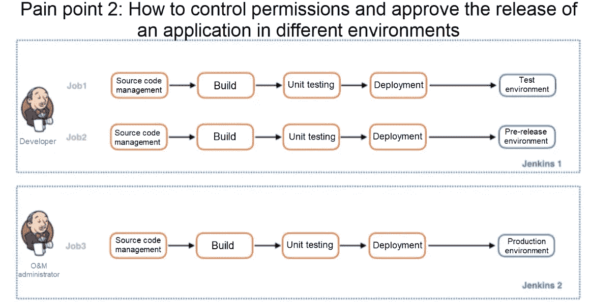

# 难点 3:增加迭代频率的困难

第三个痛点是，用户发现很难提高应用程序迭代的频率，也很难专注于新业务或创新业务的扩展。造成这种困难的一个原因是，开发人员在运行的应用程序或这些应用程序的测试结果之间的同步和反馈过程中看到了差距。此外，当在线业务遇到问题时，他们需要找到一种方法来快速定位、重现和回滚问题，这对于这种模式来说也不容易。

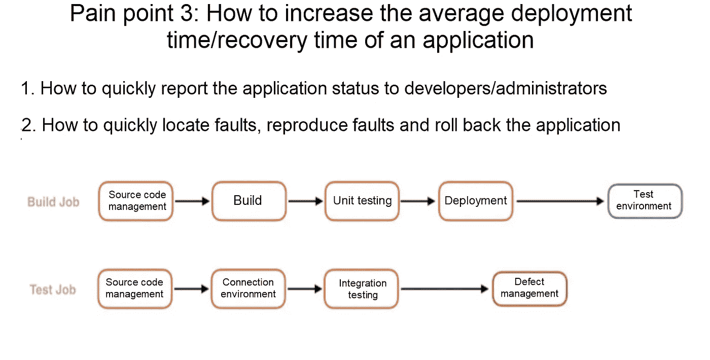

# GitOps 如何工作

这三个痛点都只是我了解到的与用户沟通的几个痛点。现在，让我们重新审视这些痛点，看看 [GitOps](https://www.weave.works/technologies/gitops/?spm=a2c41.13239679.0.0) 模型是如何设计的，以及它如何改进整个开发过程。

让我讨论一下设计 GitOps 发布模型时的一些核心需求。第一个需求是版本管理。我们希望每个发布的应用程序的版本号可以与 [GIT 提交 ID](https://git-scm.com/book/en/v2/Git-Basics-Viewing-the-Commit-History?spm=a2c41.13239679.0.0) 相关联。这样做的好处是，每个更改都有一个可以跟踪的历史记录，因此可以更快、更容易地定位和修复故障。第二个需求是更好的基线管理系统。在这篇博客的后面，我们将详细讨论两种类型的基线管理系统。第三个需求是如何更好地实现安全发布——这包括发布许可管理和安全批准过程。最后一个需求是如何更好地让开发者快速获得反馈。以下是这些需求的简要总结:

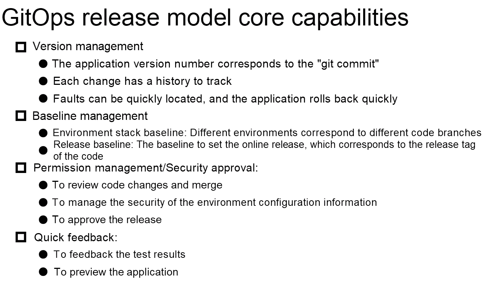

# 更简单、集中的版本管理

讨论第一点，GitOps 的核心思想是将应用系统的声明式基础设施和应用程序存储在一个 [Git 存储库](https://blog.axosoft.com/learning-git-repository/?spm=a2c41.13239679.0.0)中。对应用程序的所有操作更改都来自 Git 存储库的更新，这也是 GitOps 这个名字的由来。这有助于简化整体结构。实际上，在过去，这在 DevOps 上是不可能的。我们可以将构建和部署应用程序的脚本和配置文件存储在与应用程序源代码相同的存储库中。这就带来了两个问题:开发人员可能需要维护部署脚本或配置文件，因此无法专注于产品开发。其次，部署脚本有时会涉及敏感的环境信息，并且不够安全。因此，为了便于管理，我们必须将应用程序源代码存储库与构建存储库分开。

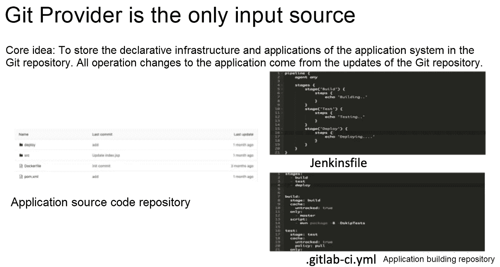

# 灵活、简单的基线管理

接下来，我们来看看基线管理。基线管理可以说分为两种:一种是环境栈基线。如图，设置是生产环境只能部署主分支的代码，预发布环境只能部署最新分支的代码，其他开发分支可以部署预览环境。这样，这里的预览环境也可以作为测试环境。但与此同时，每次开发分支通过测试验证并成功合并到最新的分支后，测试环境都会被动态破坏。这在 Kubernetes 容器集群中很容易实现。

然而，自然地，不同的策略可以用在特定的场景中。换句话说，基线政策有很大的灵活性。这个基线可以称为小基线。它被用作在预览版、预发布版和生产环境中管理应用程序进展的中心方法。大基线是针对在线发布版本的管理，可以确保我们在在线出现故障时，可以快速回滚到之前的稳定版本。这在产品发布管理中至关重要。在 GitOps 中，我们可以快速定位到准确的“git 提交”错误为了更好地了解这些基线，请考虑以下图表:

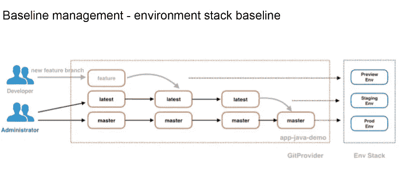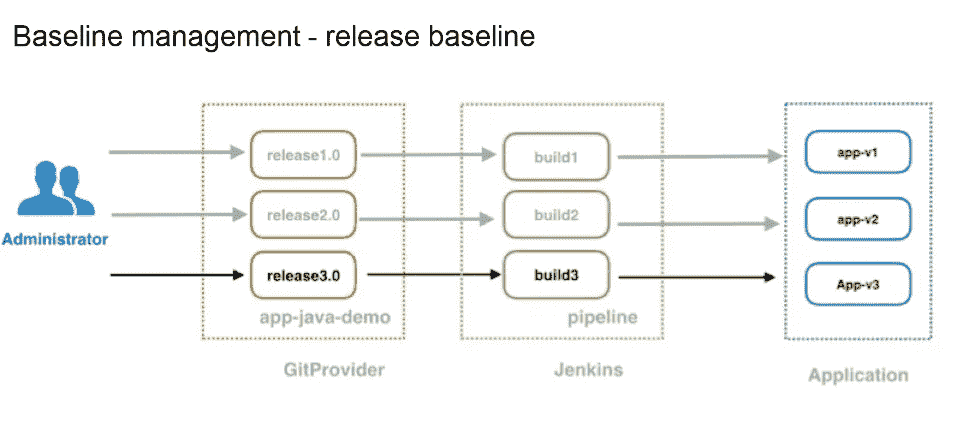

# 更简单的权限管理系统

现在，让我们快速浏览一下 GitOps 涉及的应用发布流程的权限管理和安全审批系统。GitOps 中的权限管理可以概括为通过控制代码合并过程来实现。在这个模型中，开发人员，或者非管理员，不需要对 CICD 环境有特殊的访问权限，比如对 Jenkins。相反，它们只需要查看日志的权限——这极大地简化了事情——如果您还记得我们讨论的与 DevOps 相关的复杂访问管理结构的难点的话。在 Git 端，开发人员只有将代码推送到开发分支的权限，但也可以将合并代码所需的权限应用到最新的分支，具体来说就是提交 MR/PR 的权限。在开发人员创建一个新的 MR/PR 之后，将触发建筑物将应用程序部署到预览环境中。管理员通过检查新分支的构建和部署是否通过了一系列测试和验证来决定是否接受这个 MR/PR。只有管理员接受 MR/PR 的合并后，最新的分支代码才会被重新构建，重新部署到预发布环境中，从而通过 MR/PR 的接受和拒绝，达到应用发布安全批准的目的。查看该图，全面了解其工作原理:

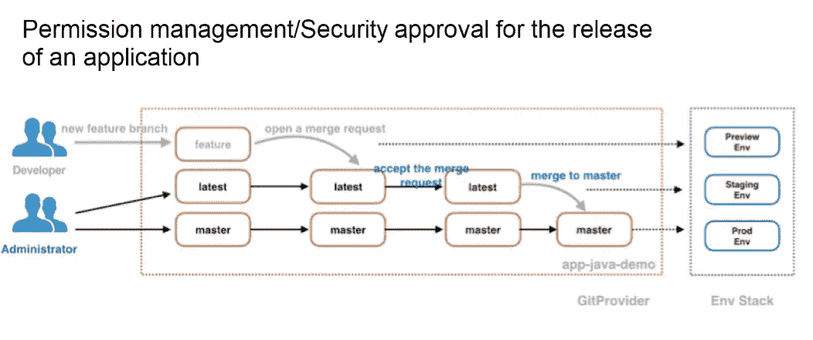

# 更快的反馈系统

最后说一下如何快速获得反馈，利用 GitOps 实现团队成员之间的互动。这包括两个部分:一个是在推送源代码后，开发者可以通过 email、DingTalk、Slack 之类的东西实时获取构建结果，更有效、更快捷地开发和测试自己的应用。另一部分是开发者可以在 MR/PR 页面上查看自动化测试的反馈，应用预览链接，以及其他团队成员的评论。下面是这个过程的可视化:

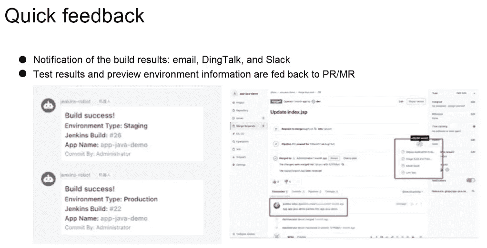

# GitOps:整体架构

本节中的下图是使用 GitOps 管理应用程序发布到不同 Kubernetes 集群的整体架构和时间顺序图。首先，应用程序源代码与构建源代码是分离的。在顶部可以看到一条虚线。虚线以上的部分是普通开发者可见的，他们有权限在这部分操作。剩下的部分是管理员有权限操作的地方。绿色区域是詹金斯的流水线任务。开发人员没有权限在 Jenkins 环境中创建作业或构建作业，但只有权限查看日志来构建作业。这个常见的应用程序在 Git 存储库中。

它有不同的分支，有一定的集合关系。每个构建(比如预览管道和生产管道)都将从另一个 Git 存储库中完成，在那里可以存储一些信息。只有应用程序管理员可以看到这些信息，普通开发人员没有权限查看。然后，我们需要设置应用发布环境堆栈。在本例中，我们有预览环境、预发布环境和生产环境的设置。在预发布环境和生产环境中发布应用程序需要管理员的安全批准。

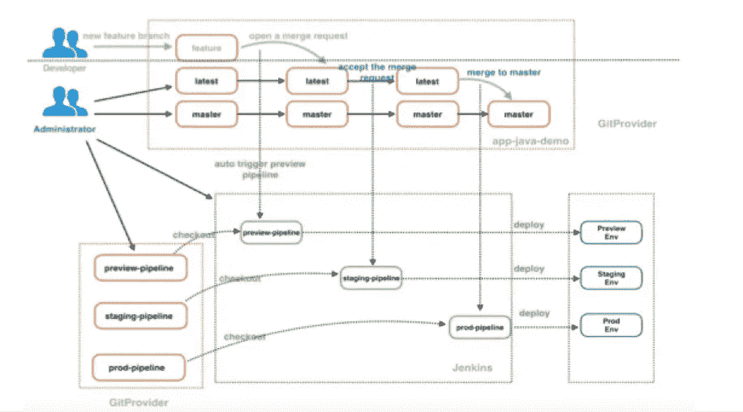

最后，这是一个时序图。开发人员提交一个新特性，并创建一个指向最新分支的 MR。然后，创建 MR 的动作将触发预览管道的构建，并且该构建将提取预览管道的构建库。构建存储库存储构建脚本和要部署的环境的信息。

然后，执行自动构建过程。首先，从应用程序源代码库中拉出应用程序源代码，用于构建、静态代码测试和单元测试，并将测试结果反馈给 MR，然后，将容器映像打包并推送到映像库。最后，通过文件将应用程序部署到 Kubernetes 集群上，并进行功能测试。测试结果也反馈给 MR，部署后收集相关应用信息，通过 DingTalk 发送给开发组。收到 DingTalk 通知后，开发者可以点击链接查看应用状态。如果存在问题，他们可以重新开发并重新提交应用程序，并重复之前的过程。如果不存在问题，他们可以请求管理员批准并将代码合并到最新的分支中。当更新了最新的分支和主分支时，将触发一个类似于先前构建过程的过程，以将应用程序推送到预发布环境和生产环境。

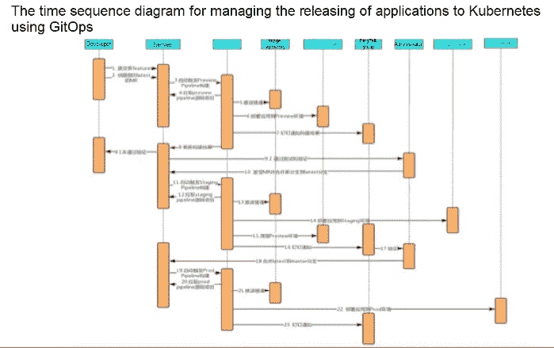

# 原始资料

 [## GitOps 如何解决客户的棘手问题

### 阿里巴巴容器服务 2019 年 7 月 29 日 149 由刘胜解决传统应用常见痛点…

www.alibabacloud.com](https://www.alibabacloud.com/blog/how-gitops-is-solving-customer-pain-points_595155?spm=a2c41.13239679.0.0)