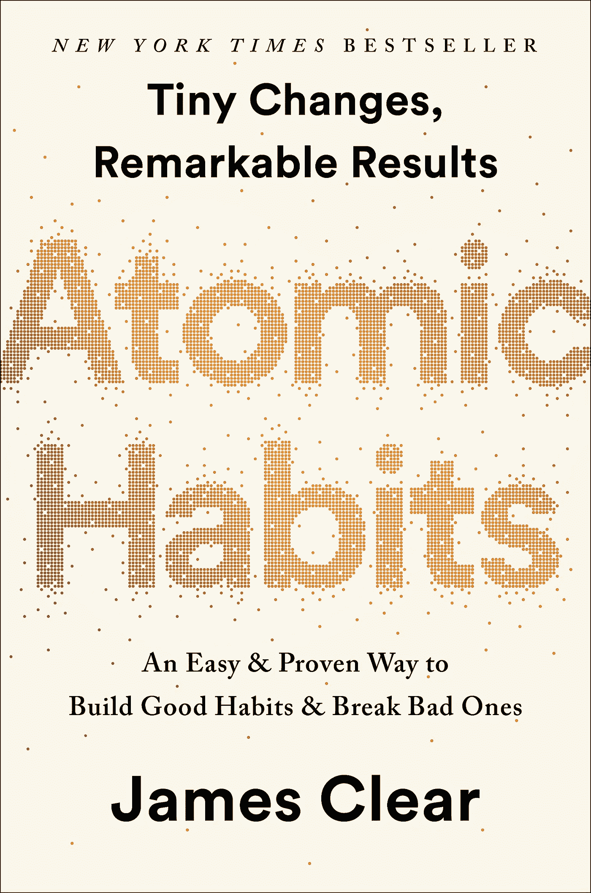
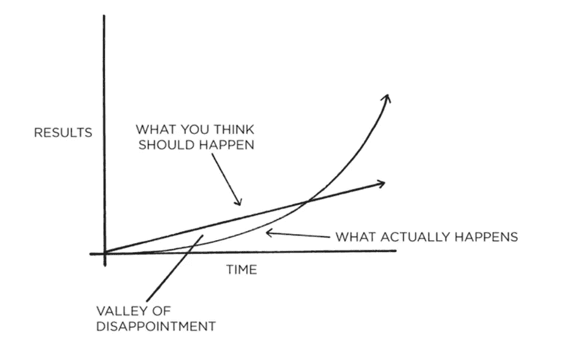

# 好习惯如何导致惊人的结果——詹姆斯·克利尔的《原子习惯》

> 原文：<https://medium.datadriveninvestor.com/how-good-habits-lead-to-astonishing-results-atomic-habits-by-james-clear-4c5fac3d505f?source=collection_archive---------4----------------------->

James Clear 的《原子习惯》是一本全面的指南，讲述了如何利用好的习惯和渐进的改进，随着时间的推移，可以产生实质性的结果。

 [## 成功人生的 25 种自我提升方式|数据驱动的投资者

### “我活得越久，学到的就越多。学的越多，体会的越多，知道的越少。”―米切尔·莱格兰德时间到…

www.datadriveninvestor.com](https://www.datadriveninvestor.com/2019/03/12/25-self-improvement-ways-for-a-successful-life/) 

你是否经常发现很难保持良好习惯的一致性？当你开始一个建立良好习惯的新旅程时，比如每天锻炼，你是否发现自己在几天后失去了动力？你开始怀疑培养好习惯是否真的值得你付出所有的汗水和努力？

请记住，尽管这篇文章可能回答了你所有关于习惯堆积的问题，但这些答案毫无意义，我甚至认为，除非你付诸行动，否则毫无用处。

# **习惯的力量**

> 1.01 ** 365 = 37.789
> 
> 0.99 ** 365 = 0.03

詹姆斯清楚地(哈哈，没有双关语)概述了**微小的变化如何随着时间的推移积累成非凡的成果。每天提高 1%，一年后你会比现在的自己提高 37%。相比之下，一年中每天差 1%会让你回到零。这就是习惯如此强大的原因。好习惯会让你的生活变得更好，同样，坏习惯会毁了你的生活。**

# 坚持不懈是区别

为什么我们很容易养成坏习惯，却很难养成好习惯？简单的答案是，坏习惯给我们带来了立竿见影的效果，满足了我们的即时满足感，而源于好习惯的结果却被推迟了。我们很容易坚持像吸烟这样的坏习惯，因为它给我们提供了即时的缓解。我们都知道吸烟和肺癌之间的密切关系，但人们仍然选择吸烟，因为其负面影响往往在戒烟时已经太晚了。

We think the results of our efforts are linear, but they are actually compounded exponentially. This means that there exists a period of time termed the valley of disappointment in which you never seem to experience any tangible results after putting in a substantial amount of effort. The Plateau of Latent Potential is the point in which your efforts finally translate into results and begins to surpass your expectations.

人们普遍认为进步或相反，恶化是线性发生的，但实际上它是指数复合的。我们经常感到沮丧，因为我们的努力不会自然而然地转化为进步。

被称为“失望之谷”的现象指的是这样一段时间，在这段时间里，我们感到非常沮丧，以至于我们想要屈服于我们的环境，因为我们努力的结果还不明显。*这就是我们为什么放弃的根本原因，这主要是因为* ***我们不坚持。重要的是要明白成功不是短期投资，你努力的全部价值通常要比预期的晚很多才会显现出来。***

一旦结果显现出来，这是成功的决定性时刻，你就会明白你努力的真正价值远远超出你的想象。作为他人成功的旁观者，我们经常看到光明的一面，如名誉、财富和权力，但我们很少看到成功人士所经历的努力和不眠之夜。我们甚至喜欢把别人的成功说成是“一夜成名”。然而在现实中，没有什么实质性的东西可以在一夜之间积累起来。我们看到的是人们生命中的决定性时刻，他们的突破时刻，这让我们感到气馁。

随着社交媒体每天以关于一切的完美场景分散我们的注意力，我们很容易忘记成功不会在一夜之间到来，除非我们努力奋斗，否则这不是真正的胜利。不要放弃，再坚持一会儿，你的努力总会有回报的。

有些人失败的原因是因为他们屈服于潜在的高原。你努力的真正价值不会被破坏，**相信只要有毅力和耐心，你的努力一定会有回报。**

# **你失败是因为系统有问题**

如果所有的企业家都有一个相同的目标，那就是将他们的创业公司发展成独角兽公司，那么为什么大多数人失败了，而其他人却成功了呢？

> “你没有达到你的目标。你会下降到你的系统的水平。”—詹姆斯·克利尔

目标设定的积极结果只在短期内有效。长期结果的关键依赖于一个好的系统。你的目标不是你生活的目的，但你的系统是你的生活。当你跑完马拉松，或者赢得一笔 1000 万美元的交易后，会发生什么？如果你是一个目标导向型的人，你很可能会失去动力和动力。相反，开发一个好的系统，并坚持不懈地坚持下去，将会每天都有进步，带来不可思议的结果。

忘记通过设定目标来激励自己，而是专注于建立一个可行的、有效的系统。例如，企业家的系统是他们如何招募人才，以有效的方式运作，设计产品，营销产品，等等。作为一名企业家，你的主要关注点应该是如何开发一个专门为你的公司设计的高效系统。

> "修正输入，输出就会自我修正."—詹姆斯·克利尔

有了功能系统，你不需要设定目标就能成功。结果会自动反映到您的系统中。最大的问题是**我们如何**建立一个好的系统？

# 你的身份是一个好系统的关键

你的习惯反映了你的身份。你的习惯证明了你是谁。正如 James Clear 所说，你的行为是对你将成为什么样的人的投票。如果你不想成为被诊断为肺癌的病人，不吸烟可能是明智的。如果你是一个想戒烟的烟民，你必须首先改变自己。如果你想戒烟，那么你应该把自己表现成一个不吸烟的人，而不是一个正在努力戒烟的吸烟者。比方说，一个朋友走到你面前，问你是否想吸烟，如果你认为自己是一个正在努力戒烟的吸烟者，你可能不会成功拒绝他们，因为这意味着你仍然是一个吸烟者。相反，如果你认为自己是一个不吸烟者，你会发现自己更成功。

**完善你的身份是打破坏习惯、培养好习惯的最有效方法。**让我们以 Jessica 为例，她正在为即将到来的马拉松做准备，但她从未能让自己通过紧张的训练。对她来说，解决办法是专注于完善她的身份，然后在行动中强化她的信念。对杰西卡来说，重要的是要明白她之所以努力训练，是因为她是一名跑步者。当她相信她确实是一个跑步者时，她的行动会与她的信念一致，这将帮助她通过训练推动自己。类似地，如果你想要更健康的生活方式，重要的是要明白你是一个健康的人，而不是一个不健康的人想要更健康。如果你想养成每天学习的习惯，你要相信你学习是因为你是一个优秀的学生，而不是因为你没有达到你想要的成绩。理解你的身份不是静态的，而是动态的，这一点极其重要。

**要成为最好的自己，你必须根据你一生的学习经历不断调整你的身份**，无论这是通过你自己的错误还是别人的证词。

# 从小处着手，建立一个轻松的习惯

短期内不可能积累任何实质性的东西。成功是无数个通宵的积累。永远不要认为人生是一项短期投资，如果你想成功，你必须做长期的投资。

沃伦·巴菲特成功的秘诀在于，他只关注投资的长期轨迹，从不考虑赚快钱。

> “如果你不打算持有一只股票 10 年，那就别想持有 10 分钟。”—沃伦·巴菲特

忘记围绕短期愿景建立你的习惯。好习惯不是立竿见影的效果，比如 3 天内减掉 30 磅，一周训练后跑马拉松，一周内写完一本书，等等。从小处着手，养成几乎不费力就能坚持的习惯是很重要的，因为这有助于保持动力。如果你从雄心勃勃的习惯开始，这很快就会积累成压力，导致你失去动力。经验法则是始终确保你的目标新习惯在 5 分钟内完成。例如，2 分钟的慢跑是一个非常简单的任务，对我们来说非常容易完成。如果你开始每天慢跑一段时间，穿上跑鞋开始慢跑将很快成为你的第二天性。有一天，你可能会发现自己已经连续跑了 2 英里，却没有意识到这一点。从每天 2 分钟开始，最终你会达到每天 2 英里。相比之下，如果你从每天 2 英里开始，你将很容易回到每天 2 分钟。

> “现在你成功与否并不重要。重要的是你的习惯是否让你走上了成功之路”——詹姆斯·克莱尔

# 利用您的环境

把你的环境想象成你习惯的触发点。如果你不得不克服困难去养成某个习惯，那么保持动力将会非常困难。

例如，我想养成多喝水的习惯。我不怎么喝水的主要原因要追溯到我的环境。如果我在我的房间里，我想喝水，我必须走到楼下我的厨房拿一杯水。这可能让我听起来真的很懒，但得到一杯水的过程中所涉及的摩擦让我不愿意喝水😅。为了抵消我的环境，我决定在我的房间里放一个大水瓶。因此，身边总是放着一个水瓶，我喝了更多的水。这只是一个简单的例子，说明你的环境如何影响你的行动。

如果你的环境可以帮助你建立一个好习惯的常规，它也可以帮助你打破坏习惯。例如，如果你经常发现自己浪费食物，因为你倾向于用比你的胃能处理的更多的食物填满你的盘子，下次尝试使用更小的盘子。如果你想减少垃圾食品的消费，试着把它们放在冰箱顶上或者需要梯子才能够到的地方。

你的环境不仅包括物品和家具，还包括你周围的人。你的家人、朋友和社区都在塑造你的过程中扮演着重要的角色，正如我们所讨论的，这会影响你的习惯。你是否经常模仿你最好的朋友说话的方式？你有时会发现自己在模仿同龄人的做法，这样你就不会感到被冷落了吗？同伴压力是你周围的人如何对你施加影响的主要例子。这就是为什么从支持你的朋友中辨别出有毒的朋友，并明智地选择你大部分时间和谁在一起是至关重要的。

# 在现有习惯的基础上融入新习惯

将你的习惯统一到你甚至没有意识到是你的习惯的日常任务中，也被称为习惯堆积，这是一个帮助你保持动力的伟大策略。将新习惯与现有习惯联系起来，可以提醒你**强化它们**。当你刚刚开始适应新的生活习惯时，我们可以想出无数的借口来让我们忘记坚持下去。习惯堆积的力量在于它减少了培养新习惯的计划量。从本质上说，习惯堆积将这个过程简化为一个简单的例行程序，它与你每天已经习惯做的事情相关联。例如，如果你每天都遛狗，试着在散步后做一分钟的平板运动。如果你每天刷牙，试着在刷牙后马上用牙线清洁牙齿。如果你每天都吃晚饭，为了避免堆积如山的盘子，试着吃完后马上洗碗。如果你每天开车上班，那么在上路之前，试着冥想 1 分钟。这些简单的添加到现有的习惯中，当结合在一起时，可以达到指数级的增长。

# 不要依赖动机

成功背后的真正驱动力不是动机，而是抵抗无聊的能力(T2)。动机也许能帮助你实现你的短期愿景，但从长远来看，它毫无帮助。成功的关键是在你的一生中坚持和保持动力的能力。动机可能会有效地让你摆脱生活给你的借口，但从长远来看，它没有任何意义。

作为一名运动员有天赋是很重要的，但是光有天赋还不足以区分成功的运动员。这一切都归结于他们的决心的转化，这是他们的辛勤工作。我总是对全职运动员有这样一个问题，他们每天是如何完成同样的训练程序的？每天完成同样的锻炼不会带来动力，让你度过难关的是抵抗无聊的神奇能力。

# 我的主要收获

*   每天 1%的改进最终会带来突破
*   不要因为没什么结果就放弃
*   关注长期成功
*   重要的是不断完善你的身份，成为最好的自己
*   目标要小，从让你的习惯尽可能轻松开始
*   让你的环境成为你的朋友，而不是敌人
*   在现有习惯的基础上培养新习惯
*   不要让无聊拖累你

感谢阅读！希望你在我的文章中发现了价值！记得留下几个掌声，在 [LinkedIn](https://www.linkedin.com/in/joey-mach-6293b1175/) 上关注我！