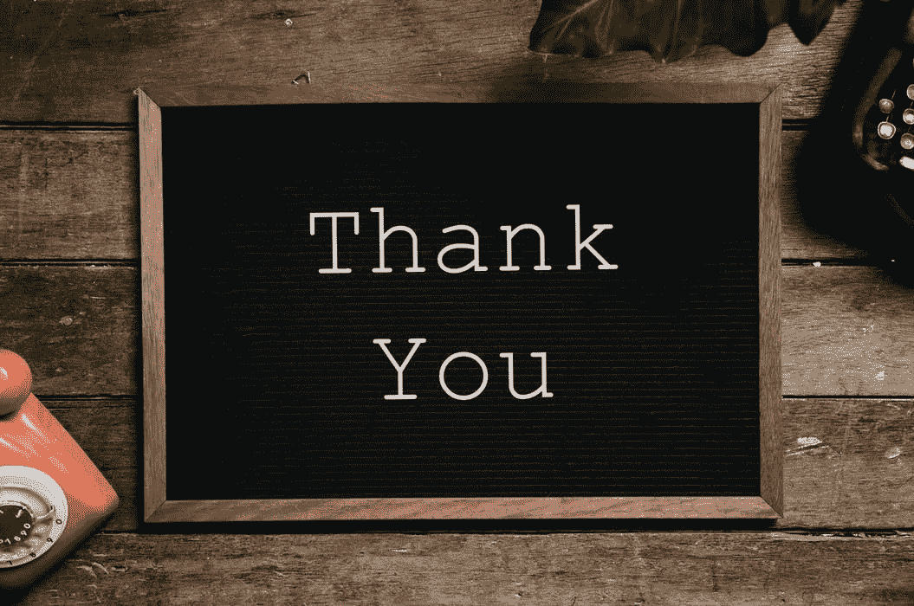

# 感恩是生命的货币

> 原文：<https://medium.datadriveninvestor.com/how-gratitude-is-the-currency-of-life-de24f0fb7b33?source=collection_archive---------14----------------------->

> ***“我们应该感谢生活中的每一件事和每一个人。让善良成为我们为我们在地球上占据的狭小空间支付的一笔小小的租金。”***

说到感恩。我们进行了一项实验，实验中人们被分成两组。第一组被告知要表现出一些感激之情，并多说“*谢谢你*”。而第二组应该表现得毫无感激之情。

我们开始了实验。两组人都被介绍给了其他人，而他们对我们的实验一无所知。第一组的人被告知分散在海滩附近，与陌生人交流，询问他们可以去的不同地方，可以看的电影，可以吃东西的餐馆以及任何他们想谈论的话题。我们非常仔细地观察了第一组人。他们在交谈中表现出绝对的感激，并按照要求行事。一切似乎都很好。他们中的一些人甚至与海滩上的人建立了永久的联系，并交换了电子邮件 id 和电话号码，以便将来联系。这是实验的第一部分。

接下来，我们让第二组的人散开，进行他们想进行的任何类型的对话。因为他们不应该表现出感激，不应该非常感激和高兴，所以他们只是做了他们被告知要做的事情。他们询问人们附近可以去的不同地方，一旦得到答案，他们就开始离开那个人。他们对与他们谈话的人毫无感激之情。在这样做的时候，海滩上的人们看到这个人的这种行为感到非常惊讶。他们的肢体语言表明，如果这是人们的行为方式，他们不会有兴趣与任何其他陌生人交谈。这是我们实验的另一部分。

你看出两组人的区别了吗？

一组表现出对人的感激和感恩，另一组表现出漫不经心的态度。

你认为其他人会喜欢和哪一群人在一起？

很明显，与第二组的人相比，第一组的人会更成功地与他人建立更健康的联系。感恩就是这样运作的。

> ***“人都希望被尊重，期望遇到善良的人。”***

# 表示一些感激

从我们的实验中可以看出，第一组的人更有可能与他们交往的人联系在一起。在今天的世界里，你要建立良好的人际关系。

良好的关系会在你需要的时候帮助你。他们会帮助你创造或发现新的机会。这是一种结交新朋友、认识人和从不同思维模式思考的方式。

表达感激并不难。多练习说“谢谢”就好了。

有人帮助你完成了未完成的工作？说谢谢。

有人让你扶着门先进屋？说谢谢。

当你练习更多地说“谢谢”时，你往往会获得积极的能量和对你周围的好事和人的想法。

感激是会传染的。下一次，其他人也会以类似的方式帮助你。感恩就是这样运作的。它有助于建立生活中的联系。它有助于建立健康的关系。

别人会觉得你是个好人，会夸你。这就是为什么感恩是生命的货币。它帮助你建立联系，让你成为一个更好的人。

> ***“感谢阅读”。***

# [这是我所有个人理财和生产力文章的清单](https://medium.com/@abhilashgupta8149/personal-finance-articles-index-30e48fcc6075)

如果您对个人财务和资金管理有任何疑问，我希望收到您的来信。

**感谢阅读。如果你喜欢这篇文章，请随意点击那个按钮👏帮助其他人找到它。**

# 然后..

 [## 为什么个人理财是一个社会禁忌

### 你是否发现很难与你的朋友或亲戚分享你的个人财务状况？为什么你觉得很难…

medium.com](https://medium.com/@abhilashgupta8149/why-personal-finance-is-a-social-taboo-350cd4abcfb6) 

*最初发表于* [*FinCalC 博客*](https://fincalc-blog.blogspot.com/2018/11/How-Gratitude-Is-The-Currency-Of-Life-fincalc.html)