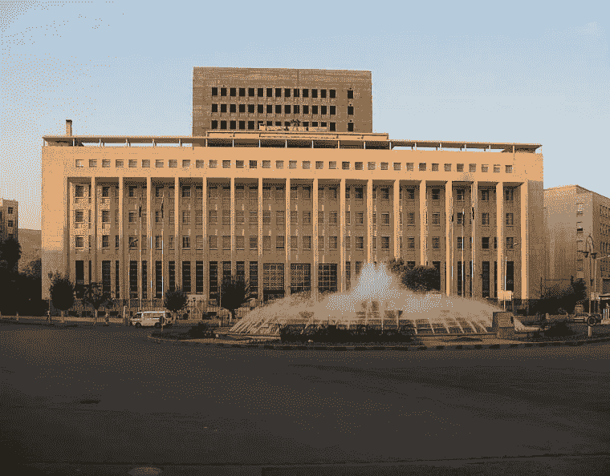

# 叙利亚银行是如何成功抵御制裁和战争的

> 原文：<https://medium.datadriveninvestor.com/how-have-syrian-banks-succeeded-against-sanctions-and-war-a1233508972e?source=collection_archive---------3----------------------->

Syrian Central Bank in Sabaa’ Bahrat Square, Damascus

在过去的八年里，叙利亚因战争、爆炸、经济下滑而成为头条新闻。然而，我们从未听说过任何关于金融行业或银行业的消息。在经历了大约八年的毁灭性战争和阻碍国际制裁后，我们似乎越来越接近尾声，叙利亚经济遭受了沉重打击，但叙利亚银行经受住了制裁风暴，尽管美国和欧盟曾相信。

为了调查这种弹性，我与不同的叙利亚经济分析师进行了交谈，并研究了上市银行共享的财务报表(尽管有些银行最近一次报告是在 2014 年。)我发现，尽管叙利亚银行(包括私人和公共银行)确实遭受了沉重打击，在经济萎缩、国际制裁和缺乏公共和私人投资的情况下苦苦挣扎，但六家国有银行都没有暂停运营。此外，14 家私人银行——主要是沙特阿拉伯、黎巴嫩、巴林、约旦、卡塔尔和科威特的地区性阿拉伯银行的子公司——已经决定按兵不动，等待冲突的解决，以便能够长期留在该国。这些银行在暴力横行的城市中经历了分行和办事处的毁坏、抢劫、对其外汇业务的更严格检查以及一些员工的贪污。

为了理解这种弹性，我们回顾一下 2011 年之前的十年里中国银行业的巨大变化。2000 年巴沙尔·阿萨德总统当选后，政府于 2003 年初决定放开银行业，结束了自 1960 年代叙利亚私营银行国有化以来对金融系统的垄断。叙利亚经济迈出的第一步是政府走向社会市场经济计划的一部分，目标是最终采纳资本主义市场原则。

三十年来，叙利亚一直是民粹主义结构。然而，在 2000 年代早期和中期，有一场运动试图将这种结构改变为新自由主义经济结构，旨在将公共资产转移到资本家网络——就像俄罗斯的寡头一样。在后民粹主义时代放弃社会主义政策之后，大马士革证券交易所(DSE)于 2009 年成立，并于 3 月 10 日启动。2010 年，从 1 月 1 日到 5 月 18 日，叙利亚市场上涨了 12.6%，相比之下，约旦安曼上涨了 1.3%，邻国黎巴嫩贝鲁特表现平平，阿联酋迪拜下跌了 3.6%。事实上，领先的 DSE 指标已经超越了中东地区的所有其他指标。即使在 2011 年之后，在该交易所上市的公司数量仍在增长，目前包括 26 家公司，涵盖服务(2 家)、工业(1 家)、银行(14 家)、保险(6 家)、农业(1 家)和电信(2 家)等行业。电信股是最后两次增加，发生在 2019 年。叙利亚电信在 1 月份首次公开募股，MTN 在 2 月份首次公开募股。

金融体系的改革并不意味着取消该国的公共银行。虽然叙利亚只有 6 家国有银行，而私营银行有 14 家，但就资产、业务和服务而言，叙利亚商业银行(المصرف التجاري السوري‎)仍是叙利亚最大的银行；哥伦比亚广播公司的资本为 70 亿叙利亚镑(SYP) —按 45 美元/SYP 的汇率计算，冲突前价值约为 15.5 亿美元。这在很大程度上是由于政府金融交易和银行存款的集中化，使 CBS 垄断了最大的雇主和投资者:政府的预算和收入。

新建立的叙利亚私人银行系统将公共银行的垄断市场份额重新分配给私人银行，同时保持一定程度的保护主义，因此国有银行保持了其银行服务垄断地位。这种安排是苏格兰圣安德鲁斯大学国际关系和中东政治教授雷蒙德·欣内布什所说的“中间道路”的一部分，即允许私营部门扩张，同时改革国有企业。

就像世界上任何地方一样，蓬勃发展的私人银行吸引了有政治背景的商人，包括前政治家和高级安全官员，他们是外国机构投资者的天然合作伙伴，在 2010 年之前，叙利亚人必须拥有 49%的股份才能获得经营许可。世界银行的一份报告观察了埃及裙带公司之间错综复杂的所有权结构和共同投资。对公开上市银行在 DSE 上的披露进行的彻底审查显示了类似的趋势，其中著名的叙利亚商人(有些已被制裁)是董事会成员，并在多家银行拥有大量股份。

为了孤立叙利亚政权，美国和欧盟对数十名安全官员、政客和商人实施了制裁，其中一些人是这些私人银行的股东和董事会成员。制裁旨在破坏该国商业和政治之间的密切联系，并在这些紧密结合的关系之间制造裂痕。然而，这一政策在很大程度上失败了。这些商人大多在中国有大量投资，超过了他们的海外资产和商业利益。他们与执政的政治精英有着千丝万缕的联系，这使得他们高度关注政权的存亡。制裁并没有导致足够数量的商人放弃政权。尽管只有极少数银行决定从这些银行撤资，但其他银行实际上增加了投资，尽管存在严重的运营、安全和声誉风险。冲突结束后，他们所做的大量投资以及对私人和国际资助的全国重建计划的需求将超过从该国撤出的前景。

最近，阿拉伯联合酋长国重新开放了他们在大马士革的大使馆，据说更多的阿拉伯大使馆正在寻求重新开放。美国宣布从叙利亚撤出大部分军队。随着我们越来越接近尾声，银行将在叙利亚的重建中发挥至关重要的作用。

华盛顿邮报的拉沙德·阿尔-卡坦