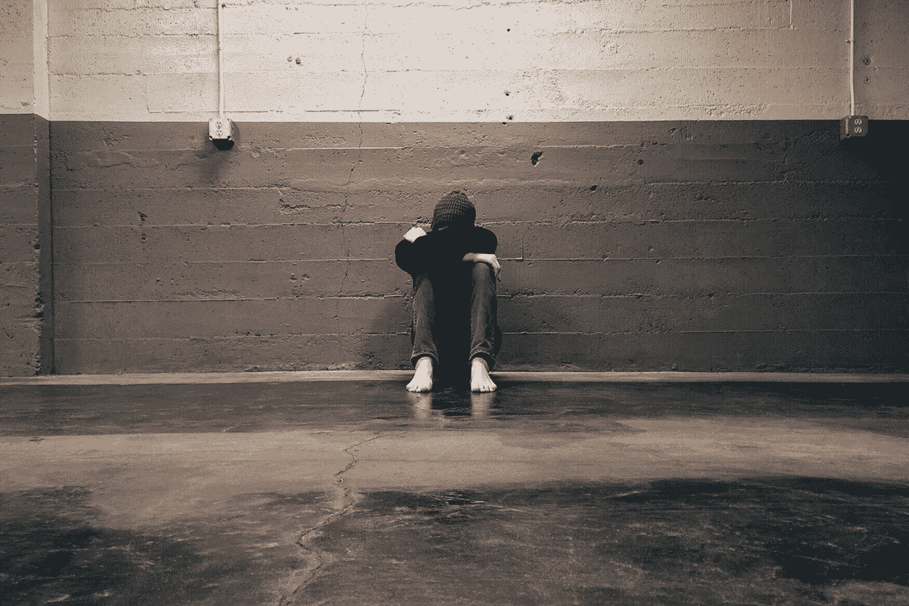

# 我如何战胜焦虑

> 原文：<https://medium.datadriveninvestor.com/how-i-beat-anxiety-f76433e2a927?source=collection_archive---------17----------------------->

在成长过程中，我总是被称为“令人毛骨悚然的安静的孩子”，因为我一直在与发育障碍作斗争。我很少向别人敞开心扉，因为他们会不断指责我缺乏社交意识。随着年龄的增长，我很幸运地形成了一个亲密的朋友群体，我觉得我可以向他们倾诉而不会被评判。今天，我住在全国各地，但我仍然每天设法在短信群聊中给所有的朋友发短信。经历了八年级，我觉得我终于开始打破我的外壳，交朋友，这是一种我通常会感到不舒服的情况，但这一切都在一天内改变了。

一天，我放学回家，看见草坪上有一个出售的牌子。这没什么大不了的，因为我知道我父母想卖掉房子，他们想搬到加州，但是他们之前已经卖了两次了，都没有成功。我想我已经脱离险境，并将在弗吉尼亚度过余生。我错了。我妈妈想搬到加州去照顾她生病的母亲，她和我爸爸决定他们愿意大幅降价来达到这个目的。我想我从来没有比那天哭得更厉害过。

 [## 决策的移情设计方法如何工作——数据驱动的投资者

### 移情设计是一种产品设计方法，首先由多萝西·伦纳德和杰弗里·雷波特在哈佛大学提出

www.datadriveninvestor.com](https://www.datadriveninvestor.com/2018/07/18/how-the-empathic-design-method-of-decision-making-works/) 

加利福尼亚对我来说是一个全新的世界。除了偶尔的暑假，我从来没有去过加州很长一段时间。我没有土地，没有网络，没有朋友，我所拥有的只有我的家人和一个栖身之所。那时我的焦虑达到顶峰。整个午餐时间，我都在校园里转圈，因为我不想被人看到我一个人坐着，而且我从来不在课堂上说话，除非老师叫我回答问题。直到开学 6 个月，我才交到一个单身朋友。那个朋友最后成了我最好的朋友之一。但是焦虑仍然伴随着我。我的手不停地出汗和颤抖，当我被迫说话时，我的声音颤抖。我从来没有勇气去接近我想交朋友的人。

随着时间的推移，我变得越来越舒服，但我仍然被广泛称为“安静的孩子”我交的这个朋友对我成长的帮助超出了我的想象，我非常感谢他为我做的一切。最终，在我大三的时候，我意识到我不能继续反社会了。这是我的意识和焦虑的心理障碍之间的战斗。幸运的是，我有很好的自律能力，能够通过参加越来越多的活动来迫使自己慢慢走出舒适区。我开始去看足球比赛，然后去了返校节足球比赛，最后我甚至参加了学校的赛前动员会，这对那些有社交焦虑的人来说是一场噩梦。到了下半年，我交了不少朋友，但并非没有挥之不去的焦虑。

出于某种奇怪的原因，焦虑又回来了，我无法控制它。上课时我开始变得更安静，更少互动。几乎没有焦虑的时期是短暂的。

那年夏天，一位密友邀请我和他一起去健身房锻炼。这位朋友是一名职业棒球运动员，在他患上焦虑症并被迫进入小联盟之前，他的职业生涯很有前途。这并不罕见，但仍然非常不幸。一天，当我在电脑上看视频时，我妈妈走进我的房间，告诉我她给我报了一个烹饪班，试图帮助我“走出去”并结交朋友。我不知道为什么，但我失去了它。我有一个全面的恐慌发作和更多。我非常害怕面对和我同龄的陌生人，以至于我的身体和大脑都停止了工作。崩溃持续了足足 5 到 10 分钟，但我镇定下来，把自己锁在房间里。

第二天我和朋友去健身，我哥把我崩溃的事情告诉了他。只需要两个字:“谁在乎？”谁在乎别人怎么看你。谁在乎。没有人。每个人都有缺点。就像你一样。焦虑会让微小的错误看起来像是令人难忘的尴尬。他们不是。没有人有能力记住他们一生中的每一件事情，他们很可能会忘记或忘记让你尴尬的事情。这发生在每个人身上，这就是为什么你不应该为自己的尴尬感到羞耻。不要害怕出丑。

当然，这说起来容易做起来难，但这帮助了我。显然，焦虑可能是由许多不同的因素引起的，我学到的是，当我偶尔遇到焦虑时，深呼吸非常有帮助，将你的手或几个手指放在你的脖子上你的脉搏处，并专注于你的脉搏。然而，我最好的“应对机制”是意识到这其实没什么大不了的，也不是世界末日。我希望我的故事和建议能帮助你消除焦虑，因为我知道这会让生活变得困难。祝你好运！