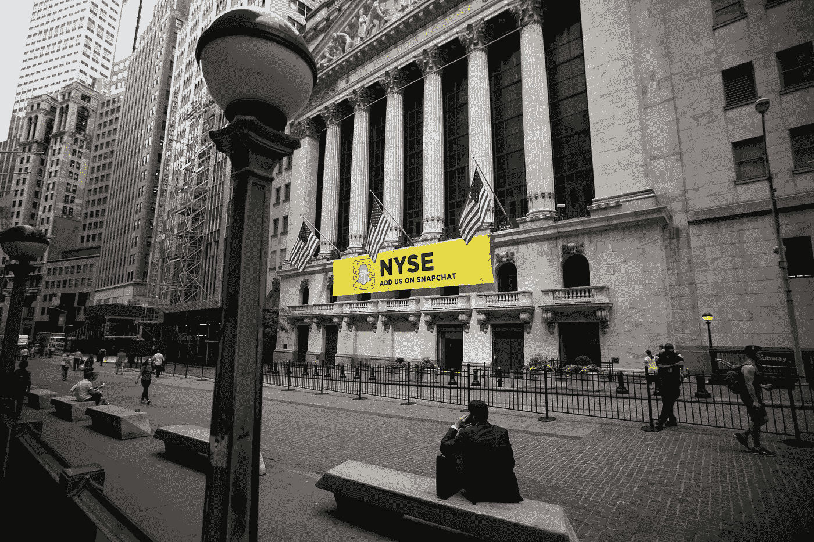
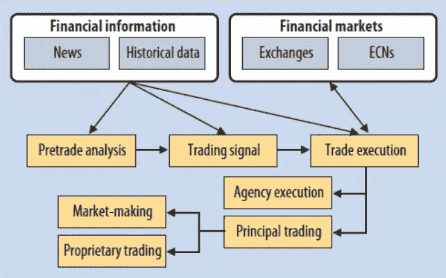
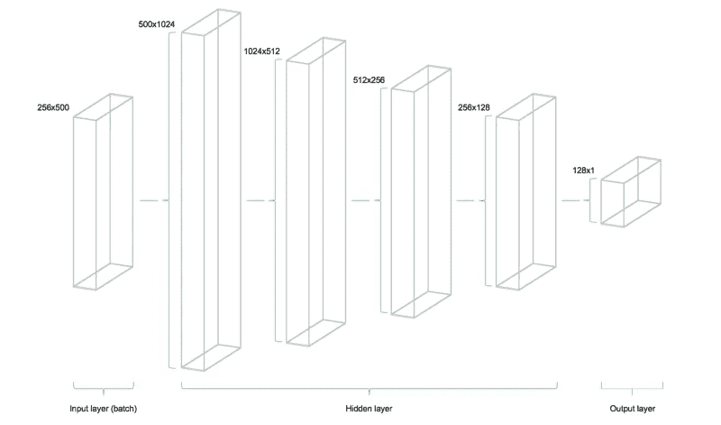
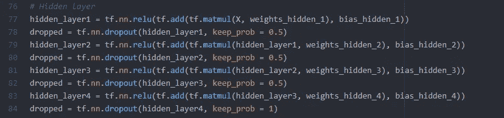
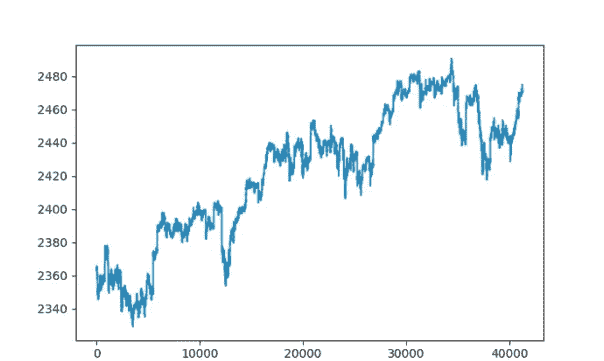

# 我如何使用深度学习建立一个模型来预测标准普尔 500 的价格

> 原文：<https://medium.datadriveninvestor.com/how-i-built-a-model-to-predict-prices-on-the-s-p-500-using-deep-learning-bde4745e5d86?source=collection_archive---------1----------------------->

[](http://www.track.datadriveninvestor.com/1B9E)

当大多数人想到投资银行和交易时，他们会想到一家公司，里面满是西装革履的银行家，他们一边疯狂地奔跑，一边大声叫卖交易，互相咒骂。一些人想象出了《华尔街之狼》中完全混乱的场景。事实是，这与事实相去甚远。对于对冲基金 Citadel Group 来说，平常的一天出奇地安静，尽管每天执行的股票数量超过了纽约证券交易所本身！认识一下新的华尔街交易员，高频算法交易平台。


For traders at Citadel, work can be far different from what most people expect. They only monitor trading platforms for any problems, and no trading is conducted by humans!

## **算法交易系统及其工作原理**

几乎每一个对冲基金、投资银行和私募股权公司都在使用这些策略，并且已经成为投资银行的标准。两只适马，一只完全依靠机器学习解决方案进行投资的对冲基金，管理着超过 500 亿美元的资产，使其成为世界第三大对冲基金。虽然算法交易，或使用计算机化系统来自动化交易决策，已经在金融业广泛使用了近 30 年，但最近一个主要因素开始发挥作用:人工智能。

在此之前，这些算法交易平台必须有特定的规则来决定何时买卖股票以及如何分配投资。如果一个程序员遗漏了任何完整的规则，可能会导致数百万美元的损失。有了机器学习和自然语言处理，这些模型不再需要依赖特定的规则，可以形成关于高表现股票的某些财务指标往往具有什么价值的模式，等等。然而，作为机器学习的结果，这些自动化交易系统的架构发生了重大变化。



A Basic Layout of A Algorithmic Trading Platform

## 算法交易平台的基本布局

大多数算法交易平台利用历史数据中的金融信息，如股票价格、金融指标等，来帮助建立交易前分析。随着自然语言处理的使用，许多平台现在也利用顶级公司如汤森路透、彭博等的金融市场新闻，来阅读和分配*情绪*，或确定新闻是否可以被解读为好或坏。利用这一点，我们的平台可以形成交易信号(买入/卖出/持有)，并在交易所或电子通信网络(ECN)上执行交易。这些平台已经成为所有银行和公司的标准做法，超过 70%的交易是通过计算机进行的。

意识到机器学习在这个行业中的巨大潜力，我决定通过开发一个深度学习模型来发展我的技能，使用来自谷歌金融 API 和 Kaggle 的时间序列历史数据来预测标准普尔 500 的股票价格。

# 我如何创建自己的价格预测模型

意识到机器学习在这个行业中的巨大潜力，我决定通过开发一个深度学习模型来发展我的技能，使用来自谷歌金融 API 和 Kaggle 的时间序列历史数据来预测标准普尔 500 的股票价格。回归模型最适合这种情况，因为该模型会输出股票未来价格的数值，以及它对预测有多大信心的概率。

## 设计网络架构



A Technical Illustration of the feedforward Network Architecture

我的模型的架构非常简单，是模仿一些研究论文和个人项目，尤其是斯坦福大学电气工程系的一些研究人员写的这篇优秀的[论文](http://cs229.stanford.edu/proj2012/ShenJiangZhang-StockMarketForecastingusingMachineLearningAlgorithms.pdf)。上图代表了该架构，因为它显示每批数据只从左向右流动。通过这篇文章，我决定使用均方差(MSE)，这是一种简单的方法，可以衡量模型预测和实际训练目标之间的偏差。


MSE is a simple yet effective way of obtaining the cost function of the network.

该模型的输入由二维矩阵组成，而输出是一维向量。这些占位符用于拟合我们的模型，因为`X`是 S & P 500 下所有股票的输入或股价，而`Y`是 S & P 500 未来一分钟的输出或指数值。

```
# Placeholder
X = tf.placeholder(dtype=tf.float32, shape=[batch_size, number_stocks])
Y = tf.placeholder(dtype=tf.float32, shape=[batch_size])
```

## 使用压差防止过拟合并提高精度

Dropout 是机器学习模型中的一种正则化技术，以防止神经网络*过度拟合*。过度拟合实质上是模型将训练数据模型化得更好。它学习训练中的细节和噪音，以至于对新数据(如测试和验证集)的性能产生负面影响。它的工作原理是随机选择神经元，然后随机忽略或“放弃”。对模型权重的任何更新，以及被忽略的神经元对正向传递的贡献，都不会应用于反向传播中的神经元。这迫使其他神经元不得不“介入”并处理对缺失神经元进行预测所需的任何表示。这产生了模型正在学习的多个独立的内部表示,并导致网络对神经元的特定权重变得不太敏感。网络能够变得更有泛化能力，并且不太可能过度拟合。如下所示，我将这一点整合到模型的所有四个隐藏层中，这有助于降低测试的均方误差。所用的退出率为 50%或 0.5，这意味着通过每次迭代，一半的神经元被随机“退出”。



Implementation of dropout throughout the hidden layer

## 我是如何训练模型的

该模型使用以. csv 格式编译的数据，包括 500 只股票的每分钟数据以及标准普尔 500 的股票指数表现。幸运的是，所使用的数据已经被清理和准备好了，上一次观察被结转，这意味着表中任何缺失的数据都将结转到上一次观察。80%的数据用于训练，其余的用于测试模型。

使用`pyplot.plot(data['SP500'])`显示时序数据:



在导入数据、定义占位符、变量、成本函数和 AdamOptimizer 之后，通过**小批量训练**来训练网络。这是我们从数据集中随机抽取样本并输入网络的地方。一批数据`Y`将流经网络的隐藏层，直到它到达输出层，在那里它与当前批中的目标数据`Y`进行比较。使用优化器和成本函数，模型更新其参数，如权重和偏差。每批数据都会重复这一过程。所有批次中的一次完整迭代被称为**时期**。

## 结果呢

模型在测试集上的表现，或者是被搁置的 20%的数据**没有被学习，而是被搁置。**为了可视化结果，我记录了每第五批的表现，并将其组合成训练过程的动画。由于目标被缩放，最终的测试 MSE 达到 0.00141，而绝对百分比误差为 7.57%，这是一个相当不错的结果。通过利用退出率和停止模型的标准，这比原始测试结果好得多，但我们还有许多其他方法可以优化模型的性能。当我们在下面的动画中查看结果时，我们可以看到，随着模型运行越来越多批次的数据，它开始学习数据集的模式，并更准确地预测股票指数的价格，直到它密切反映目标数据。

## 结论

利用算法交易平台，每分钟**进行上亿笔交易**。随着人工智能的进一步实施，特别是机器学习和自然语言处理，其在股票市场的使用只会继续扩大。虽然算法交易是大多数公司和交易所交易员数量减少的关键原因之一，但随着该行业走向自动化，人工智能的使用表明了其他一些东西；**对分析师和投资银行家的需求减少。**在顶级公司，如高盛，分析师的数量一直在下降，而对工程师的需求却在上升，以与顶级对冲基金如 Two 适马和 Citadel 竞争。可以说，机器学习将极大地颠覆这个行业。金融行业可能比以往任何时候都需要更多的科技员工。正因为如此，进入这个行业的人具备编程知识和技术技能比以往任何时候都更加重要。然而，对我们未来投资银行工作岗位的流失有一个积极的影响；金融科技初创公司和公司的涌入，承诺投资者手中有更多的透明度和控制权，并有机会为任何希望进入该行业的投资者创造公平的竞争环境。

## 关键要点

1.  算法交易占据了当今世界的大部分股票，并控制着市场。
2.  随着最近人工智能在这些平台上的实施，我们不再需要编写特定的购买/销售规则，而是允许这些模型学习模式并自行做出决定。
3.  算法交易平台使用一系列模型，如用于情绪分析的基于 NLP 的模型，以及用于未来股票价格的回归模型，来生成交易信号。
4.  在算法交易信号中使用人工智能可能会扰乱投资银行业，并导致对更多开发人员的需求。

## 后续步骤

如果您喜欢这篇文章，请务必遵循这些步骤，与我未来的项目和文章保持联系！

1.  一定要给我的文章一些掌声支持。
2.  在 [Linkedin](https://www.linkedin.com/in/seyone-chithrananda-a5974915b/) 上与我联系，了解我未来的发展和项目。现在我正在使用 DeepBind 来预测 DNA 和 RNA 结合蛋白的序列特异性！
3.  一定要[订阅](https://www.subscribepage.com/e8v5s6)我的每月简讯，看看我参加的新项目、会议和我发表的文章！
4.  随时给我发电子邮件在 seyonec@gmail.com 谈论这个项目和更多！

感谢阅读这篇文章，我希望你从中有所收获，并了解更多关于人工智能在投资行业的力量！