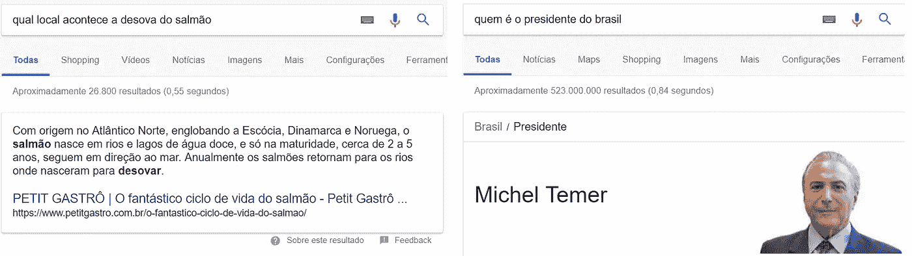
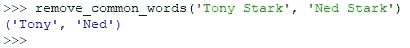
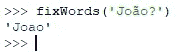
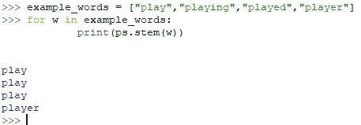
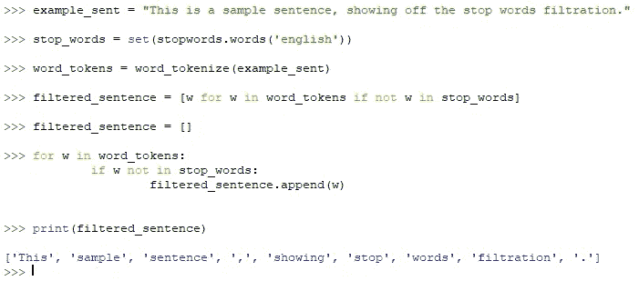
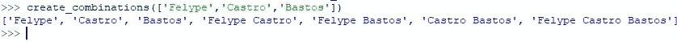
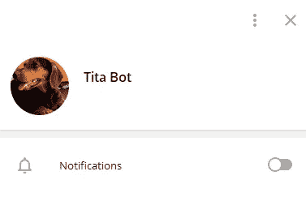

# 我如何创造一个机器人(蒂塔)来打败奎兹。

> 原文：<https://medium.datadriveninvestor.com/how-i-created-a-bot-tita-to-beat-quize-20d9e01150c3?source=collection_archive---------11----------------------->

Quize 是一个游戏，你必须击中 15 个问题才能赢得比赛。这是一个基于他的美国兄弟 HQ 琐事的巴西应用程序，价值超过 1 亿美元。

在 15 分钟的时间里，成千上万的玩家在广播中相遇，争夺已经到手的大约 13500 美元的奖金。白天有两轮，一轮在早上，另一轮在晚上。周一、周三和周五还有额外的查房。

回答每个问题只有 10 秒钟，这使得手动使用一些搜索引擎变得不可能。答对所有 15 个问题的玩家将分享奖品。

# 灵感

我在工作中遇到奎兹，在那之前我已经知道并且已经玩了 HQ 琐事。同一天，回到家，我已经开始写这个项目的第一行，后来被称为 **Tita** 。

# 注意

没有一次 Tita 是现场使用的，传输是使用 Vysor 和使用 Tita 后录制的。

# 第一版

我的第一个 Tita 版本是在很短的时间内创建的，并且很明显:

打印屏幕，使用 PyTesseract 提取文本，对问题执行请求，然后我计算答案的出现次数。获得最大值的应该是要检查的选项。

但是…我不想就此止步，我想加快速度，提高性能。

# 第一个挑战

我将提高 PyTesseract 的速度和准确性作为第一个挑战，在阅读了一段时间的文档后，我决定对图像进行阈值处理:

Before and after threesholding.

有了阈值，我能够更快地读取文本，几乎没有错误(每次读取大约需要 400 毫秒)。

解决了这个问题后，我开始着手建立搜索系统。如我所说，最初我做了一个简单的搜索，但她不够好。

在制定了一个好的搜索引擎之后，我建立了 10 种类型的搜索，基本上可以归结为在谷歌、维基百科和第一个谷歌页面上搜索答案。除此之外，我还对字符串执行某些转换以改进搜索，如应用 NLP(自然语言处理)技术来删除停用词，找到问题的关键词，删除符号和重音符号，并应用词干技术。

有了这个，我就可以进行几次搜索，从谷歌上提取片段和准确的答案。

On the left we have a Snippet, on the right an accurate answer.

使用 BeatifulSoup 库，我能够在 soups 中搜索每个对象的特定 id:

直接回答— **Z0LcW**

通过直接回答，我得到了可能的最佳答案，因此，你的分数很高。

片段— **伊戈热**

通过这个片段，我得到了问题的摘要，在很多情况下，我的评分系统都得到了满意的结果。

# 平行

由于项目复杂性的增加和并行性的缺乏，寻找响应时间(<10s) was impossible. Because of this it was necessary to write the parallel search functions using the Python Multiprocessing library.

With this I was able to reduce the application time of search techniques to only 1 ~ 1.5 seconds. With the result in hand, I decided to extend Multiprocessing to other parts of Tita’s flow, I decided that the process of capturing the screen would be divided (previously I just took a Screenshot and cut the interesting parts of the image) in 3 prints in the areas of interest (plus time gain ~ 300ms for the capture part). Parallelism was also applied at treatment time.

The final search time was around 4 seconds, from capture, text extraction, text transformations, searches, calculations and return.

# NLP

Some transformations deserve to be highlighted, such as:

· The removal of words in common between the two answers;

· Removing special characters and accents;

· *词干*)的任务；

停用词的删除。

# 记分系统

为了更好地组织来自 10 个搜索的各种结果，我建立了一个评分系统，根据它们的重要性，我创建了一个常数来乘以研究报告中答案的出现次数。

我决定直接回答的分数应该是最高的，更准确地说是 10，000，000，对于页面上的每个正常事件，我将乘以 300，等等。K_Search 是我为提高搜索性能而构建的一种算法，其计算的一个重要细节如下:

(出现次数*(字数))^(字数+ 1)

例如:

句子“Normal Again”在给定文本中出现 13 次，单词“Normal”在同一文本中出现 18 次。

第一句的分数是:(13 * 2) = 17576。

第二句的分数是:(18 * 1) = 324。

通过这种方式，我能够为单词的正确组合创造更大的力量，并避免计算对想要的单词毫无意义的单词。

# k _ 搜索

K_Search 是 Tita 的 hearth 算法，最初我创建每个响应的所有可能组合，例如，对于句子“Felype Castro Bastos”将创建这样的组合:

Results from K_Search

对于每一个生成的组合，我在 BeatifulSoup 中执行搜索，并如前一节所述进行标点，赋予整个组合更多的重要性。如果文本中有组合键“Felype Castro Bastos ”,则得分最高！

这种算法运行在各种搜索点上，无论是谷歌页面、维基百科，甚至是在谷歌上找到的第一页。

# 电报

除此之外，我还决定在 Telegram 上创建一个机器人，负责将选择的答案传递给我，因为我决定不在任何直播游戏中使用 Tita。这个创建纯粹是为了教学目的。

Yes, she’s my Dog.

Tita on Telegram.

# 流动

项目的最终流程如下所示:

1.通过检测图像中平均像素颜色的变化，可以自动捕获问题(持续捕获图像)。

2.在捕获图像之后，它们被阈值化，从而被转换成文本。

3.问题和答案的原始形式被存储。

4.应用基本转换，删除特殊字符并将单词小写，以及删除两个答案之间的共同单词。

5.所有的汤都是搜索所需要的，大约有 6 种汤是由谷歌、维基百科、首页等提供的。

6.此后，在每种搜索技术中执行特定的变换，并且执行搜索。

7.我返回一个包含每项技术得分的列表。

8.我将分配给每个回答的分数相加，然后归一化，最后的结果是:回答 1 = 98%，回答 2 = 2%。

9.片段(如果有的话)、正确答案(如果有的话)、评分向量以及给定问题的最合适答案被发送到电报。

10.循环开始，期待下一个问题。

# 结论

我生成了一个包含 100 个问题的数据框架，并在所有的问题中都使用了 Tita。只有 5 个错误，大部分是比手动搜索需要更多解释的问题(下一章的场景)。
她错过的问题有:

> 1.巴士底狱是巴黎的一座堡垒，曾被用作法国的国家监狱？
> 2。这些人物中哪一个是被工作人员认识的，“我是对的还是错的？”
> 3。是不是用“渐渐”来形容事情做的很慢，很慢？
> 4。世界上主要的音乐奖项是什么？
> 5。车手艾尔顿·塞纳赢得了几个 F1 全球定位系统？

显然，不可能肯定地说准确率是 95%，但是，在所有测试的游戏中，平均每场游戏有 2-3 个错误，实际上大约有 84%，在某些情况下，可以通过片段用肉眼检查响应。另一个有用的机制是跳跃，可以在弃权或者不安全的时候使用。

# 将来的

我来自机器学习领域，对人工智能充满热情(目前在大学研究遗传算法，并在该领域实践),我打算给 Tita 添加更多“人性化”的东西，尤其是她解释问题和找到更准确答案的能力。我有一个非常强烈的灵感是 IBM 的沃森超级计算机，它在 2011 年的 Jeopardy 游戏中击败了人类。