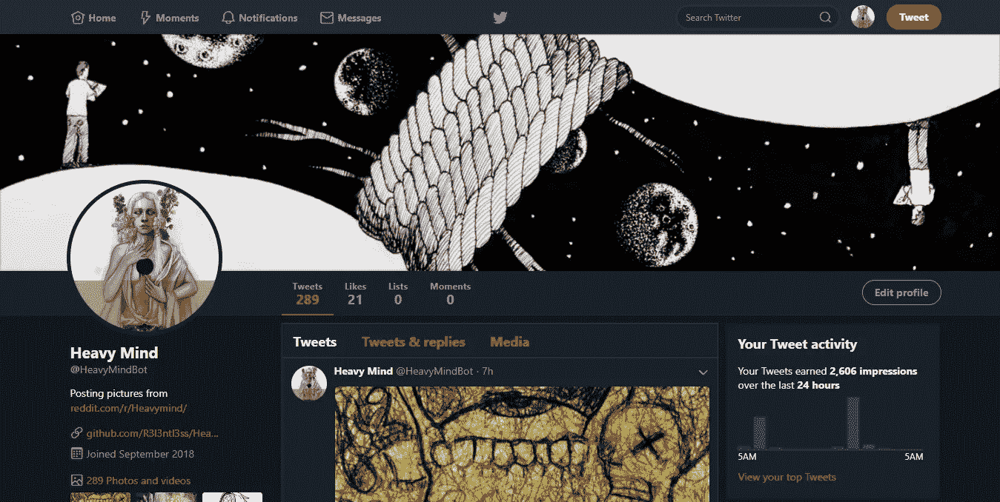
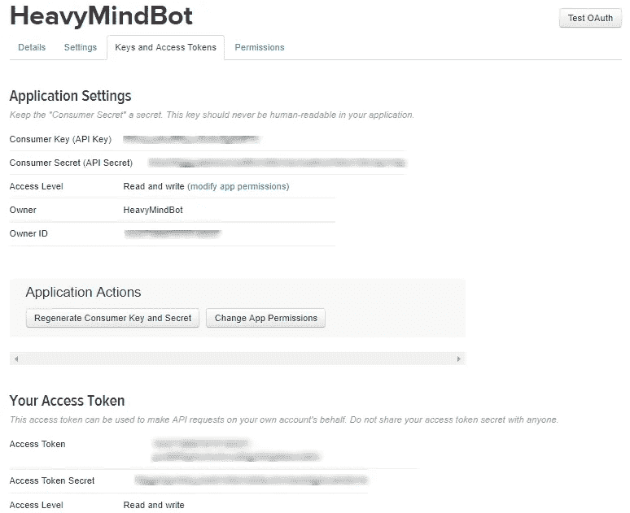

# 我如何使用 Python 创建一个 Twitter 机器人

> 原文：<https://medium.datadriveninvestor.com/how-i-created-a-twitter-bot-using-python-a68b917d133?source=collection_archive---------4----------------------->



创建一个机器人可能是让你熟悉 API 和自动化世界的一个很好的方式，这正是我试图通过这次冒险经历的。我的想法很简单，创建一个 Twitter 机器人，自动从属于特定类别的分类良好的图片中发布图片。我脑海中的这个机器人包括两个主要模块:

*   **图片抓取器**——为了创建一个图片集，我决定构建一个抓取器，从一个特定的子编辑中下载图片【在我的例子中是 [HeavyMind](https://www.reddit.com/r/Heavymind/) 子编辑】。
*   **机器人**——这是机器人的核心功能所在，这里我利用 Twitter API 来发布图片抓取器下载的图片。

如果你想看看这个机器人的行动，看看它的简介[这里](https://twitter.com/HeavyMindBot)。在我们开始之前，让我澄清一下，即使你不是一个熟练的程序员，创建这样一个机器人也是非常简单的。说到这里，让我们开始吧。

# 图像刮刀

我不想深入这个模块，因为它超出了本主题的范围。我使用 [PRAW](https://praw.readthedocs.io/en/latest/) python 库与 Reddit API 交互，以便从所需的 subreddit 下载图像，在我看来这是迄今为止 python 最好的 Reddit 库。更多信息请看我在 Github 上的程序。

# 建造机器人

因此，让我们开始构建机器人，但在此之前，我们需要满足一个先决条件。

**获得一个 Twitter 开发者账户**——以前获得一个开发者账户非常容易，但由于现在 Twitter 上有大量的机器人导致服务器流量过大，Twitter 决定让获得它们的 API 变得更加繁琐。不过别着急，还是有可能得到的。访问他们的[开发者网站](https://developer.twitter.com/en/apply-for-access)申请，回答关于你的用例的简单问题和你的项目继续进行的意图。他们反应真的很快，所以这不会花很长时间。

1.  **获取 API 令牌** —

登录开发者帐户后，点击创建应用按钮即可开始。请提供您的应用程序的名称和其他必要详细信息，以便创建应用程序。创建完成后，转到“密钥和访问令牌”部分获取 API 密钥。



创建单独的变量来存储程序中的每个键:

```
consumer_key = ''
consumer_token = ''
access_token = ''
access_token_secret = '' 
```

2.**安装必要的软件包** —

我们将使用 [tweepy](http://www.tweepy.org/) 作为这篇文章的提示。Tweepy 是一个 python 库，它使我们与 Twitter API 的交互和通信变得非常容易。Tweepy 可以通过在终端中使用 pip 来安装:

```
pip install tweepy
```

或者使用 git。这两种方法会产生相同的结果。

```
git clone https://github.com/tweepy/tweepy.git
cd tweepy
python setup.py install
```

3.**连接 Twitter** —

首先使用以下命令将库导入到您的程序中:

```
import tweepy
```

现在我们需要连接到我们的 Twitter 帐户，或者你可以说“刺激登录帐户”。这可以通过使用以下代码行来完成:

```
auth = tweepy.OAuthHandler(consumer_key, consumer_secret)    auth.set_access_token(access_token, access_secret)
api = tweepy.API(auth)
```

`OAuthHandler, set_access_token` 和`API`只是简单的函数和类，允许我们登录 twitter 账户。

4.**发布图片**

现在我们已经登录了我们的帐户，剩下要做的就是在推特上发布我们下载的图片。

首先，我们必须转到我们下载所有图片的目录。我创建了一个名为“图片”的目录，在那里我保存了我所有的图片。因此，我将使用下面几行代码切换到该目录:

```
import os
os.chdir('images')
```

现在我们在那个目录中，我们可以使用一个简单的 for 循环来遍历图像。

Tweepy 有`update_with_media()` 功能，允许我们简单地发送一张图片作为参数，它会在推特上发布那张图片。

```
for image in os.listdir('.'):
    api.update_with_media(image)
```

但是如果我们这样做，图片会很快在推特上发布，这可能会导致推特禁止我们的账户，因为它带来了太多的流量。为了防止这种情况，我们可以使用`sleep()`函数来提供每个 tweet 之间的间隔。

```
for image in os.listdir('.'):  
    api.update_with_media(image)
    time.sleep(20)
```

就是这样！

我们的机器人完成了。您的最终代码应该如下所示:

在 Github 上查看我的机器人的源代码。

非常感谢你的阅读！我希望这能对你有所帮助。