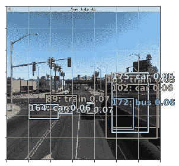

# 自定义 fast.ai，用美国卡车模拟器开发游戏内自动驾驶车辆

> 原文：<https://medium.datadriveninvestor.com/how-i-developed-an-in-game-self-driving-vehicle-using-fast-ai-and-american-truck-simulator-2524891dbaf?source=collection_archive---------9----------------------->

[](http://www.track.datadriveninvestor.com/1B9E)

我要非常感谢 [fast.ai](http://fast.ai) 团队，他们不仅开源了一个非常棒的深度学习库，还提供了学习它的资源。我还要感谢[pythonprogramming.net](https://pythonprogramming.net/game-frames-open-cv-python-plays-gta-v/)提供了大量关于使用`opencv`和`PIL`进行屏幕显示和操作的不同方法的深刻见解。

过去几周我一直在看 fast.ai 课程，想在个人项目中测试一些方法。我认为自动驾驶汽车项目会特别有趣，而且似乎与我们在课程中学到的方法非常吻合。我用的是装有 Sierra 操作系统的 13 英寸 MacBook Pro 不幸的是，这让我在车辆模拟器游戏上的选择非常少。然而，我在 [Steam](https://store.steampowered.com/) 中发现了游戏《美国卡车模拟器》，这似乎符合我的需求。我的想法是让两个神经网络执行两个不同的任务。其中一个基本上是受 Nvidia 不久前关于自动驾驶汽车端到端学习的研究论文的启发[，研究人员基本上采用视频输入并将其映射到驾驶员方向盘角度。如果这种方法有效，那么没有理由它不能与按键一起工作。第一个神经网络是相似的，因为我完全根据视频输入数据和按键来训练它。第二个神经网络执行对象检测，以确定在卡车的路径上是否有其他汽车、卡车、火车、人。这里用 fast.ai 库的大部分方法都是来自深度学习课程的第 3 课和第 9 课。](https://arxiv.org/pdf/1604.07316.pdf)

```
**import** numpy **as** np
**import** pandas **as** pd
**import** time
**from** numpy **import** ones,vstack
**from** numpy.linalg **import** lstsq
**from** statistics **import** mean
**import** os
**from** collections **import** Counter
**from** random **import** shuffle
**from** datetime **import** datetime**from** IPython.display **import** Image
**from** mss **import** mss
**from** PIL **import** ImageGrab
**import** cv2**import** pyautogui
**from** pynput **import** keyboard
```

首先，我们希望使用 python 开发一种方法来按下按键(测试模型)并跟踪按键被按下的时间(保存训练数据)。为此，我分别使用了库`pyautogui`和`pynput`。

按键功能的结构源自 pythonprogramming.net，但方法却大不相同，因为我用的是 mac，而他用的是 PC。事实证明，在 mac 上实际上要容易得多！

这是我应该指出的第一点欺骗——我在 Jupyter 笔记本上开发，因为按键是远程控制我的系统的，所以我必须从 root 启动我的笔记本，让按键正常工作。所以只要去一个终端输入`sudo jupyter notebook`。除此之外，我不得不在我的`~./jupyter/jupyter_notebook_config.py`文件中取消对`c.NotebookApp.allow_root=True`的注释。如果`jupyter_notebook_config.py`文件不存在，您可能需要使用命令`jupyter notebook — generate-config`来生成它。该文件应该位于您的主文件夹`.jupyter`中。如果您没有在 mac 上显示所有隐藏文件，您应该这样做。只需打开你的取景器，点击`cmd` + `shift` + `.`

好了，现在我们准备获取一些按键和记录按键的函数。

```
**def** on_press(key):
    **try**:
        print('alphanumeric key {0} pressed'.format(
            key.char))
        keys.append(str(key))
        **return** **False**
    **except** AttributeError:
        print('special key {0} pressed'.format(
            key))
        **return** **False****def** on_release(key):
    print('{0} released'.format(
        key))
    **if** key == keyboard.Key.esc:
        # Stop listener
        **return** **False****def** key_check():
    **with** keyboard.Listener(
        on_press=on_press,
        on_release=on_release) as listener:
        listener.join()
```

我让`keys_to_output()`返回一个 hot 编码列表，指示哪个键被按下，因为在某个点上，模型将必须预测左、右、直，并且模型将返回每个概率的 numpy 数组。最终，这将产生一个长度为 3 的列表，其中一个被热编码到适当的方向，因此为了保持一致性，该函数以这种方式返回按键。

```
**def** keys_to_output(keys):

    **if** "'a'" in keys:
        **return** [1,0,0]
    **elif** "'d'" in keys:
        **return** [0,0,1]
    **elif** "'w'" in keys:
        **return** [0,1,0]
    **else**:
        **return** [0,0,0]**def** PressKey(key):
    pyautogui.keyDown(key)**def** ReleaseKey(key):
    pyautogui.keyUp(key)
```

我认为实际上在构造`left()`或`right()`的方式上有很大的改进空间。我注意到当我玩游戏的时候，我倾向于一直按下去，甚至当我试图左转的时候。所以我试着在函数中加入这一点。或者，你可以建立一个模型来预测左，直，右的组合。

```
**def** straight():
    PressKey('w')
    ReleaseKey('a')
    ReleaseKey('d')
    time.sleep(0.09)**def** left():
    PressKey('a')
    PressKey('w')
    ReleaseKey('d')
    ReleaseKey('a')
    time.sleep(0.09)
    ReleaseKey('w')**def** right():
    PressKey('d')
    PressKey('w')
    ReleaseKey('a')
    ReleaseKey('d')
    time.sleep(0.09)
    ReleaseKey('w')**def** slow_ya_roll():
    #PressKey('s')
    ReleaseKey('w')
    ReleaseKey('a')
    ReleaseKey('d')
```

因此，为了创建训练数据，我们希望有一个函数来记录游戏窗口周围的帧，同时记录正在进行的按键，然后将每一帧和每一次按键保存到一个 numpy 数组中，稍后我们可以将按键放入与该帧的文件名对应的 csv 中。当我使用`PIL`的`ImageGrab`函数时，找出边界框可能是这个过程中最烦人的部分，因为像素值不符合预期，然后我发现了这个叫做`mss`的 python 包，它基本上让我的生活从糟糕变得很棒。`ImageGrab`在大约 1.2 秒内完成循环，`mss`平均在 0.05 秒左右。同样在`mss`中，定义要记录的盒子非常清楚。我只是在我的 mac 上点击`cmd` + `shift` + `4`，弹出小屏幕截图光标，检查它所说的顶部和左侧的像素值，然后计算宽度和高度。

*代码注释为* `record_frames()` *:*

`key_check()`跟踪什么键被按下并追加到列表中。
-列表应该预先用某个键值初始化:`keys = ["'w'"]`
-然后按键映射到`[[1,0,0],[0,1,0],[0,0,1]]`并追加到`training_data`

```
**def** record_frames(file_name):

    # keys = ["'w'"]

    **for** i **in** list(range(4))[::-1]:
        print(i+1)
        time.sleep(1)

    **with** mss() **as** sct:
        # Part of the screen to capture
        monitor = {"top":79,"left":265,"width":905,"height":586} **while** "Screen capturing":
            last_time = time.time() # Get pixels from the screen, save it to a Numpy array
            screen = np.array(sct.grab(monitor)) print("fps: {}".format(1 / (time.time() - last_time))) # screen =  np.array(ImageGrab.grab(bbox=(265 * 2,79 * 2,1170 * 2,665 * 2))) # previous slower method last_time = time.time() screen = cv2.cvtColor(screen, cv2.COLOR_BGR2RGB)
            screen = cv2.resize(screen, (224,224))# # uncomment if you want to see what the screen recorder sees           # cv2.imshow('window2', cv2.cvtColor( cv2.resize(original_image, (800,600)), cv2.COLOR_BGR2RGB)) key_check()
            print([keys[-1]])
            output = keys_to_output([keys[-1]])
            training_data.append([screen,output]) **if** cv2.waitKey(25) & 0xFF == ord('q'):
                cv2.destroyAllWindows()
                **break** **if** len(training_data) % 10 == 0:
                print(len(training_data))
                np.save(file_name,training_data)
```

我不能连续玩几个小时，我也不指望你能做到，所以这实际上是在每次你玩的时候创建新的 numpy 文件，你可以在以后把它们连接在一起。要追加 numpy 数组，你可以把它们全部读入，然后对你拥有的`train_data`数组做`np.append(train_data1, train_data2)`。

```
**for** i **in** range(100):

    file_name = 'training_data_{filename}part{num}.npy'.format(filename = datetime.now().strftime("%m%d%y"), num = i+1) **if** os.path.isfile(file_name):
        print('File exists, moving on!')
        **continue**
    **else**:
        print('File does not exist, starting fresh!')
        training_data = [] # initialize training_data
        keys = ["'w'"] # initialize keys
        **break**record_frames(file_name = file_name)
```

你的数据集将会不平衡，因为很自然地，你只是按下`w`来显示大多数帧。为了使之均匀，你可以打乱数据，然后取每一类(左，直，右)中的最小值。因此，如果您的计数器返回`Counter({‘[0, 1, 0]’: 550, ‘[1, 0, 0]’: 247, ‘[0, 0, 1]’: 223})`，那么您可以随机抽取 223 个。我从 pythonprogramming.net 那里抓取了这段代码，做了一些小小的编辑。

```
lefts = []
rights = []
forwards = []shuffle(train_data1)**for** data **in** train_data1:
    img = data[0]
    choice = data[1]

    **if** choice == [1,0,0]:
        lefts.append([img,choice])
    **elif** choice == [0,1,0]:
        forwards.append([img,choice])
    **elif** choice == [0,0,1]:
        rights.append([img,choice])
    **else**:
        print('no matches')forwards = forwards[:len(lefts)][:len(rights)]
lefts = lefts[:len(forwards)]
rights = rights[:len(forwards)]final_data = forwards + lefts + rights
shuffle(final_data)train_data = np.load('training_data_v2_011919.npy')
```

现在我们有了训练数据，是时候开始构建模型了。我们将构建的第一个模型基于 fast.ai 的第 3 课，因此您可以看到代码中的相似之处。

```
**from** fastai.conv_learner **import** *
**from** fastai.core **import** *
**from** fastai.transforms **import** *
**from** fastai.dataset **import** *PATH = "data/"
sz = 224
arch = resnet34
bs = 64
```

将所有训练图像保存到一个文件夹中，并将按键保存到一个 csv 文件中。

```
**for** i **in** range(len(train_data)):
    cv2.imwrite(f'{PATH}/train3/trucksim_{i}.jpg', train_data[i][0])directions = ['left', 'straight', 'right']labels = pd.DataFrame({'id':[f'trucksim_{i}' **for** i **in** range(len(train_data))], 
         'label':[directions[np.argmax(train_data[i][1])] **for** i **in** range(len(train_data))]})label_csv = f'{PATH}labels_3.csv'n = len(list(open(label_csv))) - 1 # header is not counted (-1)
val_idxs = get_cv_idxs(n) # random 20% data for validation setval_idxs.shape, get_cv_idxs(n).shapelabel_df = pd.read_csv(label_csv)
```

创建模型数据对象和转换。

```
tfms = tfms_from_model(arch, sz, aug_tfms=transforms_side_on, max_zoom=1.1)
data = ImageClassifierData.from_csv(PATH, 'train3', f'{PATH}labels_3.csv',val_idxs=val_idxs, suffix='.jpg', tfms=tfms, bs=bs)**def** get_data(sz, bs): 
    tfms = tfms_from_model(arch, sz, aug_tfms = transforms_side_on,     max_zoom=1.1)
    data = ImageClassifierData.from_csv(PATH, 'train3', f'{PATH}labels_3.csv',val_idxs=val_idxs, suffix='.jpg', tfms=tfms, bs=bs)
    **return** data
```

在你完成这个过程并保存你的模型后，你可以跳过所有的`.fit()`步骤，只做`learn = ConvLearner.pretrained(arch, data, precompute = False)`和`learn.load(‘model0’)`。这里的区别是`precompute = False`，你保存的模型已经用`resnet34`架构训练过了，所以不需要再次预计算。到目前为止，我只使用了 500 帧训练数据，因为玩游戏需要很多时间来获得更多数据，所以我会随着我玩得更多而更新。

```
learn = ConvLearner.pretrained(arch, data)learn.fit(1e-2, 5)
```

**Out[1]:**

```
epoch      trn_loss   val_loss   accuracy               
    0      1.355581   0.955264   0.566667  
    1      1.202431   0.912144   0.544444               
    2      1.085148   0.811203   0.588889               
    3      0.983141   0.716187   0.666667                
    4      0.897174   0.66741    0.688889
[array([0.66741]), 0.6888888888888889]
```

所以很明显我需要更多的训练数据。500 帧不够。

```
learn.set_data(get_data(224, bs))
learn.freeze()
```

下一个可能需要一些时间。

```
learn.fit(1e-2, 3, cycle_len=1, cycle_mult=2)
```

**Out[1]:**

```
epoch      trn_loss   val_loss   accuracy                
    0      0.655568   0.662868   0.677778  
    1      0.637863   0.6479     0.666667                
    2      0.631665   0.640404   0.677778                
    3      0.63021    0.648688   0.688889                
    4      0.608185   0.658299   0.7                     
    5      0.594226   0.659508   0.688889                
    6      0.588468   0.657246   0.688889
[array([0.65725]), 0.6888888888888889]
```

现在我们有了模型，所以我们可以在图像上测试它。您的模型数据对象有一个`.val_ds`属性，因此您可以简单地提取验证数据集。

```
fn = data.val_ds.fnames[1]PIL.Image.open(PATH + fn)
```


American Truck Simulator

```
trn_tfms, val_tfms = tfms_from_model(arch, sz)img = val_tfms(open_image(PATH+fn))
log_pred = learn.predict_array(img[**None**])directions[np.argmax(log_pred)]
```

**Out[1]:**

```
'straight'
```

该模型预测准确。

好，现在去上 fast.ai 的[第九课。我不会将该类的所有代码放在这里，但本质上，它会经历使用](https://course.fast.ai/lessons/lesson9.html) [Pascal 2007](https://www.kaggle.com/zaraks/pascal-voc-2007) 数据集创建单次检测器(SSD)对象检测模型的过程。我会给你一些过程中的注意事项和一些建议。如果你克隆 fastai repo，你需要运行代码的笔记本在`courses`内的`dl2`目录中被称为`pascal-multi`。在该目录中，我刚刚创建了另一个名为`data`的目录，其结构如下:

数据
|-Pascal
| |-tmp
| |-mbb . CSV
| | |-MC . CSV
| |-models
| | |-drop 4 . H5
| |-fl0 . H5
| | | | |-pre focal . H5
| |-tmp . H5
| |-VOCdevkit
|-VOCdevkit 2

其中大部分是从 kaggle 页面下载的，模型是在您学习课程的过程中生成的。我们最终将在自动驾驶汽车中使用的车型是`drop4`车型。我还建议你在阅读第 9 课时通读这篇文章，它是一个很好的预演，有一些非常好的见解。

一旦你在`pascal-multi`笔记本上的一切都准备好运行，只要运行所有的细胞，然后去给自己做些晚餐或去健身房或两者都去，因为这将需要一段时间。然后，您应该有一个名为`drop4`的模型，您可以将它放在这个项目的当前工作目录中。

现在我们要加载`drop4`模型。这比上一个稍微复杂一些，因为这个模型使用了一个定制的模型数据对象和一个定制的架构头。我们还希望 SSD 课程的某些方面能够在我们的美国卡车模拟器数据上进行测试，例如，边界框、注释、锚点等。

```
PATH_pascal = Path('data/pascal')trn_j = json.load((PATH_pascal / 'pascal_train2007.json').open())
IMAGES,ANNOTATIONS,CATEGORIES = ['images', 'annotations', 'categories']
FILE_NAME,ID,IMG_ID,CAT_ID,BBOX = 'file_name','id','image_id','category_id','bbox'cats = dict((o[ID], o['name']) **for** o **in** trn_j[CATEGORIES])
trn_fns = dict((o[ID], o[FILE_NAME]) **for** o **in** trn_j[IMAGES])
trn_ids = [o[ID] **for** o **in** trn_j[IMAGES]]JPEGS_pascal = 'VOCdevkit2/VOC2007/JPEGImages'
IMG_PATH_pascal = PATH_pascal/JPEGS_pascal**def** get_trn_anno():
    trn_anno = collections.defaultdict(lambda:[])
    **for** o **in** trn_j[ANNOTATIONS]:
        **if not** o['ignore']:
            bb = o[BBOX]
            bb = np.array([bb[1], bb[0], bb[3]+bb[1]-1, bb[2]+bb[0]-1])
            trn_anno[o[IMG_ID]].append((bb,o[CAT_ID]))
    **return** trn_annotrn_anno = get_trn_anno()
```

`id2cat`这是预测的所有类别，这对于我们对自动驾驶汽车的注释和决策非常重要。

```
id2cat = list(cats.values())**def** hw2corners(ctr, hw): **return** torch.cat([ctr-hw/2, ctr+hw/2], dim=1)anc_grids = [4,2,1]
anc_zooms = [0.7, 1., 1.3]
anc_ratios = [(1.,1.), (1.,0.5), (0.5,1.)]
anchor_scales = [(anz*i,anz*j) **for** anz **in** anc_zooms **for** (i,j) **in** anc_ratios]
k = len(anchor_scales)
anc_offsets = [1/(o*2) **for** o **in** anc_grids]
```

`k`是 9

```
anc_x = np.concatenate([np.repeat(np.linspace(ao, 1-ao, ag), ag)
                        **for** ao,ag **in** zip(anc_offsets,anc_grids)])
anc_y = np.concatenate([np.tile(np.linspace(ao, 1-ao, ag), ag)
                        **for** ao,ag **in** zip(anc_offsets,anc_grids)])
anc_ctrs = np.repeat(np.stack([anc_x,anc_y], axis=1), k, axis=0)anc_sizes  =   np.concatenate([np.array([[o/ag,p/ag] **for** i **in** range(ag*ag) **for** o,p **in** anchor_scales]) **for** ag **in** anc_grids])
grid_sizes = V(np.concatenate([np.array([ 1/ag **for** i **in** range(ag*ag) **for** o,p **in** anchor_scales]) **for** ag **in** anc_grids]), requires_grad=False).unsqueeze(1)
anchors = V(np.concatenate([anc_ctrs, anc_sizes], axis=1), requires_grad=False).float()
anchor_cnr = hw2corners(anchors[:,:2], anchors[:,2:])n_clas = len(id2cat)+1
n_act = k*(4+n_clas)MC_CSV = PATH_pascal/'tmp/mc.csv'CLAS_CSV = PATH_pascal/'tmp/clas.csv'
MBB_CSV = PATH_pascal/'tmp/mbb.csv'mc = [[cats[p[1]] **for** p **in** trn_anno[o]] **for** o **in** trn_ids]
id2cat = list(cats.values())
cat2id = {v:k **for** k,v **in** enumerate(id2cat)}
mcs = np.array([np.array([cat2id[p] **for** p **in** o]) **for** o **in** mc])val_idxs_pascal = get_cv_idxs(len(trn_fns))
((val_mcs,trn_mcs),) = split_by_idx(val_idxs_pascal, mcs)mbb = [np.concatenate([p[0] **for** p **in** trn_anno[o]]) **for** o **in** trn_ids]
mbbs = [' '.join(str(p) **for** p **in** o) **for** o **in** mbb]df = pd.DataFrame({'fn': [trn_fns[o] **for** o **in** trn_ids], 'bbox': mbbs}, columns=['fn','bbox'])
df.to_csv(MBB_CSV, index=False)]
```

创建新的模型数据对象:

```
aug_tfms = [RandomRotate(3, p=0.5, tfm_y=TfmType.COORD),
            RandomLighting(0.05, 0.05, tfm_y=TfmType.COORD),
            RandomFlip(tfm_y=TfmType.COORD)]tfms_pascal = tfms_from_model(arch, sz, crop_type=CropType.NO, 
                              tfm_y=TfmType.COORD,aug_tfms=aug_tfms)md_pascal = ImageClassifierData.from_csv(PATH_pascal, JPEGS_pascal, MBB_CSV, tfms=tfms_pascal, bs=bs, continuous=True, num_workers=4)
```

然后添加自定义模型数据类:

```
**class** ConcatLblDataset(Dataset):
    **def** __init__(self, ds, y2):
        self.ds,self.y2 = ds,y2
        self.sz = ds.sz
    **def** __len__(self): **return** len(self.ds)

    **def** __getitem__(self, i):
        x,y = self.ds[i]
        **return** (x, (y,self.y2[i]))trn_ds2 = ConcatLblDataset(md_pascal.trn_ds, trn_mcs)
val_ds2 = ConcatLblDataset(md_pascal.val_ds, val_mcs)
md_pascal.trn_dl.dataset = trn_ds2
md_pascal.val_dl.dataset = val_ds2
```

然后将自定义头添加到架构中:

```
**class** StdConv(nn.Module):
    **def** __init__(self, nin, nout, stride=2, drop=0.1):
        super().__init__()
        self.conv = nn.Conv2d(nin, nout, 3, stride=stride, padding=1)
        self.bn = nn.BatchNorm2d(nout)
        self.drop = nn.Dropout(drop)

    **def** forward(self, x): **return** self.drop(self.bn(F.relu(self.conv(x))))

**def** flatten_conv(x,k):
    bs,nf,gx,gy = x.size()
    x = x.permute(0,2,3,1).contiguous()
    **return** x.view(bs,-1,nf//k)**class** OutConv(nn.Module):
    **def** __init__(self, k, nin, bias):
        super().__init__()
        self.k = k
        self.oconv1 = nn.Conv2d(nin, (len(id2cat)+1)*k, 3, padding=1)
        self.oconv2 = nn.Conv2d(nin, 4*k, 3, padding=1)
        self.oconv1.bias.data.zero_().add_(bias)

    **def** forward(self, x):
        **return** [flatten_conv(self.oconv1(x), self.k),
                flatten_conv(self.oconv2(x), self.k)]drop=0.4**class** SSD_MultiHead(nn.Module):
    **def** __init__(self, k, bias):
        super().__init__()
        self.drop = nn.Dropout(drop)
        self.sconv0 = StdConv(512,256, stride=1, drop=drop)
        self.sconv1 = StdConv(256,256, drop=drop)
        self.sconv2 = StdConv(256,256, drop=drop)
        self.sconv3 = StdConv(256,256, drop=drop)
        self.out0 = OutConv(k, 256, bias)
        self.out1 = OutConv(k, 256, bias)
        self.out2 = OutConv(k, 256, bias)
        self.out3 = OutConv(k, 256, bias)**def** forward(self, x):
        x = self.drop(F.relu(x))
        x = self.sconv0(x)
        x = self.sconv1(x)
        o1c,o1l = self.out1(x)
        x = self.sconv2(x)
        o2c,o2l = self.out2(x)
        x = self.sconv3(x)
        o3c,o3l = self.out3(x)
        **return** [torch.cat([o1c,o2c,o3c], dim=1),
                torch.cat([o1l,o2l,o3l], dim=1)]k = 9
head_reg4 = SSD_MultiHead(k, -4.)
models = ConvnetBuilder(arch, 0, 0, 0, custom_head=head_reg4)
learn_pascal = ConvLearner(md_pascal, models, precompute=False)
learn_pascal.opt_fn = optim.Adam
```

现在只需加载您在 fast.ai 的第 9 课中创建的模型

```
learn_pascal.load('drop4')
```

现在我们已经加载了对象检测模型，我们应该在我们的一个图像上进行测试。

```
**import** matplotlib.cm **as** cmx
**import** matplotlib.colors **as** mcolors
**from** cycler **import** cycler
**from** matplotlib **import** patches, patheffects**def** get_cmap(N):
    color_norm  = mcolors.Normalize(vmin=0, vmax=N-1)
    **return** cmx.ScalarMappable(norm=color_norm, cmap='Set3').to_rgbanum_colr = 12
cmap = get_cmap(num_colr)
colr_list = [cmap(float(x)) **for** x **in** range(num_colr)]**def** bb_hw(a): **return** np.array([a[1],a[0],a[3]-a[1]+1,a[2]-a[0]+1])**def** show_ground_truth(ax, im, bbox, clas=None, prs=None, thresh=0.3):
    bb = [bb_hw(o) **for** o **in** bbox.reshape(-1,4)]
    **if** prs **is None**:  prs  = [None]*len(bb)
    **if** clas **is None**: clas = [None]*len(bb)
    ax = show_img(im, ax=ax)
    **for** i,(b,c,pr) **in** enumerate(zip(bb, clas, prs)):
        **if**((b[2]>0) **and** (pr **is** None **or** pr > thresh)):
            draw_rect(ax, b, color=colr_list[i%num_colr])
            txt = f'{i}: '
            **if** c **is** **not** None: txt += ('bg' **if** c==len(id2cat) **else** id2cat[c])
            **if** pr **is not None**: txt += f' {pr:.2f}'
            draw_text(ax, b[:2], txt, color=colr_list[i%num_colr])**def** get_y(bbox,clas):
    bbox = bbox.view(-1,4)/sz
    bb_keep = ((bbox[:,2]-bbox[:,0])>0).nonzero()[:,0]
    **return** bbox[bb_keep],clas[bb_keep]**def** actn_to_bb(actn, anchors):
    actn_bbs = torch.tanh(actn)
    actn_centers = (actn_bbs[:,:2]/2 * grid_sizes) + anchors[:,:2]
    actn_hw = (actn_bbs[:,2:]/2+1) * anchors[:,2:]
    **return** hw2corners(actn_centers, actn_hw)**def** torch_gt(ax, ima, bbox, clas, prs=None, thresh=0.4):
    **return** show_ground_truth(ax, ima, to_np((bbox*224).long()),
         to_np(clas), to_np(prs) if prs **is not None else None**, thresh)**def** show_img(im, figsize=None, ax=None):
    **if** **not** ax: fig,ax = plt.subplots(figsize=figsize)
    ax.imshow(im)
    ax.set_xticks(np.linspace(0, 224, 8))
    ax.set_yticks(np.linspace(0, 224, 8))
    ax.grid()
    ax.set_yticklabels([])
    ax.set_xticklabels([])
    **return** ax**def** draw_outline(o, lw):
    o.set_path_effects([patheffects.Stroke(
        linewidth=lw, foreground='black'), patheffects.Normal()])**def** draw_rect(ax, b, color='white'):
    patch = ax.add_patch(patches.Rectangle(b[:2], *b[-2:], fill=False, edgecolor=color, lw=2))
    draw_outline(patch, 4)**def** draw_text(ax, xy, txt, sz=14, color='white'):
    text = ax.text(*xy, txt,
        verticalalignment='top', color=color, fontsize=sz, weight='bold')
    draw_outline(text, 1)
```

我第一次这样做的时候，我遇到了只给模型传递一张图片进行预测的问题。我认为这个问题是因为模型预期批量大小为 64，我只是传递给它 1 个图像，因为错误似乎源于 BatchNorm 层，但我不是 100%确定。我发现做`learn_pascal.model.eval()`允许我传递 1 图像，因为它禁用了 BatchNorm 层。

```
learn_pascal.model.eval()
```

我们可以在之前使用第一个模型测试的同一张图像上测试该模型，我们之前将路径分配给了`fn`，因此我们可以使用 fast.ai 的函数`open_image()`打开图像，这是一个非常方便的工具，可以将图像拖入 numpy 数组。然后，我们可以在该图像上执行转换，因为模型需要图像尺寸的批量大小，所以我们可以将`[None]`放在最后。所以我们最终得到了形状为`(1, 3, 224, 224)`的`val_tfms(open_image(PATH+fn))[None]`，而原始图像的形状为`(224, 224, 3)`。`next(iter(md_pascal.val_dl))`是从我们的模型数据对象中提取下一批数据的 fast.ai 方法，我们可以使用它的第二个元素来标识我们的类(汽车、卡车、公共汽车等)。).

```
_,y = next(iter(md_pascal.val_dl))
y = V(y)x = val_tfms(open_image(PATH+fn))[**None**]
# x = to_np(x)b_clas_truck,b_bb_truck = learn_pascal.model(V(x))ax = plt.gca()
ima=open_image(PATH+fn)
bbox,clas = get_y(y[0][0], y[1][0])
a_ic_truck = actn_to_bb(b_bb_truck[0], anchors)
clas_pr_truck, clas_ids_truck = b_clas_truck[0].max(1)
clas_pr_truck = clas_pr_truck.sigmoid()
torch_gt(ax, ima, a_ic_truck, clas_ids_truck, clas_pr_truck, clas_pr_truck.max().data[0]*0.75)
plt.tight_layout()
```



还不错。

我们已经准备好在游戏中测试这个东西了。对象检测模型用许多不同的边界框为每个图像预测许多类。我们想剔除一些多余的东西，看看我们是否关心框架中的物体，以及它是否对我们构成威胁。

我们可以做的一件事是设置一个概率阈值，以便它只显示高于某个概率的分类。实际上，我发现将这个值设置为 0.15 很有用，但是你可以用不同的值来测试。

接下来，我们要确定该分类是否是一种威胁。我确信有更好的方法来做到这一点，但我定义了一个包围卡车前部的名为`warning`的框，如果分类的边界框与`warning`边界框重叠，我称之为威胁。然后我检查那个分类是在窗口中心的左边还是右边，然后转向相反的方向。

*代码注释*:

注意所有的标签都从左上角
开始——这是因为在绘图功能中它说从`b[:2]`(左上角)开始

如果`c == 20`(id 2 cat 的长度)，则该单元格是背景

ex)对于 bbox: `[ 68 116 18 29]`，`[68 116]`是左上角，`18`是宽度，`29`是高度

```
bbox = to_np((a_ic_truck*224).long())
bb = [bb_hw(o) **for** o **in** bbox.reshape(-1,4)]; bbclas = clas_ids_truck
prs = clas_pr_truck
thresh = 0.06**if** prs **is** **None**:  prs  = [None]*len(bb)
**if** clas **is None**: clas = [None]*len(bb)
**for** i,(b,c,pr) **in** enumerate(zip(bb, clas, prs)):
    c = float(to_np(c))
    pr = float(to_np(pr))
    **if**((b[2]>0) **and** (pr **is** **None** **or** pr > thresh)):
        txt = f'{i}: '
        **if** c **is not None**: txt += ('bg' **if** int(c)==len(id2cat) **else** id2cat[int(c)])
        **if** pr **is not None**: txt += f' {pr:.2f}'
        print(b, b[:2], txt)
```

**Out[1]:**

```
[ 75 146  21  11] [ 75 146] 83: car 0.07
[ 58 130  44  20] [ 58 130] 89: train 0.07
```

定义一个边界框，这是我们的危险区域，以及一个函数来检查它是否与预测重叠。

```
warning = np.array([64, 64, 96, 64])**def** overlapping2D(box_a, box_b = warning): 
    xmin1, xmax1 = (box_a[0], box_a[0] + box_a[2])
    xmin2, xmax2 = (box_b[0], box_b[0] + box_b[2])

    ymin1, ymax1 = (box_a[1], box_a[1] + box_a[3])
    ymin2, ymax2 = (box_b[1], box_b[1] + box_b[3])

    check1Dx = xmax1 >= xmin2 **and** xmax2 >= xmin1

    check1Dy = ymax1 >= ymin2 **and** ymax2 >= ymin1

    **if** check1Dx **and** check1Dy **and** ((xmin1 + xmax1) / 2) < 112:
        **return** np.array([0,0,1])
    **if** check1Dx **and** check1Dy **and** ((xmin1 + xmax1) / 2) > 112:
        **return** np.array([1,0,0])
    **else**:
        **return** np.array([0,0,0])**def** convert_warnings(warning):
    directions = ['left', 'straight', 'right']
    **return** directions[np.argmax(warning)]**def** draw_bboxes(img, bboxes, color=(0, 0, 255), thickness=1):
    **for** bbox **in** bboxes:
        cv2.rectangle(img, tuple(bbox[:2]), tuple(bbox[:2]+bbox[-2:]), color, thickness)
```

这里是运行自动驾驶车辆的主要功能。

```
**def** main():

    last_time = time.time()

    _,y = next(iter(md_pascal.val_dl))
    y = V(y)

    **for** i **in** list(range(4))[::-1]:
        print(i+1)
        time.sleep(1)

    counter = 0
    **with** mss() **as** sct:
        monitor = {"top":79,"left":265,"width":905,"height":586}
        **while** "Screen capturing":
            last_time = time.time()
            counter += 1
            screen = np.array(sct.grab(monitor))
            print('loop took {} seconds'.format(time.time()-last_time))
            last_time = time.time()
            screen = cv2.cvtColor(screen, cv2.COLOR_BGR2RGB)
            screen = cv2.resize(screen, (224,224)).astype(np.float32)/255 img = val_tfms(screen)
            log_pred = learn.predict_array(img[None])
            moves = np.around(np.exp(log_pred))
            print('Here are the moves:', moves) # run object detection model
            b_clas_truck,b_bb_truck = learn_pascal.model(V(img[None]))
            bbox, clas = get_y(y[0][0], y[1][0])
            a_ic_truck = actn_to_bb(b_bb_truck[0], anchors)
            clas_pr_truck, clas_ids_truck = b_clas_truck[0].max(1)
            clas_pr_truck = clas_pr_truck.sigmoid() bbox = to_np((a_ic_truck*224).long())
            bb = [bb_hw(o) **for** o **in** bbox.reshape(-1,4)]
            print('Here is a bb:', bb[0]) clas = clas_ids_truck
            prs = clas_pr_truck
            thresh = 0.15 **if** prs **is None**:  prs  = [**None**]*len(bb)
            **if** clas **is None**: clas = [**None**]*len(bb)
            move_warning = np.array([0,0,0])
            **for** i,(b,c,pr) **in** enumerate(zip(bb, clas, prs)):
                c = float(to_np(c))
                pr = float(to_np(pr))
                **if**((b[2]>0) **and** (pr is None or pr > thresh)):
                    move_warning = move_warning + overlapping2D(b)
                    cv2.rectangle(screen, tuple(b[:2]), tuple(b[:2]+b[-2:]), (0,0,255), 1)
                    txt = id2cat[int(c)]
                    cv2.putText(screen,txt,tuple(b[:2]), cv2.FONT_HERSHEY_SIMPLEX, 0.5, (200,255,155), 2, cv2.LINE_AA) # # If you want to display the picture
            # cv2.imshow("OpenCV/Numpy normal", screen) cv2.imwrite(f'data/record/screen{counter}.png', cv2.cvtColor(screen, cv2.COLOR_RGB2BGR) * 255) # to save the screens print('Here is the move-warning:',          np.argmax(move_warning), move_warning)
            print(directions[np.argmax(log_pred)]) **if** (moves == [1,0,0]).all():
                **if** np.sum(move_warning) != 0:
                    warning = convert_warnings(move_warning)
                    **if** warning == 'right':
                        right()
                    **if** warning == 'straight':
                        straight()
                left()
            **elif** (moves == [0,1,0]).all():
                **if** np.sum(move_warning) != 0:
                    warning = convert_warnings(move_warning)
                    **if** warning == 'left':
                        left()
                    **if** warning == 'right':
                        right()
                straight()
            **elif** (moves == [0,0,1]).all():
                if np.sum(move_warning) != 0:
                    warning = convert_warnings(move_warning)
                    if warning == 'left':
                        left()
                    if warning == 'straight':
                        straight()
                right()
            **else**:
                **if** np.sum(move_warning) != 0:
                    slow_ya_roll()
                    warning = convert_warnings(move_warning)
                    **if** warning == 'left':
                        left()
                    **if** warning == 'straight':
                        straight()
                    **if** warning == 'right':
                        right() **if** cv2.waitKey(25) & 0xFF == ord('q'):
                cv2.destroyAllWindows()
                **break**
```

**Out[1]:**

```
4
3
2
1
loop took 0.06589078903198242 seconds
Here are the moves: [[0\. 1\. 0.]]
Here is the bb: [14 13 28 24]
Here is the move-warning: 0 [0 0 0]
straight
loop took 0.06248593330383301 seconds
Here are the moves: [[0\. 1\. 0.]]
Here is the bb: [14 14 28 24]
Here is the move-warning: 0 [0 0 0]
straight
loop took 0.05881690979003906 seconds
Here are the moves: [[0\. 1\. 0.]]
Here is the bb: [14 13 31 27]
Here is the move-warning: 0 [0 0 0]
straight
```

AI trained on 500 frames of training data — would not get in that truck!

就是这样！

显然，这仍然是一项正在进行中的工作，还有大量的改进空间，但使用 fast.ai 的对象检测来启动和运行自动驾驶汽车是多么容易，这真是太酷了。

之后，如果你想把你保存的图像转换成视频，我发现使用`ffmpeg`很有帮助，尽管有点混乱。一个建议是下载，而不是从他们的网站上下载——这样容易多了。后来我了解到，这种编码方式不能在大多数开箱即用的视频播放器中播放。你必须用像素格式`yuv420p`对它进行编码，你调用命令的顺序真的很重要！以下是我从终端运行的命令:

```
! ffmpeg -start_number 1 -framerate 4 -r 8 -i data/record/screen%01d.png -pix_fmt yuv420p output.mp4
```

然后，如果你只是想快速观看视频，你可以运行`! ffplay output.mp4`(感叹号是从笔记本运行 bash，假设你像我一样在笔记本上工作)